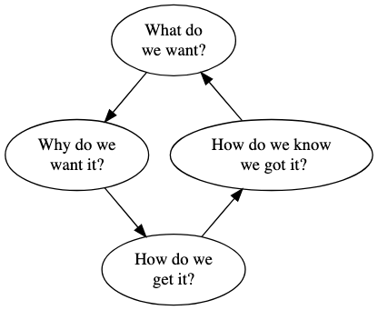
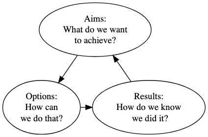
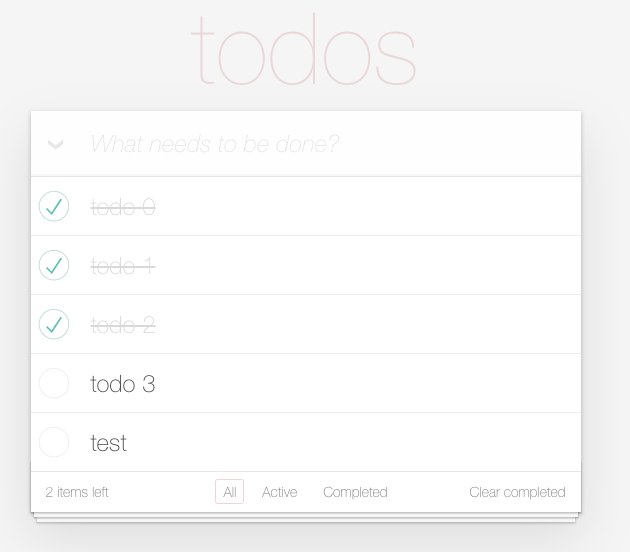
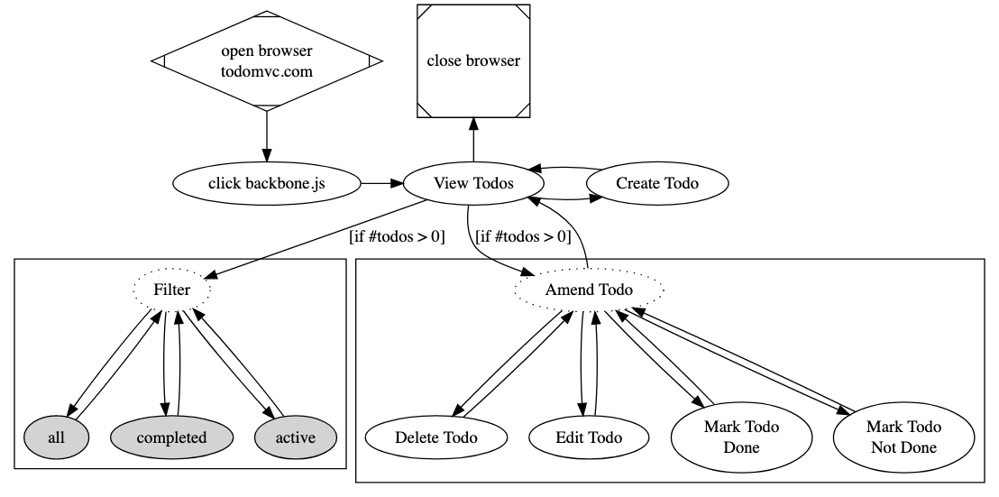
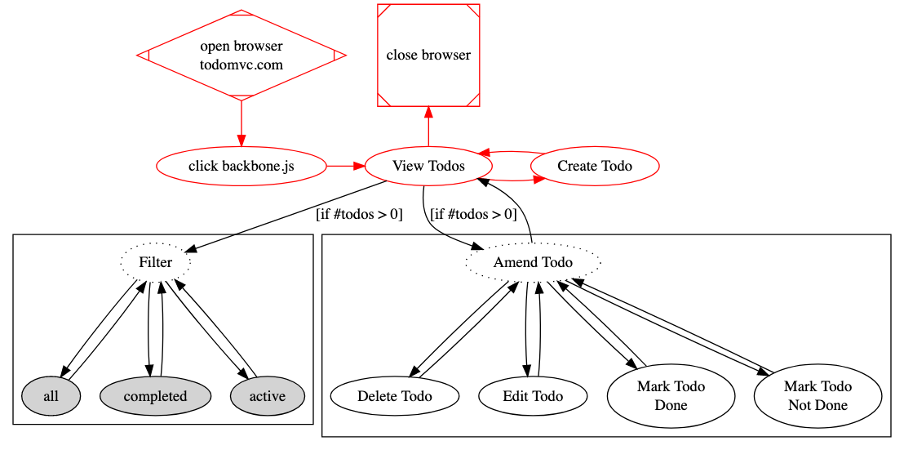
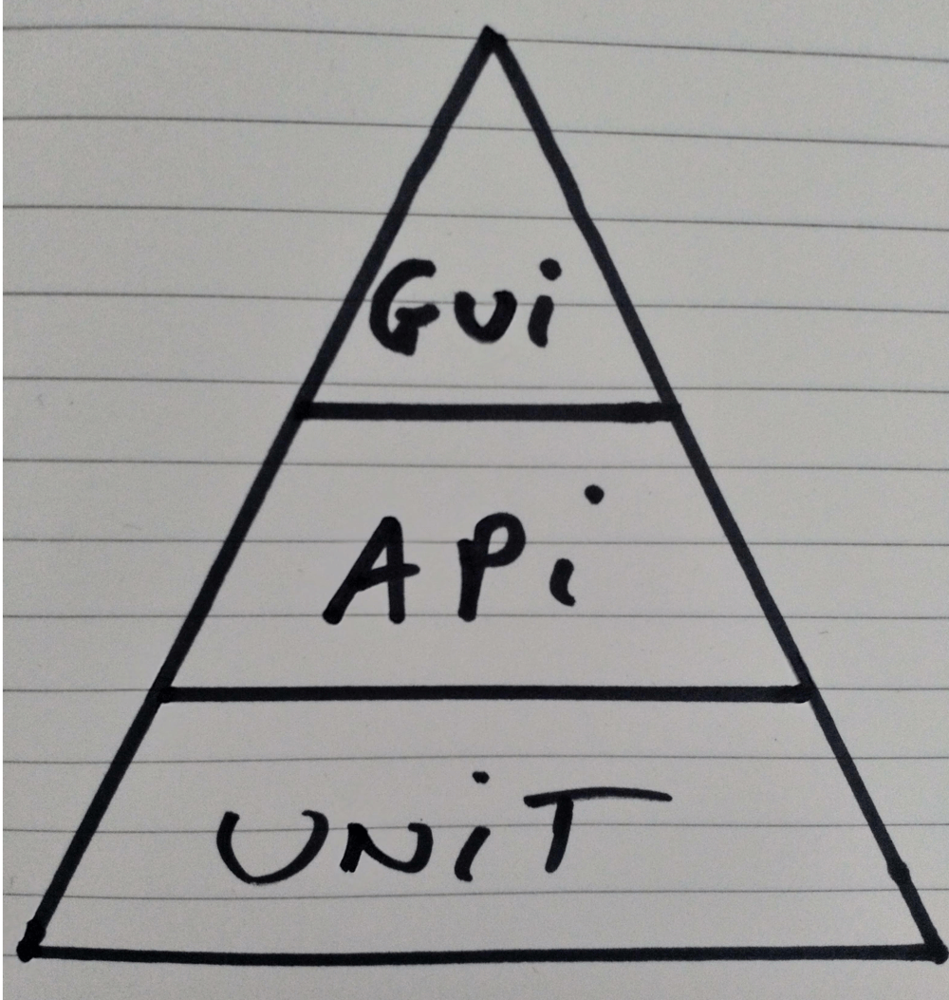

footer: @EvilTester
slidenumbers: true

# Secret Mysteries of Automated Execution

## Alan Richardson
## @eviltester

- www.EvilTester.com
- www.CompendiumDev.co.uk

---

# Secrets & Mysteries of Automated Execution

## _Hopefully stuff not covered later_

---

# There are many things we don't know:

- Does Bigfoot exist?
- Are UFOs Alien Spacecraft?
- Is there a monster in Loch Ness?
- Does the application still function after this code change?

<!--

Some of these mysteries have defied repeated attempts to investigate.

Application functionality... we've pretty much got a good handle on that.

-->

---

# Executing Application functionality...  we've pretty much got a good handle on that.

## Or do we?

---

# How do you know how well your automated execution works?

---

## It is not how well your automated execution works when everything is working well that tells you how well your automated execution works. It is how well your automated execution works when things are not working well that that tells you how well your automated execution works.

---

#  Your Automated Execution is only as good as it deals with difference

---

# Difference?

- changes to application
- slow / partial environments
- maintenance, refactoring
- wrong data

What is the difference that make a difference?

---

# What is the response to the difference?

- report errors?
- self healing?
- debug information?
- take another path?
- skip step?
- silent failure?

---

# WIIFM

- Generalisations
- Simple Automation Models
- Understand "The Why"
- Techniques Illustrated (with Code)
- Reinforcement of Important Concepts

---

# Decisions & Disagreements

- Right / Wrong
- Appropriate / Less Approriate
- Decided upon / Decided against

---

# What are the Secret Differences Between Coding an Application and Automated Execution?

---

# The Paranoia Principle

<!-- paranoiamagazine.com -->

---

# Automated Execution Would Avoid....

~~~~~~~~
class MyApp {
    public static void main(String[] args) {
       try{
             new myApplication().run(args);

        }catch(Throwable t){
           // never let the user know
           // there was a problem
}}}
~~~~~~~~

---

# Code Automated Execution for Paranoia
---

- _THEY_ are lying to you
   - Check _ALL_ assumptions/preconditions
- _THEY_ want to trap you
    - Don't move unless sure
- _THEY_ will twist your words
    - Log your actions! Take screenshots!
- _THEY_ falsify evidence
    - check and log all post conditions before moving
- _THEY_ want a scapegoat
    - throw exceptions, fail the run, avoid blame

<!--

Image from paranoia magazine issue 38 http://www.paranoiamagazine.com/2016/12/paranoia-38/

-->

<!--

https://dreampuf.github.io/GraphvizOnline

digraph G {
   
    start [shape=Mdiamond, label="open browser \n todomvc.com"];
    close_browser [shape=Msquare, label="close browser"];
   
    { rank = same; start, close_browser}
   
    choose_app [label="click backbone.js"];

  todo_list [label="View Todos"];
  create_todo [label="Create Todo"];

 
  subgraph cluster_filter {
    filter [label="Filter", style="dotted"];
    node [style=filled];
    all;
    completed;
    active;
   
    filter -> all -> filter;
    filter -> completed -> filter;
    filter -> active -> filter;
   
  }
 
   subgraph cluster_amend_todo {
    amend [label="Amend Todo", style="dotted"];
    delete_todo [label="Delete Todo"];
    edit_todo [label="Edit Todo"];
    done_todo [label="Mark Todo \n Done"];
    undone_todo [label="Mark Todo \n Not Done"];
    /*label = "Work With Todo"; */
   
    amend -> delete_todo -> amend;
    amend -> edit_todo -> amend;
    amend -> done_todo -> amend;
    amend -> undone_todo -> amend;

  }
 
  start -> choose_app;
  choose_app -> todo_list;
  todo_list -> create_todo -> todo_list;
  todo_list -> amend [label="[if #todos > 0]"];
  todo_list -> filter [label="[if #todos > 0]"];
  amend -> todo_list;
 
  todo_list -> close_browser;
 
  { rank = same; create_todo, choose_app, todo_list}
 
}

-->

<!--

https://dreampuf.github.io/GraphvizOnline

digraph G {
   
    start [shape=Mdiamond, label="open browser \n todomvc.com", color="red"];
    close_browser [shape=Msquare, label="close browser", color="red"];
   
    { rank = same; start, close_browser}
   
    choose_app [label="click backbone.js", color="red"];

  todo_list [label="View Todos", color="red"];
  create_todo [label="Create Todo", color="red"];

 
  subgraph cluster_filter {
    filter [label="Filter", style="dotted"];
    node [style=filled];
    all;
    completed;
    active;
   
    filter -> all -> filter;
    filter -> completed -> filter;
    filter -> active -> filter;
   
  }
 
   subgraph cluster_amend_todo {
    amend [label="Amend Todo", style="dotted"];
    delete_todo [label="Delete Todo"];
    edit_todo [label="Edit Todo"];
    done_todo [label="Mark Todo \n Done"];
    undone_todo [label="Mark Todo \n Not Done"];
    /*label = "Work With Todo"; */
   
    amend -> delete_todo -> amend;
    amend -> edit_todo -> amend;
    amend -> done_todo -> amend;
    amend -> undone_todo -> amend;

  }
 
  start -> choose_app [color="red"];
  choose_app -> todo_list  [color="red"];
  todo_list -> create_todo -> todo_list  [color="red"];
  todo_list -> amend [label="[if #todos > 0]"];
  todo_list -> filter [label="[if #todos > 0]"];
  amend -> todo_list;
 
  todo_list -> close_browser [color="red"];
 
  { rank = same; create_todo, choose_app, todo_list}
 
}

-->

<!--

digraph G {
 
 what [label= "What do \n we want?"];
 how1 [label= "How do we \n get it?"];
 why [label= "Why do we \n want it?"];
 how2 [label= "How do we know \n  we got it?"];

what -> why -> how1 -> how2 -> what;

{ rank=same; why, how2}

}

-->

<!--

digraph G {
 
 aims [label= "Aims:\n What do we want \n to achieve?"];
 options [label= "Options: \n How can \n we do that?"];
 results [label= "Results: \n How do we know \n  we did it?"];

aims -> options -> results -> aims;

{ rank=same; options, results}

}

-->

---

# What are the secrets of the process of automating?

---

# Processes & Tools

- Requirements and Specifications
- Programming Languages, Compilers
- Libraries
- Patterns, SOLID
- TDD, BDD, Unit Testing
- Exploratory Testing
- Automated Execution
- etc.

<!--

We created a variety of Software Development processes to help out:

But these are just names.

They only mean stuff to the initiated. And even then there are secrets.

-->

---

---

<!--

In simple terms:

- What do we want?
- Why do we want it?
- How do we get it?
- How do we know we got it?

This is a generalisation.

A high level model of what we do.

We go wrong, when we skimp on one of these items.

Skimp the what and we are unfocussed and build the wrong thing.

Skimp on the why? and we don't know how to prioritise and make decisions.

Skimp on the how do we get it and we use an inappropriate approach, technology that is not a good fit.

Skimp on the how do we know and we let bugs slip in

And these have evolved over the years but we've learned a lot.

In this keynote I'll look at what we have done to remove those mysteries. To find out what really makes us effective.

-->

---

# Why Say Automated Execution?

---

# Why Say Automated Execution?

Automated Execution covers:

- build process, release process, CI/CD
- Development tools, IDEs, Static Analysis
- Environment Setup
- Monitoring, Logging, Alerting
- Exploratory Testing Support
- Test Automation
- etc.

<!--

- Test Automation is a subset
   - load/stress, functional coverage
   - Executable Specifications

Automated Execution is bigger than Test Automation.

Test Automation has all this old baggage that it is done by testing, that it is something that you add on top.

-->

---

# Secret of Automated Execution

## Automating is a means to an end, not the end itself.

---

# Automated Execution Build Process

The aim is not to automate the build process.

The aim is to:

- make the build process faster, repeatable, objective, transparent.
- allow humans to stay in flow,
- etc.

---

# Automated Execution For Testing

The aim is not to "automate all testing".

The aim is to:

- automate assertions which we want to regularly check that they still apply
- cover regular paths with lots of data
- etc.

---

# Secret : Bake Automate Execution In

## Accept that automating is part of our work because it is what humans do.

<!--

We really want to automate as part of our work and create some automated execution that allows us to change frequently and support our work without having to constantly revisit stuff we believe is done. And we want to do that as part of our normal process. This is the ultimate secret of automated execution. It is baked into our process.

-->

---

# What are the hidden secret fundamental concepts of automating?

---

# Automating Concepts

- Automated Execution
     - making something do something without human intervention
- Assertion
    - detecting if what should happen, has happened
    - _more rare_ detecting if something that should not have happened has happened.

<!--

Not about replacing humans, its just about doing something without human intervention.

A human might trigger it. A Human might double check the results.

Can be as simple as an inline refactoring in the IDE. Because we automate programming all the time.

- human triggers it
- IDE does it without my intervention
- I check it works by compiling may code and seeing what has changed in the version control history

-->

---

# What do we automate?

- systems?
- applications?
- code?
- interfaces?

---

# Automate What? Stuff.

- todomvc.com
- browser
- javascript
- elements
- mouse clicks
- keyboard

---

# We automate using models and abstractions

- representations of systems
- representations of applications
- abstractions of browsers
- abstractions of interactions

---

# Are you aware of the risks?

## because you are automating?

## in how you are automating?

---

# Automate Using Models

---

---

# Automated Execution is about paths

---

# Automated Execution is about paths

## An executable traversal of a defined path through a system with  data.

---

---

# How do we do it?

## Tools & Code

## Path and Data Combined

---

~~~~~~~~
    WebDriver driver = new ChromeDriver();
    driver.get(
       "http://todomvc.com/examples/backbone/");

    WebElement createTodo =
                         driver.findElement(
                         By.className("new-todo"));
    createTodo.click();
    createTodo.sendKeys("new task");
    createTodo.sendKeys(Keys.ENTER);

    driver.close();
~~~~~~~~

---

# How do we know we did it?

## Assertions

---

~~~~~~~~
@Test
public void canCreateAToDo(){
    WebDriver driver = new ChromeDriver();
    driver.get("http://todomvc.com/examples/backbone/");

    WebElement createTodo = driver.findElement(
                               By.className("new-todo"));
    createTodo.click();
    createTodo.sendKeys("new task", Keys.ENTER);

    Assertions.assertTrue(driver.findElement(
                  By.className("filters")).isDisplayed());

    int newToDoCount = driver.findElements(
                  By.cssSelector("ul.todo-list li")).size();

    Assertions.assertEquals(1, newToDoCount);
    driver.close();  }
~~~~~~~~

---

# Concepts

- An Aim
- A Path
- Invariant Data - controls the path to be executed
- Variant Data
- Ability to automate the system
- Assertions

Whatever we are doing for automating - we are doing this.

---

# What, How, How

- What do we want?
    - An Aim
- How do we get it?
    - A Path
     - Invariant & Variant Data
     - Ability to automate the system
- How do we know we got it?
     - Assertions

---

# But that example automated the GUI and we know that is to be avoided

---

# Automation Pyramid

## Mass?

## Ease?

## Speed?

---

# What to Automate?

## coverage not layers

## using interfaces and covering functionality

<!--

it is about coverage, not pyramids

it isn't about layers, it is about using the appropriate interfaces and covering the necessary functionality

-->

---

# What about easy to automate?

## are some layers and functionality easier to automate than others?

<!--

-are some layers easier to automate than others?
- are some activities easier to automate than others?

Of course, but that is not how we decide what to automate.

-->

---

# Ease, does not trump coverage.

## Ease might cause us to re-architect, to make it possible to achieve coverage.

<!--

If the coverage is important enough then we automate it.

If the automating is time and cost effective compared to doing it manually, then we automate it.

Ease is not the issue.

-->

<!--

* original white limestone coverage of 100% of the external of the pyramid
* but what about the inside of the pyramid
* http://www.scanpyramids.org/
* secret space in pyramid https://www.businessinsider.com/khufu-pyramid-big-room-chamber-void-muons-physics-2017-11?r=US&IR=T
* pyramid log book https://www.livescience.com/55439-ancient-logbook-on-great-pyramid-unveiled.html

-->

---

## What do we want to know?

## What do we care about?

## To get the best answers to that...

---

## What are the best questions to ask?
## Where is the best place to ask those questions?
## What is the best way to ask it?

---

# What is the secret of making automated execution robust?

---

# Or...

## How do some teams avoid flaky automation?

## How do some teams avoid intermittent build failures?

---

# `Thread.sleep(5000);`

<!--

Just kidding.

But is this ever valid?

If we want to synchronise on the passage of time.

-->

---

# Synchronisation

## Is it ready?

## Is it complete?

## Polling

---

# Synchronise on State not the Passage of Time

---

# Synchronising on state requires...

- ability to 'see' the state
    - observability, monitorability
- know what is the correct state
- act in a timely fashion while it is in that state
- timeout so we don't wait for ever

---

# But a timeout is time

~~~~~~~~
Thread.sleep(5000);
~~~~~~~~

- pause, regardless, fail on future step

~~~~~~~~
wait.until(componentIsReadyToUse(), 10);
~~~~~~~~

- poll, timeout on maximum time reached

---

# Wait for multiple states

~~~~~~~~
wait.until(componentIsRendered(), 10);
wait.until(buttonsAreVisible(3), 10);
wait.until(buttonIsClickable(3), 10);
~~~~~~~~

- multiple waits in sequence, instead of time increase
- check all your assumptions/preconditions

---

# Architecture Does Not Rule Out Synchronisation

- API
    - timeout on method calls
    - poll queues for results
    - poll DB for state prior to issuing another call

---

# `@Test` vs Automated Execution Does Not Rule Out Synchronisation

- Build & Deploy Process
    - wait for DB to be available before writing
    - have all Tables been created as expected before trying to write data
    - wait for previous step to complete, before next
    - wait for file to be readable before moving to next step
    - etc.

---

# Synchronisation Failures Should Help Debug Failure

---

# What is the secret to trusting automated execution?

---

# If you've only seen it pass, make it fail

<!--

Does it report errors in a way that you understand them?

Does it actually fail?

Ever had a test report success when it should have failed?

Ever had an automated execution script silently 'succeed' when it violently failed?

-->

---

# Once it is working...

Change the system/environment:

- to check every assertion fails
- to check wait can timeout if condition not met
- to check every step fails if the app is different

_this is often harder than writing it in the first place._

---

# What is the secret of using BDD for automated execution?

---

# We don't use BDD for Automated Execution

---

# We can use BDD Classified Tooling

## Because they support Executable DSL creation

---

# Multiple Representations and Multiple Tools

- If you use Cucumber, don't use it for everything

---

# Write Automated Execution at the Correct Domain

---

# Inappropriate Domain Level

~~~~~~~~
  Scenario: Should create a TODO through API
    Given request body loaded from "/resources/api/createtodo.json"
    And content type is "application/json"
    When a POST request to "/todos"
    Then status code is 201
    And response contains "id" with value "my-todo-guid"
    And response contains "title" with value "created todo"
~~~~~~~~

---

# Feature Steps delegate to other layers of abstraction

---

~~~~~~~~
Feature: We can create and edit To Do lists in ToDoMvc
  Scenario: Create a ToDo Item
    Given a user opens a blank ToDoMVC page
    **When the user creates a todo "new task"**
    Then they see 1 todo item on the page
---
~~~~~~~~

~~~~~~~~
@Given("^the user creates a todo \"([^\"]*)\"$")
public void the_user_creates_a_todo(String todoName)
                   throws Throwable {
    final int count = page.getTodoItems().size();
    user.createNewToDo(todoName);
    assertThat(page.getTodoItems().size(), is( count+1));}
~~~~~~~~

---

## “The purpose of abstraction is not to be vague, but to create a new semantic level in which one can be absolutely precise.”

## [Edsger W. Dijkstra, The Humble Programmer](https://www.cs.utexas.edu/~EWD/transcriptions/EWD03xx/EWD340.html)

---

# The Secrets are things we already know: Prioritisation, Abstraction, Modelling, Flexibility, Preconditions/PostConditions, etc.

---

# That doesn't mean it's easy.

---

# But it does mean we can do it.

---

# The Secrets are  things we already know. That doesn't mean it's easy. But it does mean we can do it.

---

# Questions?

## @EvilTester
## EvilTester.com

---

# End Credits

* [www.eviltester.com](http://www.eviltester.com)
* [@eviltester](https://twitter.com/eviltester)
* [www.youtube.com/user/EviltesterVideos](https://www.youtube.com/user/EviltesterVideos)
* [www.compendiumdev.co.uk](http://www.compendiumdev.co.uk)
* [uk.linkedin.com/in/eviltester](http://uk.linkedin.com/in/eviltester)

---

## Follow

- Linkedin - [@eviltester](https://uk.linkedin.com/in/eviltester)
- Twitter - [@eviltester](https://twitter.com/eviltester)
- Youtube - [EvilTesterVideos](https://www.youtube.com/user/EviltesterVideos)
- Instagram - [@eviltester](https://www.instagram.com/eviltester)
- Github - [@eviltester](https://github.com/eviltester/)
- Slideshare - [@eviltester](www.slideshare.net/eviltester)
- Facebook - [@eviltester](https://facebook.com/eviltester/)
- Pinterest - [@eviltester](https://uk.pinterest.com/eviltester/)

---

## BIO
 
Alan is a test consultant who enjoys testing at a technical level using techniques from psychotherapy and computer science. In his spare time Alan is currently programming a [multi-user text adventure game](http://compendiumdev.co.uk/page/restmud) and some [buggy JavaScript games](http://compendiumdev.co.uk/games/buggygames/) in the style of the Cascade Cassette 50. Alan is the author of the books "[Dear Evil Tester](http://www.eviltester.com/page/dearEvilTester/)", "[Java For Testers](http://javafortesters.com/page/about/)" and "[Automating and Testing a REST API](http://compendiumdev.co.uk/page/tracksrestapibook)".

---

# Visit EvilTester.com

Alan's main website is [www.eviltester.com](http://www.eviltester.com) and he blogs at [blog.eviltester.com](http://blog.eviltester.com)
