<!-- footer: @EvilTester | http://EvilTester.com -->
<!-- page_number: true -->

# Technology Based Technical Testing

## Agile Testers Conference 2018

### Alan Richardson

* [www.eviltester.com](http://www.eviltester.com)
* [www.compendiumdev.co.uk](http://www.compendiumdev.co.uk)
* [@eviltester](https://twitter.com/eviltester)

---

## Blurb

<!--

Scottish Sig - cancelled

There are so many different definitions of Technical Testing that it can be hard to know what the phrase might mean. In this case I'm going to use it to cover: "identify technology based risks to drive testing". This thought process can help us go beyond acceptance criteria and make informed decisions about the scope of exploratory testing we will carry out.

This requires:

- understanding of the technology
- risk identification
- tools applicable to the technology

Lessons learned:

- Even simple technology can pose risk
- Combining simple technology can increase risk
- Understanding technology allows us to evaluate risk

-->

<!--

For online Agile Tester's Conference - Brazil

-->

What do you learn if you want to test 'beyond the acceptance criteria'? Technical risk based testing can help. In this case I'm going to use the phrase Technical Testing to cover: "identify technology based risks to drive testing". This thought process can help us make informed decisions about the scope of exploratory testing we will carry out. It also helps focus your studies on the technical knowledge appropriate for the project you are testing. 

---

## Blurb

This requires:

- understanding of the technology
- risk identification
- tools applicable to the technology

This presentation will use a simple example to demonstrate that:

- Even simple technology can pose risk
- Combining simple technology can increase risk
- Understanding technology allows us to evaluate risk

---

# Why this talk?

Because I was asked a simple question.

---

# I know HTML, CSS, HTTP, and JavaScript what do I learn next?

---

## I know HTML, CSS, HTTP, and JavaScript what do I learn next?

- Do you know it?
- Do you know how your application uses these?
- Do you understand the HTML being used?
- Do you know which elements have JavaScript events?
- Do you understand the CSS in use?
- Do you know how it is applied?
- Have you validated it?
- Are there any cross browser risks?

---

## Simple things in combination can have complex side-effects

- When changed does caching impact?
    - CDN, Web Server Cache, Local Browser Cache
- When are JS events hooked on to HTML?
    - when loaded, after rendering?
- Do you use CSS animations?
- Is anything loaded dynamically?
- Impact on automating?

---

## If you do not understand the technology

### you are not testing for technical risk effectively

---

## Agile Stories

- Vary between teams
- Often business focussed
- Often lightweight 'conversation markers'
- Acceptance Criteria provide minimum 'goodness' assertions

---

## Do Acceptance Criteria cover Technical Considerations?

- Specify if validation is JavaScript, HTML5, Server Side?
- Specify libraries in use?
- Specify versions of libraries?
- Specify 'acceptable' browser range?

They Might. We might discuss and document this during planning sessions.

Do they cover technical risks?

---

## Do Acceptance Criteria cover Technical Risks?

- Specify if validation is JavaScript, HTML5, Server Side?
    - risk of validation JS code  cross browser?
    - risk of users bypassing HTML5 validation?
    - risk of server side validation not matching front end?
- Specify libraries in use?
    - CDN delivery vs Web Server
    - keeping versions up to date?
- Specify 'acceptable' browser range?
    - based on what criteria?
    - test all functionality on all specified browsers?

Do they rarely cover technical risks?

---

## An Example

### The user must be able to navigate the site from a drop down menu

Acceptance Criteria:

- Drop down menu shown
- Clicking on drop down menu items navigates to specified menu item

---

## General Risks for the Story and Acceptance Criteria?

- Drop down menu shown
     - What about tablets/Mobile?
     - Accessibility?
     - screen sizes?
     - specific browsers used?
- Clicking on drop down menu items navigates to specified menu item
    - How do we know correct text/link mapping?

So we decide on platforms/browser combinations and create a list of text/link mappings.

---

## Did we consider the technology?

- What JavaScript is used?
- What CSS is used?
- What libraries?
- Is CSS generated in the build or hard coded?
- Deployment of artifacts?
- Caching of CSS/JS?
- etc.

---

# Why are the Technologies important?

---

## Application Perspectives

- different views of an app change how we test it
- require different domain knowledge
    - business, HTML, CSS, HTTP, JavaScript, Server side
- require different tools

---

## Non-Technical Views of an app

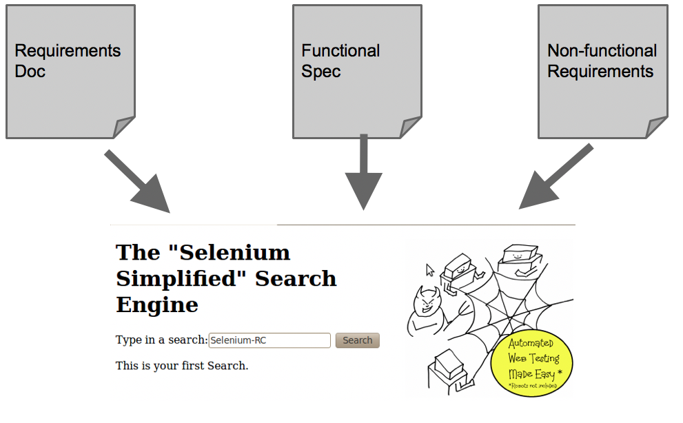

---

## Browser View

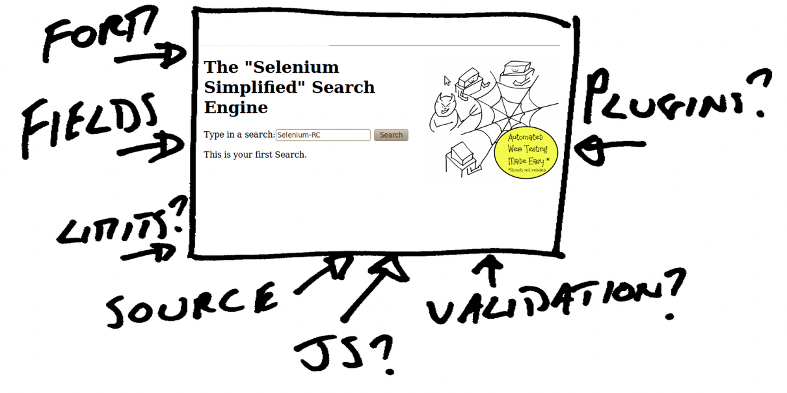

---

## Server Communications View

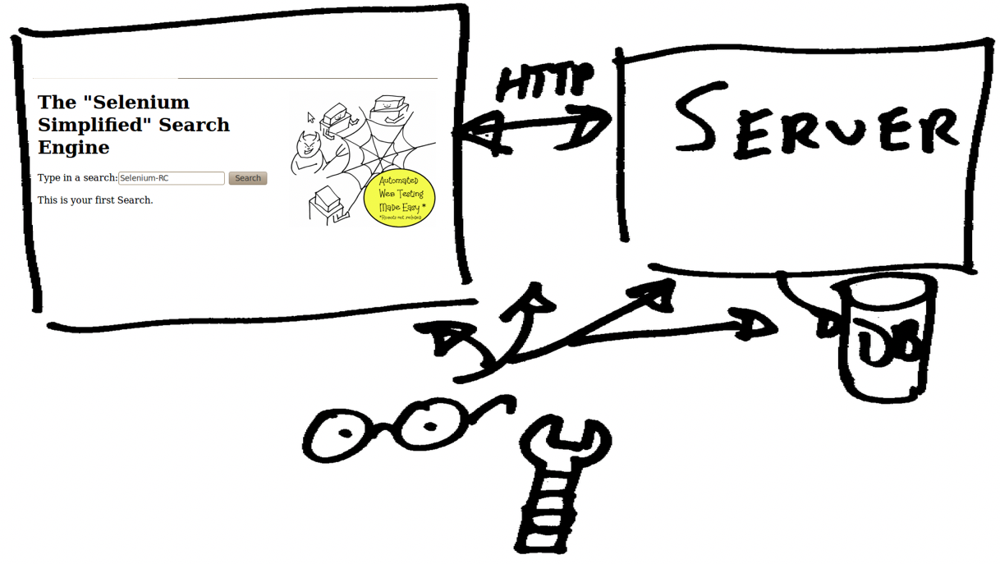

---

## Why do this for testing?

### "identify technology based risks to drive and limit testing"

---

## Technical Testing by (_MORIM_):

- **Modelling** the application from multiple view points and multiple technical levels.
- Using tools to:
    - **Observe** the application in action,
- **Reflecting** on what you see to approach the testing with intent based on risks, and at different interface points.
- Using tools to:
    - **Interrogate** the application to more detailed levels
    - **Manipulating** the application at detailed levels

<!--

v1 of pulper has a drop down indexing bug
v3 of pulper has the hamburger menu on smaller screen

-->

---

# The Pulper v001

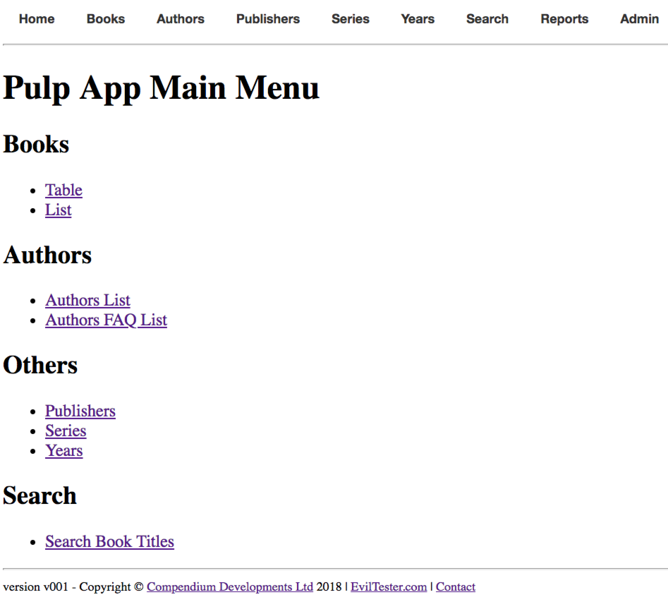

[github.com/eviltester/TestingApp](https://github.com/eviltester/TestingApp)

---

## The Drop Down

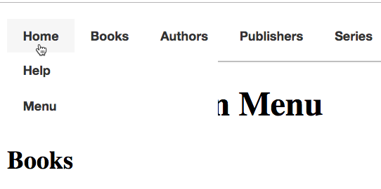

### Why is drop down menu risky for the web?

---

## Why is drop down menu risky for the web?

- It doesn't exist
- On Desktop it exists as a native control
- It doesn't exist as a native HTML element
- We have to simulate it
- We have to write code

---
## If it did exist

~~~~~~~~
<ddm>
   <mi><a href="/home">Home</a>
        <ddm>
            <mi><a href="/help">Help</a></mi>
            <mi><a href="/home">Home</a></mi>
        </ddm>
   </mi>
</ddm>
~~~~~~~~

**Why would this be less risky?**

---

## Why would this be less risky?

It would be 'just HTML'.

- standard
    - can be compliance checked
- browser implements
    - cross-browser testing reduced
    - don't test browser implementations
- tool supported
    - automated tools will support
    - automated tools may have abstractions
        - e.g. `new DropDown().select("Home");`

---

## But even when it is standard HTML we can introduce risk

Different set of risks:

- CSS styling
     - rendering of CSS, animations
- Augmenting with JavaScript

---

## But it doesn't exist

Humans have to implement it. Using?

- CSS?
- JavaScript?
- What HTML Underpinning it?

_As an exercise after this talk: look at all the different implementations of drop downs on the web._

---

##  Possible Risks?

- Might not render at all - Why?
- Rendering Errors
    - Overlapping Drop Downs
    - Animation Errors
- Links might not work
- Might not be responsive
- Cross Browser JavaScript Errors?
- Ajax JSON Errors Loading Sub Menus?

---

## Without knowing the technology used.

How would we test for these risks?

---

##  Possible Test Approaches

- Links might not work

Mitigation:

- Link Checker?
    - Does that work for non exposed sub-menus?
    - can we test rendering independent of link clicking?

---

##  Possible Mitigation/Detection Test Approaches

- "Test in all browsers"
- "Test on all platforms"

---

## Mitigation/Detection

where "Test in all browsers" would mean:

- *all*
    - all that we care about? blindly accepting risk with others?
    - create a 'supported browser list'
    - create a 'supported resolution' list?
    - create a 'supported device list'
    - who creates these? based on what?
- *test*
    - test what?
    - on every page?
    - every combination of drop down?
    - do I have to click every link on every rendering?

---

## Too Many Risks!

### Testing Blind

**Reduce Risks by understanding the Technology**

---

## Drop Down is not a Li

- But what makes it a drop down?
    - Magic?
    - CSS?
    - JavaScript?

Different Tech, Different Risks

<!-- SPEAKER NOTES

The technology choice exposes us to different risk, and so we test differently.

-->

---

## v001 has a problem

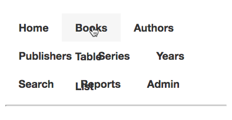

---

## Could our 'standard' browser set find that?

- only if we resize the browser

---

## Could we predict that with technical knowledge?

- past experience?
- CSS/HTML knowledge about z-index styling?

---

## Fixed in v002

~~~~~~~~
#primary_nav_wrap ul li:hover > ul
{
    display:block;
    z-index:100;
}
~~~~~~~~

---

## A JavaScript Example

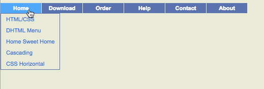

from
[a JS Implementation at Javascript-array.com](http://javascript-array.com/scripts/simple_drop_down_menu)

---

## Similar functionality but a different set of risks

- same basic functionality
- different technology
- different risks

Do we do the same testing?

<!--
<!DOCTYPE HTML>
<html><head></head><body>
<ul id="sddm" style="margin:0 auto">
    <li><a href="#" onmouseover="mopen('m1')" onmouseout="mclosetime()">Home</a>
        

        <a href="#">HTML/CSS</a>
        <a href="#">DHTML Menu</a>
        <a href="#">Home Sweet Home</a>
        <a href="#">Cascading</a>
        <a href="#">CSS Horizontal</a>
        

    </li>
    <li><a href="#" onmouseover="mopen('m2')" onmouseout="mclosetime()">Download</a>
        

        <a href="#">ASP Server-side</a>
        <a href="#">Pulldown navigation</a>
        <a href="#">AJAX Drop Submenu</a>
        <a href="#">DIV Cascading</a>
        

    </li>
    <li><a href="#" onmouseover="mopen('m3')" onmouseout="mclosetime()">Order</a>
        

        <a href="#">Visa Credit Card</a>
        <a href="#">Paypal</a>
        

    </li>
    <li><a href="#" onmouseover="mopen('m4')" onmouseout="mclosetime()">Help</a>
        

        <a href="#">Download Help File</a>
        <a href="#">Read online</a>
        

    </li>
    <li><a href="#" onmouseover="mopen('m5')" onmouseout="mclosetime()">Contact</a>
        

        <a href="#">E-mail</a>
        <a href="#">Submit Request Form</a>
        <a href="#">Call Center</a>
        

    </li><li><a href="#" onmouseover="mopen('m6')" onmouseout="mclosetime()">About</a>
        

        <a href="#">E-mail</a>
        <a href="#">Submit Request Form</a>
        <a href="#">Call Center</a>
        

    </li>
</ul>
</body></html>
-->

---

## Amazon - divs and spans

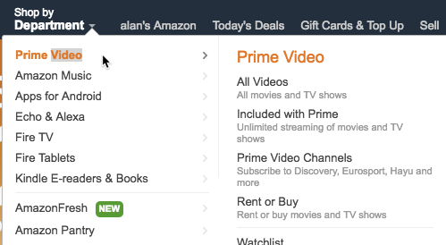

- previous examples used div,ul,li
- Amazon uses div,span

---

## Do we test for fallback?

- What if CSS is not present?
- What if JavaScript is not present?

Do we test for that risk?

Is the app designed for that risk?

---

## Amazon without CSS

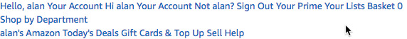

---

## The Pulper without CSS

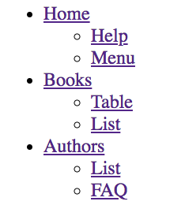

---

## Do we know how to test for fallback?

- Chrome Dev Tools Network
   - Block URL
- Proxies
    - Block requests/responses
    - Autoresponders
- Browser Plugins
- Browser Settings

Tools are required for technology based testing.

---

# Reduce/Explore Risks by understanding the tech

---

## What Technology Do We Need To Learn?

- HTML?
- CSS?
- JavaScript?
- HTTP?
- AJAX?
- DOM Manipulation?

---

## We only _really_ need to understand the technology in use.

---

## Learn the technology in use

- Do not need to learn all technology at once
- Learn the technology you are testing
- To the level that the technology is used

This makes developing technical skills sustainable.

---

## The Pulper Uses Basic HTML

~~~~~~~~

<nav id="primary_nav_wrap">
    <ul>
        <li><a href="/apps/pulp/gui/">Home</a>
            <ul>
              <li><a href="/apps/pulp/gui/help">Help</a></li>
              <li><a href="/apps/pulp/gui/">Menu</a></li>
            </ul>
        </li>
    </ul>
</nav>

~~~~~~~~

**What are the risks with this?**

---

## Risks

- Do the links work?
- Any styling applied?
- Is the HTML Valid
- Seems like standard HTML - reduces cross browser

---

## How to make HTML Less Risky?

Ideal is:

~~~
<ddm>
     <mi>Home
        <ddm>
          <mi>Help</mi>
          <mi>Menu</mi>
        </ddm>
    </mi>
</ddm>
~~~

Analogous or Isomorphic HTML is less risky. (HTML that shares similar structure)

---

## Analogous HTML

~~~
<menu>
     <menuitem>Home</menuitem>
     <menu>
          <menuitem>Help</menuitem>
          <menuitem>Menu</menuitem>
     </menu>
</menu>
~~~

Good?

---

## Menu according to w3schools is for context Menus

[w3schools.com/tags/tag_menu.asp](https://www.w3schools.com/tags/tag_menu.asp)

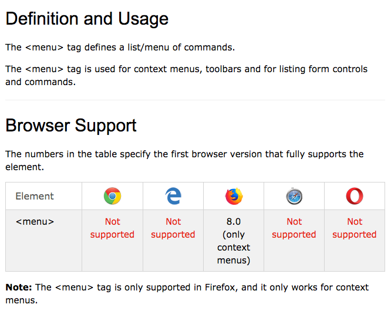

---

## Menu according to MDN is not particularly well supported

https://developer.mozilla.org/en-US/docs/Web/HTML/Element/menu

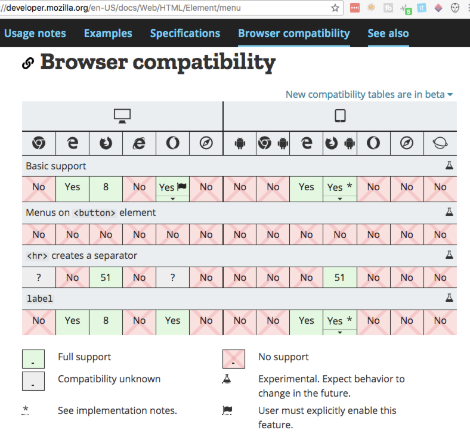

---

## Authorative Oracles

- https://www.w3schools.com
- https://developer.mozilla.org
- https://validator.w3.org
- https://caniuse.com/

Find tools and Oracles to help identify/explore risk.

---

## Analogous HTML

~~~
<ul>
     <li>Home
       <ul>
          <li>Help</li>
          <li>Menu</li>
       </ul>
     </li>
</ul>
~~~

---

## Analogous HTML

~~~

     
Home
         

            
Help

            
Menu

         

     

~~~

Risks?

---

## Div risks

By Default a browser puts a new line before each div:

~~~~~~~~
div {
    display: block;
}
~~~~~~~~

CSS needs to be used to `inline` the display.

`div` provides the nested structure required for a menu. Uses styling rather than semantics for layout.

---

## Unconventional

~~~~~~~~

     <li>Home</li>
     

          <li>Help</li>
          <li>Menu</li>
     

~~~~~~~~

Issue: Does not validate according to [validator.w3.org](https://validator.w3.org/)

---

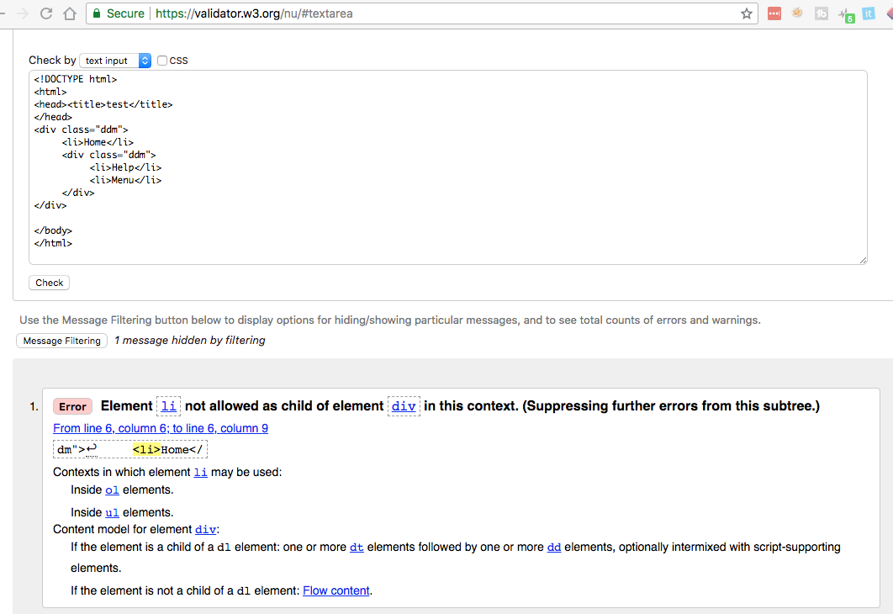

---

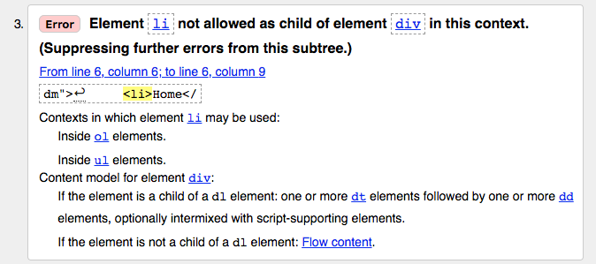

---

## What risks does non validated HTML pose?

- Might have no impact
- Might not render
- Browser might 'fix' the HTML
    - impact: then CSS styling or JavaScript might not work

Mitigation:

- Increase in Cross browser testing required

---

## CSS Risk Identification

- What is CSS?
- How does CSS work?
- What CSS is used?
- Are there any CSS Validators?
- Are there any common problem areas with CSS?
   - animation, z-order

---

## What general CSS risks are there?

- cross browser
- version compatability
- invalid syntax
- browser quirks

---

## Technology Based Testing Requires Tools

We probably need to understand:

- Browser Dev Tools
    - Different Dev Tools - different functions
- Proxy Tools
     - Different proxies - different functions

Different functions - different testing opportunities e.g. Charles - can send HTML for w3c validation, Fiddler - AutoResponders, Zap - Fuzzing

---

## Complexity can arise from combinations

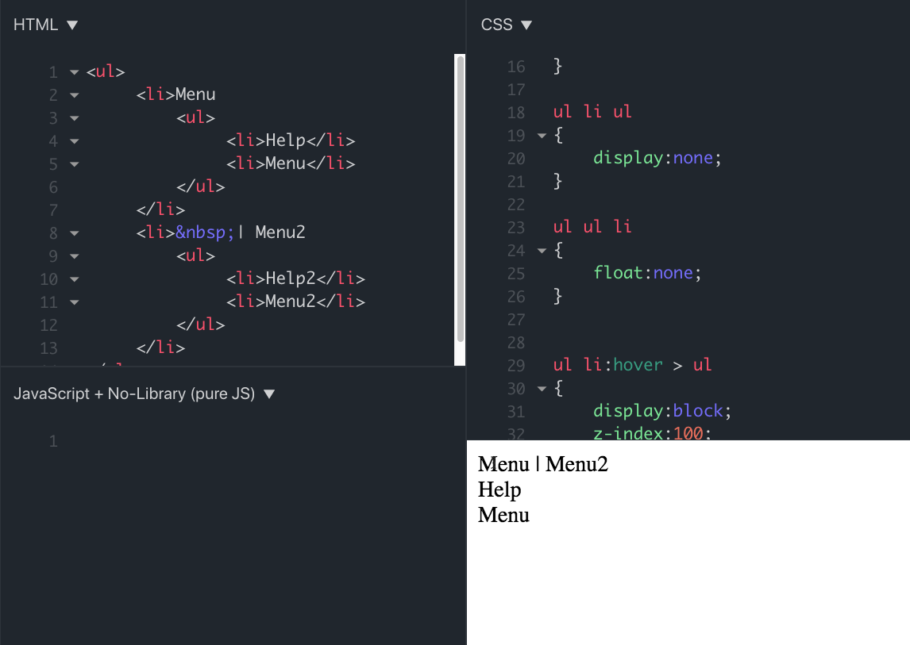

[https://jsfiddle.net/h7wkoea6/16/](https://jsfiddle.net/h7wkoea6/16/)

---

## Become Tech Aware

- use tech knowledge to identify new risks
- identify risk beyond acceptance criteria
- use tech knowledge to limit test scope
- identify appropriate tools
- model applications from different tech perspectives

---

## Useful Links

- Handling common HTML and CSS problems
- [developer.mozilla.org/en-US/docs/Learn/Tools_and_testing/Cross_browser_testing/HTML_and_CSS](https://developer.mozilla.org/en-US/docs/Learn/Tools_and_testing/Cross_browser_testing/HTML_and_CSS)
- Bootstrap Dropdowns
- [getbootstrap.com/docs/4.0/components/dropdowns/](https://getbootstrap.com/docs/4.0/components/dropdowns/)
- Web Animations Complexities
- https://dev.to/kyleparisi/making-web-animations-9ng

---

# Exercises

- When you visit a site or an app, use the dev tools to interrogate the HTML/CSS/Javascript
- Review the apps you are testing, do you understand the fundamental building blocks?
- Find similar functionality on different sites - are they implemented the same way?
- Identify risks, identify the tools you need to enable testing for them

---

# End Credits

## Alan Richardson

* [www.eviltester.com](http://www.eviltester.com)
* [@eviltester](https://twitter.com/eviltester)

---

## Learn More

* [www.compendiumdev.co.uk](http://www.compendiumdev.co.uk)
* [uk.linkedin.com/in/eviltester](http://uk.linkedin.com/in/eviltester)
* Online Training - [www.compendiumdev.co.uk/page/online_training](http://www.compendiumdev.co.uk/page/online_training)
* Books - [www.compendiumdev.co.uk/page/books](http://www.compendiumdev.co.uk/page/books)
     * [Dear Evil Tester](https://www.compendiumdev.co.uk/page/deareviltester)
     * [Automating and Testing a REST API](https://compendiumdev.co.uk/page/tracksrestapibook)
     * [Java For Testers](https://compendiumdev.co.uk/page/javafortestersbook)
     * [Selenium Simplified](https://compendiumdev.co.uk/selenium/)

---

## Follow

- Linkedin - [@eviltester](https://uk.linkedin.com/in/eviltester)
- Twitter - [@eviltester](https://twitter.com/eviltester)
- Instagram - [@eviltester](https://www.instagram.com/eviltester)
- Facebook - [@eviltester](https://facebook.com/eviltester/)
- Youtube - [EvilTesterVideos](https://www.youtube.com/user/EviltesterVideos)
- Pinterest - [@eviltester](https://uk.pinterest.com/eviltester/)
- Github - [@eviltester](https://github.com/eviltester/)
- Slideshare - [@eviltester](www.slideshare.net/eviltester)

---

## BIO
 
Alan is a test consultant who enjoys testing at a technical level using techniques from psychotherapy and computer science. In his spare time Alan is currently programming a [multi-user text adventure game](http://compendiumdev.co.uk/page/restmud) and some [buggy JavaScript games](http://compendiumdev.co.uk/games/buggygames/) in the style of the Cascade Cassette 50. Alan is the author of the books "[Dear Evil Tester](http://www.eviltester.com/page/dearEvilTester/)", "[Java For Testers](http://javafortesters.com/page/about/)" and "[Automating and Testing a REST API](http://compendiumdev.co.uk/page/tracksrestapibook)". Alan's main website is [compendiumdev.co.uk](http://compendiumdev.co.uk) and he blogs at [blog.eviltester.com](http://blog.eviltester.com)

---

## END SLIDE

This slide intentionally left blank.

_Not including: this text, the paragraph above or the slide title or the footer, but this is the last slide so it is effectively blank. In fact, it is actually unnecessary. Forget you saw this slide._
