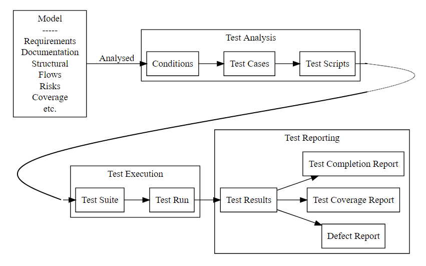
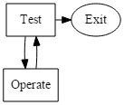
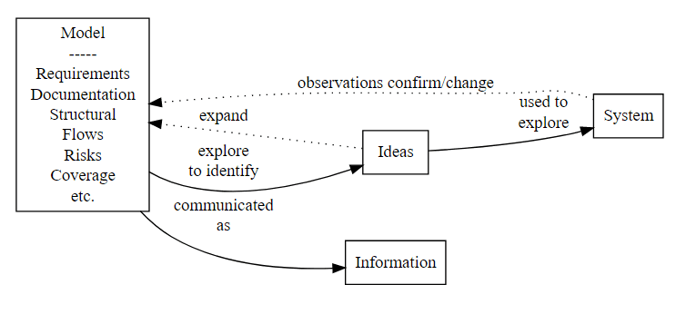

<!-- footer: @EvilTester -->
<!-- page_number: true -->

# Effective Software Testing for Modern Software Development

## Agile Tour London - October 2017
## Alan Richardson

* [www.eviltester.com/agile](http://www.eviltester.com/agile)
* [www.compendiumdev.co.uk](http://www.compendiumdev.co.uk)
* [@eviltester](https://twitter.com/eviltester)

---

# Common Questions About Modern Software Development, Can you...

## Develop Software without Testing?

## Develop Software without Testers?

---

# Have we had such bad experiences of Software Testing?

---

# We tend to argue over names and definitions

- "Agile", "Devops"
- "Automation Pyramid", "ATDD", "BDD", "TDD", "Continuous Integration", "Continuous Delivery"
- "Tester", "Test Automator", "SDET"

---

# We argue over roles, responsibilities and approaches

- Who should test on Agile Projects?
- Should testers code?
- Can programmers test?
- Can we automate all testing?
- Should we automate through the GUI?

---

# Most of this seems like the wrong focus

---

## We need a customised and tailored process for our organisation.

- We build a System **Of** Development
- We want the System to work effectively in our environment
- People are part of that System
- We Automate as part of that System

---

# Alan Richardson: Software Developer

- I Test Things (Tester)
- I help people test Better (Consultant)
- I develop software (Programmer)
- I learn to develop software better (Practitioner)
- etc.

---

# "I know that I am not a category. I am not a thing - a noun. **I seem to be a verb**, an evolutionary process - an integral function of the universe."

R. Buckminster Fuller
I Seem to Be A Verb, 1970

---

# You can... Develop software without testing

## If you don't want to know if it is good enough.

<!--

This leads on to the question of Risk. Risk is fundamental to how we design and develop the system of development.

-->

---

# You Can... Develop Software without Testers

## If you call the people doing the testing a different name.

---

# Those are Verbal Hacks

---

# "What is a mathematician - someone who does mathematics?"

Ian Stewart
The Magical Maze, 1997

---

# "...a mathematician is someone who sees opportunities for doing mathematics that the rest of us miss."

Ian Stewart
The Magical Maze, 1997

---

# "...a tester is someone who sees opportunities for doing testing that the rest of us miss."

_Paraphrasing: Ian Stewart, The Magical Maze_

---

# Software development used to look easy when it was a long line of specialist processes

<!--

- Waterfall
- Get it right first time - at each step
- you had a long line of processes done by different people and they handed the work over to the next people down the line and it took a long time and in the end it didn't work
- Measure twice - cut once
- Why did we end up with Huge testing efforts and Huge Integration efforts at the end
- Why did so many projects fail to deliver?
- We actually prioritised process over product

-->

---

# Modern software development is hard because we have to customise everything

<!--

- we are building a System Of Development
- Every Environment is Different
- So many approaches available
- Interpretation required for every approach
- Customisation Required for every approach
- We make decisions all the time about tools

-->

---

# Have we carried forward too many concepts from Legacy Software Development?

---

# Guiding Principle: Regularly Release Software That Works

---

# Hard, but worth it

- Better Quality Product
- Speed of delivering requirements
- More interesting work
- Better quality staff

<!--

- hopefully we think it is worth it
- Better Quality of product - meets requirements, less breakage from change

We have an idealised software development process in mind which will result in happy people and great software and straight into production with no errors and... joy to the world.

-->

---

# What is Modern Software Development?

- A mess of terms - TDD, BDD, ATDD, Agile, Devops, CI, CD
- A Plethora of Technologies
- commonalities - flow, fast, automated execution and assertion, short cycles, more releases, automated deployment pipeline

<!--

- exploring a mess of terms - TDD, BDD, ATDD, Agile, Devops, Continuous Integration, Continuous Deployment, Continuous Delivery
- typified by 'flow'

-->

---

# What is Not Modern Software Development?

- Development without testing
- Tools above Concepts
- Development without risk
- Accumulation of Technical Debt

<!--

(using jenkins does not mean continuous integration)

-->

---

# Modern software Development goes fast because it has more safety controls

<!--

Explain and explore some safety controls:

- Automated Assertions before writing code - TDD
- Automated Acceptance Criteria Assertions before story complete - ATDD

-->

---

# Risk: A Process might only look and sound like Modern Software Development

<!--

- Just because we call it Agile, doesn't mean it is Agile.
- We might be moving fast, but building up Technical Debt
- We might have created a System of Development that adds risk because we haven't
-->

---

# Historic Software Development called the safety control "Testing"

---

# Historic Software Development created a Testing Process around...

## Test Phases that related to Development Phases

- Test Strategy - Analysis
- Test Planning - Design
- Test Cases & Scripts - Programming
- Test Execution - Build and Deployment

... but that was never "Testing", that was the part of the Software Development process that The Test Team performed

---

# Modern Software Development has dropped phases

- Analysis Phase
- Design Phase
- Programming Phase
- Testing Phase
- Deployment Phase
- Support Phase

<!--

But sometimes we hang on to these concepts.

Agile didn't drop 'deployement' and 'support' until DevOps

And we often still think of Testing in terms of a Phase.

And if we are building a System of Software Development that thinking poses a risk to our process.

-->

---

# We need to separate the concept of "Testing" from...

- A Testing Phase
- A Formal Testing Process
- An Outsourced Activity
- An Activity that only Testers do
- etc.

## We need to work out what "Testing" really is.

---

# Software Testing is part of The Software Development Process

## Testing Process needs to be created to contextually fit the Development Process.

---

# Modern Software Development Processes Build in Safety Controls Based on Risk

---

# Risk that:

- we build something the user doesn't want
    - prioritised backlog, MVP, agreed acceptance criteria, release working implementation regularly, work in small chunks (stories), review stories when 'done'
- we break something as we build new stuff
    - automate acceptance criteria assertions, automated unit testing, continuous integration

We create a disciplined process to mitigate risk.

---

# Testing has always been related to Risk

---

# But there is still a risk that

- the acceptance criteria are not complete enough
   - we don't cover edge cases
- we only focus on acceptance criteria and ignore technical risk
- we don't test integration and interfaces
- we don't step back enough to review and test the whole system
- performance, emergent behaviour, failover, security, data, etc.

<!--

We know the acceptance criteria will not be enough.

Working in small chunks can mean that we get stuck into the system at a really low level and we don't experiment.
-->

---

# Testing Takes a Risk & Uncertainty Focus

---

# What fundamentally is testing?

<!--

- TOTE - George Miller - reminds me of TDD
- 1960 https://en.wikipedia.org/wiki/T.O.T.E. 
- model of problem solving
-->

<!--

digraph G { 
  node [shape = "rectangle"];
  Test -> {Operate Exit}
  Operate -> Test

  subgraph { rank = same; Test; Exit}

  Exit [shape = "ellipse"];
}

-->

---

# TDD

- Test before writing code
   - testing is modelling, design, specification
   - test fails
- Write code
- Run Test 
   - Assert on specific conditions we agree in advance
- Test test scope (review)
   - tests document the scope of development
   - Any more tests needed?
- Done - Exit

---

# A side-effect of TDD is a set of code

...that we can use to continually assert that the conditions we wrote the code to meet, are still met.

## We sometimes refer to that using the legacy term "Regression Testing"

---

# Do we still need to test if we do TDD?

- Integration risk mitigation?
- What about missing `@Test`?
- What about missing asserts?
- Just enough to drive code, not always enough to cover all uses of the code
    - e.g. exceptions, null, bad data
- What about future unplanned usage?
   - e.g. `add(int, int)` tested against `1-100`, used with `Integer.MAX_VALUE`

---

# Basic Model of a Testing Process

---

# "Observers are men, animals, or machines able to learn about their environment and impelled to reduce their uncertainty about the events which occur in it, by dint of learning."

Gordon Pask
An approach to Cybernetics, 1961

---

# Despite Observation being an important part of the process of Testing, we also test to increase our uncertainty.

- New Risks
- New Questions
- New Decisions

---

# Automated ATDD, BDD

Very often:

- this is not Driving Development (DD)
- this is automated DSL based acceptance condition assertions
- we execute against deployed and integrated systems
- Requirement Risk Based

## We sometimes refer to that using the legacy term "Acceptance Testing"

---

# Do we still need to test if we do ATDD?

Very often:

- we spend so much time automating ATDD, BDD we don't leave enough time to test
    - Automation backlog
    - Test sprints
- we spend time maintaining 
- Requirements not complete, examples don't cover full risk profile

---

# Acceptance Testing

Tom Demarco, 1978, "Structured Analysis and System Specification"

> "The Specification _is_ the Acceptance Test"

...

> "Acceptance tests are derived from the Target Document and from the Target Document alone"

> "Acceptance tests will fall into the following five categories: normal path tests, exception path tests, transient state tests, performance tests, special tests"

<!--

The target document was a behavioural description of the system - acceptance criteria.

-->

---

# Special Tests

> "It would be naive to think that any system, no matter how complex, could be tested completely by the derived test sets as I have explained them."

> "...they must be placed explicitly in the Structured Specification before it is considered complete. This will maintain the standard that all the criteria for acceptance are contained in the Structured Specification"

- Exploratory Testing to Learn
- Add what we learn to the Acceptance Criteria and coverage

---

# We still need to test because we make mistakes and we miss things out

- Risks
- and we might not want to assert on them continuously

---

# Risk: Overlap Between Feeding Models

TDD, ATDD, BDD:
   - all use the same models as Testing
    - result in Automated Execution and Condition Assertion

We want to avoid a lot of overlap.

---

# Automating Vs Testing Vs Developing

---

# Abstraction

## "The purpose of abstraction is not to be vague, but to create a new semantic level in which one can be absolutely precise."

- _E. W. Djkstra_
- 1972 ACM Turing Lecture: '[The Humble Programmer](http://www.cs.utexas.edu/~EWD/transcriptions/EWD03xx/EWD340.html/)'

<!--

http://www.cs.utexas.edu/~EWD/transcriptions/EWD03xx/EWD340.html/

-->
 

---

## No Abstractions - Web Testing

~~~~~~~~
@Test
public void canCreateAToDoWithNoAbstraction(){
 WebDriver driver = new FirefoxDriver();
 driver.get(
     "http://todomvc.com/architecture-examples/backbone/");

 int originalNumberOfTodos = driver.findElements(
             By.cssSelector("ul#todo-list li")).size();

 WebElement createTodo;
 createTodo = driver.findElement(By.id("new-todo"));
 createTodo.click();
 createTodo.sendKeys("new task");
 createTodo.sendKeys(Keys.ENTER);
 assertThat(driver.findElement(
       By.id("filters")).isDisplayed(), is(true));

 int newToDos = driver.findElements(
          By.cssSelector("ul#todo-list li")).size();
  assertThat(newToDos, greaterThan(originalNumberOfTodos));
}
~~~~~~~~

---

## But there were Abstractions

* WebDriver - abstraction of browser
* FirefoxDriver - abstraction Firefox (e.g. no version)
* WebElement - abstraction of a DOM element
* createToDo - variable - named for clarity
* Locator Abstractions via methods `findElement` `findElements`
* Manipulation Abstractions `.sendKeys`
* Locator Strategies `By.id` (did not have to write CSS Selectors)
* ...

**Lots of Abstractions - just no Domain Abstractions**

---

## Using Abstractions - Same flow

~~~~~~~~
@Test
public void canCreateAToDoWithAbstraction(){
  TodoMVCUser user = 
        new TodoMVCUser(driver, new TodoMVCSite());

  user.opensApplication().
       and().
       createNewToDo("new task");

  ApplicationPageFunctional page = 
          new ApplicationPageFunctional(driver, 
          new TodoMVCSite());

  assertThat(page.getCountOfTodoDoItems(), is(1));
  assertThat(page.isFooterVisible(), is(true));
}
~~~~~~~~

---

# What Abstractions were there?

Domain level abstractions

* `TodoMVCUser`
   * User
   * Intent/Action/Behaviour Based
   * High Level   
* `ApplicationPageFunctional`
   * Structural
   * Models the rendering of the application page

(see also Domain Driven Design by Eric Evans)

---

# Automating With Abstractions Supports Testing

- regular automated execution with assertions
- creation and maintenance by many roles
- exploratory testing
- model based automated execution
- performance testing
    - multithreaded bots
    - potential re-use in performance/stress tools

---

# Adaptation

## "If the people can not adapt to the methods, then the methods must be adapted to the people."

- E.F. Schumacher,
- Small is Beautiful, 1973

---

# We are creating A System of Development

Everything that applies to the System Under Development applies to our Development System

- Testing as "opportunities for doing testing that the rest of us miss."
- Systems have risks
- Testing Targets Risk
- Re-think testing in terms of Risk
- Automate Strategically to Mitigate Risk
   - Flexible Abstractions

---

# End

Alan Richardson [www.compendiumdev.co.uk](http://www.compendiumdev.co.uk)

- Linkedin - [@eviltester](https://uk.linkedin.com/in/eviltester)
- Twitter - [@eviltester](https://twitter.com/eviltester)
- Instagram - [@eviltester](https://www.instagram.com/eviltester)
- Facebook - [@eviltester](https://facebook.com/eviltester/)
- Youtube - [EvilTesterVideos](https://www.youtube.com/user/EviltesterVideos)
- Pinterest - [@eviltester](https://uk.pinterest.com/eviltester/)
- Github - [@eviltester](https://github.com/eviltester/)
- Slideshare - [@eviltester](http://www.slideshare.net/eviltester)

---

# BIO
 
Alan is a test consultant who enjoys testing at a technical level using techniques from psychotherapy and computer science. In his spare time Alan is currently programming a [multi-user text adventure game](http://compendiumdev.co.uk/page/restmud) and some [buggy JavaScript games](http://compendiumdev.co.uk/games/buggygames/) in the style of the Cascade Cassette 50. Alan is the author of the books "[Dear Evil Tester](http://www.eviltester.com/page/dearEvilTester/)", "[Java For Testers](http://javafortesters.com/page/about/)" and "[Automating and Testing a REST API](http://compendiumdev.co.uk/page/tracksrestapibook)". Alan's main website is [compendiumdev.co.uk](http://compendiumdev.co.uk) and he blogs at [blog.eviltester.com](http://blog.eviltester.com)
