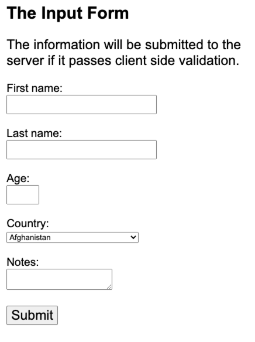
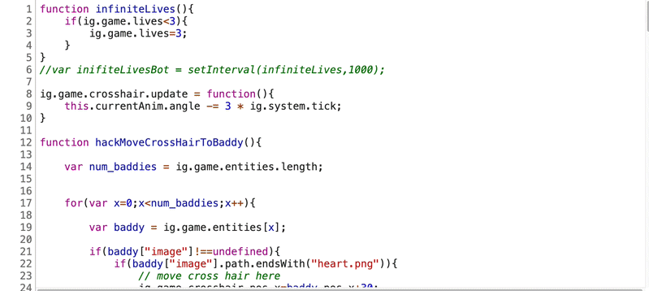

footer: @EvilTester
slidenumbers: true

# Automating to Augment Testing

Breakpoint 2020

Alan Richardson

- [@EvilTester](https://twitter.com/eviltester)
- [EvilTester.com](https://eviltester.com)
- [github.com/eviltester](https://github.com/eviltester)
- [compendiumdev.co.uk](https://compendiumdev.co.uk)
- [digitalonlinetactics.com](https://talotics.com)

---

# What is Traditional Test Automation?

- Automated Execution of Paths through a System
- Automated Assertion on Conditions during the execution
- Reporting on the Automated Execution

---

# Traditional Test Automation is a subset of Automating

- Tools
- Build Process
- Release Process
- Model Based Automating
- Tactical scripting and activities

We automate processes. Doing stuff.

---

# What Can we Automate?

- Interaction
- Observation
- Interrogation
- Condition Checking
- Assertions
- Reporting

What else?

---

# Think Differently

Go beyond "Test Automation".

- What processes do I do?
   - Would it help to automate some of that?
- What am I not doing?
   - Could I do that if I had tooling or an automaton to help?
- How can I reuse what I've got?

---

# e.g. What if...

- What if I could have an environment spin up automatically?
- What if the browser could just 'be in the right place' so that I could start exploring?
- What if I could test while a bunch of other 'people' were using the same data at the same time?

---

# e.g. What if...

- What if something could just 'tell' me that this page had some `404` request in the back ground as I test?
- What if we could just have something running in the background to exhaustively cover all the data combinations - just in case?

What if...?

---

# Examples

- Fuzzers to create data
- Release scripts to create Test Envs
- Performance Tests as background load
- Automated Execution as release checking tools
- Monitoring to identify gaps in coverage - live errors, weak signals
- etc.

---

# Unstable Application Context

- Registration process: 6 or so pages, 30+ fields.
- Outsourced Development, not viewed as high risk
- No Automating/Testing from development team
- Every release had something different not working
- Testing would take days to hit upon a combination of issue revealing data
- "Throw it over the wall" process

---

# Common "Test Automation" Knowledge

## "Never Automate an application that has lots of bugs and is constantly changing. Wait until the application is stable."

---

# Knock on Effect

## You spend a lot of people time identifying the issues in an unstable application, make their life frustrating and make little progress.

---

# Why do we automate?

- to save time
- to save money
- to increase coverage
- to allow testers to do something more valuable instead

Could we do that?

---

# What could we do?

- Identify the common issues found
- Model the paths that they trigger along
- Identify data partitions used to find them
- Exhaustively traverse and report issues

---

# How could we do that

- Model Based Testing, not Model Based Tooling
- Model 'Valid' Equivalence Partition Data
   - Paths, Inputs
- Makes 'Oracle' easy
  - "Must go to next step",
  - "Must report success on submission"

---

# The Example Application

[testpages.herokuapp.com/styled/validation/input-validation.html](https://testpages.herokuapp.com/styled/validation/input-validation.html)

- this only has 5 fields so:
- we can automate it in about an hour
- automation takes < 10 mins to run

---

# Run The Test

---

---

~~~~~~~~
Final Error Report
==================
~~~~~~~~

---

# Backend Validation Issue

~~~~~~~~
-----
Test: 15
-----

Using for age: 28

Using for firstname:
PRMN QBYUOUMKPYJHEIGJ BQJXYVIH

Using for Country: Panama

Using for lastname: A AAIRPTUVDSTYZHUC:

Using for notes:  JHKIWFOPR:

Submit Form
~~~~~~~~

---

# Frontend Validation Issue

~~~~~~~~
-----
Test: 108
-----

Using for Country: Eswatini (fmr. "Swaziland")

Using for notes: HIUPDRY:

Using for age: 42

Using for firstname: JVTDFAYFCNZIFRSXNSOGI

Using for lastname: CCKJRUUJLRAMLL

Submit Form
~~~~~~~~

---

# Sample Code

~~~~~~~~
   @Test
    public void aTest(){

        for(int x=0; x< 200; x++) {
            report="";
            reportThis(String.format(Test: %d%n", x));
            try {
                visitForm();
                fillFormCorrectly();
                submitForm();
                checkValidInput();
            }catch(Exception e){
                errorReport = errorReport + report;
            }
        }

// print report to system out
~~~~~~~~

---

# Fill The Form

~~~~~~~~

    private void fillFormCorrectly() {
        String[] theFields = {"firstname", "lastname",
                                      "age", "country", "notes"};
        List<String> fieldNames = new ArrayList<>();
        fieldNames.addAll(Arrays.asList(theFields));

        while(fieldNames.size()>0){
            String nextFieldToFill = fieldNames.get(
                                    random.nextInt(fieldNames.size()));
            fillFieldWithValidRandomValue(nextFieldToFill);
            fieldNames.remove(nextFieldToFill);
        }
    }
~~~~~~~~

---

# Fill a Field

~~~~~~~~
    private void fillFieldWithValidRandomValue(
                             final String nextFieldToFill) {

        switch (nextFieldToFill){
            case "firstname":
                // 5 to 89
                stringValue = getRandomLengthStringValue(5, 89, "firstname");
                driver.findElement(
                              formFields.get(nextFieldToFill)).sendKeys(stringValue);
                break;
~~~~~~~~

---

# Fill Another Field

~~~~~~~~
...
            case "country":
                // valid country from list
                int countryIndex = countryPicker.getNextRandomCountryIndex();
                Select select = new Select(
                                 driver.findElement(formFields.get(nextFieldToFill)));
                select.selectByIndex(countryIndex);
                reportThis(String.format("Using for Country:%n%s%n",
                             select.getFirstSelectedOption().getText()));
                break;
...
~~~~~~~~

---

# Equivalence Partitions - it doesn't matter:

- what order we fill in the fields
- what string values we use so long as they are the right length
- what age provided within range
- which country so long as in the list
    - perform exhaustive coverage of country list

Randomise. Execute path enough times to achieve coverage.

---

# Oracle

- can submit form
    - no client side validation errors
- no validation errors on submitted page
    - no server side validation errors

---

# Random Data

- when using random data
    - report on data used when flagging an error
- strategically
    - allow seeding to repeat tests

code [github.com/eviltester/modelbased](https://github.com/eviltester/modelbased/tree/master/tactical-random-form-filler/src/test/java/uk/co/compendiumdev/webdriver)

---

# Think Differently About Automating

- Our "Test Strategy" was Agile, with a lot of automating
- This project "didn't need automation"
- Automating was used as a tactic to support testing
    - Automate first. Test if stable.
- Automated across Equivalence Classes Models - everything was valid

---

# Decisions

- I decided to 'risk' a few hours of my time, to see if we could save days/weeks of testing effort.
- Tactical. Throw Away.
- Did not spend a lot of time on the code.

---

# Test Automation Does Not Mean Replacement

- Test Automation does not mean 'replacement'
- It means automating as part of a Test Approach or Strategy
- Sometimes that means tooling

---

# Observation

- When testing I can't observe everything
- I can't watch the GUI and the Network Traffic, and the back end server, and the memory usage and the...
- Tools can help me observe, as I'm testing
- e.g. I can see status codes in network panel as I test

---

# Interrogation

- I find it hard to 'Observe' the contents of messages
- I have to open and Interrogate them later
- Could tooling 'observe' message content for me?

---

# Case Study

- Data Leakage Security Testing
- Using a site, wanted to identify any data leakage possibilities
- Observed, not Interrogate

---

# CDP Test Support

- given a set of values to look for
- start a browser
- tell me if we find any of those values in requests as I test

~~~~~~~~
email_1=george@mailinator.com
email_2=bob@mailinator.com
~~~~~~~~

---

---

# CDP Test Support

- Tactical Automating
- Met a need
- Uses Chrome Debug Protocol

[github.com/eviltester/cdptestsupport](https://github.com/eviltester/cdptestsupport)

---

# Think Differently About Automating

- What is the minimum you can do to increase the capabilities of testers?
- Augment, rather than replace.
- Prefer and off the shelf tool prior to writing code.

---

# What does it take to Automate?

- Specialist Tools?
- Libraries?
- Expensive environments?

---

# What if we just used the browser dev console?

## To create data

---

---

# Simple Code

~~~~~~~~
for(x=1; x<=100; x++){
    setTimeout(function (name){
        document.querySelector(
                'input.new-todo').value=name;
        document.querySelector(
                  'input.new-todo').
            dispatchEvent(new Event(
                 'change',{'bubbles':true}));
    }, x*100, "todo "+x)
}
~~~~~~~~

---

# Automate the Un-automatable

- Some applications are very hard to automate externally
- e.g. Canvas Based - no HTML elements
- Automating might require visual automating or AI
- How do we Automate the Unautomatable?

e.g. [phoboslab.org/xtype/](https://phoboslab.org/xtype/)

---

---

# A Bit More Code Required

---

# Think Differently About Automating

- What are the untapped capabilities of the tools you already use?
- Can you script your tooling?
- What can you do with a little imagination?

---

# Can you re-use your Automation code?

- Do you have abstractions you can re-use, or are they locked to a framework?
- Is everything driven by Gherkin tools or can your write custom execution?
- Can you quickly create adhoc Tests that do something specific and unexpected?

---

# Could you use your abstractions...

- To write small, concurrent, autonomous bots?

---

# Given a multi-user app

- And Single User Tests Written
- And Abstraction layers in place
- When I want to know if it can handle multiple users
- Then do I write completely new tests in a Stress/Performance tool?

Or can I repurpose the abstractions to create multi-threaded model based bots.

---

# Abstractions As Dependency

- Package Abstraction Layers for re-use
- Helps keep them 'clean'
- Strategic, but opens up more tactical use cases

~~~~~~~~
<dependency>
   <groupId>uk.co.compendiumdev.restmud.testing</groupId>
   <artifactId>restmud-api-testing</artifactId>
   <version>${restmud-api.version}</version>
</dependency>
~~~~~~~~

---

# What is a bot?

- A class that implements as a thread

~~~~~~~~
public class ThreadedRestMudTestBot implements Runnable{
~~~~~~~~

---

# And does stuff... randomly

~~~~~~~~
    public void run() {
        botState(STARTED);
        running=true;
        try {
            while(!shouldStop){
                myBot.executeARandomActionStrategy();
                // Let the thread sleep for a while.
                myBot.executeARandomWaitingStrategy();
                botState(LAST_EXECUTED);
            }
        }catch (InterruptedException e) {
            botState(INTERRUPTED);
        }
        botState(EXITED);
    }
~~~~~~~~

---

# Stuff it does are implemented as "Strategies"

~~~~~~~~
public class RandomDoorOpenerStrategy
          implements RestMudBotStrategy {
~~~~~~~~

Which are executed.

~~~~~~~~
    @Override
    public RestMudResponseProcessor execute() {
...
    }
~~~~~~~~

Which use the existing abstractions.

---

# Patterns

- Command Pattern
- Strategy Pattern
- Screenplay Pattern

etc.

---

# A Simple re-use example

- Rather than re-use the 'tests'
- Re-use the abstractions
- Tests are often not abstracted enough to make them re-usable
    - too many preconditions
    - too many post conditions to tidy up

Create Abstractions that are libraries, rather than frameworks.

---

# Basic Model Based Testing

- `@Test` code traditionally models path through system
- Abstractions help introduce equivalence randomness
- Strategy and Command Patterns help model at a high level
    - treat paths as data (randomly choose path)

---

# Test Automation Rules

- Don't automate unstable applications.
- Don't "just knock up code", Test Code is Production Code
- Test Automation Takes a long time
- Tests should be short. Long running automation is flaky.

---

# More Test Automation Rules

- Don't automate systems you haven't tested.
- Test Automation does not find bugs.
- Automate for the long term, not short term.
- Test Automation ROI - is it worth the cost?

---

# What if "Rules" were "Heuristics"

We have to know when they apply and when they don't.

- We are not "breaking rules".
- We are making contextual decisions.

---

# Why do we automate?

- to save time
- to save money
- to increase coverage
- to allow testers to do something more valuable instead
- etc.

Can you achieve any of these benefits quickly?

---

# Automating is Driven by ideas

## and supported by tooling.

---

# Don't let tools. Dictate your Automating.

---

# Think Differently About Automating

## Automate to Augment Testing

---

# Alan Richardson

- [@EvilTester](https://twitter.com/eviltester)
- [EvilTester.com](https://eviltester.com)
- [github.com/eviltester](https://github.com/eviltester)
- [compendiumdev.co.uk](https://compendiumdev.co.uk)
- [digitalonlinetactics.com](https://talotics.com)
