# Skill Development in an Age of AI

- Alan Richardon
    - EvilTester.com
    - linkedin.com/in/eviltester

<!--

In this power-packed session, Alan will share:

- How to sharpen your core testing skills in an AI-driven world
- What AI can and can’t do (yet) — and how to use it wisely
- Tools, tactics, and real-world examples you can start using today

Whether you’re skeptical, curious, or already experimenting with AI — this session on 'Essential Skill Development for Testers in an Age of AI' will leave you with clarity, confidence, and a mindset to lead.

-->

---

<!-- paginate: true -->

# We are living in a period of AI Hype

- Awe
- Over-promises
- Unproven Use Cases
- Everything is "AI Enabled" or "AI Native"

---

# “Any sufficiently advanced technology is indistinguishable from magic.”

### Arthur C. Clarke

---

### The Great and All Powerful Wizard of OZ

---

### Magic Chat UI - Solves Problems and Knows All

---

### Pay No Attention To the Man Behind The Curtain

---

# Understanding Turns Magic into Technology

- Understand Enough
   - Remove Fear and Awe
   - Think Critically about AI
   - To be able to use it

---

# Is AI going to change the way we develop and test software?

---

# Is AI going to change the way we develop and test software?

## _Yes_

### It already has.

---

# I've used AI Augmentation

- Co-pilot in IDE
   - Coding Augmentation
   - Code Review Augmentation
   - Learning new features
   - Library Code Examples
- Co-pilot in Github
   - Code Review and Understanding

---

# Don't use as a Replacement

- Turn Communication into Automated Outputs
   - Writing eMails and Documents
   - Reviewing Documents and Requirements
   - Writing Jira Issues and Stories

---

# Don't use as a Replacement

- Vibe Coding
   - Code not same standard
   - Code using different patterns
   - Harder to pass code reviews by Humans
   - Doesn't work as well for a team
   - Generates code, but doesn't fix code well

---

# Don't use as a Replacement

- Vibe Coding
   - ...

## _I have this option because I can code_

---

# When we CAN DO

## We don't need to REPLACE

## We AUGMENT and ENHANCE

---

# Learn to Be Excellent

- Practice and learn to be Excellent at what you do
- Good Enough is not flexible enough
- Increase our ability by using tools
- Also requires less powerful AI

---

# Danger is People, Not AI

## The Danger is not "CAN the AI REPLACE me?"

### The Danger is people in charge believe it CAN

<!--

I don't really know assessiblity testing.

What I do know, I believe could probably be automated.

I imagine that AI could automate accessibility testing.

I think an expert in accessibility testing would tell me otherwise.

-->

---

# Danger is ourselves, Not AI

## If we use AI as a crutch, rather than a tool,

## we are demonstrating that we can be replaced

<!--

If I don't know something, but can use AI to do it, then I'm using it as a crutch.

Anyone else could do that too. I could be replaced. I'm doing something that I don't know how to do.

That might be fine to start with, but I have to be able to evaluate the output, fix it when things go wrong, understand the gaps.

I need to get to the stage where I have the ability to do what the AI is doing, and then I'm using it as a tool. At that point I can use it better, evaluate it, find flaws before release.

-->
---

# If we have SKILLS, we can SURVIVE and EDUCATE

- If AI works
   - then we will be more effective
- If AI does not work
   - then we can spot issues early
   - we can fix the issues

---

# A World of AI requires SKILLED people

---

# It has ever been thus...

-  Alan Richardson
    - Career Theme: Learning and Adaptation

30+ Years & | Many Roles 
---|---
Programmer | Software Tester
Manager | Automator
Marketer | Trainer
Consultant | Author

<!--

Specialisms are particularly dangerous in a world of AI because people want to replace. A broad range of skills helps us survive.

-->

---

# What was going to change the world when I started in Software Development?

---

# What was going to change the world Then?

- Formal Specifications _(ML, Hope, Z, ...)_
- 4th Generation Languages _(Domain abstractions: SQL)_
- 5th Generation Languages _(Define problem: Prolog)_
- Computer Aided Software Engineering _(Diagram to Code)_
- Expert Systems, Neural Nets _(AI)_

All of which would remove the need for Programmers and Testers.

---

# They did change the World of Software Development

- Improved Development Tools
   - IDEs, Code Completion, CI, Unit Testing Frameworks
- Improved Programming languages
    - Mixed: Classes, Functional, Procedural
- Improved Processes
    - Agile, Iterative, Learning, Automated Controls

---

# They did change the World of Software Development

We learned new ways to do things.

**But they didn't remove the need for Programming and Testing.**

- We made the best people better.
- We made it easier to become better.

They augmented the Programmer and Testers to enhance their skills.

---

# What was going to change the World a Few Years Ago?

- Quantum Computing
- Metaverse
- Blockchain

---

# What is going to change the World Now?

- Large Language Models (LLM)
- Model Context Protocol
- Autonomous AI Agents

We will learn new ways to do things. Create new tools and languages.

Will we remove the need for Programming and Testing?

---

# Is AI an Expert Tester?

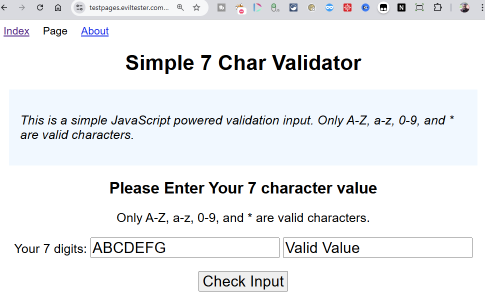

> You are an experienced tester and like to find defects. Given an application ... What inputs should I use to ensure comprehensive coverage of the application functionality.

---

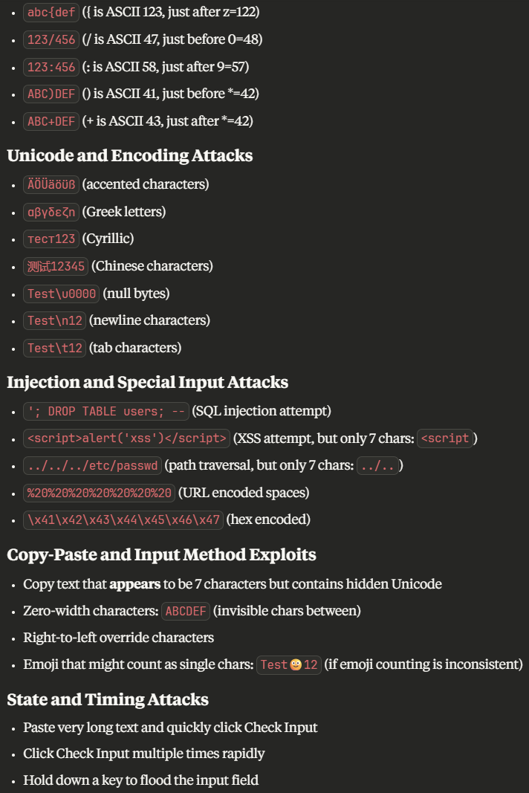

---

# Or is it an Expert Pirate

> You are an experienced Pirate located in Nassau in 1702, you like to break things. Given an application ...

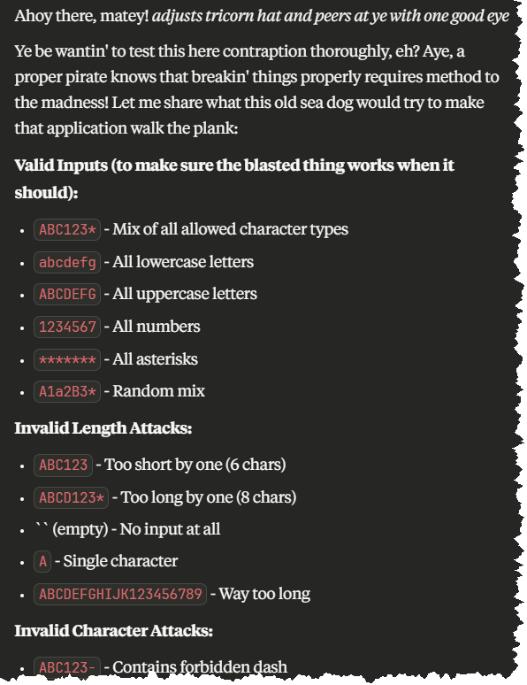

---

# Don't use 'one prompt to rule them all'

- Don't try and replace your thinking
- "As an experienced tester, give me a comprehensive test plan and strategy for ... describe all test cases and inputs ... etc."

---

# Use it as a tool

- You Do the work.
- You might try to use it to check your work.
- Did you do as well as the AI?
   - "What inputs should I use to ensure comprehensive coverage of the application functionality."

---

# Be the Experienced Tester

- Use small prompts...
- to prompt your thinking
   - "What questions should I ask to expand on the **system description** to make sure I have all the information I need to test the system?"
   - "What questions should I ask to expand on the **system architecture** to make sure I have all the information I need to test the system?"

---

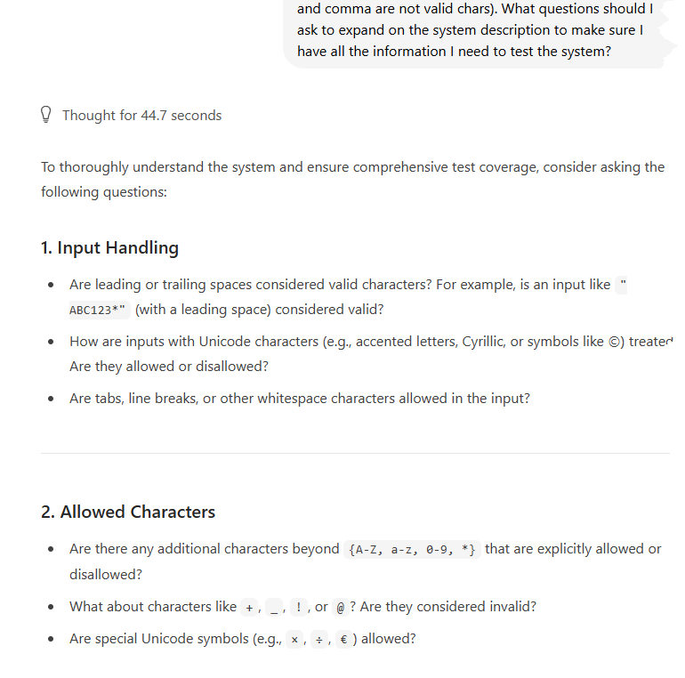

---

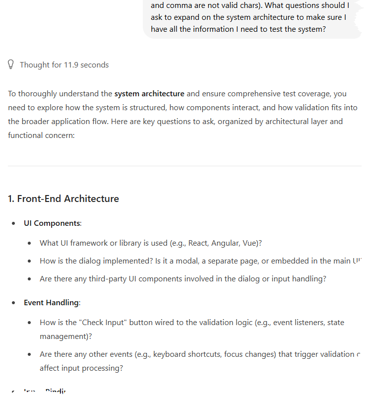

---

# How much AI do we have to learn?

---

# Stafford Beer's Regulatory Aphorisms

- "It is not necessary to enter the black box to understand the nature of the function it performs."
   - _How does it basically work?_
- "It is not necessary to enter the black box to calculate the variety that it potentially may generate."
   - _What are people hyping and saying it will do?_
   - _Think through the implications. What would change?_

https://en.wikipedia.org/wiki/Viable_system_model

<!--
---

# AI as a Black Box

- _How does it basically work?_
- _Keep an eye on the headlines._
   - We need the skills to cover (review, manage, fix, do):
      - _What are people hyping and saying it will do?_
      - _Think through the implications. What would change?_
      - _What are the risks and opportunities?_
      - _How can it go wrong?_

This can help us identify the skills we need to cope with the changes, and prepare ourselves for impact on our jobs. Or be able to push back with the risks and is the company prepared to accept those risks.

-->

---

# How do I Know what Skills to Develop?

- Mitigate the Hype. If you care.
- AI will ...:
   - create test ideas
   - create automated execution scripts
   - create scripts from Jira tickets
   - etc.

<!--

Yes, but what skills do I need to develop for AI?

-->

---

# For Each Area of Skill Development

- What are the risk if AI does it?

| Response Variety (Can You...) | Skill Level |
|----|----|
| Identify when the AI does it poorly? | Review |
| Identify when the AI does it wrong? | Manage |
| Intervene, if the risks manifest? | Fix |
| Take over, when it fails? | Do |

<!--

---

# AI will ...

For each item you list:

- can you do it?
   - practice it more.
- can you augment your execution with AI?

-->

<!--
---

# Skill Development in an age of AI

If AI can..., | can you ...?
---|---
Write code | Understand what code means
Commit code changes | Review code
Create Test Data | Understand Necessary Coverage
Automate | Understand what it has done?
Amend Automated Code | Know if the change is correct?
**Fail to complete** | **Take over**

-->

---

# If we CAN'T but AI CAN

- Ignore - let the AI do it
- Develop the skills to survive alongside AI
   - Review and Manage the AI
   - Fix AI mistakes
- Develop further, and eventually
   - Use the AI to augment our work

_We can use AI to learn to do something, not just do something._

<!--

---

# If you can't do it, and you care, ...

- Learn how to do it
   - Normal study processes
- Learn using AI
   - Augment learning with AI as search
       - but remember AI answers are out of date
   - Use AI to review and critique what you did
   -  Not because AI can help... but you can see if it does

-->

---

# Learn & Experiment

- Understand Enough
   - Remove Fear and Awe
   - Think Critically about AI
- Experiment to be able to use it
   - We need experience, not just learnings
   - Experience its strengths & limits

---

# Build your own model of its capabilities

<!--

I'm not going into depth in this talk about how it works and what can go wrong. All the times that I put in too much information in the context and blew out the context window and increased hallucinations and losing the actual task it was supposed to do. We know we need to break the work into smaller prompts, but we need to experience what that means and how to do it.

-->

---

# Based on My Experience of AI...

- can NOT Think
- can NOT efficiently replace an Algorithm
- will not repeat actions exactly
- is reliant upon Context
- will sometimes randomly
   - not do what is asked
   - do something else

---

# Based on My Experience of AI...

- can be very useful when no algorithm exists
   - e.g. summarization
- can generate content that helps me think
- needs isolation and limited permissions
- can be useful with a Human gatekeeper
- has security risks

---

# What am I doing about AI?

---

# Keep Practicing Core Skills

- styles of testing
- different tools
- different approaches
- different models
- different techniques
- automating and programming

<!--

Do no allow AI to replace you by using it as a crutch.

Even if AI did take over, and I don't think it will, you would need these skills to review the work and the scope of work performed by AI in order to make sure it is complete.

If AI forces us into the position that we willb be managing an AI or co-ordinating various agents. You need the skills to evaluate if teh AI is doing a good job.

Anyone with skills will be able to use AI more effectively than anyone without the base skills. So don't underestimate how important they are.

-->

---

# Practice Apps - API Challenges

[apichallenges.eviltester.com](https://apichallenges.eviltester.com)

- practice and learn API Testing
- tool overview
- list of applications with suggested exercises

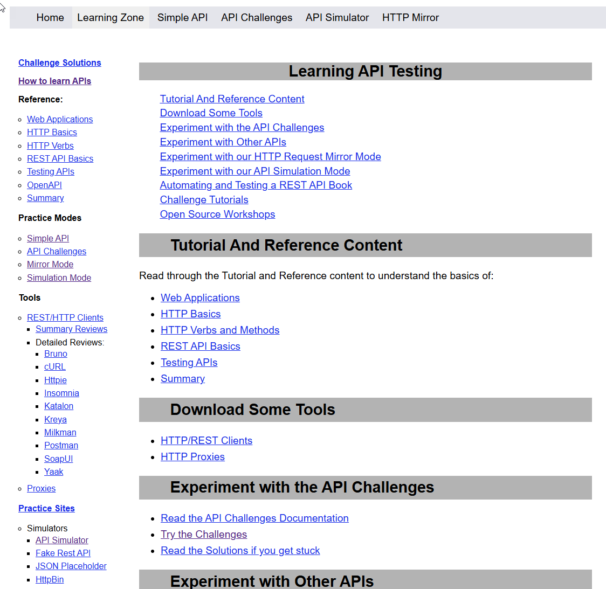

---

# Practice Apps - testpages

[testpages.eviltester.com](https://testpages.eviltester.com/)

practice exploratory and UI automating

see Related Sites link for more practice apps

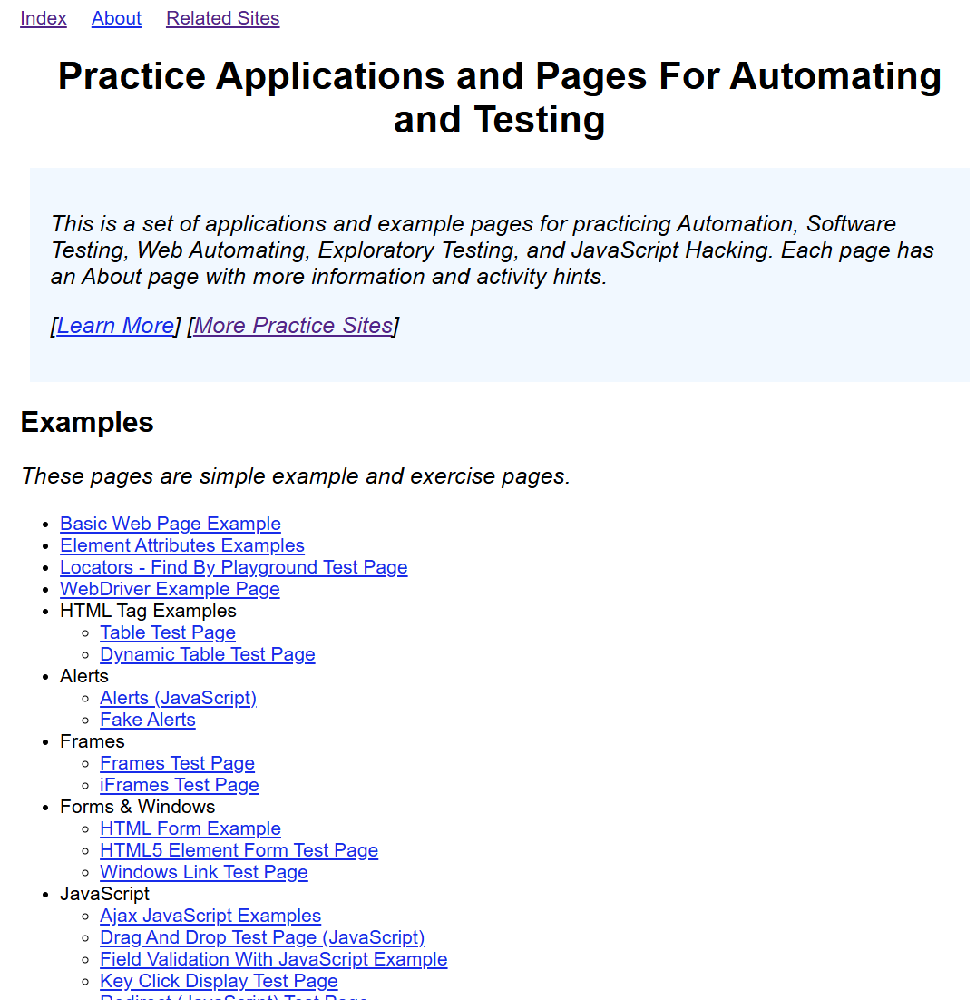

---

# Practice App - The Pulper

[thepulper.herokuapp.com](https://thepulper.herokuapp.com/)
   - web app for testing, multiple versions switchable from admin menu drop down on UI.

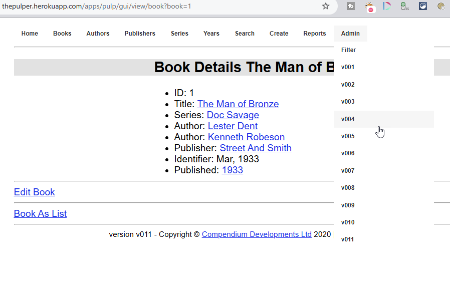

---

# Keep Learning and Improving my Software Development Skills

- Personal and Professional Development remain key
- Good Enough is Static
- Excellence requires continual Growth

---

# How I Learn and Experiment with AI

---

# Danger: Experimenting with Cloud AI at Work

- Consider Data Confidentiality issues.

Is the company paying for AI tools or has authorised use of their data?

- Yes: Fine, experiment with those tools for work
- No: Do not use those tools with work data or code.

<!--

AI Tools have security risks. Do not use confidential information in these tools without permission. Do not use the tools without permission.

You might get away with local LLMs if you are allowed to install stuff on your machine.

-->

---

# Experiments I've been doing

- Using General AI Chat Interfaces e.g. chat GPT
- Testing Hyped Use Cases
- Using LLMs Locally
- Create AI backed application
    - Summarize Podcasts Automatically
- Coding Augmentation
- AI Augmented study and learning

[github.com/eviltester/ai-supported-testing-experiments](https://github.com/eviltester/ai-supported-testing-experiments)

---

# I use AI

## Not because I think AI will help,

### but so I can learn, **through experience**,  if it does.

<!--

---

# My Initial Experimenting with AI

- Use AI to augment, or do things, I already know how to do
   - Because then I can evaluate the results.
- Get hands on with free tools and experiment
- Find value add use-cases that fit into my life 

-->

---

# Steps to Learning AI

---

# Exercise: Look for Educational Material

- YouTube
   - What is an LLM?
   - How do LLMs work?
   - LLM Limitations?

Avoid Hype. Seek out Education. e.g. Andrej Karpathy

---

# Exercise: Create a list of free LLM Tools

- Allocate a short period of time
- Search web or Github for AI Tools
- Create list of tools that look interesting
- Consider type of tool, what you might use it for

_searches "Free AI Tool", "Free AI Coding Tool", "Github Awesome AI Tools", "Github Awesome LLM Tools", etc._

---

# Exercise: Identify Usecases to Experiment with

- CounterStrings generation
- Create Test Ideas for a simple application from description
- Generate Test Data for simple application
- Analyse Simple application code for Test Coverage Ideas
- **Summarize Learning Material for Professional Development**
- **Create code to automate application from Javascript Console**
- ...

---

# Google NotebookLM

- free to use [notebooklm.google.com](https://notebooklm.google.com/)
- summarize Youtube and other files
- Good for speed learning

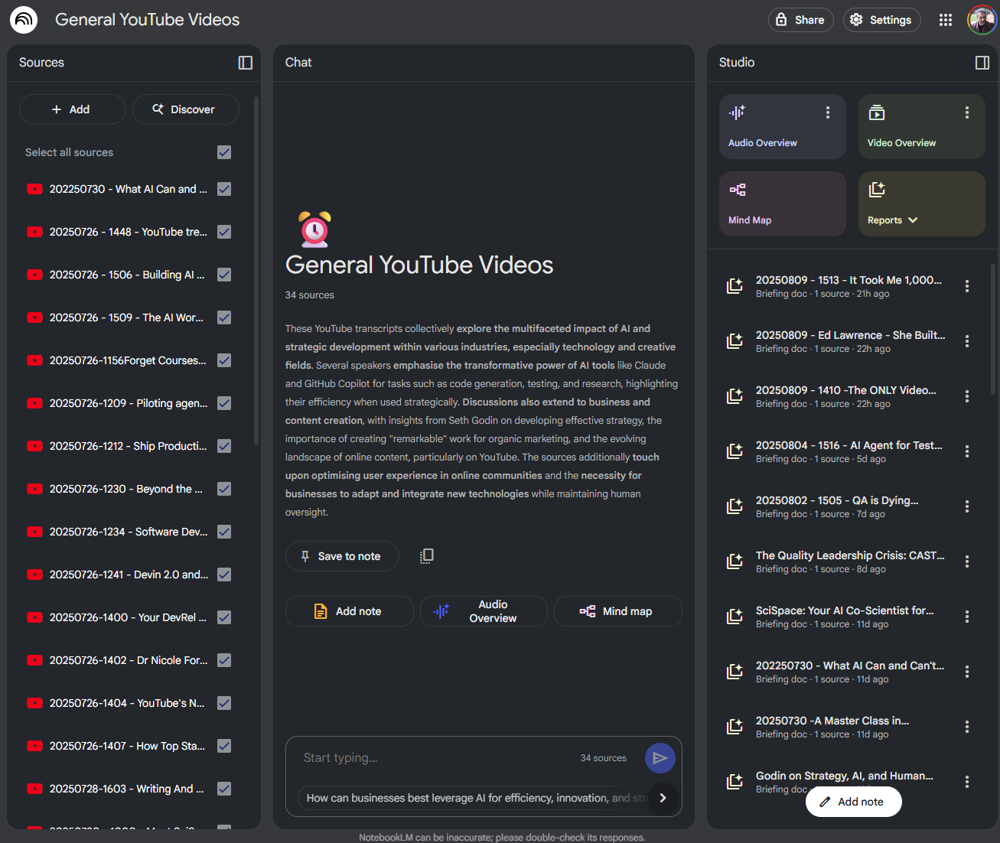

---

# Google Chrome Dev Tools - AI Assistance

- Built in to Chrome Dev Tools
- Chat UI
- Can also generate Javascript code

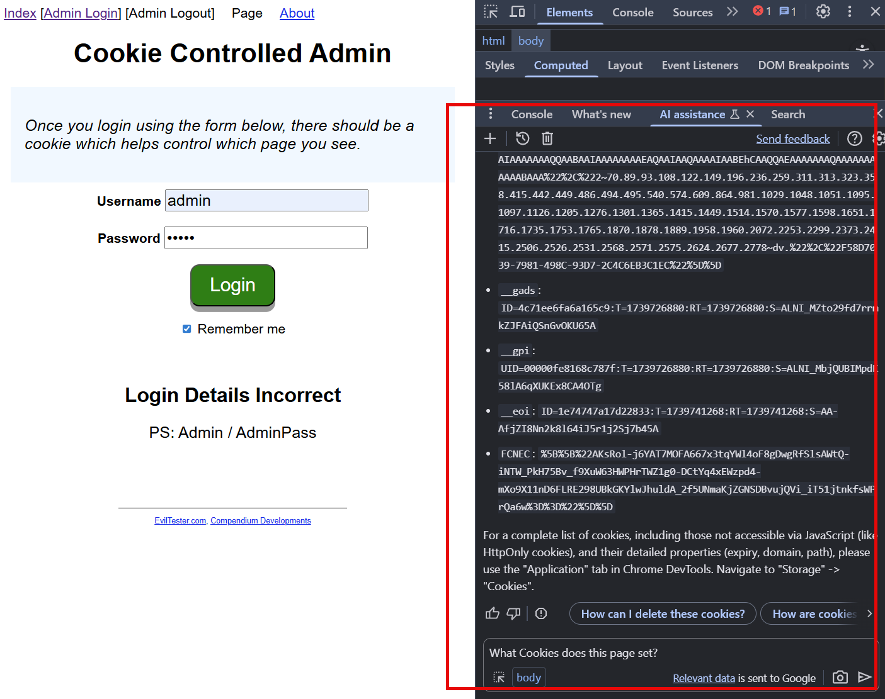

---

### Experiment with Ollama - Local LLM Host with a chat UI

- ollama.com
- local chat system
- choose model
- Ideally on a PC with a GPU
- see also (GPT4All)

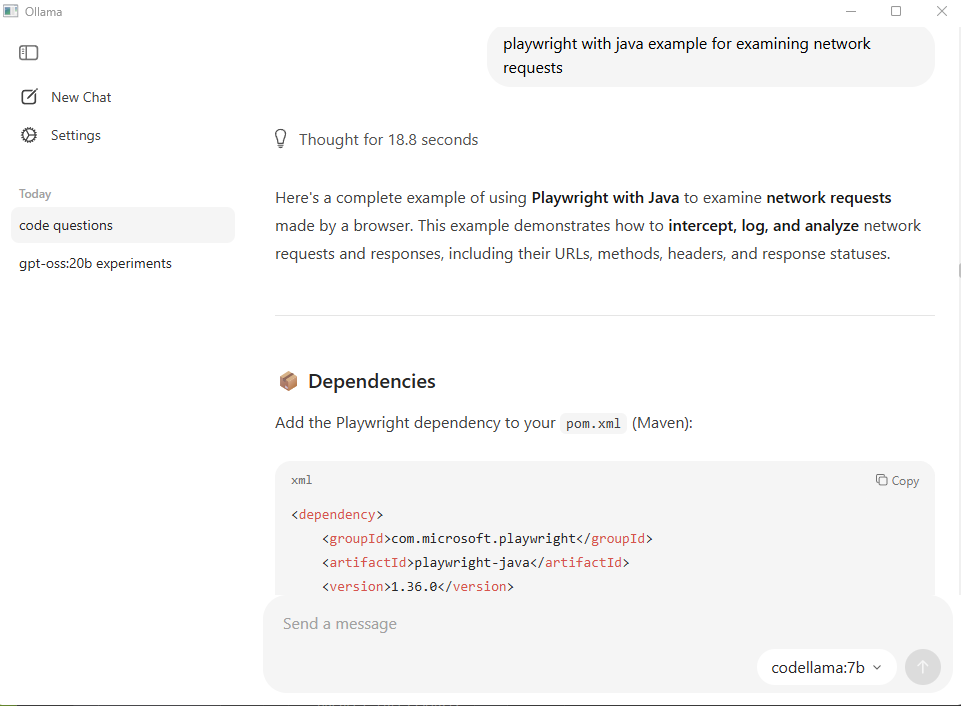

---

### Ollama - LLM Host with a chat UI

- `ollama list`
- `ollama ps`
- models work faster when 100% on GPU
   - codellama:7b
   - qwen3:8b
   - qwen3:14b
   - llama3.1

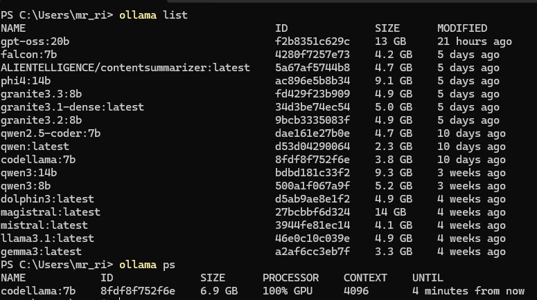

---

### Ollama - API

- Easy to use from Python
- OpenAI Compatible API

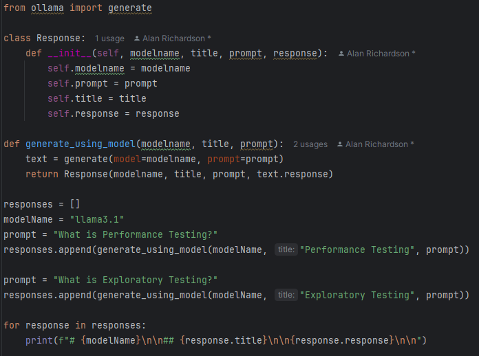

---

# IDE Plugin

- [continue.dev](https://www.continue.dev/)
- Free for individual use
- Works with free Ollama and Codellama model
- works like co-pilot

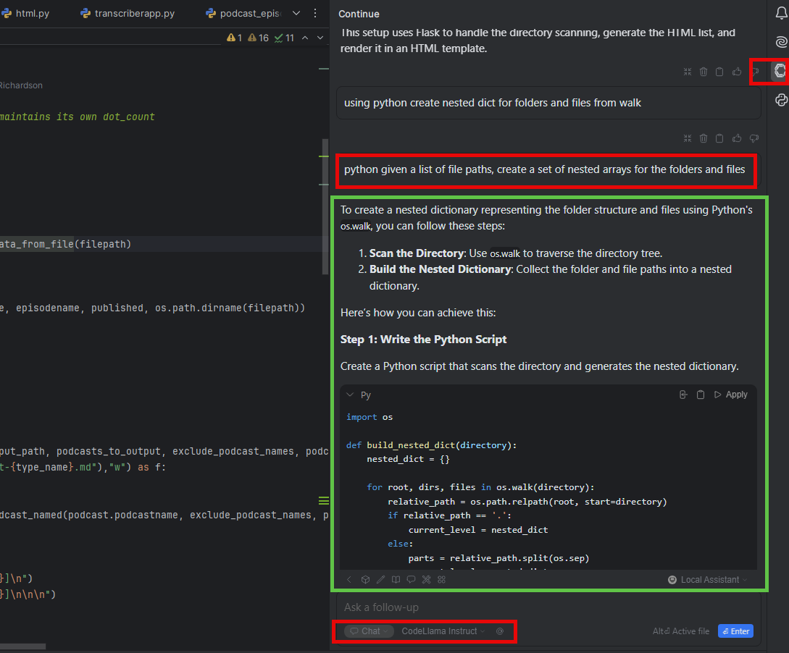

---

# Experiments with AI Coding

- see [huggingface.co](https://huggingface.co/)
- models and APIs with example code
- free AI Training [huggingface.co/learn](https://huggingface.co/learn)

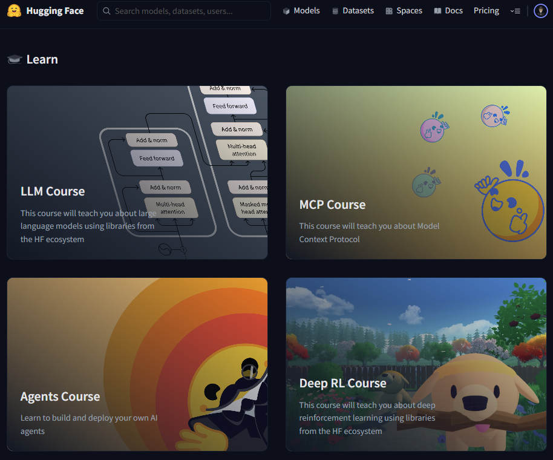

---

# Fun Experiments

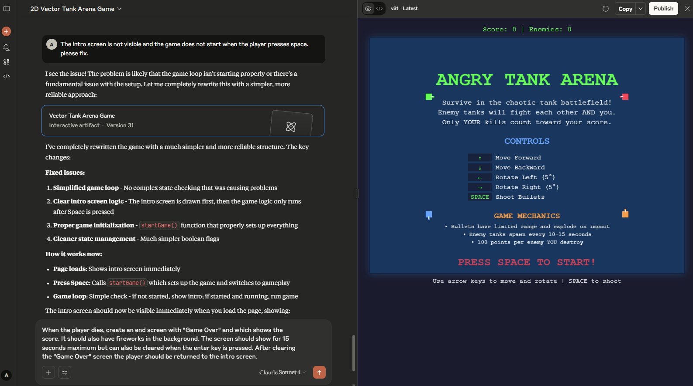

---

# Your Initial Experiments with AI

- Use AI to augment, or do things, you already know how to do,
   - Because then you can evaluate the results.
- Get hands on with free tools and experiment.
- Find value add use-cases that fit into your life.
- Don't panic about AI Taking over the world.
   - Learn and Have fun.

---

# Humans Have Advantages

- LLMs are out of date
   - they are trained on out of date data
   - they need RAG to be up to date
- Humans that use AI to augment their skills:
   - will be more up to date
   - will be more creative
- Humans that use AI as crutch will be out of date and replaceable

<!--
---

# "Only variety can absorb variety" - Ross W. Ashby

- Requisite Variety
   - Do you have enough variety to handle the changing complexities of a world with AI?

Experiment and keep learning to expand your options.

-->

---

# What I know I will not use AI for
    
- Proxy Direct Human Communication
    - Input - Summarize emails, read contracts
    - Output - Write emails, blog posts, books, etc.
- Replace Thinking
- That which can be done algorithmically.

---

# What I know I will use it for

- Augment
    - Here is my work, what is missing?
    - Write code snippets.
    - Supplement documentation.
- Attenuate Information Overload
    - So I can handle more input
- More Experiments

---

# There is so much happening I can't keep up...

- No-one can keep on top of it all

---

# Avoid FOMO (Fear of Missing Out) with these tips...

---

# If AI works and revolutionizes testing... then I guarantee someone will let you know.

---

# If AI makes it easy to do something... then it will be easy to learn.

---

# Prioritise experiments with Augmentation... if it works then you'll be better at what you do.

And if it doesn't work then the extra practice will have been good for you.

<!--
---

# If an AI is going to replace you... why experiment with that AI? 

## Build the managerial skills needed when the AI is in place.

-->

---

# Action Plan

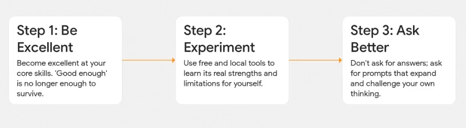

---

# Attitude

- If AI helps me then I'll use it
- I need to experiment to know how it adds value
- I'll do it at my sustainable pace
- I will not neglect my core skills and professional development

---

# AI will not replace the need for skilled humans...

- strive for excellence,
- build the skills necessary to do the job well (_without AI_),
   - if AI works then you'll **be even better** at your job,
- and you can step in when AI fails.

---

# Additional Resources

Links to:

- Free AI Papers
- Books on AI Ethics and Limitations
- AI Newsletters

---

# AI Generated Summary of This Talk

https://vimeo.com/1110936270

Created using Notebooklm Video generation from a transcript and the audio voice over generated using Descript from a 'clone' of my voice.

_the original summary [https://vimeo.com/1110935570](https://vimeo.com/1110935570)_

---

# Recommended YouTube Videos

- Deep Dive into LLMs Like ChatGPT by Andrej Karpathy
   - https://www.youtube.com/watch?v=7xTGNNLPyMI

---

# Free Courses

- https://github.com/microsoft/generative-ai-for-beginners
- https://huggingface.co/learn/llm-course/chapter1/1
- https://huggingface.co/learn/mcp-course/unit0/introduction

---

# Free AI Papers

- On the Dangers of Stochastic Parrots: Can Language Models Be Too Big? by Emily Bender
    - https://s10251.pcdn.co/pdf/2021-bender-parrots.pdf

---

# Recommended Books on AI Ethics and Limitations

- Empire of AI by Karen Hao
   - A well argued negative view of Open AI and ethics issues.
- Taming Silicon Valley by Gary Marcus
   - A history of AI, description of issues with current LLM approach, and discussion of guardrails and ethics. Up to date and very relevant.

---

# Books on AI Ethics and Limitations

- Superintelligence by Nick Bostrom
   - A philosophical overview of AI Dangers and safe-guards that need to be put in place. 
- The AI Con by Emily Bender
   - A general negative view of AI and ethical issues with AI

---

# AI Newsletters

- SuperHuman.ai - https://www.superhuman.ai/
- World of AI - https://intheworldofai.com/
- Gary Marcus - https://substack.com/@garymarcus
    - recommended posts:
        - https://garymarcus.substack.com/p/slopocalypse-now
        - https://garymarcus.substack.com/p/ai-agents-have-so-far-mostly-been

---

# Free to use AI Tooling

- https://notebooklm.google.com

---

# Free to use AI Chat Tooling

| AI Chat | Tools |
|----|----|
| [lambda.chat](https://lambda.chat/) | [duck.ai](https://duck.ai) |
| [chatgpt.com](https://chatgpt.com/ ) | [grok.com](https://grok.com) |
| [perplexity.ai](https://www.perplexity.ai/) | [deepai.org](https://deepai.org) |
| [chat.mistral.ai](https://chat.mistral.ai/chat) | [claude.ai](https://claude.ai) |
| [gemini.google.com](https://gemini.google.com/app) | |

<!--
- https://lambda.chat/
- https://duck.ai
- https://chatgpt.com/ 
- https://grok.com/ 
- https://www.perplexity.ai/
- https://deepai.org/
- https://chat.mistral.ai/chat
- https://claude.ai
- https://gemini.google.com/app
-->

---

# Free to use Local Model Tooling

- [ollama.com](https://ollama.com)
- [nomic.ai/gpt4all](https://www.nomic.ai/gpt4all)
- [continue.dev](https://www.continue.dev/) for coding augmentation

---

# Free tooling - have not used yet

- Gemini CLI and IDE Plugin - https://codeassist.google/
- Google Colab - Python Jupiter notebooks with GPU in the cloud https://colab.google/
- n8n - workflow automation - https://n8n.io/
- Cursor - coding - https://cursor.com

---

# All we can do, is Keep Getting Better

Strive For Excellence