<!-- footer: @EvilTester -->
<!-- page_number: true -->

# A Guide to Testing Web Applications

DevFest 14th Dec 2019 Bishkek

## Alan Richardson

- EvilTester.com
- @EvilTester
- compendiumdev.co.uk
- digitalonlinetactics.com

---

> Have you ever wondered how other people test applications? Not in theory, but in practice? What thought processes are used? How did they model the application? What tools were used? How did they track the testing? That's what this talk is all about. This talk will be based on a short Case Study of testing an open source web application. Why open source? Because then there is no commercial confidentiality about the process, tools or thought processes. Alan will explain his thought processes, coverage, approaches, tools used, risks identified and results found. And generalise from this into reusable models and principles that can be applied to your testing. This covers the What?, and the Why? of practical exploratory web testing.

---

# A 'micro' case study

- This is a case study performed at a 'micro' level
    - equivalent to about a 'day' of Testing
- Lessons and observations are extrapolated to a 'macro' level
- Means that:
   - not all Testing Lessons will be discussed
   - the lessons mentioned, have context

---

# Which App to choose

- Tracks
- https://www.getontracks.org/
- Web App, JS, API, DB
- Offers a lot of scope for testing

---

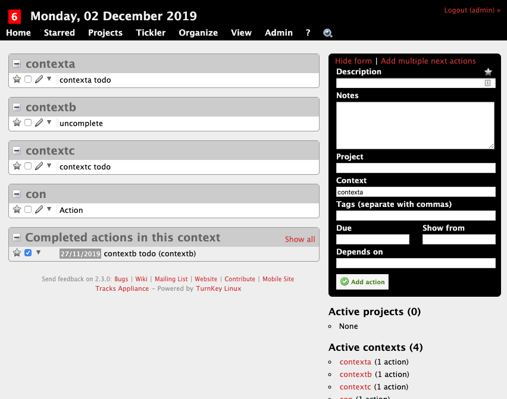

---

# Lesson

- Normally we don't get to choose
    - Or do we?
-  We need to allocate staff based on skills and experience,
    - not just availability
- If we don't understand the technology
    - we need to manage that as a risk

---

# Environment

Could use:

- Docker
- Local install
- VM
- Cloud hosted

Each has different risks and constraints.

---

# My Environment Requirements

- proxy traffic
- possibly view DB
- low impact on my machine

---

# Knowledge Constraints

- My Tech knowledge of Docker
- Lower Docker knowledge than VM
- Know how to configure and access DB on VM
- Chosen VM https://www.turnkeylinux.org/tracks
- Issue... old version of tracks
    - not a concern for this talk

<!--
R00troot
-->

---

# Lesson Environment Impacts Testing

- Do staff have permissions?
    - to observe, interrogate, manipulate?
- Does environment match deployment?
- Does release process match live?
- Version management
    - same as live?
    - can do upgrades?

---

# Install Session

~~~
# Install Session

20191125 10:00

* download vm https://www.turnkeylinux.org/tracks
* install tracks
* 192.168.1.36
* R00troot

10:30
~~~

---

# Environment Ready

- Installed VM
- Login as Admin
- Is tracks ready?
    - Don't know
    - No health check or status to inform me

---

# Lesson

- Automated Execution can help derisk deployment and startup
- Without this, the first 'test' sessions are 'health check' sessions
- Otherwise there is a risk of wasted time but finding out too late

---

# Health Check

- CRUD
- Create, Read, Update, Delete
- Main Areas
    - Keep it simple, create a todo

---

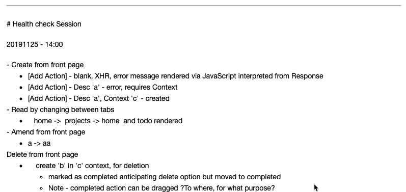

---

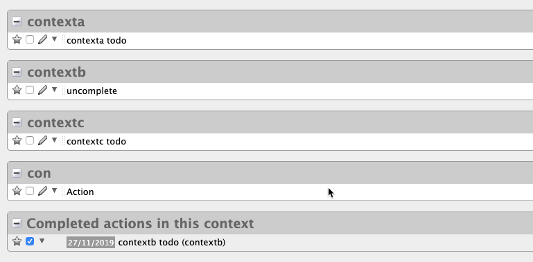

---

# Lessons

- All testing is exploratory, observation and exploration during health check
- Exploration boosts (and is constrained by) technical knowledge of the app
- Time Box Testing
- I need to have screenshot tools to help gather evidence quickly during testing
- Make Notes Prior (Plan) (AIMs)
- Make More Notes During (Actual)
- Gather Evidence

---

# How do I know what to test?

- Requirements
- Stories
- Defects
- Change Requests
- Commits

---

# I am going to

- Test Holistically
    - System rather than Story
- Assume other testing has been performed
- Plan

---

# Planning Session

- Making the decision about what to test is also a 'session'
- It is an exploratory process of weighing up factors, asking questions and making decisions
- It can be tracked and planned like any other activity
- It is important not to go into too deeply because we are working with unknowns
- But if we "don't plan" because we are Agile, or Exploratory we are losing an opportunity to effectively target our testing.

---

~~~
# Planning session

20191126 - 13:00

- release notes
- commits?
- defects?
- general functionality?
- assume team tested, add value by going 'holistic'
- pick release note item and go beyond acceptance criteria

"You can now change the state of a context to closed"

Questions:

- What is a Context?
- What is Context State?
- What states are there?
- Is it a state machine?
- Are all states equally valid?
- Are there transition rules?

20191126 - 13:10
~~~

---

# What do I test?

- Requirements
    - Often driven by 'stories' on Agile
    - What a User wants to achieve
    - Why they want it
- How it has been implemented
    - Functional Description
    - Technical Risk
- Decisions & Constraints made during development
- Priorities and Agreed Risk Areas

---

# Taking a System and Beyond View

I will assume that testing has been done on the stories and all stories complete in the sprint and release.

I will take a System view and ignore specific 'sprint', 'story' or 'release' requirements. View functionality as a whole.

I will not review automated execution. Risk of duplicated effort and scope.

---

# Q: How does a manager add value on an Agile Project?

<!--

This isn't a joke by the way.

-->

---

# A: By looking at the project holistically.

- Teams are focussed on the functionality that they are working on.
- Teams often don't have time to look beyond.
- Teams are often not encouraged to think beyond.

Process risk, can be used to drive testing. Look where others don't.

---

# My Chosen Scope

From https://www.getontracks.org/news/comments/release-2.3.0/

> "You can now change the state of a context to closed"

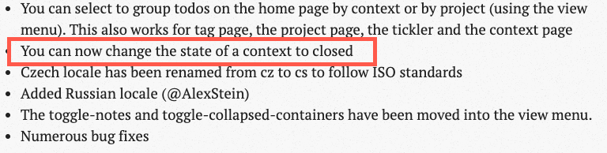

---

# When I start testing, I don't know what that means yet.

I have to explore to find out.

---

# Context State

"Charter"

> "You can now change the state of a context to closed"

- What is a Context?
- What is Context State?
- What states are there?
- Is it a state machine?
- Are all states equally valid?
- Are there transition rules?

---

# Recon Session

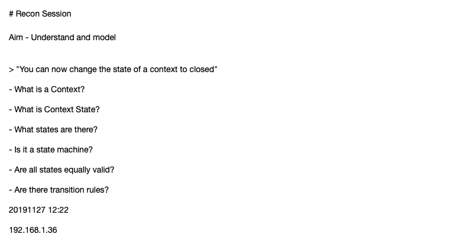

---

# Recon Session

Findings:

* todos added to context
* context seems to move between state in any order (TODO: cover state table)
* constraint, cannot move context to closed if open actions
* but can add open actions to closed contexts
* all contexts are shown in auto complete drop down regardless of state (order controlled by Organize view)
* seems to be XHR updates but need to view traffic to be sure
* open screens to not update with state unless refreshed e.g. home, when open and move context to new state, does not show new state - can this be used to abuse state? e.g. drag todo as sub todo on a todo on a closed state and closed todo that has not refreshed yet?

---

Lessons Learned:

- Functional Testing is Functional Testing
- Architecture and technology changes observation ability
- My modelling and assessment of findings is limited by my ability to observe
- Choosing and Selecting Tooling is an evolving process based on the needs of the testing and the application.
- I don't 'start' with tools, I iterate towards tool usage as required.

---

# Debrief Session

- Look at what we've done
    - Working exploratory means I have to 'step back' periodically
- Collate Notes
- Identify Issues, Todos, Raise Defects
- Feed into Planning Session
- Refine/Formalise Models - Modelling Session if 'large'

---

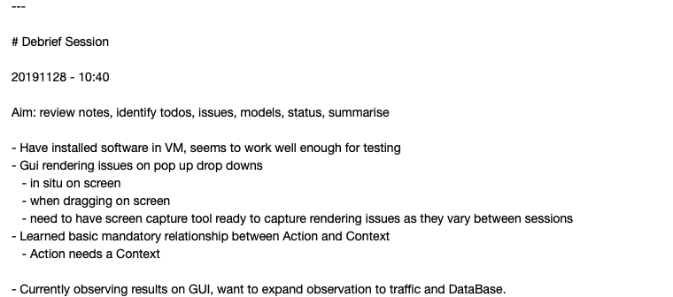

---

# Lessons Learned

- I rely on linear text as much as possible
- text files, markdown, screenshots in `images` folder
- formatting, aesthetics, structure
    - can be added automatically and during debrief
- when working on own, this is indispensable
- can act as a 'status' report

---

# Modelling Session

- "prep a more comprehensive coverage approach because I didn't 'test' this I did an initial exploration during recon but the coverage wasn't documented or thought through well enough."

---

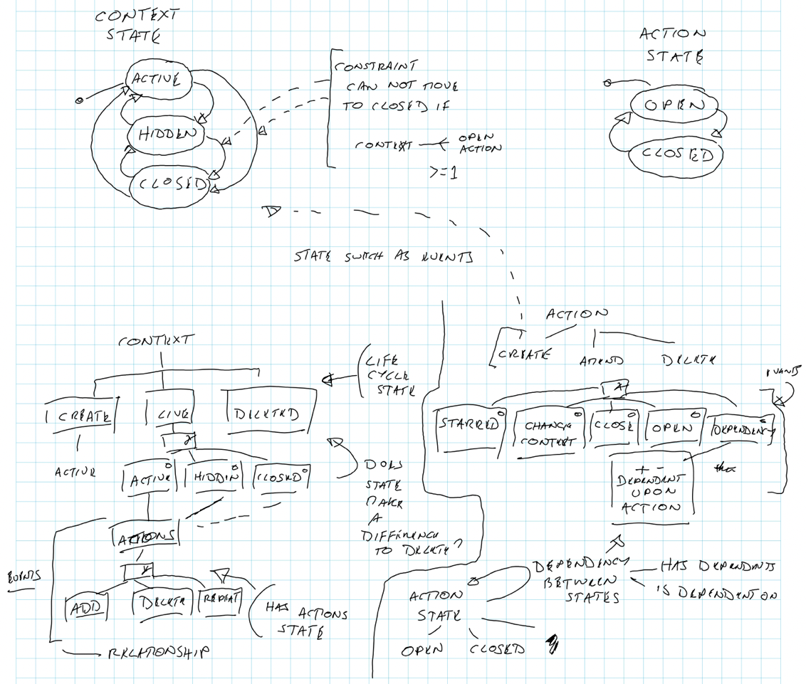

---

# Lessons Learned

- Modelling is a key skill
- When our models are ambiguous it might mean we don't understand
- Simple concepts can expand into complex models
- Complex models have a high number of combinations
- Formal modelling often has tooling support
- Informal modelling can support exploration
- Don't leap to a diagrammer tool
    - pen, paper, smartphone camera
    - whiteboard -> smartphone camera
    - tech solution smartpen -> Evernote

---

# Led to a Quick Planning Session

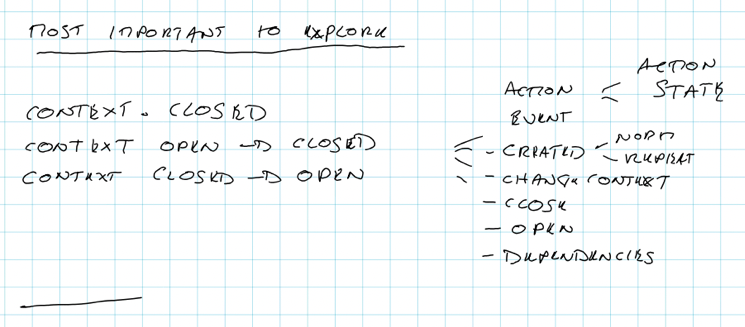

---

# If this was a real project:

- add this as notes in a Jira task
- add this to kanban board
- discuss with team
- possibly expand further and write up, if not doing immediately and model is complex

---

# Lessons Learned

- Modelling and Planning are related
- Planning is prioritising parts of model coverage
- Having a representation of your model means it is easier to see, what else can be done later
- Initial plan helps maximise the effectiveness of the testing sessions
- Expand Plan as far as you need to to support the next session

---

# Coverage Session

- Actual Testing
- Created a mindmap in advance to expand the plan
- kept notes as tested
- discovered some missing items from the 'plan' added them into my notes
- trying to keep additional exploration to a minimum - focus on 'coverage' of defined plan

---

# Expanded Plan

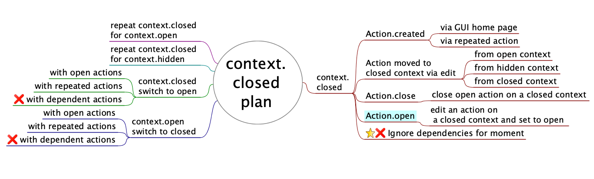

---

# Coverage Session Notes

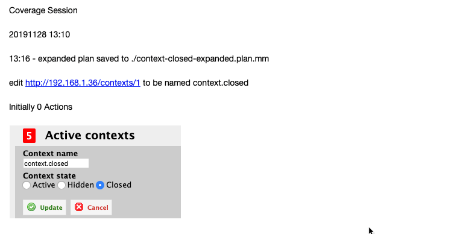

---

# Lessons Learned

- Gathered more evidence when testing, than during recon
- Expand plans as required, when required
    - I use FreePlane because of build in scripting and easy file parsing
- Plan may not be complete
    - be aware of new opportunities to test
    - if in keeping with current aim then follow
    - if out of scope then note down idea as a todo and plan via debrief
    - keep notes of expanded extra paths followed
- tooling support for observation, interrogation. manipulation appropriate for scope and aim i.e. I didn't use any extra tools for testing, but I did for planning

---

# (Technical) Exploratory Session

"Aim: Investigate the traffic mechanisms for creating actions and changing state on context - how far can we push this?"

---

# Technical Exploratory Session Difference From Exploratory Session

- Technical Exploratory Session using observation at a technology level e.g. traffic, params, headers
- Manipulation at a technical level e.g. resend requests, DOM manipulation
- Testing often driven by Technical observation - what happens if I change that field? what if there are multiple fields?
- Bypass system flow and GUI, send messages directly
- Tools mandatory

---

# Using

- Firefox (because I have fewer plugins to create noise in the Proxy)
- FoxyProxy plugin (configure use of ZAP Proxy)
- Owasp ZAP Proxy (Observe, Interrogate, Manipulate HTTP)
- Firefox Dev Tools (interrogate/manipulate DOM)
- TextEditor - view XML (Sublime Text)
- SnagIt - screenshots
- Evernote - note taking

---

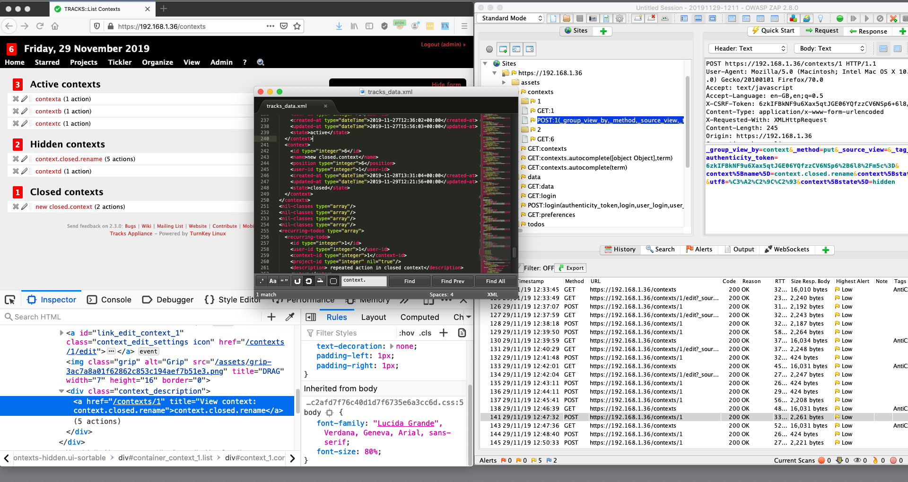

---

# Basic Process

- Work in GUI
- Observe impact via HTTP (I can see if JS or Server validation used)
- Interrogate HTTP Traffic
    - source of additional testing ideas
- Manipulate (resend) HTTP Traffic for message/param exploration
- Trigger interesting results via DOM manipulation in GUI
- very important to keep an eye on time and scope of testing

---

# Notes Overview

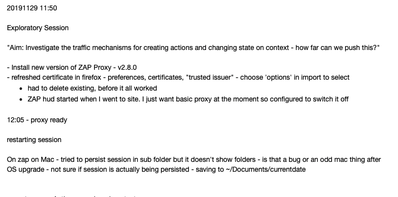

---

# Notes Subset

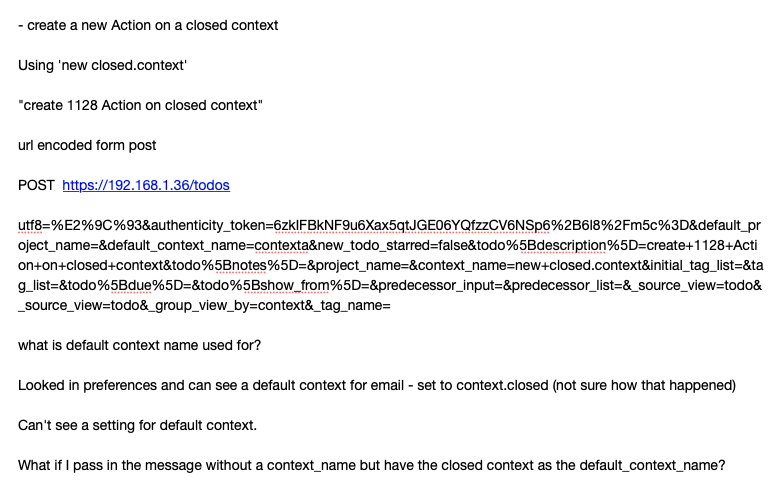

---

# What I Found

- possible bug in ZAProxy - session only savable to Documents, not sub folder
- possible Tracks bug - no error message from system when incorrect status used for context, the value is ignored, the user is told 200 OK, suggests Tracks 'trusts' the GUI so error handling might need more investigation across system
- Tracks XHR message responses which are error messages are 200 status rather than a 4xx status

---

# What I Found

- many 'interesting things about tracks' that I might want to investigate later e.g.  `_method=put` field in request different from HTTP verb, what is a "default context" and how is it set, Tracks responds with HTML and JS rather than a 'message' like JSON
- API vs GUI mismatch? ie a forms API and a JSON API
- limited in what I could observe because I did not include DB tools, had to use System exports to check data.

---

# Tooling Benefits

- automatically record HTTP session
- easy replay for requests
- easy to view traffic without having to use dev tools
- use dev tools for DOM Inspection and manipulation
- use proxy for HTTP Observation, Inspection and Manipulation

---

# Lessons Learned

- Tools can impact testing - lost time due to tool setup
- More information can mean more risk of going off charter or off time
- Test Ideas that are not possible without tooling (e.g. duplicate params, re-order params)
- Duplicate 'bugs' at GUI as well as HTTP level to demonstrate possibility e.g. amend DOM, not just HTTP
- Automated record keeping is a 'backup', I still copy HTTP request and URLs into my notes

---

# What Did I Not Do/Show? - Automating

- likely factored into "Story" Testing
- start tactical, make it work, refactor to abstraction layers, become more strategic as required
- use default tools you know how to get value out of quickly

---

# What Did I Not Do/Show? - Admin

- Admin Sessions
- Raising Defects
    - Use existing logs and evidence where possible.
    - Use logs to help recreate
- Clarifying Questions
- Communication
- Uploading Logs to Time Tracker
- keep as light weight as possible
    - use existing team tools, rather than adding 'test tools' - particularly on Agile - as much as possible

---

# What would I do next (for current scope)?

- API
    - expand functional scope to the API to repeat what was done at GUI
    - assumption - different routing code, possibly different back end code
- DB
    - extend observation and interrogation to the DataBase

---

# Basic Testing Flow Used

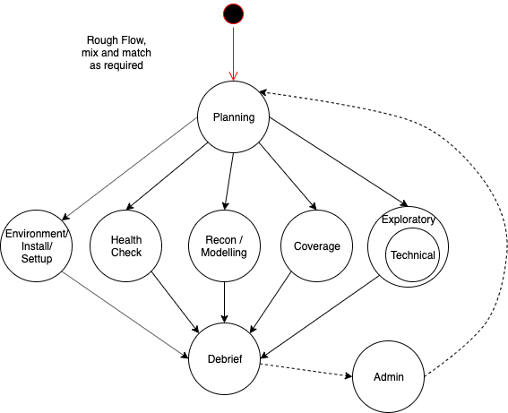

---

# Testing

- 241 minutes (4 hours) spent Testing
- 93 minutes (1.5 hours) hands on
- 2-3+ hours additional admin if 'real' project

Much of Testing goes unnoticed and untracked.

Note taking is key to gathering evidence and making testing visible.

<!--

Of the 241 minutes I spent Testing only 90 minutes would be what most people think of as "Testing"

- i.e. hands on keyboard work

Because this was an 'exercise' I didn't have to raise defects or have discussions which would probably have added another few hours on to the total without increasing the "Testing" work.

-->

---

# Bugs

Testing is not all about bugs.

- The most visible output, are bugs.
- Many projects only care about bugs.
- Testing is a process of deliberate exploration and coverage.
- Finding bugs is a side-effect of this process.

---

# Tooling

Tooling comes from:

- need
    - observation
    - interrogation
    - manipulation
    - admin (reporting, management, etc.)
- technology
    - chosen project technology can aid/hinder tooling

---

# Exploration And Coverage

We can explore at all points in our testing. Observation and reflection can identify new opportunities. New opportunities do not need to be followed immediately.

- The more we are focussed on coverage the more we constrain our exploration within the coverage.

- The more we are focussed on Exploration, the more our coverage has to be reverse engineered from our logs, evidence and notes.

---

# About Alan Richardson

- EvilTester.com
- CompendiumDev.co.uk
- Talotics.com
- @EvilTester

_see above for books, youtube, online training, patreon, blog, etc._

---

# Social & Contact Links

1. https://www.eviltester.com
2. https://twitter.com/eviltester
3. https://www.linkedin.com/in/eviltester/
4. https://www.youtube.com/user/EviltesterVideos
5. https://instagram.com/eviltester
6. https://facebook.com/eviltester

---

# Section: Edited for length

The slides that follow were not used in the main presentation due to timing constraints.

---

# In-Sprint, Story and System Testing

---

# In-sprint testing

- constrained to 'work done' scope
- artificially constrained - no error handling, no security etc.
- need to track these 'ommissions' as coverage gaps for later testing
- often testing 'bits' of stories

---

# Stories

- Complete chunk of work
- Sometimes span sprints
    - 'not complete' but still requiring testing
- Acceptance Criteria testing needs to be revisited
- Automated Execution to cover criteria can help
- Going 'beyond' the story often needs to wait till story is 'complete'
- Stories often tested in isolation - Automated Execution in a CI can help

---

# System Testing is a vague term

- I'm meaning 'system as a whole'
- Stories in combination i.e. functional flows that span stories
- Stories in different orders
- Going beyond the story Acceptance Criteria
- Often 'neglected' in Agile Projects

---

# Tracks v2.3.0 Release Notes

https://www.getontracks.org/news/comments/release-2.3.0/

- Changes
- Bug Fixes

Could review code committed since previous release.

---

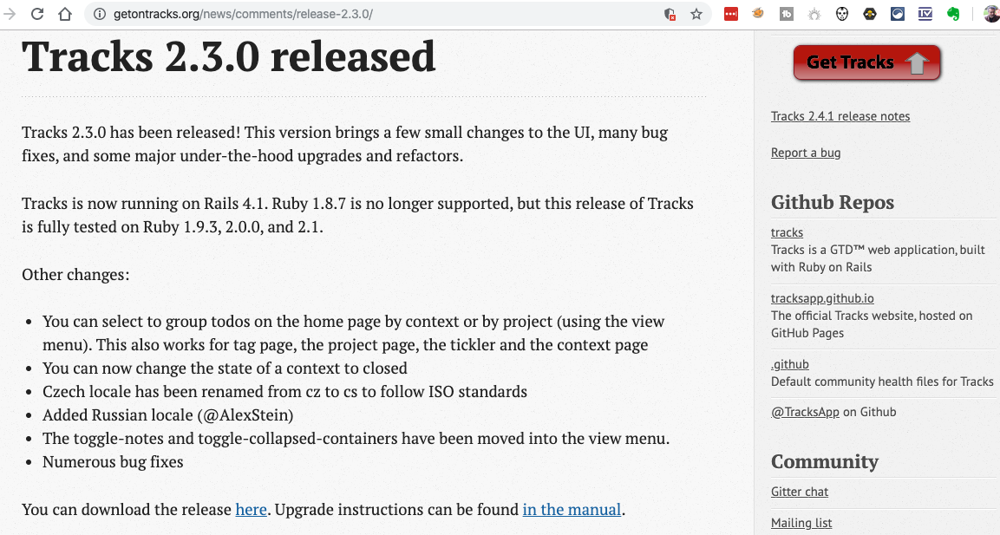

---

# Is it a real issue?

> I cannot create an Action on a closed context. And I can not change state of a Context to closed when it has open Actions. But I can amend an Action to assign it to a closed context.

- Don't know
- On a real project I would not have pursued it so far, without finding that out first.
- It is the type of issue that would be found via exploratory processes

---

# If it is an issue, when would it be found?

- Structured/Traditional testing
    - hopefully during a Q&A, clarification when writing 'cases/conditions' from the requirements
    - but it might take days/weeks to get to that point depending on process e.g.
        - analyse all test conditions and ideas against requirements and remove ambiguity - might find it within days
        - if test conditions, converted to cases, converted to scripts and work through requirements in sequence it might take weeks

---

# If it is an issue, when would it be found?

- Agile
    - hopefully during a story understanding or development session
    - if not then, would it be found from following acceptance criteria?
         - probably not, it would be found in the exploratory testing 'around' the story

Note: questioning and clarifying during analysis is an Exploratory process. This can be found early, by exploring early.

---

# Projects make decisions about defects

In this case it seems like a mismatch in states. The constraint is too easy to bypass if it is an important constraint e.g.

Instead of creating the Action on a closed context. I create it on an Active context, then amend the action to be on a closed context.

But, the impact in terms of system reliability, robustness, data integrity etc. is minor so I might not push hard on this, I might point out that it seems pretty inconsistent.

---

# What Drives Tooling?

- Observation
- Interrogation
- Manipulation
- Admin
    - process support, Evidence Gathering, Note Taking, etc.

---

# Observation

- seeing in real time
- possibility to quick catch issues
- supports monitoring e.g. alerts on errors in logs

---

# Interrogation

- deep dive 'after'
- could be 'seconds' after, but still 'after'
- more data than can be absorbed quickly

---

# Manipulation

- ability to change the system -defaults, static data
- repeat/amend requests
- use the API

---

# Evidence Gathering

- recorded observations
- note taking

---

# What Drives Tooling ... Needs of Testing

---

# For Web

I can test 'blind' and trust the GUI or I can add tooling

- Dev Tools
- Proxy Tools

Both allow observation and interrogation. Proxy tool offers scope for easier longer term interrogation and manipulation for replay.

---

# For `Technology`

Find tools that allow:

- Observation
- Interrogation
- Manipulation
- Support Scripting, extension, apis
- Record Evidence
