# Time Tracking:

20191125 - install - 10:00 - 10:30 (30 mins)
20191125 - health check - 14:00 - 14:20 (20 mins)
20191126 - planning - 13:00 - 13:10 (10 mins)
20191127 - recon - 12:22 - 12:42, 12:50 - 13:13 (20+23 = 43 mins)
20191128 - debrief - 10:40 - 10:53 (13 mins)
20191128 - modelling - 11:20 - 11:52 (32 mins)
20191128 - coverage - 13:10 - 13:41 (32 mins)
20191129 - exploratory - 11:50 - 12:51 (61 mins)

Running total = 241 mins

---

# Install Session

20191125 10:00

* download vm https://www.turnkeylinux.org/tracks
* install tracks
* 192.168.1.36
* R00troot

10:30

---

# Health check Session

20191125 - 14:00

- Create from front page
    * [Add Action] - blank, XHR, error message rendered via JavaScript interpreted from Response
	* [Add Action] - Desc 'a' - error, requires Context
	* [Add Action] - Desc 'a', Context 'c' - created
- Read by changing between tabs
	*    home ->  projects -> home  and todo rendered
- Amend from front page
	* a -> aa
Delete from front page
	*     create 'b' in 'c' context, for deletion
	    * marked as completed anticipating delete option but moved to completed
	    * Note - completed action can be dragged ?To where, for what purpose?
	* delete is on the drop down
	    * NOTE: shows a div which can be hard to click if mouse moved slightly off.
	    * deleted 'b'

- NOTE: alerts rendered prior to create and delete - should check those paths
- NOTE: did not check CRUD via API or confirm results in DB
- NOTE: when dragging an item it is possible to trigger rendering the drop down - probably should not happen

14:20

---

# Planning session

20191126 - 13:00

- release notes
- commits?
- defects?
- general functionality?
- assume team tested, add value by going 'holistic'
- pick release note item and go beyond acceptance criteria

"You can now change the state of a context to closed"

Questions:

- What is a Context?
- What is Context State?
- What states are there?
- Is it a state machine?
- Are all states equally valid?
- Are there transition rules?

20191126 - 13:10

---

# Recon Session

Aim - Understand and model

> "You can now change the state of a context to closed"

- What is a Context?
- What is Context State?
- What states are there?
- Is it a state machine?
- Are all states equally valid?
- Are there transition rules?

20191127 12:22

192.168.1.36

- Created when creating task on home

"c"

Which views for Read?

- /
- /todos/tag/starred
    - todos are organised based on the Context
- /contexts/1
- sidebar
- /contexts
	*     shows Active, Hidden, Closed contexts
	* can add context here or hide from front page
- exports - assume this describes state

Defect: a rendering issue in starred view for 'edit dropdown'

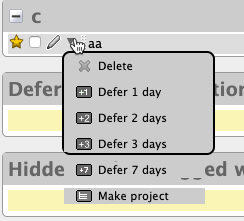

The main view for Context for editing is 

http://192.168.1.36/contexts

* clicking on edit allows changing name or state

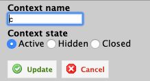

Does dragging between context states on GUI change state?

Tried - does not seem to. But only have 1 context. Create more and see if it makes a diff.

contexta, contextb, contextc, contextd

No - can't drag. Not sure why drag functionality is present.

Drag is used to re-order within a particular state.

Seem to be no state constraints i.e. can move from

active -> hidden -> closed seemingly in any order.

Formally create combos and try

* active -> hidden
* hidden -> closed
* closed -> active
* active-> closed
* closed -> hidden
* hidden -> active

Can set existing state? Possibly when amending name? Not sure what is submitted - XHR?

* active -> active
* hidden -> hidden
* closed -> closed

pause 12:42 - door

restart 12:50

Need visibility into messaging when doing this as not a page refresh so XHR used.

Does context state impact other views where context shown?

make:

- all contexts have todos
- view on all views
- change state

contextc - hidden

contextb - closed

check on all views

when creating todos - question does context state change auto complete on main page?

Note Seems odd to me that we can't change the state from the edit on the full main context view i.e. http://192.168.1.36/contexts/4# But only from the context view. http://192.168.1.36/contexts

hid contextc

close contextb...

Found a state constraint. Cannot move to closed when a context has uncompleted actions.

- Does this mean that we cannot add uncompleted actions to a context which is closed?

12:59

Closed "contextb todo" on front page and on front page it is shown in a 'completed actions in this context' - assume this shows actions from all contexts

TODO: check completed actions in this context shows todos from all contexts - what if hidden?

continue - close contextb then try and add an action to it

"todo on closed contextb"

contextb shown in auto complete drop down so state does not affect presence in drop down - but this might be cached - haven't checked how auto complete works, need more visibility into traffic here

added new action "todo on closed contextb" to a closed context

Note: seems odd that I can add an uncompleted action to a closed context, but I can't close a context with uncompleted actions, this feels like a potential bug.

TODO: what other entity/state combinations are there?

*  repeating todos?

refresh home page in case the context state impacts the drop down auto completion. No difference, all contexts shown in drop down after refresh.

Findings:

* todos added to context
* context seems to move between state in any order (TODO: cover state table)
* constraint, cannot move context to closed if open actions
* but can add open actions to closed contexts
* all contexts are shown in auto complete drop down regardless of state (order controlled by Organize view)
* seems to be XHR updates but need to view traffic to be sure
* open screens to not update with state unless refreshed e.g. home, when open and move context to new state, does not show new state - can this be used to abuse state? e.g. drag todo as sub todo on a todo on a closed state and closed todo that has not refreshed yet?

Note: when dragging a todo to become a sub todo, I can't see how to remove it from sub task as 'drag' handle has gone. (amended todos in tickler view to remove 'dependency')

TODO: does API enforce the same constraints?

13:13

---

# Debrief Session

20191128 - 10:40

Aim: review notes, identify todos, issues, models, status, summarise

- Have installed software in VM, seems to work well enough for testing
- Gui rendering issues on pop up drop downs
   - in situ on screen
   - when dragging on screen
   - need to have screen capture tool ready to capture rendering issues as they vary between sessions
- Learned basic mandatory relationship between Action and Context
   - Action needs a Context

- Currently observing results on GUI, want to expand observation to traffic and DataBase.
- Currently manipulating through GUI, want to expand manipulation to API. Can then observe and interrogate through API.

- Context state interaction
   - Context can have states Open, Hidden, Closed
   - Constraint - cannot close a context when it has open actions.
   - Possible issue
   - Open Action can not be moved to a Closed Context
       - Possible issue, an Open Action can be created on a Closed Context

I do need to explore the state and ELH relationships in more detail. Move this to a planning session to prep a more comprehensive coverage approach because I didn't 'test' this I did an initial exploration during recon but the coverage wasn't documented or thought through well enough.

**Added Timing Session to Notes**

NOTE:

If this was a real project:

- write down all questions from notes
- write down all 'issues' from notes
- write down all 'todos' to isolate for prioritisation purposes
- communicate these in project for answers and clarification, then raise if issues

10:53

---

Modelling

see aegir smartpen pad notes

20191128 11:20

11:52

---

Coverage Session

20191128 13:10

13:16 - expanded plan saved to ./context-closed-expanded.plan.mm

edit http://192.168.1.36/contexts/1 to be named context.closed

Initially 0 Actions

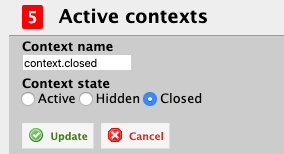

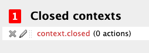

## Action.created

http://192.168.1.36/

Create action from home in closed context

Added a recurring action to repeat every day - created one day in past just in case it will create - otherwise wait till tomorrow or advance system clock

Inspected message sent to server and it is all fields with ints - didn't look like the opportunity to convert a millisecond delay into a faster trigger.

## Action moved to context via edit

**From open context**

http://192.168.1.36/

"aa" - id 1 is open in open context a - edit to move to context.closed

Action saved

Upon viewing the context I can see that a repeated task from 'yesterday' has also been added

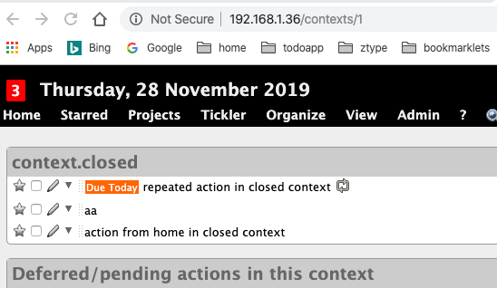

**From hidden context**

contextd has items and is open, make contextd hidden

Edit "contextd todo" id 5 to be in context.closed

Added successfully

**From closed context**

make contextd closed, then move remaining open context to this context

Cannot make contextd closed because "State cannot be changed. The context cannot be closed if you have uncompleted actions in this context" constraint kicked in.

Create new context "new closed.context" add an item to it from home, then move to "context.closed"

create action - "added to new closed context" in closed context

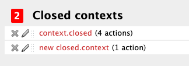

Edit action and move to context.closed - successfully completed

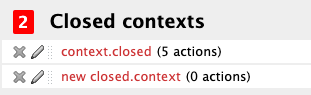

## Action.close

close an open action on a closed context

from context view http://192.168.1.36/contexts/1

"aa" marked as closed successfully

## Action.open

open "aa" - success

## Defer action (new path, not planned)

set to Deferred - "aa"

success, now in 'tickler"

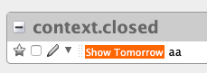

## Context closed

Switch to Active with open actions - use "context.closed"

change state from context view

http://192.168.1.36/contexts

Context Saved

## Context open to closed

> "State cannot be changed. The context cannot be closed if you have uncompleted actions in this context"

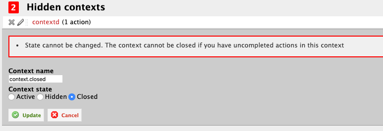

## Context open to hidden

allowed 

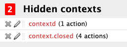

## Context hidden to closed (new path)

"State cannot be changed. The context cannot be closed if you have uncompleted actions in this context"

I did drop down to network tools for this and saw that it is a form POST, but has a '_method' in the form for "put"

http://192.168.1.36/contexts/5

It might be worth exploring the messages in more detail.

13:41

Additional Items not in plan

* context hidden to closed when it has open actions
* action set to deferred on a closed context

20191129 11:50

Exploratory Session

"Aim: Investigate the traffic mechanisms for creating actions and changing state on context - how far can we push this?"

- Install new version of ZAP Proxy - v2.8.0
- refreshed certificate in firefox - preferences, certificates, "trusted issuer" - choose 'options' in import to select
* had to delete existing, before it all worked
* ZAP hud started when I went to site. I just want basic proxy at the moment so configured to switch it off

12:05 - proxy ready

restarting session

On zap on Mac - tried to persist session in sub folder but it doesn't show folders - is that a bug or an odd mac thing after OS upgrade - not sure if session is actually being persisted - saving to ~/Documents/currentdate

- create a new Action on a closed context

Using 'new closed.context'

"create 1128 Action on closed context"

url encoded form post

POST  https://192.168.1.36/todos

utf8=%E2%9C%93&authenticity_token=6zkIFBkNF9u6Xax5qtJGE06YQfzzCV6NSp6%2B6l8%2Fm5c%3D&default_project_name=&default_context_name=contexta&new_todo_starred=false&todo%5Bdescription%5D=create+1128+Action+on+closed+context&todo%5Bnotes%5D=&project_name=&context_name=new+closed.context&initial_tag_list=&tag_list=&todo%5Bdue%5D=&todo%5Bshow_from%5D=&predecessor_input=&predecessor_list=&_source_view=todo&_source_view=todo&_group_view_by=context&_tag_name=

what is default context name used for?

Looked in preferences and can see a default context for email - set to context.closed (not sure how that happened)

Can't see a setting for default context.

What if I pass in the message without a context_name but have the closed context as the default_context_name?

12:20

replay message

error context can't be blank

try again and make default same as. context name

* worked

The response is JavaScript which is used to refresh the page

Changing the default context seemed to make no difference.

12:23

Investigate the changing state of context message

i.e. for a context with actions - see what message is sent when we try to set it closed

https://192.168.1.36/contexts

"context.closed"

POST https://192.168.1.36/contexts/1

utf8=%E2%9C%93&_method=put&authenticity_token=6zkIFBkNF9u6Xax5qtJGE06YQfzzCV6NSp6%2B6l8%2Fm5c%3D&context%5Bname%5D=context.closed&context%5Bstate%5D=closed&_source_view=&_group_view_by=context&_tag_name=

_method and verb mismatch - what if change _method?

e.g. post, patch

`_method=post - 404`

`_method=patch - 200` (but it is actually an error - state cannot be changed)

QUESTION: Possible issue - It might be more appropriate if this returned an error code, but since it is used by an XHR does that make a difference?

?what if try to change to a state that does not exist?

e.g. close instead of 'closed'

! context saved

but saved as what?

still shown as hidden on the screen

Tool limitation - really need to see in the database at the same time as the traffic because I don't know if the data was changed and we have a rendering mismatch.

Short term going to try the export to gain visibility

export as xml lists state as hidden

Suggests that the state is validated, but no error message thrown if not as expected - presume this is because the server is not expecting the state to be different.

Can I trigger this from the GUI by amending the HTML prior to sending?

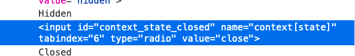

Posted with 'close' and GUI reported that 'context was saved' but no change to the screen.

what if blank?

context saved - 200 response, no changes made

The full message has the name of the context as well - can I change this at the same time as changing the state?

"context.closed.renamed" and set to active

- that worked - so the same message can be used for both changes, as per the GUI

Could a valid name change override an invalid state change?

e.g. change name at same time as setting to 'closed'

No - the name is changed, but the state is not

what if I use a double state? i.e add it into the form twice - first valid, second invalid

error message - state cannot be changed to close - reverse order in form?

error - but looking at the proxy message sent, it did not reverse the order - the table view in ZAP did not reflect the order that it rendered - that was "adv" mode - trying in normal table mode

message accepted but state was sent trough as "closed" and "" which is not what I wanted to send but the actual impact was...

context is still active - the invalid state of "" was used, not the first

Using the text view in zap to ensure ordering

create with:

- closed
- active
- closed

error

what if param value has multiple values? e.g. active,closed?

active%2Cclosed

accepted - no change made

Conclusion: Server rejects the status as invalid but no error message shown to user - only error message if constraint is invalidated. I would probably raise this as a bug.

12:51

Is authenticity token required? There is also an Z-CSRF-Token in the headers and an auth token and a session token in the cookies - which really controls the auth?

