footer: \#esconf | @eviltester
slidenumbers: true

<!-- footer: @EvilTester -->
<!-- page_number: true -->

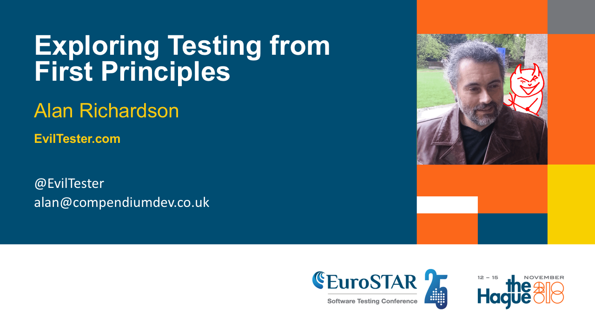

<!--

---

# Exploring Testing from First Principles

## Eurostar 2018

### Alan Richardson

* [www.eviltester.com](http://www.eviltester.com)
* [www.compendiumdev.co.uk](http://www.compendiumdev.co.uk)
* [@eviltester](https://twitter.com/eviltester)

-->

<!--

[speedboat photo]

Alan Richardson start his career in Software Development as a programmer, working with C and COBOL.

[A conference photo]

For most of his career he has specialised in Software Testing, he writes about his experience online

[new photo holding books] at EvilTester.com and has written four books related to Software Testing.

[photo in front of computer with text adventure game books and boxes] As well as creating online training courses Alan has written games to help people practice their testing, including a Multi-user text adventure game.

[guitar photo] When not writing, programming and creating YouTube videos, Alan enjoys playing guitar. Please welcome on stage Alan Richardson.

-->

<!--

---

# Blurb

What if we knew nothing about testing, how would we start? Does our every day life provides the tools we need to help us investigate a domain and develop the necessary skills we need to survive? This talk will start by assuming that about Software Testing and Technical software testing we know nothing. And then, using a process of questioning and exploration we will see how far we get in terms of building a model of Software Testing and Testing an application from a Technical perspective.

Over the course of the presentation, we will see a repeatable process of working from first principles to improve our knowledge, experience and skills. We will see that we can learn to perform complicated and technical software testing activities without having to adopt a complex understanding of software testing.

-->

<!--

I plan to demonstrate that use of questions like "How do we know?" "How can I tell?" "What does that mean?" can lead us through a process of learning and mastery such that we can build our models of testing and our skill sets from first principles and that we do not need to overcomplicate our testing and we do not need to ask "why?". I will explain that "Why?" is a belief chain question, and we really want to focus on observable models of reality rather than 'beliefs' and 'common knowledge' about software testing.

e.g. I want to test a web application - what does that mean? What does test mean? What do I hope to achieve by testing it? How can I achieve those goals? I also have to understand some domain technology - "web", "application" which I learn from the 'web' domain rather than the 'testing' domain. When testing I ask "How do we know?" i.e. "How does it know I'm logged in?" because when we log in it creates a session which it puts in a cookie - which leads to other "What does that mean?" questions until we understand. And then we ask "How do I know it has created a cookie?" which leads us to identify how we can observe and interrogate the system e.g. "How can I see cookies". By exploring a web application from first principles with simple questions we will learn about browser developer tools, http proxies and web testing.

-->

---

<!--

# The Trooper

-->

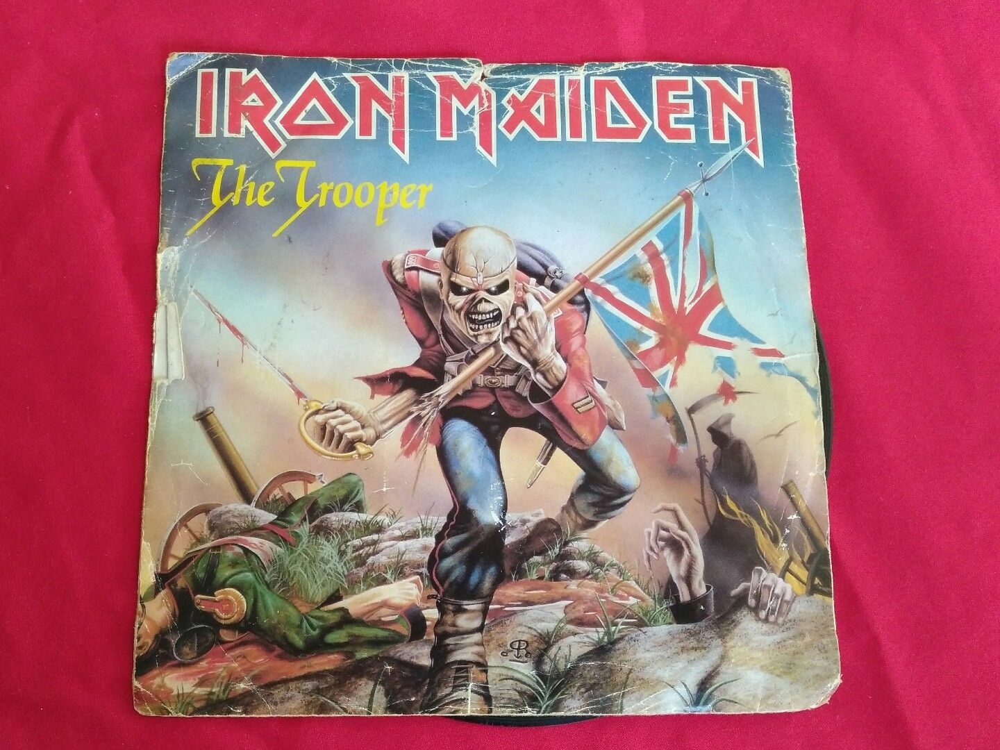

<!--

The reason I started with Iron Maiden's "The Trooper"

Aside from it being Iron Maiden's "The Trooper"

was the notion that "No plan survives contact with the enemy"

And if we over-complicate things they go wrong, if we have complicated plans and can't adapt we fail, if we have complicated tools that take over what we do we can't handle variation.

We need flexibility in our thoughts and actions.

-->

<!--

Image from https://www.ebay.co.uk/itm/IRON-MAIDEN-THE-TROOPER-b-w-CROSS-EYED-MARY-7-VINYL-45-1983-EMI-5397-/232809784910?nordt=true&orig_cvip=true&rt=nc&_trksid=p2047675.m43663.l10137

https://www.ebay.co.uk/sch/tamal-uk/m.html

-->

---

<!--

# The Tester

-->

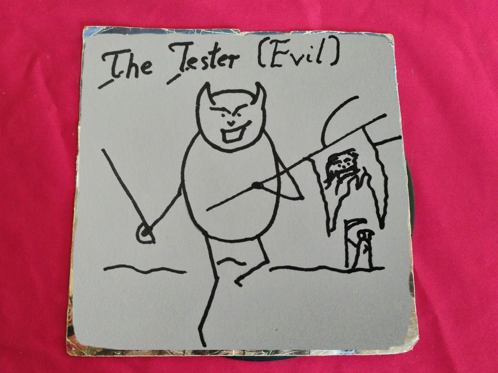

<!--

I know, art skills. How many people didn't notice the slide had changed?

I worry that we over-complicate testing and when faced with variation we don't have a base to build on that we fully own and understand.

We use other people's definitions and approaches without having fully thought them through.

So I want to try and build testing up nothing so that we understand how things fit together to give us the flexibility to succeed.

-->

---

# We over-complicate testing

- Have you seen some of the definitions?
- Have you tried to write your own definition?

---

# Otherwise

<!--

We have an issue when we try to explain what we do because we want to pit in all the nuances and complexities and subtleties because if we don't then:

-->

- it might appear too simple
- it might appear easy

---

# And if its too easy and simple

<!--

And we might feel that if it is seen as easy and simple

-->

- it might be undervalued
- only junior staff get to do it
- we might get paid less

---

# Solution

## Cram in Everything

<!--

And that's why we come up with definitions that cram in everything

-->

---

> _Software Testing is a process whereby we use a software system deployed in multiple configurations, via its GUI, API - and all exposed interfaces - to gather information about its behaviour, flaws and impact on the user and stakeholder needs and requirements; for the purpose of evaluating the quality, and fitness for purpose, in specific operational environments and conditions._

_A possible first draft definition_

---

# But we wouldn't stop there

- refine our definition
- simplify, chunk up
- delete sections
- change it over time
- communicate it differently for different people

But that's a communication. It isn't what testing 'is'.

---

# Danger - over-complicate

<!--

When we make up our own definitions we try to cram everything in

-->

- How do other fields define themselves?

e.g. complicated fields like Physics?

---

# I should consult a dictionary or something.

---

## What is Physics?

> "the branch of science concerned with the nature and properties of matter and energy."

_Google Dictionary Definition_

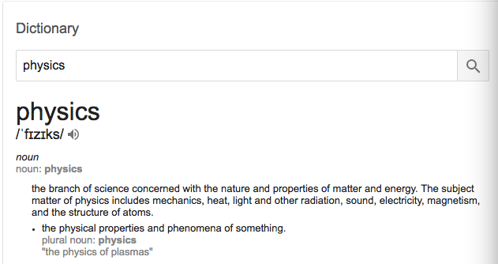

---

## What is Physics?

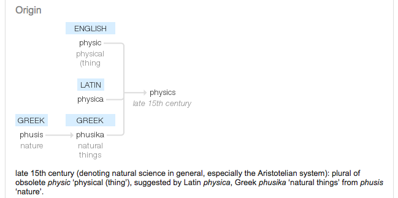

<!--

There is even a derivation.

Do we know that a lot of the stuff we take for granted in testing comes from Set Theory, Probability Theory, Graph Theory, Decision Theory, Game Theory?

-->

---

## What about Rocket Science?

---

## What is Rocket Science

<!--

> "something very difficult to understand."

_Google Dictionary Definition_

-->

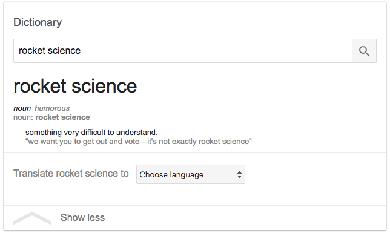

---

## Google Dictionary: What is Software Testing?

> "No definitions found. Search the web."

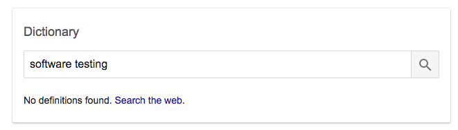

---

## We have no choice

### We have to make this up for ourselves.

---

# What is more important?

## Imagineedfusticating?

or

## Working with a good Imagineedfusticator?

---

# Imagineedfusticating

> "The art of getting exactly what you need when you need it"

_Definition from "The Associated Society of Imagineedfusticators for Advanced Imagineedfustication"_

<!--

Is that definition more important than meeting an Imagineedfustictor who could give you exactly what you need when you need it?

And remember, I'm making this all up. Because we have to learn how to make stuff up?

-->

---

# An Example

Assume we know nothing about software testing.

> "No definitions found. Search the web."

---

# How would we work from first principles?

---

# Let's use a worked example

---

# I've been tasked with testing this

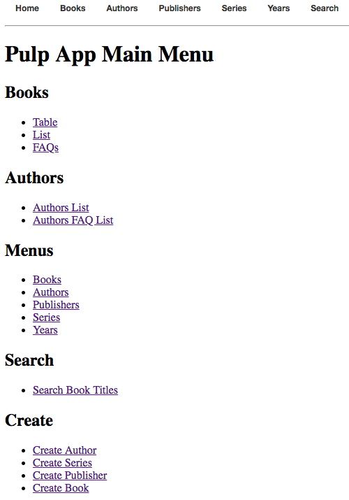

---

I don't want anyone to know that I don't know how to test it, so I nod and then try to figure out what does software testing mean.

So I look for definitions but we've seen how that turned out.

So I go ask google

"What is Software Testing"

---

# What is Software Testing?

<!-- http://tryqa.com/what-is-software-testing/ -->

> Software testing is the process of executing a program or application with the intent of finding bugs in the software.

> It can also be described as the validation and verification of a software program or application or product or system.

_not text from a website that has high rankings for this web search_

<!--

I think I understand the bugs part.

Not sure about Validation and Verification though.

-->

---

# Validation & Verification

- verification - noun “The process of establishing the truth, accuracy, or validity of something.”
- validation - noun - “The action of checking or proving the validity or accuracy of something.”

OK, so both are about validity, accuracy, proving and truth.

Those words seem pretty similar, why would I do both?

---

# OK, I'll forget that.

<!--

We take it for granted that the words we use to describe what we do are understandable and they might not be.

Own your communication and pick words that everyone understands.

-->

---

# What have I learned?

Software Testing is doing stuff to something to find out stuff like:

- find bugs,
- find things that are wrong,
- find stuff that is right

> _Warning: Be careful of certitude and absolutes._

---

# Too much theory

## I have a job to do

---

# What did they mean when they tasked me with "testing" this.

- find bugs?
- how will I know its a bug?
- anything specific you want me to test it 'for'?
- what do you want to 'do' with what I tell you?
- is testing the input to something else?

"What do you mean?"

---

# OK...

*focus on the create author function and make sure it handles a range of input values*

_"What values?"_

*You know. Good name. No name. Long names. Errors for bad names. That stuff.*

_"OK"_

*"If it creates the user OK then we'll be fine."*

---

# We just learned:

- stakeholder management
- needs and requirement analysis
- acceptance condition creation
- risk based testing
- test scope restriction

---

# Why didn't I ask "Why do you want me to test this?"

---

# Why? is a belief chain question

---

# Why do you want me to test this?

- because its your job
- because I don' t want to test it
- because testing sucks
- because I want proof that it works
- because I don't want the user finding any problems

---

# That might be useful

- we find out the organisation dynamics
- we can 'educate' that testing does not 'prove that it works'
- we could test from a user perspective

---

# The temptation with "Why?" is to chain "Why?"

- why is it my job?
- why don't you want to test it?
- why don't you want the user to find problems?

Unproductive path / conflict.

---

# But I care less about what they believe

I care more about meeting their needs

- What?
- How?
- When?
- Where?
- Who / Which?

<!--

And the reality is we don't really care.

We want needs and scope not beliefs.

-->

---

# What do I do next?

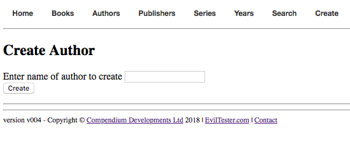

---

# Let me plan this out a bit

- No Name - ""
- Good Name - "Bob The Author"
- Bad Name ? "Mr 123"

---

# I can see there some validation when I just hit save

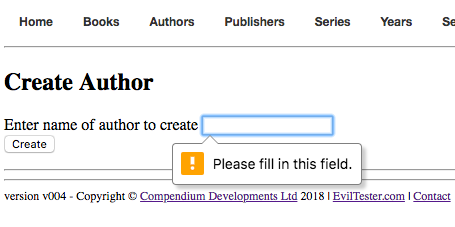

What are the validation rules? I should check those.

---

<!--

# Create an author

-->

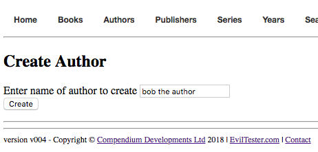

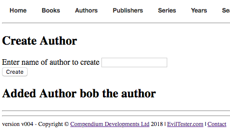

---

# Is that what it is supposed to do?

- How do I know what it is supposed to do?
- How do I know that is the correct message?
- Do I just decide if this works, or are there designs?
- Should it be consistent?
    - "Create" -> "Added"

---

# We just discovered

- A need for a reference standard (oracle)
- conformance to standard
    - requirements testing
    - acceptance condition validation
- The need for exploration: planning, learning, revisiting plan
- Consistency Heuristic

---

# How do I tell people what I have done?

- Better keep some notes to tell people what I've done.
- I need to keep track of new things I want to do e.g. validation rules
- I better keep track of the unanswered questions and concerns I have
- How do people do that?
- Are there any tools that can help?

---

# We just discovered

- Exploratory Testing
- Test Planning
- Test Tools
- Test Reporting

---

# It said it added it, but did it? How can I see it was added?

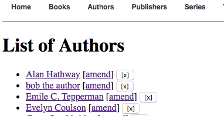

---

# Can I trust that?

- How is the data stored?
- What data is stored?
- When is the data stored?
- Where is the data stored?
- How can I see the stored data?

---

# We just discovered

- A Testing Attitude Characteristic
   - Doubt
- A Fundamental Testing Technique
   - Questioning
- Create/Read flow

---

# Then someone answers our questions

## And our world explodes with detail

---

# Uhmm, OK

> "The validation rules are controlled by HTML using HTML5 `required` and `pattern` attributes. When the `[Create]` button is pressed an `HTTP` `POST` request is made to the server with the `form` details `x-www-form-urlencoded`. The author is stored in memory with an automatically generated id."

---

# Maybe a diagram would help?

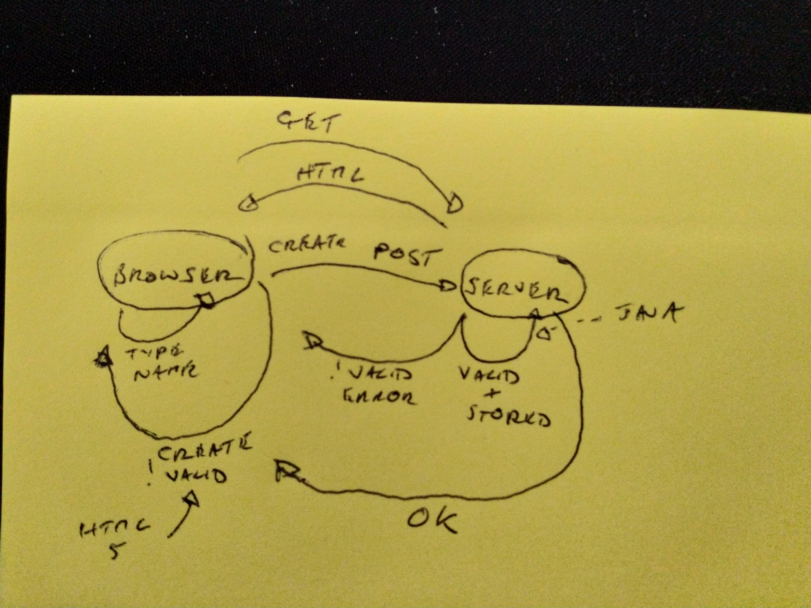

---

# Now I have to learn about

- HTML, HTML5
- `required`
- `pattern`
- HTTP
- POST
- form, form encoding
- Path coverage

---

# And how do I 'see' the HTML?

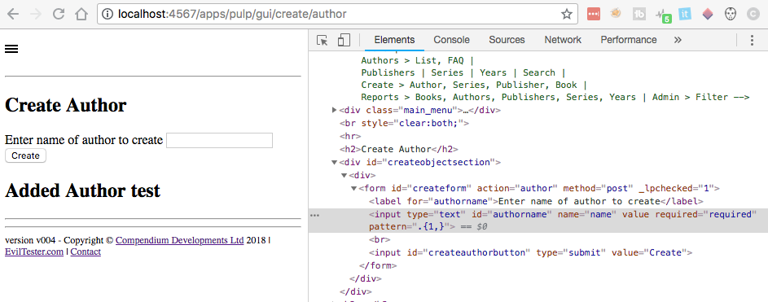

<!--

I also see a lot more here than I understand.

-->

---

# _OMG I can change it too_

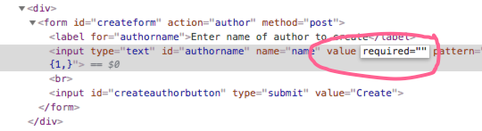

<!--

I accidentally clicked on it and changed it.

Have I broken the system?

-->

---

# _What if I change the form so there is no validation?_

*Then the server side validation should catch that.*

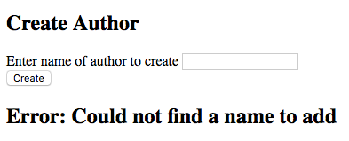

---

# So now I have to test the server side validation as well?

_"That will take quite a lot of time amending the form each time."_

*"Test it at the HTTP level then"*

_"How?"_

*"Use an HTTP Debug Proxy."*

*"A Wha?"*

---

# An HTTP Debug Proxy

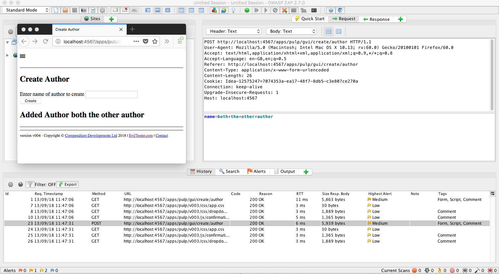

---

# What Questions Did I Ask?

- How does this work?
- What does this do?
- How can I see that? How can I make that happen?
- What should it do?
- When should it do that?
- Where should I see that?

---

# How?

## Not Why?

---

# What is Hard About This?

Why do people find this tough?

- don't like to be seen as 'not knowing' something
- don't like to say "I don't know"

---

# Let's see, what could we be?

- Scientist
- Skeptic
- Believer
- Seeker

---

# Ken Campbell

# "Seeker!"

<!--

Ken Campbell used to call people Seekers and they were people that engaged in "Supposing"

https://edinburghfestival.list.co.uk/article/103088-ken-campbell-theatrical-trickster-memorialised-in-fringe-show-ken/

- Scientist uses evidence and hypothesis based on evidence to explore the work.
- Skeptic uses evidence and might pursue topics that have no evidence often to debunk
- Believer uses faith, and evidence which supports their faith
- Seeker adopts beliefs "Just supposing" to see what happens and observe the world differently

-->

---

# Robert Anton Wilson said...

> “Belief is the death of intelligence. As soon as one believes a doctrine of any sort, or assumes certitude, one stops thinking about that aspect of existence.”

_Robert Anton Wilson, Cosmic Trigger_

---

# Top Three Trouble-free Tactics To Tough Talk

- Knowing nothing about something is good
- You don't know nothing about it, what you know about it is nothing
- Ask questions when you do know stuff

---

# I know nothing about

- Kardashians
- Love Island
- Big Brother

That is good.

---

# You don't know nothing about it

## What you know about it, you describe as 'nothing'

- You ask questions to see if that description fits
- You try to expand your model
- You try to invalidate parts of your model

**Same as normal**

---

# As a Manager

I ask questions when I do know stuff because:

- I know other people in the room don't know
- I know people have different understandings
- It gives the speaker a chance to show their knowledge

---

# Asking questions is good

---

# The Tester!

---

# Asking Questions is Good

---

# End Credits

* [www.eviltester.com](http://www.eviltester.com)
* [@eviltester](https://twitter.com/eviltester)
* [www.youtube.com/user/EviltesterVideos](https://www.youtube.com/user/EviltesterVideos)
* [www.compendiumdev.co.uk](http://www.compendiumdev.co.uk)
* [uk.linkedin.com/in/eviltester](http://uk.linkedin.com/in/eviltester)

---

## Follow

- Linkedin - [@eviltester](https://uk.linkedin.com/in/eviltester)
- Twitter - [@eviltester](https://twitter.com/eviltester)
- Instagram - [@eviltester](https://www.instagram.com/eviltester)
- Facebook - [@eviltester](https://facebook.com/eviltester/)
- Youtube - [EvilTesterVideos](https://www.youtube.com/user/EviltesterVideos)
- Pinterest - [@eviltester](https://uk.pinterest.com/eviltester/)
- Github - [@eviltester](https://github.com/eviltester/)
- Slideshare - [@eviltester](www.slideshare.net/eviltester)

---

## BIO
 
Alan is a test consultant who enjoys testing at a technical level using techniques from psychotherapy and computer science. In his spare time Alan is currently programming a [multi-user text adventure game](http://compendiumdev.co.uk/page/restmud) and some [buggy JavaScript games](http://compendiumdev.co.uk/games/buggygames/) in the style of the Cascade Cassette 50. Alan is the author of the books "[Dear Evil Tester](http://www.eviltester.com/page/dearEvilTester/)", "[Java For Testers](http://javafortesters.com/page/about/)" and "[Automating and Testing a REST API](http://compendiumdev.co.uk/page/tracksrestapibook)".

---

# Visit EvilTester.com

Alan's main website is [compendiumdev.co.uk](http://compendiumdev.co.uk) and he blogs at [blog.eviltester.com](http://blog.eviltester.com)

<!--

---

# The Efficiency Expert

*Possibly mention*

Edgar Rice Burroughs, 1921

- theory
- words to bamboozle
- keep one step ahead
- highly paid job

---

# Take Care when using absolutes

> 'Whatever you might say something "is", it is not.'"
>    *Alfred Korzybski, Science and Sanity, 1958*

Also: "does", "doesn't", "prove"

consider: "can" - "can do this, when..." "can not do this... when"

-->
