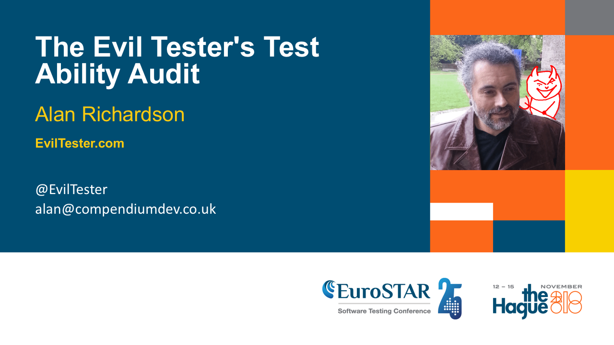
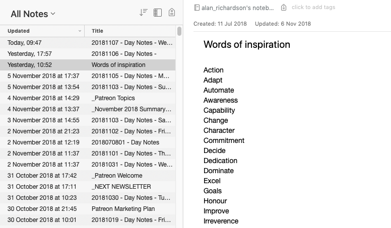

<!-- footer: @EvilTester -->
<!-- page_number: true -->

---

# The Evil Tester's Test Ability Audit

### Alan Richardson

* [www.eviltester.com](http://www.eviltester.com)
* [www.compendiumdev.co.uk](http://www.compendiumdev.co.uk)
* [@eviltester](https://twitter.com/eviltester)

<!--

Eurostar Logistics - Monday 12th November

Start at 9.00 am
Break at 10.30 for 30 min – coffee and morning snack
Break at 12.30 for 1 hr lunch
Break at 15:00 for 30 min – coffee and afternoon snack
Finish – Anytime after 17:00 and before 17:30

9 - 10:30  (1 hour 30 mins)
11:00 - 12:30 (1 hour 30 mins)
13:30 - 15:00 (1 hour 30 mins)
15:30 - 17:00 (1 hour 30 mins)

6 hours

Basic structure:

- talky bit - questions to engage group
- demo bit
- discussion bit
- exercise bit
- debrief bit

For each section, evaluate in terms of above

-->

---

# Welcome & Intro

---

## Introduction

Hi, I'm Alan

eviltester.com/testability

- links to the example apps
- links to definitions etc.
- links to slides

---

## Blurb

Ability is one of the key attributes that elevates your testing proficiency. In this workshop we will evaluate ability from a number of different perspectives:

- our ability to test
- the features of applications that support our testing
- technology attributes that support testing
- application and tool attributes that ease automating

---

## Blurb

We will also take stock of our current ability and build an action plan to improve our test ability.

This workshop has elements of discussion, hands on investigation and hands on testing.

---

## Blurb

At the end of this workshop you will:

- Understand the difference between Testablity, Test Ability and Automatability
- Have Performed a Technology Testability Audit on Web Technology, Mobile Technology or a variety of application frameworks
- Have Performed an Application Testability Audit
- Have Performed an Automatability Audit
- Have performed an audit of your own Test Ability and created an action plan to improve your ability to test.

You will need a device (laptop, mobile, tablet) with wifi or internet access to take part in the hands on audit sections.

---

## Mob Exercise: What kind of things do we test?

People in the room:

- "What kind of systems do we test?"
- "What technologies do we test?"
- "Are the systems testable?"
- "Do we have the skills and tools to test them?"
- "Are the systems automatable?"

---

## Understand the difference between Testablity, Test Ability and Automatability

- Testability
- Test Ability
- Automatability

<!--

I think these are different things.

We will explore all of them.

-->

---

## Examples used throughout

- zty.pe
   - http://zty.pe/
- zombie - cli game
- protect the square - javascript game
- Google/Bing -  a search engine
- Anything else you want to use

---

## Mob Exercise: Is this testable?

- Zty.pe
- http://zty.pe/

_Quick Demo_

see also [EvilTester.com/testability](http://eviltester.com/testability)

---

##  Mob Exercise: Is this testable?

- Zombie CLI Application
- https://github.com/eviltester/zombie-cli-text-adventure

_Quick Demo_

see also [EvilTester.com/testability](http://eviltester.com/testability)

---

## Mob Exercise: Is this testable?

- Java Script Mouse Clicking Game

https://www.compendiumdev.co.uk/games/buggygames/protect_the_square/protect_the_square.html

Also in the Java App

- https://github.com/eviltester/TestingApp

_Quick Demo_

see also [EvilTester.com/testability](http://eviltester.com/testability)

---

## Mob Exercise: Is this testable?

A hypothetical search engine e.g.

- https://www.google.com/
- https://www.bing.com/
- https://duckduckgo.com/

_Quick Demo_

see also [EvilTester.com/testability](http://eviltester.com/testability)

---

## Are those testable?

- Do we know how to test them?
- Do we know how to automate them?
- Do we have the skills to test/automate them?
- Do we understand the technology they use?
- Do we know the tools we would use?
- Do we understand their functionality?

**On a scale of 1-10 for each, how sure are we of our answer?**

---

# What is Testability?

---

## Mob Exercise: Investigation Questions

- How can we investigate Testability?
- What does it mean to investigate Testability?

---

## Mob Exercise: What presuppositions?

What presuppositions exist for this investigation into Testability?

> "Testability"

Presupposition meaning:

- what is assumed true?
- potential bias

Consider efficacy vs validity if presupposition is shown to be false.

---

## Some Presuppositions

- A thing or concept such as testability 'exists'
    - What if it doesn't?
    - Would/should our investigation tell us that?
- We perceive value in the investigation of the concept of testability
    - what value?
    - how will we know we have attained value?
    - should we measure the value?

---

## Question wording can change our focus

- Pay attention to the wording you use

What should we be investigating?

   - "What is testability?",
   - "What does testability mean?"

---

## Differences

- "What is testability?",
    - presupposes testability exists, it 'is' (quantifiable, touchable)
- What does testability mean?
     - more open, it might mean nothing
- What does testability mean <context>
    - to me, in terms of this application, in this environment, for this project
    - Example based:
        - is X testable?
        - what makes X testable?

---

## What questions might we ask to investigate testability?

- What supports my testing?
- Is testability an entity or a relationship?
- Is testability a set of attributes associated with a relationship between entities?
- What do I mean by testability?
    - Alan, Me, The Group
- What do I gain by conceptualising testability?
   - If something isn't testable then why waste time testing it?
- etc.

---

## Group Exercise: What is Testability

- Discuss in small groups
- We will then debrief and collate ideas from the groups

---

## Mob Debrief: What did we discover?

- What 'is' testability?
- What questions did we ask?
- How can we use these insights?

---

## Mob Exercise: What if Testability can be viewed as a set of Relationships

Relationships Between?

---

## Testability can be viewed as a set of Relationships

Examples:

- Tester
- System Under Test
- Technology
- Tools: available, that we know of, and we know how to use
- Techniques we use to test
- Features of the application
- Risks - guide testing, might be hard to test for (load, logging, etc.)
- Issues - can prevent paths through the application
- Time constraints - prevent performing certain activities or designing coverage
    - security testing challenge VM up for 1 hour was taking me more than that to scan the site

---

## I'm not looking to build a set of definitions, but...

> I want you to viscerally experience the difference between them and be able to investigate them on your particular projects and your particular skill sets to identify risks, issues, and improvement paths.

But...

---

## Definitions from ISTQB

http://glossary.istqb.org/search

- Testability
   - 'The capability of the software product to enable modified software to be tested.'
   - see also maintainability
      - maintainability
      - 'The ease with which a software product can be modified to correct defects, modified to meet new requirements, modified to make future maintenance easier, or adapted to a changed environment.'
- Testability Review
   - 'A detailed check of the test basis to determine whether the test basis is at an adequate quality level to act as an input document for the test process.'

---

## Definitions from ISTQB

http://glossary.istqb.org/search

- Test Ability
   - No Results found
- Automatability
   - No Results found

---

## Wikipedia definitions

- Software Testability
    - repeats ISTQB defn
    - "is not an intrinsic property ... and can not be measured directly"
    - "is an extrinsic property which results from interdependency of the software to be tested and the test goals, test methods used, and test resources (i.e., the test context)"

- https://en.wikipedia.org/wiki/Software_testability

---

## Wikipedia definitions

- Testability
    - for hypothesis testing
    - logical property such that counterexamples to the hypothesis are logically possible
    - The practical feasibility of observing a reproducible series of such counterexamples if they do exist

https://en.wikipedia.org/wiki/Testability

---

## Wikipedia definitions

- Test Ability
    - Wikipedia does not have an article with this exact name
- Automatability
    - Wikipedia does not have an article with this exact name
- Maintainability
    -  the ease with which a product can be maintained _for a bunch of reasons_

- https://en.wikipedia.org/wiki/Maintainability

---

# What is Auditing?

---

## Scientology Says

- **The goal of auditing is to restore beingness and ability**.
- Auditing does not use hypnosis, trance techniques or drugs.
- Auditing uses processes
- Many, many different auditing processes exist and each one improves the individual's ability
- **An unlimited number of questions could, of course, be asked - which might or might not help a person**.

[1](https://www.scientology.org.uk/what-is-scientology/the-practice-of-scientology/auditing-in-scientology.html) [2](https://www.scientology.org.uk/what-is-scientology/the-practice-of-scientology/the-auditing-session.html)

---

## Auditing

> An audit is a systematic and independent examination

https://en.wikipedia.org/wiki/Audit

---

## Why Audit?

- take stock
    - what do we perceive is happening?
    - what is actually happening?
    - what do we want to see happen?
- why else?

---

## Auditing - Cults vs Religious Movements vs Work

- Religious/Spiritual movements have a long history of auditing
   - Confession and other 'group' sessions
   - Used as a basis for future work
   - Anecdotal evidence suggests this may also get used for blackmail
- Work
   - "Woo hoo we passed"
   - very often no analysis of the results or thinking through

**The point is to incorporate the findings into your work life, not just 'list' stuff.**

---

## Modelling & Representation

> Q: "What is...?" == "How do you model...?"

As you audit you will build a model

- Entities,
- Relationships.
- Events,
- States,
- etc.

---

## Why Questions

~~~~~~~~
public Belief why(String question){
    return beliefs.getNextAnswer(question);
}
~~~~~~~~

- Why? is a belief question
- Beliefs are models
- Why? might be useful, but How? What? When? Where? Who? answers might be more actionable and testable.

---

## Modelling Testing

- All testing books present models
- When reading, ask yourself...
    - Are the models descriptive or prescriptive?

e.g. Object Oriented Testing a Hierarchical Approach, Dear Evil Tester, Lessons Learned in Software Testing, Software Testing Techniques (Beizer)

---

## Modelling & Representation

> A: Your representation

Models are transformed into representations - diagrams, paragraphs, statements,  manifestos, etc.  used to communicate, or reflect on, your model. They might be formal or informal, logical or physical, etc.

- Lists
- Hierarchies
- Graphs
- Adhoc

Remember transformation is 'lossy': Deletions, Generalisation, Additions, Distortions

---

## Mob Question: What Models and Diagrams do you create?

- modelling approaches?
- diagrams created?

---

## Mob Question: What Common Models in Testing Exist?

Can you think of any common models in testing?

---

## Common Models in Testing

- Acronyms
- Mnemonics
- Heuristics
- Model instances
    - waterfall, automation pyramid, testing vs checking

---

## We will audit...

- Technology
- Application
- Automatability
- Test Ability
- Test Mentality
- Our Audit

_Mob Question: How might we audit each of these?_

---

# Technology Test Ability Audit

---

## Mob Exercise: Technology Influence on Testability

- Mobile, Web, CLI, green screen?

What would be easy to test?

- generate a list of technologies
- what ones are easy to test?
   - what leads you to think it is easy?

---

## Mob Exercise: Technology Test Ability is a set of Relationships

Between?

---

## Examples: Technology Test Ability is a set of Relationships

- Technology used - programming language, libraries, deployment process, hosting, servers OS, protocols
- Tools - manipulation, Interrogation, Observation
- Ease of Modelling
  - tools to visualise models
- Our understanding of the tools, technology, architecture
- Tools to hand vs tools available
- Time - setting up environments
- Access - how far we can go down into the technology (Observe, Interrogate,  Manipulate)

---

## Mob Worked example - Zombie RestMud CLI text adventure game

- Given the CLI game
- What would we do a Technology Audit for?
- How would that help us?
- How would we audit it?

---

## Mob Worked example - Zombie RestMud CLI text adventure game

- What questions would we ask?
- Any Technology Risks?
- What demos would we need to see?
- Would we want to see the code?
- Any other questions about this Game?

---

## Mob Worked example - Zombie RestMud CLI text adventure game

We might ask in Technology TestAbility Audit

- Java
   - JRE version?
   - Cross platform? Any risks?
- CLI interface
   - Risk - Mobile? What platform does it target?
   - Tool: Terminal used? Shell used?
- Ease? Difficulties? Understanding?
- Any existing testing? yes see code
- Look at source what do we see? [github.com/eviltester](https://github.com/eviltester?tab=repositories&q=cli)

---

## Example Debrief

Relationships between instantiated entities: infrastructure, environment, components.

- Java
   - JRE version (1.9)? Cross platform (not tested)?
- CLI interface
   - Mobile (don't know)? Tool: Terminal used? Shell used?
- Architecture
   - 3 tiers: rules, cli engine, game engine (test at these instead?)
   - already existing automated coverage of rules and game engine (expand? augment?)

---

## Technology TestAbility Audit - Generic Audit Ideas

Models of

- what is it? levels, versions, interconnections, message protocols
- where is it?
- can I see it? can I interrogate it?
- do we understand it?
- can we use it? can I manipulate it?
- risks?
- known issues?

---

## A Hypothetical Web App - A Search Engine - Technological Test Ability

- Technology: html gui, javascript, http messages to server, Http responses, JSON payloads, server software written in Java, index of web pages stored in a database, Http API, etc.
- Tools: browsers, mobile

---

## How does knowing that help us?

- do we want to test our interaction with the tech, or the tech?
    - limit our testing
    - understand environments
- not a test pyramid but a stack interaction model
    -seams
    - tools for each seam and each level
- what versions are we using? out of date? known bugs? known limitations? upgrade paths? test upgrades?
- deployment processes? risk during deployment? test deployments? supports CI/CD?
- understanding can lead to new test ideas

   

---

## Group Exercise: Perform a Technology Testability Audit on Web Technology, Mobile Technology or a variety of application frameworks

- Work in groups
- Choose an application e.g. from http://eviltester.com/testability
- Conduct a Technology Testability Audit
   - Looking at the technology, What is it?
   - How testable is it? _{for you?, for others?, for everyone?}_
   - What would make it more testable - from a technology perspective?
   - What makes it less testable - from a technology perspective?
   - Any risks?, Any Issues?

---

## Mob Debrief - What did we discover?

- What 'is' Technology Testability?
- What questions did we ask?
- How can we use these insights?

---

# Do we have time to test?

_Groups, Pairs, Individually, you decide_

- pick an app, any app
- test with a 'technology' focus
- take the ideas from the audit discussions and apply them
- e.g. test at a different place than normal, use tools, what limits you?

---

## Mob: Debrief

- what did you do differently?
- how did a technology focus change your testing?
- what did we learn?
- insights?
- questions?
- comments?

---

# Application Testability Audit

---

## Mob Question: Application Testability?

- What might Application Testability mean?
- Differentiated from Technical Testability?

---

## Mob Exercise: Application Test Ability is a set of Relationships

Between?

---

## Some Possible Answers

- Features and Requirements
- our understanding of the features
- Data used, and how well we understand the data
- where features are implemented in the stack (overlap with technology)
- How does the application functionality support or hinder our testing?
- How does our understanding of the Domain impact our testing?

---

## Mob Exercise: CLI Text Game

Ease of which we can test an application and the application supports our testing.

- CLI Game Functionality - accepts input, game play, quit-game
- What hinders us for testing?
- What functionality might be useful for testing?
- What questions do we have?
- Has our technology audit helped us?

---

## Mob Exercise: CLI Text Game Sample Questions

- Does the terminal have any features that can help?
- Does the game have any 'help'?
- How can we observe the game?
    - Does the game have any 'logging'?
- Can we manipulate the game?
    - force in input?

---

## Some Answers for Application Testability Audit

- terminal might have features to help e.g. replay requests, track inputs
- documentation for game might help
- CLI Args to 'unlock features for testing'
    - `-h` for help
    - `-v` for version
    - `-verbose`
    - `-cols 40` - reformat output
    - `-txtlog logfile.txt`
    - `-jsonlog jsonlog.txt`
    - `-debug`
    - `-nobackups`
    - `-commandslog`

---

## Group Exercise: Pick an App and Audit it

- Pick an application
- Audit it from the point of view of the relationships we identified earlier
- e.g. what features help testing, what features hinder testing

---

## Mob Exercise: What did we learn?

- About Application Testability?

---

## How does this help us?

- understand functionality
- make assessments on scope
- find ways to track and model coverage
- identify paths, variant and invariant data
- identify areas of risk
- can we use the app to help us?
- can we augment theapp to cut down on our work e.g logging
- be aware of risk of using app to help us e.g. bugs in logging

---

## Hypnosis & Therapy

- Modelling - the client to understand their world view
- Feedback
- Utilisation
- Observation
- Interrogation - asking questions to expand model
- Manipulation - direct commands, alternate strategies
- Techniques, Skills and Tactics

---
 
## Testing by:
 
- **Modelling** the application from multiple view points and multiple technical levels.
- Using tools to:
- **Observe** the application in action,
- **Reflecting** on what you see to approach the testing with **intent** based on risks, coverage, etc. and at different interface points.
- Using tools to:
- **Interrogate** the application to more detailed levels
- **Manipulating** the application at detailed levels
 
### _MORIM_

---

# Do we have time to test?

_Groups, Pairs, Individually, you decide_

- pick an app, any app
- test with an 'application' focus
- take the ideas from the audit discussions and apply them
    - can you use the application to help you?
    - what features are you testing?
    - do you know what you are trying to achieve?
    - how are you making notes?

---

## Mob: Debrief

- what did you do differently?
- how did an application focus impact your testing?
- what did we learn?
- insights?
- questions?
- comments?

---

# Automatability Audit

---

## Mob Exercise: Automatability?

What might Automatability mean?

- Automatizability?
- Automation?
- Automatization?

---

## Exercise: Automatizability is a set of Relationships

Between?

---

## Examples: Automatizability is a set of Relationships

Between:

- tools, libraries
- Programming Languages
- application features - locators, state indicators
- application technology
- tasks and activities
- what I as a tester need to 'do'
- Interaction, Manipulation, Observation
- Assertions - Interrogation
- Making it easy to do stuff - DSLs, Cucumber, Gherkin

---

## Mob Exercise: Questions to ask to help audit?

What questions can we ask that might help our audit?

---

## Example Questions to ask to help audit

- Is it possible for anyone to automate this? examples from others
- How would I automate this?
- What would I gain by automating this?
- What would I want to automate?
- Do we have the skills to automate this?
- Tactical or strategic?
- Fully automate? Partially automate?
- How long to automate?
- When would I have time to do this?
- Who cares if this is automated?

---

## Mob Worked Example - Zombie CLI

- How could I automate this?
- Is it automatable?
- Does it exhibit automatability?
- What would make it more automatable?

---

## How might I automate CLI App?

- TCL & Expect?
- Unit tests at each layer - game rules, cli engine, backend engine
- embedded jar
- REST API and GUI to test the 'game' but not the CLI wrapper
- Shell scripts? Unix Commands?

~~~~~~~~ 
cat commands.txt | java -jar cli-game.jar -txtlog -jsonlog
~~~~~~~~

~~~~~~~~
java -jar cli-game.jar -txtlog -jsonlog < commands.txt
~~~~~~~~

---

## Mob Worked Example - ZType

- How could I automate this?
- http://zty.pe/

---

## ZType Automation

- WebDriver?
    - Possible, but likely too slow
- Image Recognition and OCR?
- Unit Tests
- Custom JavaScript code as bookmarklets

---

## Example JavaScript Automated Execution Crude Z-Type Bot
 
~~~~~~~~
var zTypeBotAlphaChars = "abcdefghijklmnopqrstuvwxyz";
var zTypeBotCharToType = 0;
ztypebot = setInterval(function() {
   ig.game.shoot(
      zTypeBotAlphaChars.charAt(zTypeBotCharToType));
      zTypeBotCharToType = (zTypeBotCharToType +1)%26;
    }
    , 100);
~~~~~~~~
 
Remember to stop bot:
 
`clearInterval(ztypebot);`
 
---
 
## Good Z-Type Bot
 
~~~~~~~~
ztypebot = setInterval(function() {
   if (ig.game.currentTarget == null) {
      for (var t in ig.game.targets) {
         if (ig.game.targets[t].length > 0) {
            ig.game.shoot(t);
            break;
         }
      }
   } else {
      while(ig.game.currentTarget != null){
         ig.game.shoot(
         ig.game.currentTarget.remainingWord.charAt(0));
      }
   }
}, 2);
~~~~~~~~

---

## Group Exercise: Pick an App

Pick an App, any App. Audit it for Automatizability.

Consider:

- What helps? What Hinders?
- What tools? How Automate?
- What skills? What experience?
- Does it have any automated execution?
- Evaluate Automated execution coverage?
- Evaluate Automated execution Implementation?
- etc.

---

## Mob Exercise: What did we learn?

- About Automatability?

---

## Mob Question: What is an abstraction in context of Automating?

---

## Automating with Abstractions

- Abstractions
    - modelling at different levels to precisely model
    - create multiple abstractions
    - avoid making an abstraction span too far
- Domain Specific Languages
    - easy to create in code
    - avoid because people don't code?
    - text based abstractions lack tool support
- e.g. BDD, Cucumber, Gherkin -> process, dsl framework, dsl template

---
 
## Example Test Without Abstraction
 
~~~~~~~~
@Test
public void canCreateAToDoWithNoAbstraction(){
WebDriver driver = new FirefoxDriver();
driver.get(
"http://todomvc.com/architecture-examples/backbone/");
 
int originalNumberOfTodos = driver.findElements(
By.cssSelector("ul#todo-list li")).size();
 
WebElement createTodo;
createTodo = driver.findElement(By.id("new-todo"));
createTodo.click();
createTodo.sendKeys("new task");
createTodo.sendKeys(Keys.ENTER);
assertThat(driver.findElement(
By.id("filters")).isDisplayed(), is(true));
 
int newToDos = driver.findElements(
By.cssSelector("ul#todo-list li")).size();
assertThat(newToDos, greaterThan(originalNumberOfTodos));
}
~~~~~~~~
 
---
 
### But there were Abstractions
 
* WebDriver - abstraction of browser
* FirefoxDriver - abstraction Firefox (e.g. no version)
* WebElement - abstraction of a DOM element
* createToDo - variable - named for clarity
* Locator Abstractions via methods `findElement` `findElements`
* Manipulation Abstractions `.sendKeys`
* Locator Strategies `By.id` (did not have to write CSS Selectors)
* ...
 
**Lots of Abstractions**
 
---
 
## Using Abstractions - Same flow
 
~~~~~~~~
@Test
public void canCreateAToDoWithAbstraction(){
TodoMVCUser user =
new TodoMVCUser(driver, new TodoMVCSite());
 
user.opensApplication().
and().
createNewToDo("new task");
 
ApplicationPageFunctional page =
new ApplicationPageFunctional(driver,
new TodoMVCSite());
 
assertThat(page.getCountOfTodoDoItems(), is(1));
assertThat(page.isFooterVisible(), is(true));
}
~~~~~~~~
 
---

## What Abstractions were there?

* `TodoMVCUser`
   * User
   * Intent/Action Based
   * High Level
* `ApplicationPageFunctional`
   * Structural
   * Models the rendering of the application page

---
 
## Cucumber example
 
~~~~~~~~
Given a user ID "1"
When a call to the "people" api is made
Then the name of the person is "Luke Skywalker"
~~~~~~~~
 
Using https://swapi.co/
 
---
 
## Cucumber Implementation Example
 
~~~~~~~~
public class SwapiSteps {
 
private String userId;
private String endpoint;
private Response response;
 
@Given("^a user ID \"([^\"]*)\"$")
public void aUserID(String userId) throws Throwable {

this.userId = userId;

}
~~~~~~~~
 
---
 
## Cucumber Implementation Example
 
~~~~~~~~
@When("^a call to the \"([^\"]*)\" api is made$")
public void aCallToTheApiIsMade(String apiendpoint)
throws Throwable {

this.endpoint = apiendpoint;
response = RestAssured.get(
"http://swapi.co/api/" + apiendpoint + "/" +
this.userId + "/?format=json").
andReturn();

}
~~~~~~~~
 
---
 
## Cucumber Implementation Example
 
~~~~~~~~
@Then("^the name of the person is \"([^\"]*)\"$")
public void theNameOfThePersonIs(String givenName)
throws Throwable {

String json = response.getBody().asString();
JsonPath jsonPath = new JsonPath(json);
Assert.assertEquals(givenName,jsonPath.getString("name"));

}
~~~~~~~~
 
---
 
## Cucumber JVM as DSL Framework
 
- Gherkin is a 'given', 'when', 'then' framework
- Cucumber is a DSL framework, we don't need G/W/T
 
e.g.
 
~~~~~~~~
Scenario Outline:
 
* Users exist with the following "<userid>" and "<name>"
 
Examples:
| userid | name |
| 1 | Luke Skywalker |
| 2 | C-3PO |
| 3 | R2-D2 |
~~~~~~~~
 
---
 
~~~~~~~~
@Given(
"^Users exist with the following \\\"([^\\\"]*)\\\" and" +
" \\\"([^\\\"]*)\\\"$")
public void users_exist_with_the_following
(String anid, String name) throws Throwable {

RestAssured.get(
"http://swapi.co/api/people/" + anid + "/?format=json").
then().
assertThat().
body("name", equalTo(name));

}
~~~~~~~~
 
---
 
## Hypothetical Code Based DSL Example
 
~~~~~~~~
SwapiApi swapi = new SwapiApi();
Person p = swapi.getPerson(1);
Assert.assertEquals("Luke Skywalker", p.name);
~~~~~~~~
 
I could implement Cucumber steps using the `SwapiApi`
 

---

# Do we have time to test?

_Groups, Pairs, Individually, you decide_

- pick an app, any app
- test with an 'automatability' focus
- how could automating help you test this?
- be aware of what you are not observing, the data you are not covering?
- can you implement anything now? tactically?
- is there any strategic automation available?
- take the ideas from the audit discussions and apply them
- e.g. what tools do you need, what can you automate? etc.

---

## Mob: Debrief

- what did you do differently?
- how did an automating focus change your testing?
- what did we learn?
- insights?
- questions?
- comments?

---

## Automating

- can be tool support
- can be tactical
- can be reframing tools e.g. fuzzer for data creation, javascript in console
- clearly the more adhoc, the more programming skill required
- doesn't just have to involve 'testing' staff
- dumbing down, might not help testing e.g. keyword driven, Cucumber
- not just execution - data generation, script generation, path identification, coverage tracking, monitoring

---

# Self Audit

---

# Test Ability Audit

---

## Mob Question - Test Ability?

- What might Test Ability mean?
- What might Test Ability look like?

---

## Mob Exercise: Test Ability is a set of Relationships

Between?

---

## Examples: Test Ability is a set of Relationships

Between:

- our understanding of the tools
- test techniques we know
- our understanding of the technology domain
- our understanding of the application domain
- our understanding of the business domain
- how we can find information
- who else is on our team
- our experience
- our skills

---

## Group Exercise: Pick an App

- Pick an App, Any App
- What do you personally need to know/have/etc.
- What do you have? What do you lack?
    - regarding this particularly application

---

## Mob Debrief: What did we learn?

- About Ability?
- About ourselves?
- About Others?

---

## Exercise: Test Ability and action plan to improve your ability to test

- What can you already do?
- What could you improve?
- What have other people mentioned that seems useful to you?
- What do you think is not useful to you?
- What will you work on next?
- What will you work on later?
- What will you not act on?

_As a group, in pairs, personal_

---

# Test Mentality Audit

---

## Mob Question: What is Test Mentality?

- What might Test Mentality mean?
- How do you know when you have it?

---

## Mob Exercise: Is Test Mentality a set of Relationships?

Between?

---

## Examples: Test Mentality is a set of Relationships

Between:

- our beliefs
- our experiences
- our observation of others
   - what we have seen others do
   - what we encourage in others
- our interpretation of events
   - when we think we 'failed' to step up

---

## Personas in Testing

- What are personas?
- Does anyone use personas?
    - How?
- Do we adopt personas?

---

## Fake it till you make it?

- should we fake it?
- how do we make it?

---

## Mob: How to Develop a Mentality?

- ideas?
- what do you do?

---

## Some Ideas

- Build habits
- Change behaviour
- Develop new attitudes

---

## Some General Notes

- Context
    - different behaviours trigger under different contexts
    - not "I Am" its timebound "I did X on this day at this time under this specific set of circumstances"
- Triggers
    - identify triggers
    - identify associations
- Tactics and Strategies
    
---

## How to build habits

- define goal
   - question it - "why?" rephrased as what, how, who, when, etc.
- define path(s) to goal
- build it into your life
- create reminder mechanisms
- create templates

---

## How to Change Behaviour

- identify and label 'old' behaviour
- define alternate behaviour
    - we don't want to 'not do something' we want to 'do something else'
- practice alternate behaviour
- recognise old behaviour and replace with alternate behaviour

---

## Develop new attitudes

- define the attitude
- gather resources
    - find prior evidence
    - emulate who?
    - what has to be true?
- destroy doubt
    - humour, evidence
    - what would you say to someone else
- Implement via habit/behaviour

---

## A Tactic: I have a "words" list

_Note also - daily logs, plans and strategies_

---

## Mob: What external sources do you use?

- books
- blogs?
- podcasts?
- youtube?

Any tips or recommendations?

---

## Exercise: Test Mentality Description and action plan

Think through the attitudes/behaviours you have, want to have, want to change, want to strengthen, want to weaken, etc.

e.g.

- What do you evidence that you are happy with?
- What do you want to adopt that is new?
- What are you not prepared to give up?
- How might you amplify it?
- How might you attenuate it?
- How might you replace it?
- What are you going to start on?

_As a group, in pairs, personal_

---

## What did we decide?

---

# Additional Testing Time?

_Test in Groups, Pairs, Individually_

- Pick an App, any app
- What has attracted your attention?
- What do you want to focus on?
- What do you want to experiment with?

---

# The Audit to End All Audits

---

## Mob Question: How Can This Help?

### Question: How Would This Help you Test Differently?

---

## Possible Answers

- Know what I am capable of - more confidence in my own abilities
- Know where I have gaps
   - these could be risks
   - are they mitigated  by other people on the team or by our process
- Have a 'currently learning' list and experiment with this during my testing
- Am I:
   - testing deeply enough?
   - using tools effectively?
   - automating tactically and strategically?
   - growing as a tester?
   - experimenting enough?

---

##  Do we have time to test?

Evaluate: Time to test, or on to debrief of debriefs?

---

## Mob Exercise: What has the bigger influence?

- Technology?
- Application?
- Automatibility?
- Our Ability?
- Our Mentality?

---

## Mob Question: Going beyond the bias

What else might be use to categorise audits and categorisations?

- Test...what...lity?
- Test...what...ation?
- Test..what...ive?
- ?

---

## Mob Exercise: Share any personal audit points?

- What will you do differently?
- etc.

---

## Personal Sample Examples

I'm learning security testing:

- Subscribed to a bunch of security blogs
- Take part in Bug Bounties
- Look for live vulnerabilities and report them to companies

I'm improving my programming:

- Tidying up and open sourcing as much code as possible
- Refactoring to improve style
- More advanced project structures - parent pom.xml

I am not: performance, accessibility, .Net, Ruby, Python

I might: Kotlin

---

## Summary

- Think in terms of relationships
- This is not a formal Audit process
- Make it personal
- Decide to 'do' and 'not do'
- Model yourself, your process, your system, your environment and the relationships in-between

---

# End Credits

---

## Learn to "Be Evil"

* [www.eviltester.com](http://www.eviltester.com)
* [@eviltester](https://twitter.com/eviltester)
* [www.youtube.com/user/EviltesterVideos](https://www.youtube.com/user/EviltesterVideos)

---

## Learn About Alan Richardson

* [www.compendiumdev.co.uk](http://www.compendiumdev.co.uk)
* [uk.linkedin.com/in/eviltester](http://uk.linkedin.com/in/eviltester)

---

## Follow

- Linkedin - [@eviltester](https://uk.linkedin.com/in/eviltester)
- Twitter - [@eviltester](https://twitter.com/eviltester)
- Instagram - [@eviltester](https://www.instagram.com/eviltester)
- Facebook - [@eviltester](https://facebook.com/eviltester/)
- Youtube - [EvilTesterVideos](https://www.youtube.com/user/EviltesterVideos)
- Pinterest - [@eviltester](https://uk.pinterest.com/eviltester/)
- Github - [@eviltester](https://github.com/eviltester/)
- Slideshare - [@eviltester](www.slideshare.net/eviltester)

---

## BIO
 
Alan is a test consultant who enjoys testing at a technical level using techniques from psychotherapy and computer science. In his spare time Alan is currently programming a [multi-user text adventure game](http://compendiumdev.co.uk/page/restmud) and some [buggy JavaScript games](http://compendiumdev.co.uk/games/buggygames/) in the style of the Cascade Cassette 50. Alan is the author of the books "[Dear Evil Tester](http://www.eviltester.com/page/dearEvilTester/)", "[Java For Testers](http://javafortesters.com/page/about/)" and "[Automating and Testing a REST API](http://compendiumdev.co.uk/page/tracksrestapibook)". Alan's main website is [compendiumdev.co.uk](http://compendiumdev.co.uk) and he blogs at [blog.eviltester.com](http://blog.eviltester.com)
