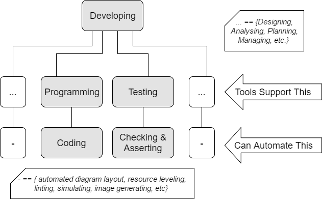

<!-- footer: @EvilTester -->
<!-- page_number: true -->

# A Technical Deep Dive into Practical Test Automation

## Fusion Meetup (Birmingham) March 2017
## Alan Richardson

* [www.eviltester.com](http://www.eviltester.com)
* [www.compendiumdev.co.uk](http://www.compendiumdev.co.uk)
* [@eviltester](https://twitter.com/eviltester)

<!--

I'm a test consultant - I test things and I help people test better.

Particularly with Automating stuff, testing within their current system of development.

Because in actual fact I'm a 'software development consultant' but I'm branded as a test consultant.

-->

---

# Synopsis

In this talk I'm going to focus on the technical aspects of 'test automation', using examples of approaches from a variety of Agile projects where we automated APIs, and GUIs. You'll learn about the use of abstractions and how to think about modeling the system in code to support automating it. Also how to use these abstractions to support stress testing, exploratory testing, ongoing CI assertions and the testing process in general. I'll also discuss the different styles of coding used to support automating tactically vs automating strategically.

---

# Secrets of Successful Practical Automating

- Get work done
- Automate Flows
- Multiple Abstractions
- Abstract to libraries, not frameworks

---

# Testing field argues about

- Testing vs Checking
- You can't automate testing
 
## "Test Automation" is contentious

<!--

Test automation is contentious with testers.

And we know it is contentions with 'programmers' because some programmers don't want to test their stuff, that is what the tester is for, why else would they be called testers. And why is it called 'test automation' if the testers don't automate the tests.

This is a 'testing' thing, not a programmer thing.

And that is why I make it a 'development' thing. Not a 'testing thing' or a 'programmer thing'.
-->

---

# An Example "This is a test?"

~~~~~~~~
@Test
public void createPreviewMVP() throws IOException {

  String args[] = { 
     new File(System.getProperty("user.dir"),
        "pandocifier.properties").getAbsolutePath()};
        
  new PandocifierCLI().main(args);

  String propertyFileName = args[0];
  File propertyFile = new File(propertyFileName);
  PandocifierConfig config;
  config = new PandocifierConfigFileReader().
               fromPropertyFile(propertyFile);
        
  Assert.assertTrue(new File(
                      config.getPreviewFileName()).exists());
}
~~~~~~~~

---

# An Example "Ce n'est pas un test"

- This is a Test because it says it is a `@Test`
- This is an Automated Test because it **checks** something (file exists)
- This is an Automated Test because it **Asserts** on the check
- This is an Application - I use it to build one of my books
- This is not an Application - it doesn't have a GUI or a standalone execution build

## This is `automated execution of a process`

---

# We Automate Parts of our Development Process: Coding, Checking, Asserting, ...

---

# Tactical Reality - I don't really care, I just want to get work done

Suggests we also have 'strategic reality'

---

# Automating Tactically vs Strategically

| **What is Tactical?**      | **What is Strategic?**             |
|----------------------------|-----------------------------|
| Solve a problem   | Agreed & Understood Goals |
| Short Term |    Long Term    |
| Change as necessary | Slower to Change |
| Your Time | 'project' time |

---

# Warning - sometimes tactics look like strategy

- Use of Jenkins is not Continuous Integration
- Automated Deployments are not CI
- Containers are not always good environment provision
- Page Objects are not guaranteed good system abstractions

---

# You know you are Automating strategically when...

- Reduced Maintenance
- Reduced change
- Everyone agrees why
- No fighting for 'time'
- It's not about roles
- It gets done

---

# How do we automate?

- not about "test automation"
- it is about automating tasks
- automate the assertions used to check that the stories are still 'done'
- Automate
    - flows through the system
    - vary data
    - abstract the execution

---

## Automating Strategically

Abstractions - "modeling the system in code"

- abstractions are a big part of automating strategically
- abstractions are about modelling - people seem to be scared of having too many models

see also "Domain Driven Design"

---

## No Abstractions - Web Testing

~~~~~~~~
@Test
public void canCreateAToDoWithNoAbstraction(){
 driver = new FirefoxDriver();
 driver.get(
     "http://todomvc.com/architecture-examples/backbone/");

 int originalNumberOfTodos = driver.findElements(
             By.cssSelector("ul#todo-list li")).size();

 WebElement createTodo;
 createTodo = driver.findElement(By.id("new-todo"));
 createTodo.click();
 createTodo.sendKeys("new task");
 createTodo.sendKeys(Keys.ENTER);
 assertThat(driver.findElement(
       By.id("filters")).isDisplayed(), is(true));

 int newToDos = driver.findElements(
          By.cssSelector("ul#todo-list li")).size();
  assertThat(newToDos, greaterThan(originalNumberOfTodos));
}
~~~~~~~~

---

## But there were Abstractions

* WebDriver - abstration of browser
* FirefoxDriver - abstraction Firefox (e.g. no version)
* WebElement - abstraction of a dom element
* createToDo - variable - named for clarity
* Locator Abstractions via methods `findElement` `findElements`
* Manipulation Abstractions `.sendKeys`
* Locator Strategies `By.id` (did not have to write CSS Selectors)
* ...

**Lots of Abstractions**

---

## Using Abstractions - Same flow

~~~~~~~~
@Test
public void canCreateAToDoWithAbstraction(){
  TodoMVCUser user = 
        new TodoMVCUser(driver, new TodoMVCSite());

  user.opensApplication().and().createNewToDo("new task");

  ApplicationPageFunctional page = 
          new ApplicationPageFunctional(driver, 
					new TodoMVCSite());

  assertThat(page.getCountOfTodoDoItems(), is(1));
  assertThat(page.isFooterVisible(), is(true));
}
~~~~~~~~

---

# What Abstractions were there?

* `TodoMVCUser`
   * User
   * Intent/Action Based
   * High Level   
* `ApplicationPageFunctional`
   * Structural
   * Models the rendering of the application page  

---

# REST Test - No Abstractions

~~~~~~~~
@Test
public void aUserCanAccessWithBasicAuthHeader(){

  given().
    contentType("text/xml").
    auth().preemptive().basic(
      TestEnvDefaults.getAdminUserName(),
      TestEnvDefaults.getAdminUserPassword()).
  expect().
     statusCode(200).
  when().
     get(TestEnvDefaults.getURL().toExternalForm() +
         TracksApiEndPoints.todos);
}
~~~~~~~~

---

# But there were Abstractions

- RESTAssured - `given`, `when`, `then`, `expect`, `auth`, etc.
- RESTAssured is an abstraction layer
- Environment abstractions i.e. `TestEnvDefaults`  

**Lots of Abstractions**

**But a lack of flexibility**

---

# Different abstractions to support flexibility

~~~~~~~~
@Test
public void aUserCanAuthenticateAndUseAPIWithBasicAuth(){

  HttpMessageSender http = new HttpMessageSender(
                                   TestEnvDefaults.getURL());

  http.basicAuth( TestEnvDefaults.getAdminUserName(),
                  TestEnvDefaults.getAdminUserPassword());

  Response response = http.getResponseFrom(
                                  TracksApiEndPoints.todos);

  Assert.assertEquals(200, response.getStatusCode());
}
~~~~~~~~

---

# Supports

- exploratory testing
- simple performance testing - multithreaded
- Variety
    - only variety can destroy/absorb variety
    - (W. Ross Ashby/Stafford Beer)

----

# Models

## We have a lot of models

   - user intent model - what I want to achieve
   - user action model - how I do that
   - interface messaging model - how the system implements that
   - admin models, support models, GUI models

## And models overlap

   - user can use the API or the GUI to do the same things

---

# As programmers we already know how to handle that

- the same things 'interfaces'
- different implementations do the same thing 'dependency injection'

~~~~~~~~
user = new User().using(new API_implementation())
user = new User().using(new GUI_implementation())
~~~~~~~~

`@Test` usage unchanged
~~~~~~~~
project = user.createNewProject("my new project")
user.addTaskToProject("my first task", project)
~~~~~~~~

---

# Abstractions are DSL to support the person writing and maintaining and reviewing the test

`user.addTaskToProject("my first task", project)`

## we can change them to make `@Test` code more readable

`user.forProject(project).addTask("my first task")`

---

# Abstractions can make developers nervous

- too much code
- too many layers

<!--

But...
   - we are used to working with interfaces: systems, subsystems, libraries, modules
   - each 'client' of the interface is an 'abstraction' level
   - normally they are not in the same code base
   - in @Test code they are in the same code base

-->

---

# When we don't do this

- test code takes a long time to maintain
- test code takes too long to write
- test code is hard to understand
- test code is brittle - "every time we change the app the tests break/ we have to change test code" 
- execution is flaky - intermittent test runs - "try running the tests again"

---

# Flaky - often implies poor synchronization

- Understand if your 'framework' is synchronising for you
- Frameworks do not sync on application state, they sync on 'framework' state
- Synchronise on minimum application state
    - e.g. 
        - when page loads, wait till it is ready
        - then all other actions require no synchronisation
        - if Ajax involved then wait for stable Dom    

---

# Writing `@Test` DSL code means that 

- test code is written at the level of the test
- it is easy to write
- it is easy to understand
- the abstraction layers have to be maintained when the application changes
- the `@Test` code only changes when the test scenario changes
- could re-use `@Test` at the API and at the GUI and in between

--- 

# Tactical Approach on Agile projects

- exploratory testing to get the story to done
- create a tech debt backlog for 'missing' automated tests
- `@Test` code is tactical and we can knock it up (not as good as production)

---

# Strategic Approach on Agile Projects

- automate the checking of acceptance criteria to get the story to done
- ongoing execution of the automated assertions for the life of the story
- implies
    - maintain this for the life of the story in the application
    - deleting the @Test code when no longer relevant
    - amending code structure to make relevant as stories change and evolve
    - `@Test` code as strategic asset (just like production code)

----

# Abstractions support different types of testing

- exploratory testing
- stress/performance testing (bot example) requires thread safe abstractions

## Good abstractions encourage creativity, they do not force compliance and restrict flexibility.

---

# Why labour the point?

- "test automation" often means "testers do the automating"
- testers may not program as well as programmers
- testers may not know various patterns of writing code
- when programmers see `@Test` code written by testers they often don't want to touch it or maintain it

---

# Move from Abstractions such as 'Programming' and 'Testing' to _'Developing'_

I say I'm a "test consultant" but the reality is that I'm a "software development consultant", and part of the process of developing is testing.

---

# Summary

- Automate Strategically on Projects
- ongoing assertion checking automated in @Test code
- Abstractions model the system in code
- Write abstractions at the domain level of the assertion concern
- Good abstractions can be used to support exploratory testing
- Write good code all the time

---

# Learn to "Be Evil"

* [www.eviltester.com](http://www.eviltester.com)
* [@eviltester](https://twitter.com/eviltester)
* [www.youtube.com/user/EviltesterVideos](https://www.youtube.com/user/EviltesterVideos)

---

# Learn About Alan Richardson

* [www.compendiumdev.co.uk](http://www.compendiumdev.co.uk)
* [uk.linkedin.com/in/eviltester](http://uk.linkedin.com/in/eviltester)

---

# Follow

- Linkedin - [@eviltester](https://uk.linkedin.com/in/eviltester)
- Twitter - [@eviltester](https://twitter.com/eviltester)
- Instagram - [@eviltester](https://www.instagram.com/eviltester)
- Facebook - [@eviltester](https://facebook.com/eviltester/)
- Youtube - [EvilTesterVideos](https://www.youtube.com/user/EviltesterVideos)
- Pinterest - [@eviltester](https://uk.pinterest.com/eviltester/)
- Github - [@eviltester](https://github.com/eviltester/)
- Slideshare - [@eviltester](www.slideshare.net/eviltester)

---

# BIO
 
Alan is a test consultant who enjoys testing at a technical level using techniques from psychotherapy and computer science. In his spare time Alan is currently programming a [multi-user text adventure game](http://compendiumdev.co.uk/page/restmud) and some [buggy JavaScript games](http://compendiumdev.co.uk/games/buggygames/) in the style of the Cascade Cassette 50. Alan is the author of the books "[Dear Evil Tester](http://www.eviltester.com/page/dearEvilTester/)", "[Java For Testers](http://javafortesters.com/page/about/)" and "[Automating and Testing a REST API](http://compendiumdev.co.uk/page/tracksrestapibook)". Alan's main website is [compendiumdev.co.uk](http://compendiumdev.co.uk) and he blogs at [blog.eviltester.com](http://blog.eviltester.com)
