footer: @EvilTester
slidenumbers: true

# Adventures in Programming, Automating, Teaching and Marketing

## Alan Richardson

- EvilTester.com
- @EvilTester
- compendiumdev.co.uk
- digitalonlinetactics.com

<!--

---

# Blurb

When you already know how to code, it's easy to forget how hard some of that learning was... until you have to teach people. And if all you've ever built are applications, you don't know really know the nuances of writing code to automate them. And if you've written the code but never had to market the applications then you've not really experienced the full joy of coding.

---

## We will cover

In this presentation Alan will revisit many of his past projects to identify lessons learned. Lessons from: writing commercial and open source tools, multi-user adventure games, REST APIs, test automation, automating applications to make them do things they are not supposed to do, and coding for technical marketing.

---

## We will learn

Some lessons we will learn:

- The 'install' is the hardest part
- Writing frameworks is too much fun and should be banned
- Applications are just "code calling other libraries"
- Writing a Text Adventure s the most fun and educational thing you'll ever code
- The Dangers of knowing how to code

---

## Ultimately

We will also learn the dangers of knowing how to code and discover how our coding skills can give us an edge, in business and online life in general, if we choose to harness our skills to improve our daily experiences.

-->

---

# You Have Evolved

> "I Can Code!"

## We have evolved to a point where we can survive in a world of Software

_Note: does not need to be programming - any software development role has enhanced survival abilities._

---

# Survive

> "We can survive"

- Normal people.
- Non-programmers.

May not be able to survive.

<!--

When you are faced with an application that doesn't work. But it worked yesterday. You know some of the techniques required to get it working: clear the cache, delete the cookies, clear the local storage, use incognito mode, try a different browser.

If you interact with an app and it doesn't work, you can look in the dev tools network tab and see the error message that wasn't rendered on screen, but now you know what you have to do to fix your input to make it acceptable to the external system.

Normal people. Non-programmers, don't know how to do that.

-->

---

# Requisite Variety

Cybernetics:

- "Variety can destroy variety" - Ross Ashby
- "Variety can absorb variety" - Stafford Beer

<!--

Our mission, should we choose to accept it is to help them survive.

We don't have to. Cybernetics has the concept of Requisite Variety. Do you have the required variety of responses to handle the changing environment.

If not then you might not be able to survive.

You might not be able to use your banking software when they update it and you have the old JavaScript in you cache.

You might not be able to see the error messages that Instagram has put in the body of the 400 error message and not rendered on screen so you can't change your profile description.

You might not be able to re-order the Twitter feed to show them in chronological order or remove the ads.

You might not survive if you don't have the Requisite Variety of knowledge and techniques.

-->

---

# Thrive

> "We don't want to just Survive, we want to Thrive"

~~~~~~~~
if( PROGRAMMER & TESTER &
    ARCHITECT & DESIGNER &
    AUTOMATOR & MARKETEER &
    TEACHER & OPS){

     return SOFTWARE_DEVELOPER;
}
~~~~~~~~

- _You May Not Want to Admit It_

<!--
 
But programming is not the full set of knowledge we need. We don't want to just Survive, we want to Thrive in this new online world.

And to do that, we need to be Software Developers.

That means:

- programming
- testing
- architecting
- designing
- automating
- marketing
- teaching
- ops
- user
- etc.

All of the skills that cover all of the activities in a Software Lifecyle.

And many of you will already have that. You just don't want to admit it because then you might be responsible for even more stuff on the projects that you work on.

-->

---

# Aspire to be a Software Developer

<!--

I aspire to be a Software Developer, not just a programmer, not just a tester, not just an automator, not just a marketeer, not just a trainer.

But I am all those things and I've learned stuff from all those roles that has helped me.

Some of you will probably share some of those experiences, and so I'm going to cover some of the lessons I've learned and hope they resonate with you.

-->

---

# Getting started is the hardest part.

<!--

- Install
- What went wrong?
- What does that error mean?
- That command didn't work what do I do now?
- What to build?

-->

<!--

---

# Get People Started

## Teach Them the Details Later

-->

---

<!--

## Simulate Working Within Code

-->

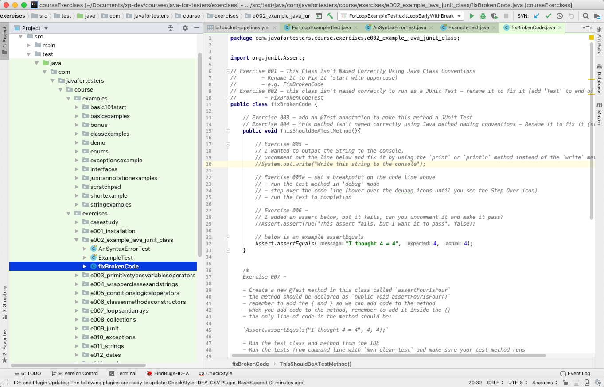

---

# Read More code

---

# We used to be exposed to a lot more code

- Mainstream Magazines
- Multiple Languages
- Multiple Platforms
- Aimed at kids

<!--

We used to be exposed to much more code, every computer magazine had listings. Coverage of multiple languages. Coverage of multiple machines.

I remember, as a teenager, reading articles and listings on:

- lisp
- prolog
- smalltalk
- c
- etc.

None of it I could use on my computer or in my life, but constant exposure made things seem possible. Understandable at a high level.

Normal.

Polyglot was normal.
 
-->

---

## Bug Detection was for Winners

---

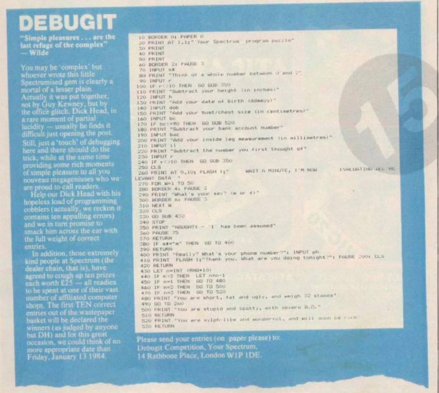

<!--

In Your Spectrum 1st issue was a competition to debug a listing.

This has clearly influenced me because this is pretty much how I interview, or audition, people.

If they are going to code then I'll show them 'bad' code and ask for improvements, critiques, risks, issues.

And then we pair on implementing them so the interview is self directed by the person.

-->

---

# Polyglot by Default

---

<!--

PCW was popular because it was cheap. And it had a lot of listings, for multiple machines with mini articles.

A lot of these magazines were like reading a feed on dev.to, but often smaller. And the code all had to be self contained in type in listings.

Great way to learn. Typing stuff in  and trying to make it work.

-->

---

# Osmosis

---

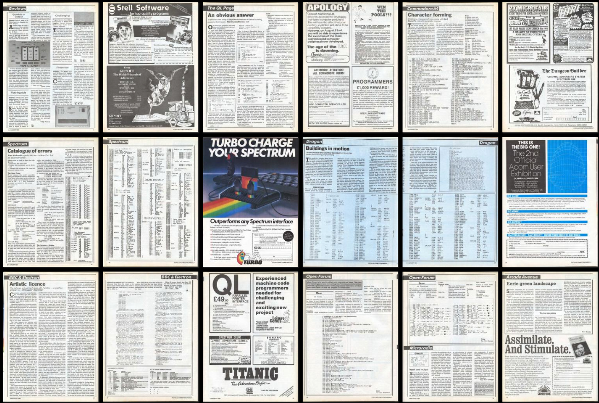

---

# It wasn't all good though

---

<!--

It wasn't always good though.

I think this was the last issue of Input magazine and they'd clearly just given up at that point.

"Here - a bunch of numbers, type them in, see what happens!"

I don't think there are even checksums there, it was just type it in - make sure you save before running otherwise it could crash your machine and wipe out the four hours of typing.

Happy days.

-->

---

# Learn from Super Stars

---

<!--

Computer and Video Games June 1984 Type in listing by Matthew Smith

https://archive.org/details/computer-video-games-magazine-032

I remember this.

A game from Super star Matthew Smith who had created Manic Miner.

We could see code that a professional programmer wrote and learn by example.

-->

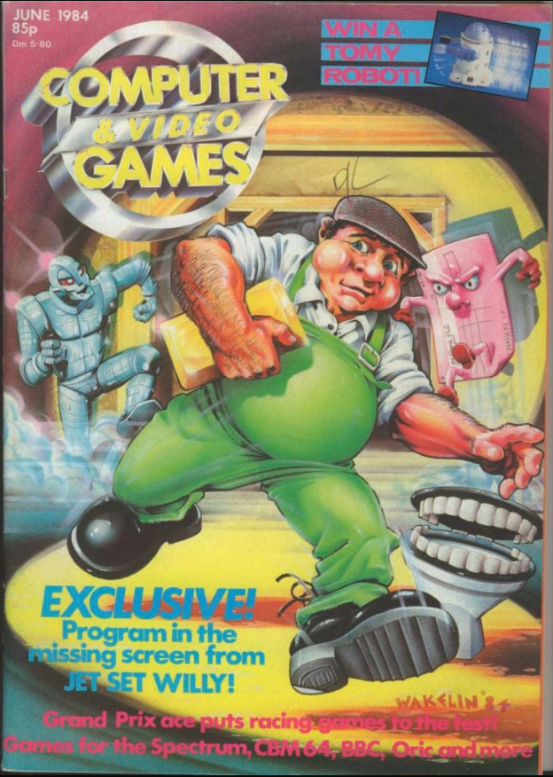
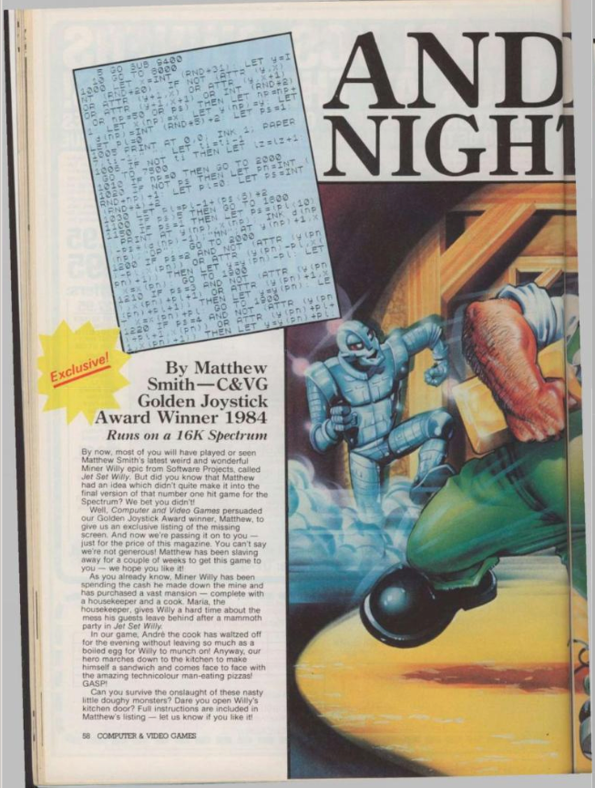
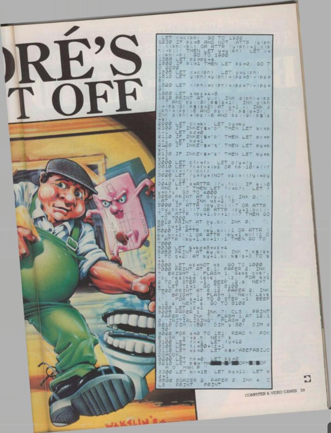

---

# Now it is all in our browser

---

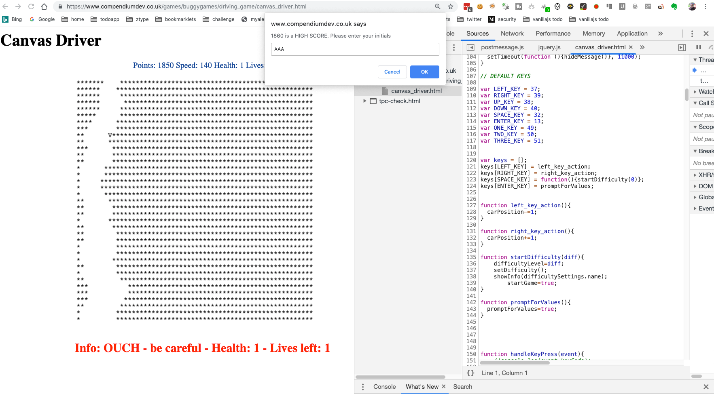

<!--

And now we have the web.

All the client code, is readable in the client. JavaScript, HTML, CSS.

Dev tools, and IDE in the browser.

Now we don't have to type it in. We can see it running, we can change it and see the impact.

We can run code in codepen, and other online editors.

This is a fantastic way to expose ourselves to code and a great way to introduce new people. Show them the code of live sites, explain it, and have them do something similar.

-->

---

# So Much Code Available

- Read Code on Github
- look for codepen (etc.) runnable examples
- YouTube live coding videos
- etc.

People wanted the 'one true book'. Immersion is what it really took.

---

# Writing frameworks is too much fun and should be banned

---

# "Dear Alan,

## I have just started learning Selenium WebDriver and Java and I am going to write a framework to make it easy for anyone to use WebDriver and Java..."

---

# "...where do I start?"

## "Thanks,

## Someone Who Wants To Save The World"

<!--

Do you get these emails?

I get these emails.

-->

---

# There is nothing wrong with wanting to save the world

---

# But don't make that the first thing you try to do

---

# What they meant was

- I'm finding it hard to learn this stuff
- I keep making mistakes
- Automating is hard
- It seems easier to write the support code
- I Want a Job For Life

---

# What they needed

- Create solutions to problems
- Learn and gain experience
- Refactor to generalised abstractions
- Build libraries rather than frameworks
- Refactor back to inline code

---

# Frameworks are Incredibly hard to build well and require a lot of experience

<!--

stories of frameworks in here if we have time

-->

---

# Dangers of knowing how to code

---

# Every problem looks like a reason to create a Tech Startup...

---

# ... or a framework, or a system, or an application, or code

## Every Problem!

---

# Problems with Twitter

## Feed not displayed in time order
## Cannot filter tweets - too much noise
## What choice did I have?

---

# ChatterScan
## .com

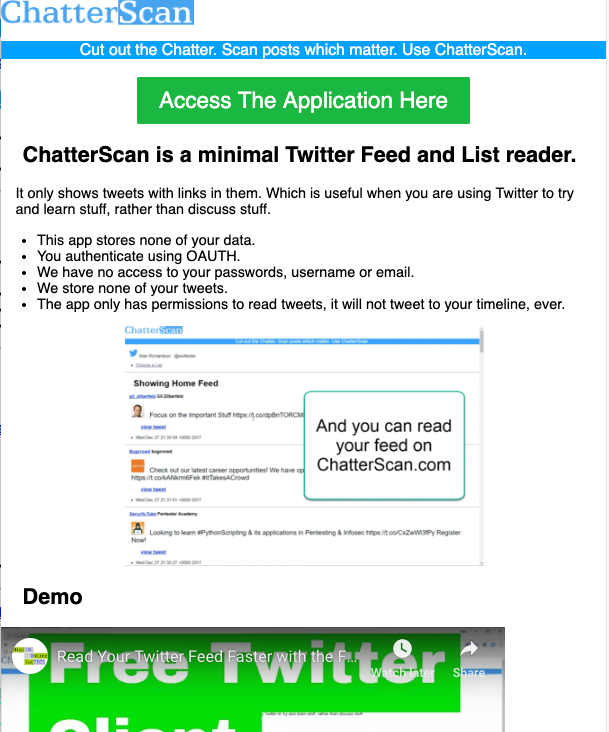

---

# Solved Problem with Tools Known at the time

- I did review other tools - Twitter clients, but...
- I found the easiest reliable Twitter API wrapper I could find
- I had an MVP working in hours
- I now have a 'thing'

---

# "Normal" might not get as far as tools.

# "Normal" stops at tools.

## DANGER - Coder Goes Further

---

# The Ultimate Secrets of Coding (*)...

## _which I give away while training beginners_

- _(*) (some of the secrets)_

---

# But each secret is a surface structure

## Deeper model comes with experience

---

# Applications are just "code calling other libraries"

## _The Secret is to find the right libraries_

---

# But the art is in...

- choosing a library for: easy of use? efficiency? authority?
- abstracting it away or not?
- trusting it, or testing it?

---

# Programmers Don't Actually Remember Anything

## Google -> StackOverflow

---

# But the Art is in ...

- wrapping the copied code in a test
- refactoring it into our domain
- taking responsibility for it

---

# IDEs write and fix code

## Press Alt+Enter repeatedly, don't remember syntax.

## Control+Space and Code completion, don't try and remember library functionality.

---

# But the art is in...

- the design, not the syntax
- writing what we want to see

---

# Programmers Don't Actually Run the App to see if it works

## Unit Tests

## Continuous Integration

---

# But the art is in...

- creating a trust building assertion safety net
- creating a robust execution mechanism

---

# Everything you need to know you can learn from writing Text Adventures

---

# Coding Them

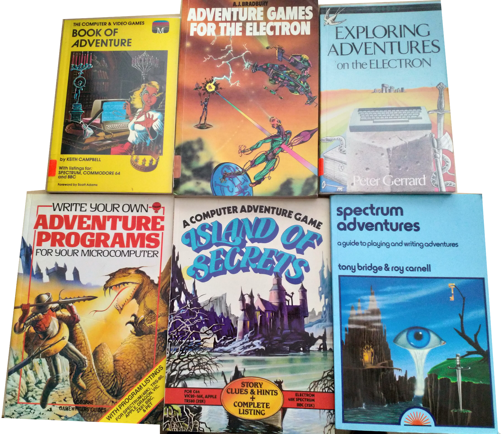

---

# You Learn

- Parsing, Tokenisation
- Domain Specific Languages
- Writing Interpreters
- Data Generation
- Data Structures
- Data Compression
- Engines
- Incremental releases, System, MVP

---

# No Limit

- Web Apps
- REST API
- Multi-User

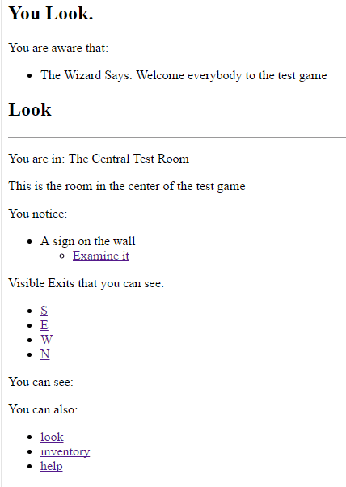

---

# Coding Not Always Required

- finished games
- using an engine
- data driven
- learn design
- DSL creation

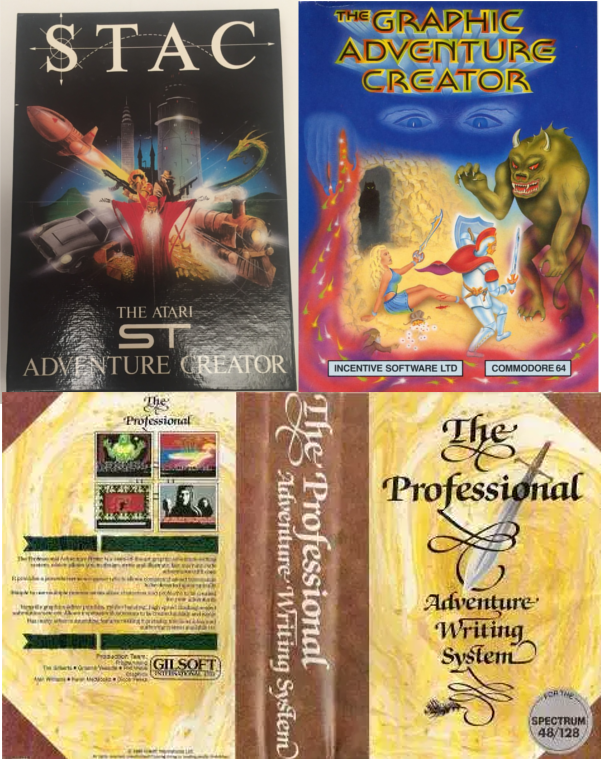

---

## Playing Them

- Architecture Mapping
- Testing
- Exploring
- Reverse Engineering

---

# Marketing

- Solve Problems
- Solution Development

---

# Solution Development

- Code for individual joy and fun
- Survival not the end goal
- Thrive as a Software Developer
- Build Solutions rather than Software
- Help other people Thrive

<!--

There is a lot of joy and fun in coding. If we really want to add value to the world and maximise the benefit of our coding skills we need to become Software Developers and that means developing not just coding skills, but design, accessibility, testing, architecture, planning, the whole gamut.

Its easy not to, because we can do better than most people because of our coding skills, be we don't want to just survive. We want to thrive.

-->

---

# Aspire to be a Solution Developer

<!--

I aspire to be a Solutions Developer, not just a Software Developer.

Because ulimately it is the Solution that helps people thrive, not the software.

-->

---

# End

## Alan Richardson
## EvilTester.com
## https://twitter.com/eviltester

---

## Games shown

- https://www.compendiumdev.co.uk/games/buggygames/
- https://www.compendiumdev.co.uk/page/restmud

---

## References

- various screenshots of magazines from archive.org
- MUD MUD: Messrs Bartle and Trubshaw's Astonishing Contrivance
    - https://www.youtube.com/watch?v=YfX8Z8W9JCE

---

# About Alan Richardson

- EvilTester.com
- CompendiumDev.co.uk
- Talotics.com
- @EvilTester

<!--

---

First programming:

- Phillips Videopac G7000 programming cartridge, random chars, little man moving, accomplishment

---

Early programming

Initially doing something cool, and big, and getting as far as a sprite, or an 'intro'
My first game was a cool intro, but no game
My first Gameboy game was a sprite that moved about
My first text adventure game was a cool parser, and a cool layout engine, but no game

---

# The Lost Initiation Ceremonies of Software Development

- Typing in Code from listings
- Loading from Tape `R Tape Loading Error 0,1`
- Reading Computer Magazines with code in them

My first finished programming projects were typing stuff in from computer magazines and debugging to figure out if it was me, or the original listing.

---

# First Creations

- https://archive.org/details/zx_3D_Game_Maker_Maker_1987_CRL_Group_a
- PAW
- QUILL
- ZAP Basic

My early finished self creations were using engines: GAC, STAC, 3d Game Maker.

- Because the 'framework stuff is hard'

---

# Solve Your Own problems

   - Early Web Indexer - page monitor, find links, follow, add to a list
   - Testing tools in Excel - build in other tools, learn 'just enough' of a language

---

# Learning Sales & Marketing

Early Apps
    Compendium-TA - hugely ambitious, no funding, no marketing, few sales,
    Email and URL

Lessons - build in small chunks, sell in small chunks, side-hustle, choose the right language (VB)

This is important for all projects - we have to add value, and add value fast, and keep adding value.

---

# Stuff

- Test Data Generator
- REST Mud
- RestListicator
- Chatterscan
- Chrome Extension for testing
- Adhoc tools - Patreon downloader, Mindmap downloaders, Linkedin profile viewer,

---

# Lessons from teaching

- the install is the hardest thing - SDK, IDE, First App
- I teach with TDD

---

# Learning JavaScript

- Sloganizer - lessons learned from text adventure games with text generation, cover generative grammars, test data generation
- Bots
     - Bookmarklet generator,
     - Z-Type
     - X-Type
- Marketing
     - Storify to Twitter migrator,

-->

<!--

---

# Chronological

- Quantum
- Lambda

-->

<!--

But I'm not going to do that in chronological order.

I'm getting ready for Quantum Computing where we can do all of the things all at the same time. We just don't know if they worked or not.

And Llambda processing where we can do things out of order and simply collate it all together when it is mostly done, with potentially the promise of adding more if we have time.

-->

<!--

---

# The 'Install' is the hardest part to keep up to date

- Every tutorial is out of date
- Videos look out of date: OS changes, IDE versions
- Version numbers confuse people
    - "learning Java 1.8 is out of date"
    - Python 2 or Python 3?
- Compilation required
    - Ruby libraries needing C compilers

-->

<!--

I gave up learning Java - compiling from the command line, failed

Python - which version do I install?

Ruby - libraries didn't work, needed C++ compiler during install

-->

<!--

---

# Teach with an Automated Install

- Package Managers
    - Homebrew
    - Chocolatey
- Dependency Managers
    - Maven
- Downloaders
    - https://github.com/bonigarcia/webdrivermanager

---

# _But version numbers! But complexity! But secrets!_

-->

<!--

---

# Experience

## Automate to free up thinking time
## Know a subset really well
## Keep learning
## More Than Code

-->

<!--

---

# Experienced Programming Manifesto

## Uncovering ways of developing software by automating and worrying less. Through this work we have come to value:

---

- **Dependency Management** over _knowing how to do everything_
- **IDE Generating code** rather than _actually coding_
- **Running Unit Tests** rather than _making sure the code works first time_
- **Continuous Integration** rather than _running our app to see if it works_

_That is, beginners worry about the items on the right & Experienced coders don't take this slide seriously._

-->

<!--

I removed a bunch of sections on 'wrong approaches and mistakes I made when writing adventures'

- not the framework
    - Parser
    - Text Formatter
    - Compression

- wrote the best parser in the world with no game to go with it
- wrote a fantastic text formater with a great font, but no game to go with it on a limited version of he machine spec (hi-res)
- wrote a great compression routine, but no game to go with it

-->

<!--

30 minute talk

-->
