<!-- footer: @EvilTester -->
<!-- page_number: true -->

# Creating Yourself as a Tester

## Make Your Own Testing Path

### Nordic Testing Days 2017
### Alan Richardson

* [www.eviltester.com](http://www.eviltester.com)
* [www.compendiumdev.co.uk](http://www.compendiumdev.co.uk)
* [@eviltester](https://twitter.com/eviltester)

<!--

---

# Synopsis

We are not born testers. We become testers. Some of us become testers by circumstance, we "just stumble into it". Some of us choose the path of a tester. In both instances we then make choices to determine if, and when, we improve as testers. Everything we do in the name of 'testing' shapes us as a tester. By our every day actions we create ourselves as testers. And its important that we recognize this because we have to take responsibility for our own test approaches. Similarly we have to take responsibility for making ourselves better testers. 

-->

<!---

https://www.nordictestingdays.eu/events/keynotes/keynote-creating-yourself-tester-make-your-own-testing-path

Thursday, June 8, 2017 -

16:00 to 17:00

Alfa 1+2

-->

<!--

---

# In this talk

Alan will describe the dark times before he recognized his own responsibility...

- when he allowed circumstance to control his testing path, 
- and the steps he has taken to improve his testing skills
-  and make his own testing path,

... in the hope that you will be able to add some of those techniques to your own self improvement regime.

-->

---

# How good would you be if you spent all your time practicing, thinking and reading about  Software Testing?

---

<!-- http://www.openfotos.com/view/clear-blue-sky-4687 -->

# "Why is the sky blue Daddy?"

## We are not born testers

<!--

5 Whys - belief hierarchy

Asking questions is an art form

Questions change state - we need to be aware of that

-->

---

# The Wonderful World of Testing

## (_'Alice' images from Mad Magazine #18, December 1954_)

---

---

# Q: What made you become a tester?

## A: I just fell into it

---

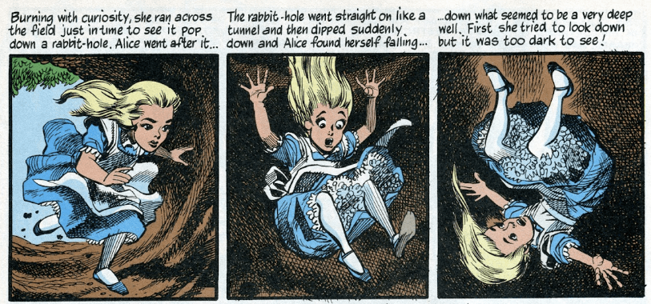

<!--

http://jeffoverturf.blogspot.co.uk/2012/08/alice-in-wonderland-jack-davis-mad.html

December 1954 and issue 18 of Mad 

-->

<!--

Some of us become testers by circumstance, we "just stumble into it". Some of us choose the path of a tester.

If only Alice had grabbed some of those books on the way down, perhaps they could have informed her 'fall'.

-->

---

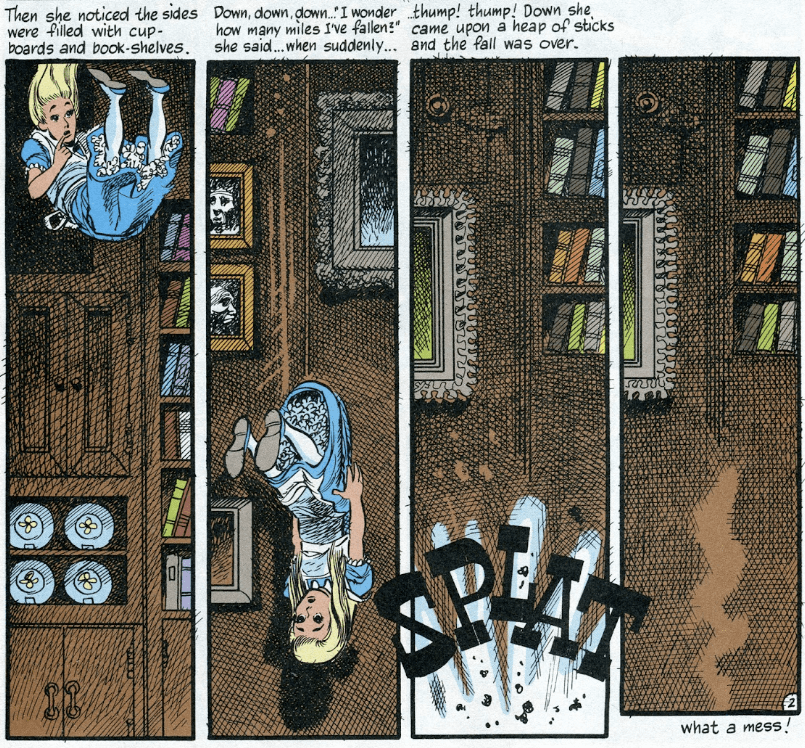

---

# We make choices to determine if, and when, we improve as testers.

---

# First Steps - Read Everything

---

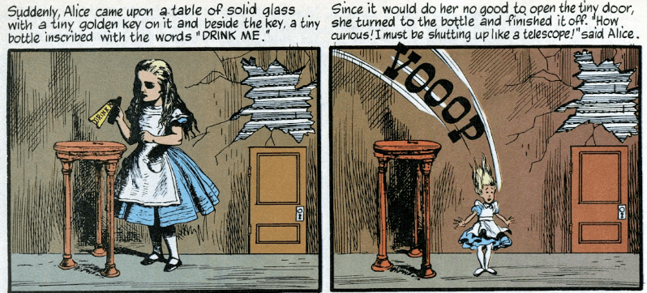

---

# First Steps - Fit in to your place of work

---

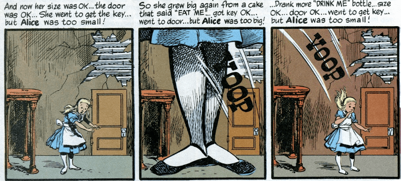

---

# Start to spot things that are 'wrong'

---

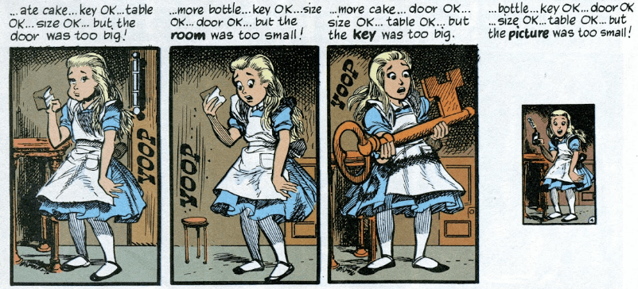

---

# There may come a point where you decide you've had enough

---

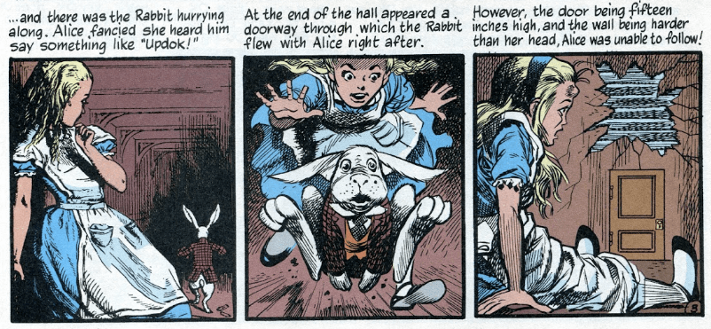

---

# Start Experimenting

---

---

# Everything we do in the name of 'testing' shapes us as a tester. By our every day actions we create ourselves as testers.

---

# We have to take responsibility for our own test approaches and for making ourselves better testers. 

---

# Dark Days

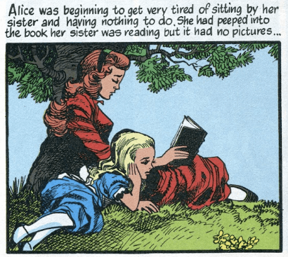

<!--

- We do this process
- This process does not seem efficient
- We do it anyway

-->

---

# Wake up and Take Control

---

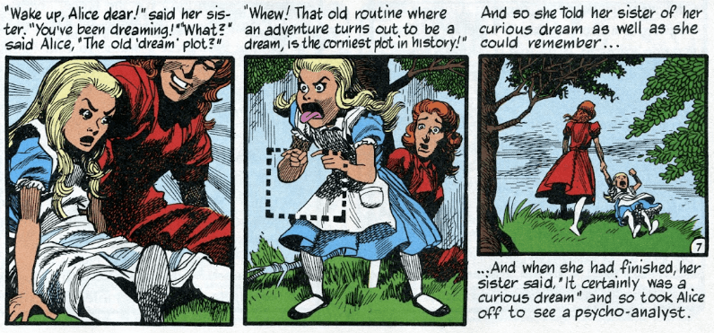

<!--

- and the steps he has taken to improve his testing skills
- and make his own testing path,

-->

---

# "...and so took Alice off to see a psycho-analyst."

<!-- photo of psycho-analysis books -->

- I study Psychotherapy as a hobby
- Because I am interested in 'beliefs', how they are formed and changed
- I did not do it to improve my testing
- But it did improve my testing

---

# There are many paths

I'm not a:

- puzzle / riddle / card game person

I'm a software person and an action gamer.

**That works better for me.**

So I 'hack' JavaScript games for fun.

_Harness and follow what works for you._

---

# Testing is a normal world activity

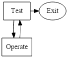

- TOTE
- George Miller

<!-- And that is the key to improving -->

<!--

Testing is Building and Comparing Models of a System to the System

Models are key

Going through customs

Model of what should be in bags
X-rays to Observe and compare against model
Interrogation down separate channel to check explore observations and model mismatch in more detail

Testing is a normal world activity

Coin purse - too bunched up , hide things behind
Stopped, asked why? expanded model, change strategy

-->

---

# Assimilate all your normal world activity and interests as 'testing'

## Not as metaphor, or simile, but as actual Testing Strategies and Processes

---

# Applied Psychotherapy

- Not a Metaphor
- Not a Simile
- I **assimilated** techniques and concepts into my Testing as Testing Techniques and concepts
 
---

# Here are some things I learned from Studying Psychotherapies that I apply directly to testing

---

# Work with the patient you have. Not the patient you want

- Every System is unique
- Avoid assumptions about how it works
- Observe below the covers to find out 'how' it actually works

---

# Therapist builds a Model the Patient's communication then asks questions to check their model, challenge patient's model and effect change

- Interactions with the system are questions
- Need to know what purpose my questioning serves
- Can be accidental change when I ask a question - am I observing deep enough?

---

# Patient tells you where the problem is if you observe and listen effectively, they also offer the solution

- Observing 'all' the details in 'all' the places is hard, need tool support
- Need to replay back 'records' of testing to spot things I missed and identify new models and questions

---

# We communicate in abstractions - generalisations, deletions, equivalence

- Apply to 'story'/'requirements'/'examples' analysis
- Specific questions: How do you know? According to whom? Specifically? Could that also mean...?

---

# Multiple Models, which can contradict, held simultaneously

- Model system from multiple angles
- Do physical models contradict logical models?
- Are models enforced at all system layers?
- Are models consistently enforced at all system layers?

---

# ... and the list goes on

- Effect of environment on behaviour and communication
- Presupposition in statements
- Intervention, Change and Manipulation

---

# I generalised my model to:

## Model
## Observe
## Reflect
## Interrogate
## Manipulate

---

# Therapies for Software Testing

- Hypnosis - Milton Erickson, NLP
- Provocative Therapy - Frank Farrelly
- Family Therapy - Virginia Satir
- Gestalt Therapy - Fritz Perls
- Brief Therapy - Steve de Shazer
- Choice Therapy - William Glasser
- Rational Emotive Behaviour Therapy - Albert Ellis

---

# There are many paths

## "Don't try to imitate my voice, or my cadence. Just discover your own. Develop your own techniques. Be your own natural self. I tried to do it the way somebody else did and it was a MESS."

_Milton H. Erickson, M.D. quoted in "Taproots", 1987, O'Hanlon_

---

# Roots and Overlaps

- Family Therapy used concepts from Systems Theory
- Rational Emotive Behavioural Therapy built on General Semantics and Cybernetics
- Brief Therapies built on Mathematics - Set Theory, Discrete Mathematics (preconditions, postconditions, transformations), Theorem Proving

## Study what those you study studied

---

# Everything is As Related as _You_ Make It

## (or "Lessons Learned from studying Conspiracy Theories")

### _related reading http://www.paranoiamagazine.com/_

---

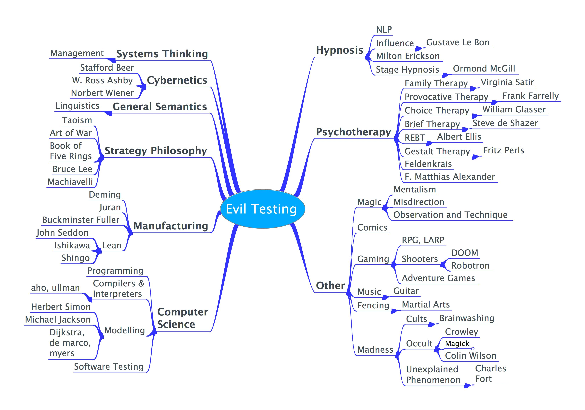

<!--

Evil Testing
    Hypnosis
        NLP
        Influence
            Gustave Le Bon
        Milton Erickson
        Stage Hypnosis
            Ormond McGill
    Systems Thinking
        Management
    Cybernetics
        Stafford Beer
        W. Ross Ashby
        Norbert Wiener
    Psychotherapy
        Family Therapy
            Virginia Satir
        Provocative Therapy
            Frank Farrelly
        Choice Therapy
            William Glasser
        Brief Therapy
            Steve de Shazer
        REBT
            Albert Ellis
        Gestalt Therapy
            Fritz Perls
        Feldenkrais
        F. Matthias Alexander
    General Semantics
        Linguistics
    Strategy Philosophy
        Taoism
        Art of War
        Book of Five Rings
        Bruce Lee
        Machiavelli
    Manufacturing
        Deming
        Juran
        Buckminster Fuller
        Lean
            John Seddon
            Ishikawa
            Shingo
    Other
        Magic
            Mentalism
            Misdirection
            Observation and Technique
        Comics
        Gaming
            RPG, LARP
            Shooters
                DOOM
                Robotron
            Adventure Games
        Music
            Guitar
        Fencing
            Martial Arts
        Madness
            Cults
                Brainwashing
            Occult
                Crowley
                Chaos Magick
                Colin Wilson
            Unexplained Phenomenon
                Charles Fort
    Computer Science
        Programming
        Compilers & Interpreters
            aho, ullman
        Modelling
            Herbert Simon
            Michael Jackson
            Dijkstra, de marco, myers
        Software Testing

-->

<!--

digraph G {

"Evil Testing" -> Hypnosis
   Hypnosis -> NLP
      NLP -> Influence
         Influence -> "Gustave Le Bon"
   Hypnosis -> "Milton Erickson"
   Hypnosis -> "Stage Hypnosis"
       "Stage Hypnosis" -> "Ormond McGill"
"Evil Testing" -> "Systems Thinking"
   "Systems Thinking" -> Management

"Evil Testing" ->     Cybernetics
    Cybernetics ->    "Stafford Beer"
    Cybernetics ->     "W. Ross Ashby"
    Cybernetics ->    "Norbert Wiener"

"Evil Testing" ->     Psychotherapy
    Psychotherapy ->    "Family Therapy"
        "Family Therapy" ->    "Virginia Satir"
    Psychotherapy ->    "Provocative Therapy"
         "Provocative Therapy" ->   "Frank Farrelly"
    Psychotherapy ->    "Choice Therapy"
         "Choice Therapy" ->   "William Glasser"
    Psychotherapy ->    "Brief Therapy"
         "Brief Therapy" ->   "Steve de Shazer"
    Psychotherapy ->    REBT
         REBT ->   "Albert Ellis"
    Psychotherapy ->    "Gestalt Therapy"
          "Gestalt Therapy" ->  "Fritz Perls"
    Psychotherapy ->    Feldenkrais
    Psychotherapy ->    "F. Matthias Alexander"

"Evil Testing" ->     "General Semantics"
        "General Semantics" -> Linguistics

"Evil Testing" ->     "Strategy Philosophy"
        "Strategy Philosophy" -> Taoism
        "Strategy Philosophy" -> "Art of War"
        "Strategy Philosophy" -> "Book of Five Rings"
        "Strategy Philosophy" -> "Bruce Lee"
        "Strategy Philosophy" -> Machiavelli

"Evil Testing" ->     Manufacturing
        Manufacturing -> Deming
        Manufacturing -> Juran
        Manufacturing -> "Buckminster Fuller"
        Manufacturing -> Lean
            Lean -> "John Seddon"
            Lean -> Ishikawa
            Lean -> Shingo

"Evil Testing" ->     Other
        Other -> Magic
            Magic -> Mentalism
            Magic -> Misdirection
            Magic -> "Observation and Technique"
        Other -> Comics
        Other -> Gaming
            Gaming -> "RPG, LARP"
            Gaming -> Shooters
                Shooters -> DOOM
                Shooters -> Robotron
            Gaming -> "Adventure Games"
        Other -> Music
            Music -> Guitar
        Other -> Fencing
            Fencing -> "Martial Arts"
        Other -> Madness
            Madness -> Cults
                Cults -> Brainwashing
        Other ->     Occult
                Occult -> Crowley
                Occult -> "Chaos Magick"
                Occult -> "Colin Wilson"
         Other ->    "Unexplained Phenomenon"
                "Unexplained Phenomenon" -> "Charles Fort"

"Evil Testing" ->     "Computer Science"
        "Computer Science" -> Programming
        "Computer Science" -> "Compilers & Interpreters"
            "Compilers & Interpreters" -> "aho, ullman"
        "Computer Science" -> Modelling
            Modelling -> "Herbert Simon"
            Modelling -> "Michael Jackson"
            Modelling -> "Dijkstra, De Marco, Myers"
        "Computer Science" -> "Software Testing"

}

-->

---

<!--
# A Path
-->

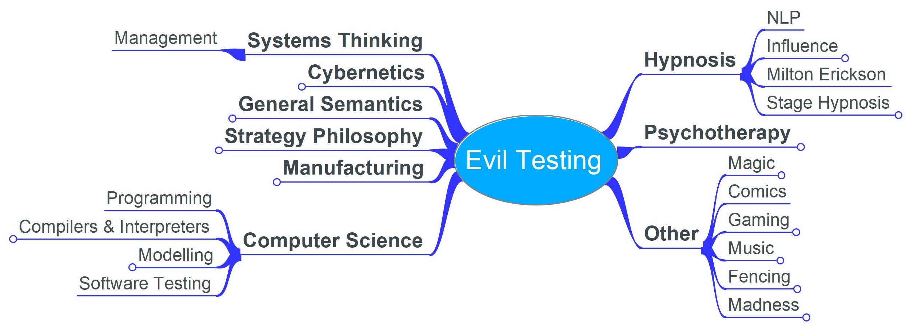

---

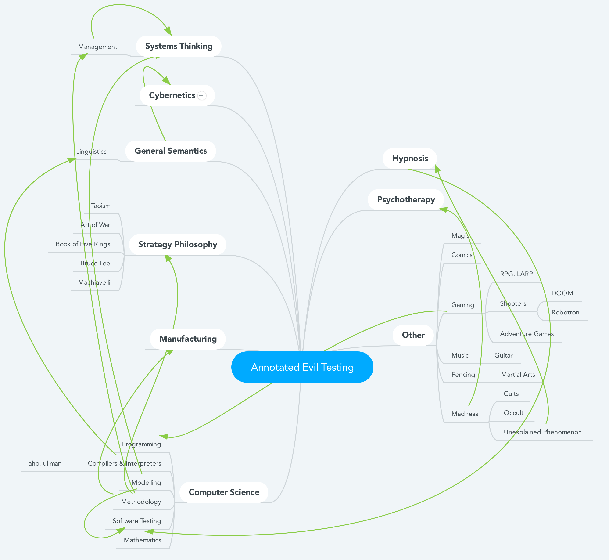

---

<!--
# Overlap
-->

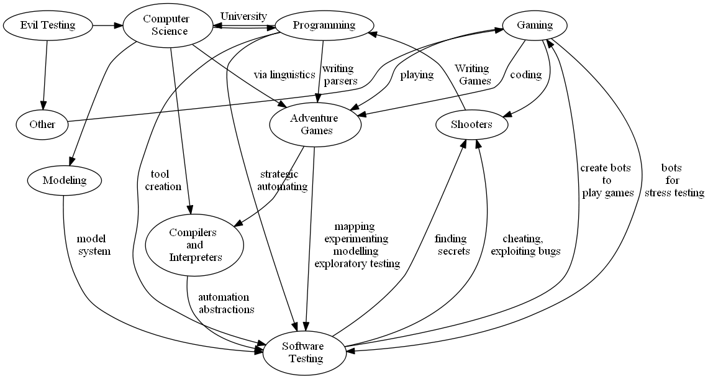

<!--

digraph EvilTesting {

 {rank=same; EvilTesting ; Other ; ComputerScience; Gaming}

  EvilTesting [label="Evil Testing"]
  
  EvilTesting -> Other
  EvilTesting -> ComputerScience

  ComputerScience [label="Computer \n Science"]

  Other -> Gaming
  Gaming -> Shooters -> Programming
  Gaming -> Adventure_Games

  Adventure_Games [label="Adventure \n Games"]

  Adventure_Games -> Compilers

  
  ComputerScience -> Programming
  ComputerScience -> Compilers
  ComputerScience -> Modeling

  Compilers -> Software_Testing [label="automation \n abstractions"]

  Software_Testing [label="Software \n Testing"]
 
  Modeling -> Software_Testing [label="model \n system"]
  Programming -> Software_Testing [label="tool \n creation"]
  Programming -> Software_Testing [label="strategic \n automating"]
  Software_Testing -> Gaming [label="create bots \n to \n play games"]

  Gaming -> Software_Testing [label="bots \n for \n stress testing"]

  Software_Testing -> Shooters [label="finding \n secrets"] 
  Software_Testing -> Shooters [label="cheating, \n exploiting bugs"]   
  Adventure_Games -> Software_Testing [label="exploratory testing, \n mapping"]   

}

-->

---

# Everything is As Related as _You_ Make It

---

# Practical Steps to Create Yourself As a Tester

- What do you do?
- Who does it better?
- What do you think?
- Practice

---

# What do you do?

- Make notes
- Reflect
   - Do you do it well? 
   - What do you need to improve?
   - What will you do to improve?
- Act
   - Dedicate time to improving  

---

# What did I do?

- daily logs
- detailed logs when testing
- create a list of technologies I did not understand
- work through the list
- find tools to support

---

# Who does it better?

- Pick people to model.
- Observe what they do,
- Build your own model of what they do,
- try it out.
 
If you get the chance, interrogate them about their model to learn how to model them better

---

# What did I do?

Model:

- read blogs, articles, watch talks
- make my own unified notes
- apply to my situation 

Ask:

- How did they get there?
- What did they read / do?

---

# What do YOU think?

- Describe your models of testing, using your words
    - What IS Testing?
    - Why did you test that?
    - Why did you test that that way?
- Describe other people's models of testing, using your words
    - What is Agile Testing? Exploratory Testing? Automation?    

---

# What did I do?

- blog
- describe rather than define
- avoid using certain words
- share - grow up in public

New: 

- instagram - daily summary of concepts and thoughts

---

# My current testing path

- EVERYTHING is Testing
- Concentrate on applied practicalities
- Create own models and descriptions
- Practice

---

# Make your own testing path

- Keep up to date with 'testing'
    - Build your own views
- Build your own model(s) of testing, refine it over time
- Choose the language you use to describe testing
- Practice applied and practical skills

---

# You are your responsibility

## Create Yourself as a Tester
## Make Your Own Testing Path

### We never finish

<!--

Topics are as related as we make them. The more similarities we find, and the more cross-disciplinary we become in our understanding of the world, the more time we spend on improvement and the better we get.

- As I play computer games, I explore for bugs and find ways to exploit them
- My system exploration helps me identify patterns in game design and maps to find secrets more easily
- When I surf the web, I use dev tools to learn more about web development technologies
- I model my guitar playing and then find ways to traverse paths I haven't covered and expand my repertoire into new riffs and styles

The more we relate our activities, the more we can learn and improve, just by being interested in more stuff.

-->

---

# Learn to "Be Evil"

* [www.eviltester.com](http://www.eviltester.com)
* [@eviltester](https://twitter.com/eviltester)
* [www.youtube.com/user/EviltesterVideos](https://www.youtube.com/user/EviltesterVideos)

---

# Learn About Alan Richardson

* [www.compendiumdev.co.uk](http://www.compendiumdev.co.uk)
* [uk.linkedin.com/in/eviltester](http://uk.linkedin.com/in/eviltester)

---

# Follow

- Linkedin - [@eviltester](https://uk.linkedin.com/in/eviltester)
- Twitter - [@eviltester](https://twitter.com/eviltester)
- Instagram - [@eviltester](https://www.instagram.com/eviltester)
- Facebook - [@eviltester](https://facebook.com/eviltester/)
- Youtube - [EvilTesterVideos](https://www.youtube.com/user/EviltesterVideos)
- Pinterest - [@eviltester](https://uk.pinterest.com/eviltester/)
- Github - [@eviltester](https://github.com/eviltester/)
- Slideshare - [@eviltester](www.slideshare.net/eviltester)

---

# BIO
 
Alan is a test consultant who enjoys testing at a technical level using techniques from psychotherapy and computer science. In his spare time Alan is currently programming a [multi-user text adventure game](http://compendiumdev.co.uk/page/restmud) and some [buggy JavaScript games](http://compendiumdev.co.uk/games/buggygames/) in the style of the Cascade Cassette 50. Alan is the author of the books "[Dear Evil Tester](http://www.eviltester.com/page/dearEvilTester/)", "[Java For Testers](http://javafortesters.com/page/about/)" and "[Automating and Testing a REST API](http://compendiumdev.co.uk/page/tracksrestapibook)". Alan's main website is [compendiumdev.co.uk](http://compendiumdev.co.uk) and he blogs at [blog.eviltester.com](http://blog.eviltester.com)