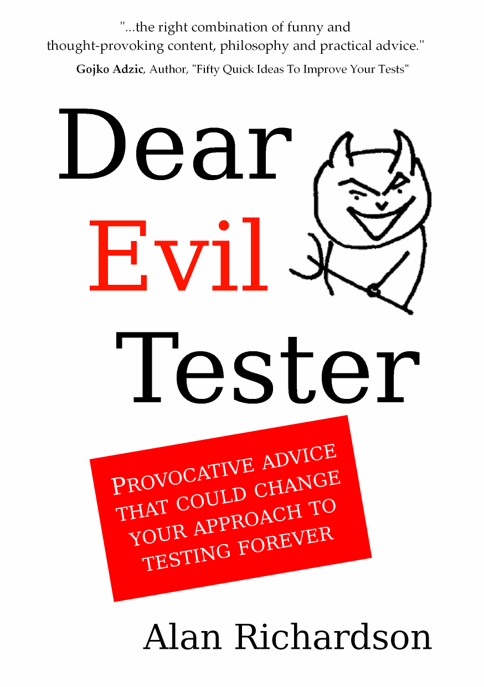
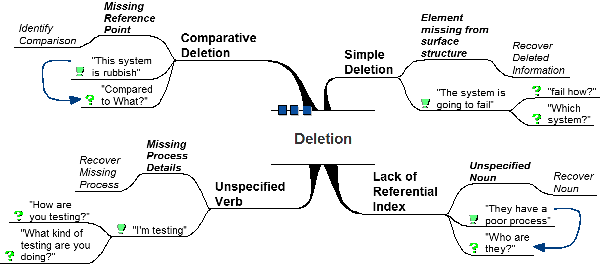
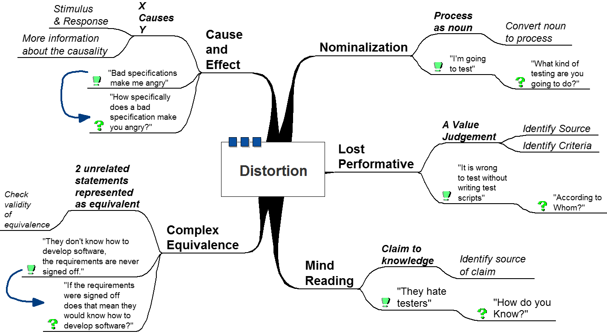

<!-- Generated from questioningTestingUsed.odp by extracting visible ODP text content. -->
<!-- ODP image references have been extracted into images/ and linked from matching slides. -->

# Slide 1

---

# "The Art of Questioning to improve Testing, Agile, and Automating"

- Alan Richardson
- Test Consultant
- CompendiumDev.co.uk
- EvilTester.com
- @EvilTester

---

# Asking Questions to...

- Build a model: risks, issues, gaps
- What questions expose the risks?
- What questions trigger action?
- What questions foster responsibility?

---

# 5 Whys

- Common 'management' questioning
- Toyota
- (Lean) Six Sigma Tool
- Root Cause Analysis

---

# Fritz Perls on Why

- If we spend our time looking for causes instead of structure we may as well give up the idea of therapy and join the group of worrying grandmothers who attack their prey with such pointless questions as “Why did you catch that cold?” “Why have you been so naughty?”
- Fritz Perls,
- The Gestalt Approach

---

# “Why?” is a Belief Question

- Beliefs about causes
- Reinforces a model
- Justification
- Leads to:
- Because...

---

# Slide 8

---

# How? What? Where? When? Who?

- Explore a model
- Build a system
- Lead to
- Experiments
- Action
- Responsibility

---

# Dear Evil Tester

- Q&A Agony Aunt for Testers

---

# Sometimes we don't know what to do and just need some advice.

---

# Q: Should I pretend to test?

- “In the past I have worked with project managers who have only pretended to manage. Just in case I come across this sort again in the future, I want to know; should I only pretend to test too, as a form of self-preservation?”
- Eliza

---

# A: No

- Dear Eliza,
- ...
- "NO".
- ...
- All the best,
- Uncle Evil

---

# Q: Should I pretend to test?

- “In the past I have worked with project managers who have only pretended to manage. Just in case I come across this sort again in the future, I want to know; should I only pretend to test too, as a form of self-preservation?”
- Eliza
- Questions have a model of the world embedded in them.

---

# Q: Tester not pulling their weight?

- Dear Evil Tester,
- What's the best way to deal with a fellow tester who is not pulling his/her weight?
- Anon

---

# A: Delegate Upwards

- Dear Anon,
- ...raise your concerns to your manager, after all your lazy manager usually has plenty of time on their hands, and it is their responsibility to deal with your light-weight under performing co-workers.
- Yours,
- Team Spirit Coach Evil
- Answers also have a model of the world embedded in them.

---

# A: Delegate Upwards

- Dear Anon,
- ...raise your concerns to your manager, after all your lazy manager usually has plenty of time on their hands, and it is their responsibility to deal with your light-weight under performing co-workers.
- Yours,
- Team Spirit Coach Evil
- Answers also have a model of the world embedded in them.

---

# Q&A Provocation

---

# Some Questions are Practical

---

# Q: How to Track Exploratory Testing

- Dear Evil Tester,
- Do you recommend any tools for note-taking and managing test sessions?

---

# Dependency Danger

---

# What do I do next?

---

# What do I do next again?

---

# Consultancy Job Security

- Job Security – 'the answer person'
- Consultants / Managers / Leads
- Aim to go 'out of business'
- build flexibility
- not dependency

---

# Dependency

- Asking questions for 'answers' rather than to build a model to increase understanding
- A step by step model has no flexibility
- Not learning to ask questions that help when expert is not present

---

# Avoiding Dependency

- Lead by example
- “asking the right questions”
- Ask questions
- which expose underlying model
- to prompt exploration of model
- Gaps, risks
- to prompt comparison of model to system
- Issues, bugs

---

# Modelling Testing as Questioning

- Given a model, does the System match the model?
- Requirements say X, can I do X?
- System 'looks like' I should be able to do Y, can I?

---

# Modelling Testing as Questioning

- Under this model:
- Test == Ask a Question
- Answer -> Expand/Confirm Model
- Reporting == Communicate Model

---

# Modelling Agile as Questioning

- Agile
- responding to change
- Change based on learning
- Learning == changes to models & understanding

---

# Modelling Agile as Questioning

- Agile requires asking a lot of questions
- What are we doing?
- Why?
- How Well?
- Could be better?
- How much?
- Minimum acceptable?
- constantly

---

# Automating as Questioning

- Automate putting system into a specific state
- Codify specific pre-defined questions
- Assert on the answers
- ...Repeat

---

# Automating as Questioning

- Automate putting system into a specific state
- Codify specific pre-defined questions
- Assert on the answers
- ...Repeat
- Questions have a model of the world embedded in them.

---

# Meta-Model

---

# Meta-Model

- http://compendiumdev.co.uk/nlp

---

# Meta-Model

---

# Meta-Model

---

# Summary

- The questions we ask reveal our model of the world.
- We can ask questions of 'the world' to explore and expand our model.

---

# Ask The Questions!

- Alan Richardson
- @EvilTester
- www.EvilTester.com
- www.JavaForTesters.com
- www.SeleniumSimplified.com
- www.CompendiumDev.co.uk

