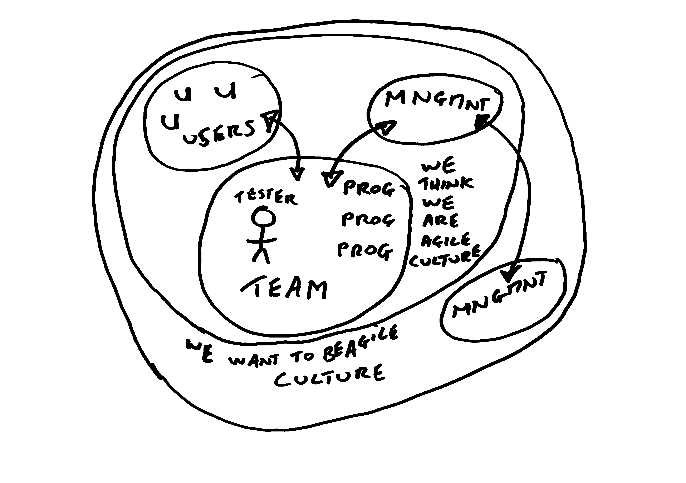
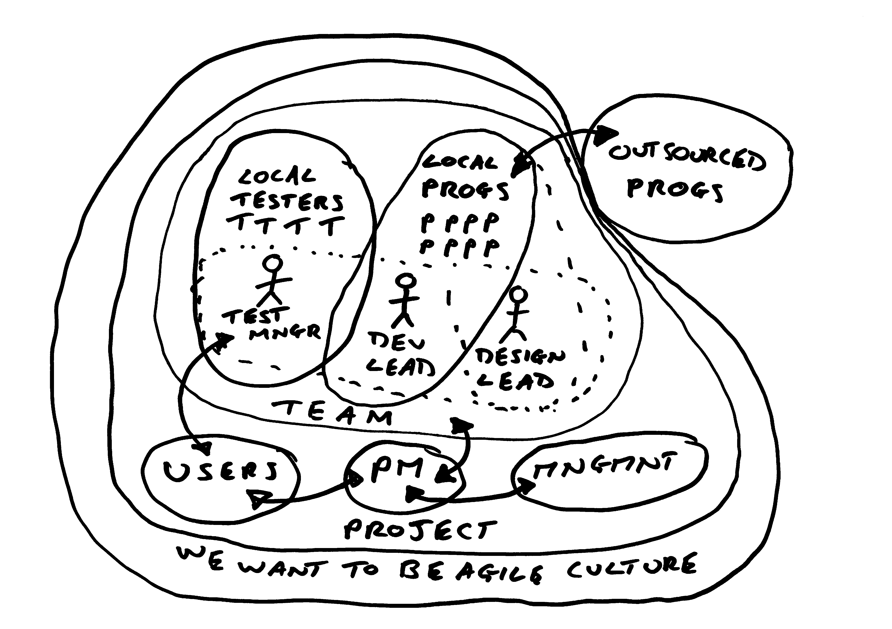
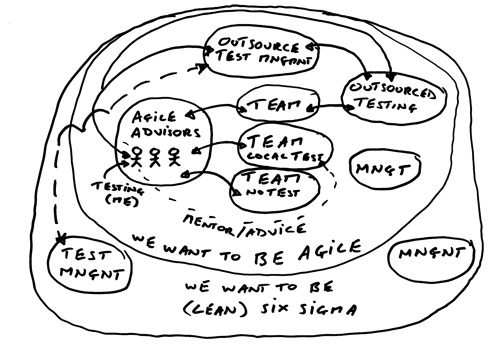
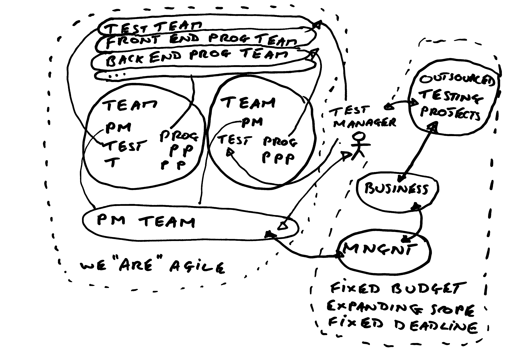
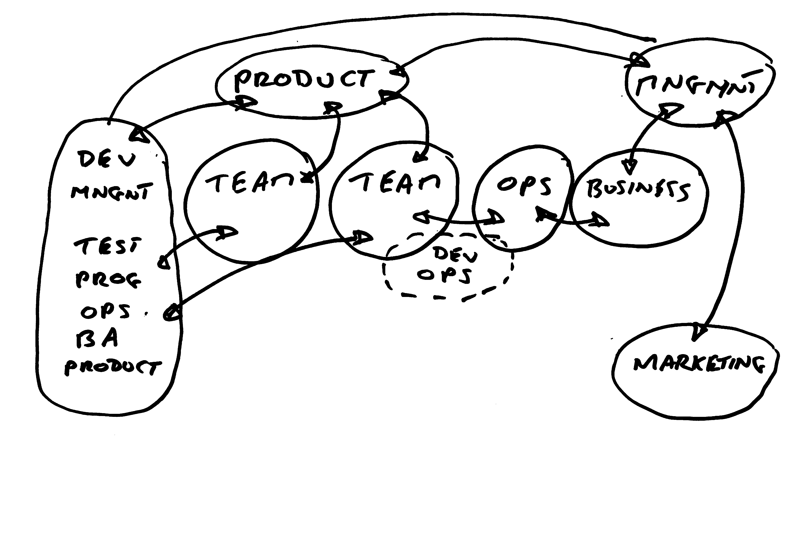

# How to Survive Agile & Devops

A Test Management Guide

- Alan Richardson (@EvilTester)
- EvilTester.com / CompendiumDev.co.uk

## What are Agile & Devops?

- Any Formal Definitions?
- Approached the same in every company?
- Everyone agrees on what they are?

## When does Testing Thrive?

- When Ambiguity is Alive,
- Then Testing will Thrive,
- With Uncertainty as well,
- Testing can Excel.

## Everything is up for grabs

- Agile literature focuses on a model of the “Team as a System”
- Real world is messier than this
- Management are often not included in the model

## The QA & Testing Mix-up

- If Quality is owned by the team
- and QA == Testing
- And we have Automated Testing
- And Automated Tests
- Then
- What need have we for Test Management?

## Everything is up for grabs

- “They” don’t know how Test Management Fits
- Test Managers have to demonstrate

> We are confused about Testing

## Everything is up for grabs

- With no formal definitions,
- there are competing idealized models of the process

> “Nothing is true, 
> everything is permitted.”

- Hassan-I Sabbah
- Alamut, by Vladimir Bartol
- William S. Burroughs
- Assassin’s Creed

## Idealised models clash

Idealised model of Agile / Devops

Clashes With

Idealised model of Test Management

## Meanwhile Back in the Real world

The Actual System of Development

Has a Negotiable Relationship With

Individuals with Skills and Experience

## Take a Systems View

- How does ‘your’ Agile / DevOps Project work?
- What are the Risks?
- What are the Issues?
- What can you do?
- Amplification / Attenuation of Signals /Noise
- What do people expect you to do?

## Take a Systems View

- How does ‘your’ Agile / DevOps Project work?
   - Dynamics Model
- What are the Risks?
   - Subjective Model
- What are the Issues?
   - Subjective Model
- What can you do?
   - Skills / Experience Model
- Amplification / Attenuation of Signals /Noise
   - Communication Model
- What do people expect you to do?
   - External 'role' Model

## A Tester Model

- Users
- Management
- Tester

- We think we are Agile culture
- We want to be Agile culture

## Case Study Lessons

- My First Agile Project
- Had to ‘carve out’ a Role, no-one knew how Testing fits in, drew upon Test Management & Testing skills
- Filled in the ‘gaps’ in the process
- Clarified the ‘test strategy’ across Dev & Users
- Amplified the ‘risks’, ‘ambiguities’
- Hands on Testing & Automating

## A Test Management Model

- Local Testers
- Test Manager
- Local Programmers
- Dev Leab
- Outsourced Programmers
- Design Lead
- Users
- PM
- Management
- We Want to be Agile Culture

## Case Study Lessons

- ‘Traditional’ Test Management within Agile
- Line management and Skill development of Testers. Who else:
- Makes sure testers can test in Agile?
- Recruits testers, guides testing, reviews testing for depth and coverage, tailors lightweight reporting, investigates alternative automated execution.
- Co-ordinates UAT? Communicates testing?
- “Outcome” Process Risk Issues

## An Advisor Model

- Outsource Test Management
- Outsourced Testing
- Team of Programmers working with outsourced Testing Team
- Local Test Team
- Team with no testing
- Management
- Agile Advisors Team (me - Agile Testing Advisor)
- We want to be Agile Culture
- We want to be (Lean) Six Sigma Culture

## Advisor Model Case Study Lessons

- Protect teams from ‘non-agile’
- Recruit / Mentor Testers
- Demonstrate Automated Execution approaches
- Demonstrate / Explain Exploratory and Technical Testing
- Risk Amplification

## A Manager Model

- Test Team
- Front End Programmer Team
- Back End Programmer Team
- Testers Embedded in Teams
- PM Team
- Outsourced Testing Projects
- Business
- Management
- Belief We Are Agile (Internal)
- Fixed Budget, Expanding Scope, Fixed Deadline (Outsourcing)

## A Manager Model – Case Study Lessons

- Management Skills
- Politics, Risk Amplification, Defending the Testers
- Training and Mentoring of Testers
- Outsourcing, Recruitment
- Working with PMs to augment management at different stages in the project
- Testing
- Automating, Tool Selection, Performance Testing

## A Manager / Coach Model

- Dev Management
- Testers
- Programmers
- Ops
- BA
- Product
- Mixed Teams
- Ops not embedded
- Some Dev Ops
- Business
- Management
- Marketing

## A Manager / Coach Model - Case Study Lessons

- Management Skills Required
- Process Advocacy, Risk Advocacy
- Career / Skill Management
- Mentoring of Testers – right skills, right approaches, etc.
- Coach Skills required
- Mentoring developers in Testing
- Testing Skills
- Automating, Technical Exploratory Testing

## Common Elements

- Who helps testers survive in Agile?
- Right skills sets, appropriate approaches
- Who helps testing survive in Agile?
- Evidence of testing, coverage, risk identification and amplification
- Core of testing is unchanged
- We test because we want to evidence functional coverage, find problems, identify and mitigate risk
- We can help that happen

## You Are A System

You are a System

- Experience,
- Skills

You interface with other Systems

- Individuals, 
- Teams, 
- Management, 
- Processes

## Work with the Actual Systems, not their Ideals

## You Are not your Role

- A role is an attempt to codify the INITIAL expectations of a person in a specific situation
- Own the situation.
- Identify the best ways to interface
- Amplify value.

