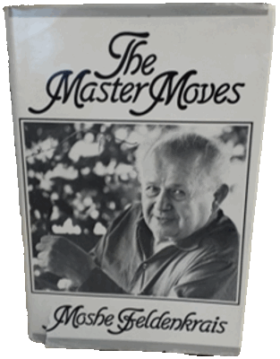

footer: @EvilTester
slidenumbers: true
<!-- deckset footer above-->

<!-- footer: @EvilTester -->
<!-- page_number: true -->

<!--

Logistics: 13:00 - 45 minutes

-->

# How to Test with Agility

## Alan Richardson

* [www.eviltester.com/agile](http://www.eviltester.com/agile)
* [www.compendiumdev.co.uk](http://www.compendiumdev.co.uk)
* [@eviltester](https://twitter.com/eviltester)

<!--

- Agile is not Agility, Testing can have Agility without Agile projects
- Automated Testing
- Exploratory Testing
- End to End Testing

- join it all together so it makes sense as a complete whole

-->

<!--

Confidence

-->

<!--

My aim here is to tell you that I learned to work with Agility rather than work with the Agile Rituals and Definitions. And I learned to trust that working with Agility trumps Rituals and Definitions the hard way. Because sticking to rituals and definitions led to rigidity, rather than agility.

And then "What does testing look like when you adopt that mindset?"

In this presentation you will short cut your learning on the topic of Agility, so you understand "What does testing look like when you adopt an Agility mindset?". Applying this mind set naturally leads to incorporating exploratory testing, technical testing, automated execution, end to end testing and risk. Adopting this mindset allows you to fit into any Agile Software Development project and create a customized testing approach that works.

-->

---

# Confidence

## Do you know how to 'Agile'?

<!--

Strange question. But "Agile" is vague:

Do you know how to:

- develop software with Agile practices?
- develop software with Agile principles?
- develop software with Agility?
- "BE" Agile

Agile is ambiguous. But it is important because it has a capital letter.

-->

---

# Confidence comes with Experience

- Do you know how to work with 'Agility'?
- Do you know multiple ways to perform a task?
- Can you make decisions?
- Can you take responsibility for those decisions?

<!--

Words can confuse us into thinking we do not have experience.

But we do. So simplify the model.

-->

---

# Relentless

> _Relentless - The Japanese way of Marketing by Johny K. Johansson and Ikujiro Nonaka, 1996_

---

# Relentless

## "Marketing by the Japanese, ... , is fundamentally an application of common sense. ...they prefer

- synthesizing over analyzing,
- common words over professional jargon, 
- and simplicity over sophistication."

<!--

> _Relentless - pg 5_

-->

---

# Agility Trumps Agile Compliance

<!--

- Agility can apply to any project format
- Do not conflate Agility with Agile

-->

---

# "...marketing is too important to leave to the professionals. Customers will fall through the cracks between specializations."

> _Relentless - The Japanese way of Marketing by Johny K. Johansson and Ikujiro Nonaka, 1996, pg 7_

---

## To understand how to "Test" with Agility

## we first need to understand "Testing"

---

# What do we get from "Testing"

## Not "Why do we test?"

---

# What do we get from "Testing"

- What do we achieve by testing?
- What do we gain from the process of testing?
- What happens if we do not test?
- etc.

<!--
- What risks can we detect or mitigate by testing?
-->

## What are the outcomes of having Tested.

---

# Q: What do we get from "Testing"

## A: Varies depending on who you ask

| - Confidence | - Bugs |
| - Knowledge | - Assurance |
| - Data | - Information |
| - Automation | - Compliance |
| - Risk Identification | - Risk Mitigation |
| - Change Impact Assessment | - SLA checking |
| - etc. | |

<!--

|  |  |
|---|---|
| - Confidence | - Bugs |
| - Knowledge | - Assurance |
| - Data | - Information |
| - Automation | - Compliance |
| - Risk Identification | - Risk Mitigation |
| - Change Impact Assessment | - SLA checking |
| - etc. | |

-->
ß
---

# Q: How do we gain those results?

## A: Craft an approach to work that delivers those outputs, within and around the development approach.

- Custom, Contextual, Flexible

---

# If Testing was Questioning

- How do we know?
- What evidence do we have?
- What if?
- What else?
- etc.

---

# To answer those questions

- We Model Systems
- Identify and explore risk
- Use appropriate communication
- Compare Models to Systems via experimentation and exploration

... a basic test approach

---

# Test Agility 

- Contextual
- Flexibility of approach
- Responsiveness
- Add value & avoiding waste
- Doing/saying the 'right' thing
- etc.

<!--

- Contextual
    - constraints, wants, needs 
- Flexibility of approach
    - more than one way to do things: planning, documenting, reporting, executing, tooling, avoid templates
- Responsiveness,
    - prioritsation, identify risk, re-plan, cope with  changes
- Add value & avoiding waste
    - do what is required, not what the 'process' mandates 
- Doing/saying the 'right' thing
    - Question, Raise Risks, Elephant in the room 
- etc.

-->

---

## Testing with Agility does not require an Agile project

---

# Agile Projects Force Some Agility

- reduced documentation
- smaller timescales
- less up front information
- test and develop in parallel
- co-located
- etc.

---

# Agile Rituals and Definitions

- 3 Amigos, Standups, Retrospective, Story Points, Stories, Definition of Done
- "Agile", "Devops", "Automation Pyramid", "ATDD", "BDD", "TDD", "Continuous Integration", "Continuous Delivery", "SDET"
- etc.

## Not really a lot about Testing in there

---

# Some seem to be about testing

## But they are not really. 

| - Definition of Done | - Test Driven Development (TDD) |
| - ATDD | - BDD |
| - SDET | - Continuous Integration |

<!--

|   |   |
|---|---|
| - Definition of Done | - Test Driven Development (TDD) |
| - ATDD | - BDD |
| - SDET | - Continuous Integration |

-->

---

# But they do provide some of the gains we associate with testing.

<!--

|   |   |
|---|---|
| - Definition of Done | - TDD |
| - ATDD | - BDD |
| - SDET | - Continuous Integration |

-->

- e.g. Confidence, Assurance, Bugs, Change Impact Assessment, SLA checking, Automation

---

## Testing is not the only way to achieve those gains

---

## So how does testing fit in to Agile?

---

# Working on Agile Projects is hard when we try to "BE" Agile

## Make it easier by

- working flexibly
- use commonsense communication
- trust yourself

---

# Rigidity Examples

- Paralysis
- Beginners know the rituals but exhibit no variety
- Follow the rituals and it will all work out
- Wait for the coach

<!--

*Paralysis*

When I started we tried to 'be' agile by using the rituals but really we wanted to create a good dynamic in the Software Development process.

Improved my skills as a developer to integrate better.

Tested differently using more exploration and technical deep dive.

*Beginners*

People straight out of University or Training might know the rituals but have no flexibility in how you gain the results that the rituals are supposed to provide.

"This is not PROPER Agile"

*Followers*

Delegate responsibility to the rituals. How dow we know it is working? No understanding, means no ability to adapt and evolve.

*Follow the Coach*

Does the coach have Agility or do they help you follow rituals?

Follow based on belief rather than Follow a Leader.

-->

---

## I learned to work with Agility rather than Agile Rituals and Definitions.

---

## Sticking to rituals and definitions led to rigidity, rather than agility.

<!--

Fortunately I learned to work with agility prior to Agile. I gained confidence in my ability to customise my work to meet the demands of the environment.

-->

---

# Focus on Outcomes

## Rather than Processes

<!--

- Is 'this' working?
- Are we getting the results we want?
- How can we improve what we do, to get better results?

rather than

- Are you doing standups?
- Are you holding retrospectives?
- Do you have 3 Amigo Huddles?
- etc.

-->

---

## What is Agile Software Development... Really?

---

## Regularly Release Software That Works and Which Adds Value with each release.

---

# So how do we Test with Agility?

---

# How do we know that we... Regularly Release Software That Works and Which Adds Value with each release

- How do we know it works?
- What does 'works' mean?
   - How do we know it does what it should?
   - How do we know it doesn't do what it shouldn't?
- How do we know it adds value?
- etc.

---

## We can test, to find answers to those questions.

---

# Augment Agile processes with Testing

<!--

Testing becomes part of the Software Development process.

When we think of it as a separate activity we start to lose agility.

-->

---

# What does Agile Software Development Look Like?

- Goals - Epics, Release Planning
- Stories
- Acceptance Criteria
- Development

---

# How might Testing fit into that?

**Goals: Epics, Release Planning**

- Questions, Risks

**Stories**
    
- Questions, Risks,
- Notes on how to test

---

# How might Testing fit into that?

**Acceptance Criteria**

- Questions, Risks,
- Notes on how to test,
- What we will cover,
- What we will not cover

---

# How might Testing fit into that?

**Development**

- Acceptance Criteria Validation,
- Automate Acceptance Criteria Validation for CI,
- Exploratory Testing (based on risk, questions, what we learn from Acc Criteria Validation, etc.)

---

# Who does all of that Testing?

**Anyone, can...**

- Questions, Risks, Notes,
- Acceptance Criteria Validation

## **People with testing skills will do it 'differently'**

---

# Who does all of that Testing?

**People who can code, can...**

- Automate Acceptance Criteria Validation for CI

## **People with testing skills can automate to support 'testing' not just 'validation'**
---

# Who does all of that Testing?

**People who can test, can...**

- Exploratory Testing
- Technical Acceptance Criteria Validation (performance, security, accessibility) 
    
---

# Agility requires utilising skills.

## Not conforming to roles.

We need people who can Test well.

---

## Someone who can Test well, **will see opportunities to Test that other people do not see.**

---

## Someone who can Test well, **will Test Better than other people.**

---

# Give people the time

## **to apply their skills**

---

# Let's Get Hung up on "Automated Testing"

## These are process questions

- Should we automate?
- How much?
- Where? Api? GUI? - Avoid GUI its flaky!
- When?
- Who automates?

---

# Outcome Questions

What questions do we want our "Automated Testing" to answer?

- Does this software continue to work?
- Does this software continue to meet the agreed acceptance criteria?
- etc.

---

## If we care about the answer then we do what it takes to get the answer.

---

# Robust Automated Execution

- Multi-skilled
- Commit
- Re-use the Automated Execution for Exploration as well as Validation
- Part of your project cost and time

**Sometimes it isn't worth the effort.**

---

# Acceptance Criteria Validation is not Enough

- How ambiguous is the Acceptance Criteria?
- Does it cover risk?
- Does it cover impact on previous areas of the system?
- Are the examples 'complete'?

---

# How deep do you have to observe Acceptance Criteria?

- HTTP Traffic?
- Memory Consumption?
- Processor Speed?
- File usage?

---

# Exploratory And Technical Testing

- What if?
- What else?

## Using the results of questioning and observation to improve our model and expand our scope of testing.
 
---

# End To End Testing

- Do we still need to test end to end when we work with Agile?
- Unit Testing is Design and Conformance
- Automated Execution of Feature Flows

---

## **We need Agility**

## We create a customised and tailored process for our organisation

---

- We build a System **Of** Development
- We want the System to work effectively in our environment
- People are part of that System
- We Automate as part of that System
- We Test as part of that System

---

# Agility - Lessons Learned from Cybernetics

<!-- marp image -->
<!--

-->

<!-- deckset image -->

[Cybernetics by Norbert Wiener](https://archive.org/details/CyberneticsOrCommunicationAndControlInTheAnimalAndTheMachineNorbertWiener) - 1948 - [bit.ly/2BA2JqV](http://bit.ly/2BA2JqV)

---

# Agility - Lessons Learned from Cybernetics

* Science of Feedback and Control
* Requisite Variety

- [Cybernetics by Norbert Wiener](https://archive.org/details/CyberneticsOrCommunicationAndControlInTheAnimalAndTheMachineNorbertWiener) - 1948 - [bit.ly/2BA2JqV](http://bit.ly/2BA2JqV)
    - see also Stafford Beer, W. Ross Ashby 

---

# Agility - Lessons Learned from Moshe Feldenkrais

<!-- marp image -->
<!--

-->

<!-- deckset image -->

---

# Agility - Lessons Learned from Moshe Feldenkrais

## "...learning means having at least another way of doing the same thing."

## "Try something you know and learn to do it another way."

> _Moshe Feldenkrais - The Master Moves, 1984_

---

# Agility - Lessons Learned from Moshe Feldenkrais

## "Now, take a minute to try for yourselves anything you want, to see what you could improve in your movement."

> _Moshe Feldenkrais - The Master Moves, 1984_

---

# Individually: Can you Trust Yourself?

- Do you understand the technologies being used?
- Do you know how to test?
- Do you know how to test these technologies?
- Will you speak out?
- Will you ask Questions?

---

## Do you have the necessary skills and attitude?

---

# Culturally: Can you Trust Yourselves?

Agility requires trust in yourself and your team.

- Are you trustworthy?
- Are you skilled?
- Are you experienced?
- Are you flexible?

---

# Working on Agile Projects is hard when we try to "BE" Agile

## Make it easier by

- understanding outcomes
- working flexibly
- use commonsense communication
- trust yourself

---

# Work with Agility

---

# End

Alan Richardson [www.compendiumdev.co.uk](http://www.compendiumdev.co.uk)

- Linkedin - [@eviltester](https://uk.linkedin.com/in/eviltester)
- Twitter - [@eviltester](https://twitter.com/eviltester)
- Instagram - [@eviltester](https://www.instagram.com/eviltester)
- Facebook - [@eviltester](https://facebook.com/eviltester/)
- Youtube - [EvilTesterVideos](https://www.youtube.com/user/EviltesterVideos)
- Pinterest - [@eviltester](https://uk.pinterest.com/eviltester/)
- Github - [@eviltester](https://github.com/eviltester/)
- Slideshare - [@eviltester](http://www.slideshare.net/eviltester)

---

# BIO
 
Alan is a test consultant who works at a technical level using techniques from psychotherapy and computer science. In his spare time Alan is currently programming a [multi-user text adventure game](http://compendiumdev.co.uk/page/restmud), a [Twitter Client](https://chatterscan.com) and some [buggy JavaScript games](http://compendiumdev.co.uk/games/buggygames/) in the style of the Cascade Cassette 50. Alan is the author of the books "[Dear Evil Tester](http://www.eviltester.com/page/dearEvilTester/)", "[Java For Testers](http://javafortesters.com/page/about/)" and "[Automating and Testing a REST API](http://compendiumdev.co.uk/page/tracksrestapibook)". Alan's main website is [compendiumdev.co.uk](http://compendiumdev.co.uk) and he mostly blogs at [blog.eviltester.com](http://blog.eviltester.com)

