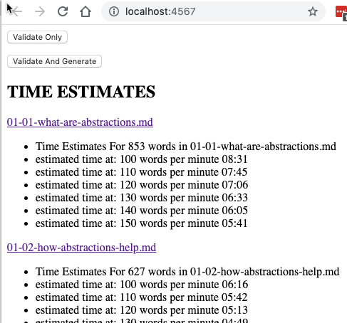
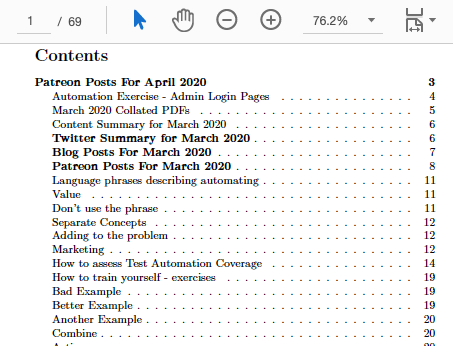

footer: @EvilTester
slidenumbers: true

# Automating Tactically and Strategically

SauceCon 2020

Alan Richardson

- [@EvilTester](https://twitter.com/eviltester)
- [EvilTester.com](https://eviltester.com)
- [compendiumdev.co.uk](https://compendiumdev.co.uk)
- [digitalonlinetactics.com](https://talotics.com)

---

# What is Tactical vs Strategic?

- Tactical
    - for a specific purpose at this point in time, possibly a bit rough around the edges, not necessarily completely robust for everyone
- Strategic
    - being critical to long term aims, maintained and maintainable, agreed and committed to

---

# Some Quick Examples

---

# Video Script Generator

- [github.com/eviltester/scriptgenerator](https://github.com/eviltester/scriptgenerator)

- Generates HTML scripts from DSL
- Tactical support of product development Strategy

---

## DSL

~~~~~~~~
Notes:

a basic script

DO:

set of instructions

SAY:

stuff to say
~~~~~~~~

---

## HTML Output

---

# Tactical Implementation as @Test

---

~~~~~~~~
public class ScriptFormatterTest {

  @Disabled("This is not a build test, this is an adhoc GUI")
  @Test
  public void givenAScriptFolderCreateAHTMLFiles()
  throws IOException {

      ScriptPaths paths = new ScriptPaths();
      paths.readFrom(""); paths.outputTo("");

       //...

      ScriptFormatterProcessor processor =
               new ScriptFormatterProcessor(paths);
      processor.outputAllScripts();

      SimpleWriter writer = newSimpleSystemOutBackedWriter();
      new ProcessorTextReport(writer).output(processor);

      Assertions.assertEquals(0,processor.getErrorReports());
    }
}
~~~~~~~~

---

# Strategic Implementation

- Evolved from `@Test`
- Until 'main' required

---

# Patreon Scraper

- Tactical support of a marketing Strategy
- every month build a pdf from patreon posts
- uses unofficial APIs, web gui, HTTP access
- 'hacked' together code, not releasable to others
- gradually automates more on each run

---

# Shakedown Automation Example

Problem:

- External System changing too fast
- Too many simple bugs
- Find problems after days of testing

---

# Shakedown Automation Example

Hacked together tactical tool to aid test strategy:

- Model based 'shake down' execution
- Runs for hours filling in forms with random data combinations
- Any issues investigated
- If it passes, then we test

---

# A Quick Code Example

from:

- [github.com/eviltester/automationAbstractions](https://github.com/eviltester/automationAbstractions)

---

# Tactical - does not mean no abstractions

---

~~~~~~~~
    @Test
    public void canCreateAToDo(){

        WebDriver driver = new ExecutionDriver().get();
        String siteURL = new TodoMVCSite().getURL();
        driver.get(siteURL);

        int originalNumberOfTodos = driver.findElements(
                 By.cssSelector("ul.todo-list li")).size();

        WebElement createTodo = driver.findElement(
                        By.className("new-todo"));
        createTodo.click();
        createTodo.sendKeys("new task");
        createTodo.sendKeys(Keys.ENTER);

        Assertions.assertTrue(driver.findElement(
                     By.className("filters")).isDisplayed());

        driver.close();
    }
~~~~~~~~

---

# Strategic Code Will Mean Abstractions

---

~~~~~~~~
  @Test
  public void canCreateAToDo(){

      WebDriver driver = new ExecutionDriver().get();
      TodoMVCUser user = new TodoMVCUser(driver,
                                new TodoMVCSite());

      user.opensApplication().and().
              createNewToDo("new task");

      TodoMVCPojoPage page =
                new TodoMVCPojoPage(driver,
                       new TodoMVCSite().getURL());

      assertThat(page.getCountOfTodoDoItems(), is(1));
      assertThat(page.isFooterVisible(), is(true));
     
      ExecutionDriver.closeDriver(driver);
    }
~~~~~~~~

---

# Differences?

- Maintainable
- How much hand holding required
- Risk and Trust
- Commitment to creation
- Reusable
- Readable for more people
- Supports creation

---

# Here are some common issues teams face with Automating illustrated by a Case Study

---

# A Case Study to Illustrate

- Content Management Based Web Site
- Agile Project
- Sprints
- Not Enough Time for Testing
- Automating Only by Test Team
- Automation New for Company
- Automation becomes Tech Debt

---

# Why?

- Beliefs vs Realities
- Rituals vs Agreement

Because "this is what you do on Agile projects"

---

# We did not have a distinction between tactical and strategic

---

# We did not have a distinction between tactical and strategic

- doing strategic work but without strategic commitment
    - automating, stories, sprints, not done
- adopting tactics without knowing the aim (Rituals)
    - poor quality standups, stories, etc.
- our work approach did not fit the reality of the project (Agile Beliefs)

---

# How could a distinction between tactical and Strategic have helped?

Forces us to recognise we are making a decision.

- Automating is full of decisions
- Heuristics are not absolute (YAGNI, DRY)

---

# Strategic

- Long term project
- Agile best fits end user's release needs
- Approach has project commitment, not role (Tester) commitment
- Maintenance of the automated execution long term
- Develop features to support automating and time to automate in sprint

This doesn't really describe the project.

---

# Tactical

- site is a 'one off'
- no real need for 'Agile'
- focus on business requirements, not dev process
- tooling to augment and identify risk manifestation
- automate small chunks not full stories

---

# We did not have a distinction between Strategic and Tactical

## We had "Agile"

---

# Without a distinction there is a risk that we don't make situational decisions.

- "Agile" is not the Context
- "The Project" is the Context

---

# Not a Binary Distinction

> "The distinction between tactical and strategic planning is often made but is seldom made clear. Decisions that appear to be strategic to one person may appear to be tactical to another. This suggests that the distinction is relative rather than absolute."

"A Concept of Corporate Planning", Russell L. Ackoff

---

# Seeking Simpler Distinctions

> "We should blunt our sharp points, and unravel the complications of things;"

_"Tao Teh King", Lao-Tze, Translated by James Legge_

[gutenberg.org/cache/epub/216/pg216.txt](http://www.gutenberg.org/cache/epub/216/pg216.txt)

- Not a binary distinction
- Work to understand and remove complications

<!--

Building our own models an Heuristics is what helps. I can remember my own Mnemonic "MORIM" when I need to.

I need to generalise and keep things simple. And I need to build my own models and understanding of the world.

-->

---

# Something is Tactical until it becomes Strategic

- If the work is tactical then...
    - who cares, go do it.
- But when it become strategic...
    - it will last longer and impact more people/systems and consideration of alternatives becomes more important.

---

## Is this code 'Rubbish' or 'Tactical'

---

~~~~~~~~
@Test
public void canCreateAToDo(){

    WebDriver driver = new ChromeDriver();
    String siteURL = "http://todomvc.com/examples/backbone/"
    driver.get(siteURL);

    int originalNumberOfTodos = driver.findElements(
                  By.cssSelector("ul.todo-list li")).size();

    WebElement createTodo = driver.findElement(
                          By.className("new-todo"));
    createTodo.click();
    createTodo.sendKeys("new task");
    createTodo.sendKeys(Keys.ENTER);

    Assertions.assertTrue(driver.findElement(
               By.className("filters")).isDisplayed());

    int newToDoCount = driver.findElements(
                By.cssSelector("ul.todo-list li")).size();
    Assertions.assertTrue(
              newToDoCount > originalNumberOfTodos);
    driver.close();
}
~~~~~~~~

---

# Cannot tell from code, but it is Sub-Optimal

What is sub-optimal about it?

- no re-use of the driver, or 'site' information across tests
- everything hard coded
- uses low level WebDriver in the test
- assertion doesn't have readable message if something goes wrong
- etc.

---

# Rubbish

What would make this 'rubbish'?

If we had 20+ tests, and they all looked like this.

---

# Why, Rubbish?

- Because we would have to maintain all the tests when URLs or locators change
- Tests require deep familiarity with the application in order to read, let alone maintain
- This is a very small path, a larger path, written in this way would be an incredibly long and hard to maintain test

---

## Tactical

When would this be acceptable for Tactical?

When we decide:

- to take the risk and impact.
- we are not working strategic yet.

<!--

- we know that we will refactor it to abstractions at the point we have repeated code in the tests
- we recognise the sub-optimal limitations of the implementation and have decided, that in the current context of the automated execution process, this is OK
- we recognise that it will need to change in the near future but, YAGNI, we don't need to do it yet
- we know multiple ways that we can improve it
- we know the strategic aims for the automated execution and this is the simplest way to implement them at the moment, building a foundation to build on

-->

---

# Tactical isn't a "Get out of jail free" word, to justify a long term sub-optimal approach.

---

# How can this distinction help?

---

# Forces Decision Making

- Is this Tactical or Strategic?
- Different
   - Attitude
   - Expectations
   - Agreements

---

# Tech Debt: stuff we should have done, but we didn't because we took a tactical approach, and we hope it won't bite us later.

---

# Tech Debt is not Strategic

Prioritising tactically, is OK for activities not part of Strategic path.

But, many of them are, and it is those ones that we have to go back and pick up the pieces for.

---

# keep that distinction " Strategic / Tactical" in mind

> "I think, that if I can keep that distinction " Strategic / Tactical" in mind when I perform my processes and daily tasks it will hopefully remind me to tidy up more after the strategic activities, and delete more after the tactical activities."

---

# "Quality is everyone's responsibility"

- Strategy is agreed across all systems
- Automation fails when strategic for 'testing' but not for 'the project'
- Tactics work best when implemented by skilled staff
- Strategic allows building up everyone's capability to contribute
- Strategic requires working together

---

# Impact on my work

---

# Start Tactical - Refactor to Strategic

- Start with off the shelf tool
- Script in tool or customise
- Hack out something in an @Test
- Experiment
- Each time I run, revisit the code I refactor
- The more it is used, the more strategic it becomes

---

# Tactical vs Strategic

- Distinction to force Decisions
- Tactical can Evolve To Strategic
- Tactical supports more experimentation
- Strategic requires Commitment
- Tactics can be used within a Strategy
- Not about "Abstractions", it is about Decisions
- Decision and Reality based vs Belief and Ritual Based

---

# Tactical vs Strategic

## A distinction to force decision making based on the reality of the situation, not our beliefs about the situation.

---

# Alan Richardson

- [@EvilTester](https://twitter.com/eviltester)
- [EvilTester.com](https://eviltester.com)
- [compendiumdev.co.uk](https://compendiumdev.co.uk)
- [digitalonlinetactics.com](https://talotics.com)

---

# Agile is a Strategic Approach

- to support frequent
   - releases
   - communication
   - value delivery

Requires commitment to agreed practices.

- testing in sprint
- automating in sprint

---

## Tactical Sub-Optimisation

When would this be acceptable for Tactical?

- we know that we will refactor it to abstractions at the point we have repeated code in the tests
- we recognise the sub-optimal limitations of the implementation and have decided, that in the current context of the automated execution process, this is OK

---

## Tactical Sub-Optimisation

- we recognise that it will need to change in the near future but, YAGNI, we don't need to do it yet
- we know multiple ways that we can improve it
- we know the strategic aims for the automated execution and this is the simplest way to implement them at the moment, building a foundation to build on

---

# Informal APIs == Tactical

- Marketing Automation
- Daily Life Automation
- Uses a lot of 'informal' 'reverse engineered' APIs
- High Risk
- Requires Review and Hand Holding

---

# Decisions about Tactical vs Strategic

Recognise when tool / code/ automating becomes strategic

- Add more Unit Tests
- Put into CI
- Refactor to refine Architecture
- Identify corners cut

---

# Perform Less Upfront Design

- Experiment
- Multiple approaches
- MVP with code wrapped in @Test
    - 'main' very late in the day

---

# Software Development is Problem Solving

A set of problem solving decisions.

---

> "The four ways of treating problems are Absolution, Resolution, Solution and Dissolution. They form a hierarchy of value, in which Dissolution is the most valuable."

- Russell Ackoff - Idealized Design - page 117

---

# Ackoff's Four Ways

- Absolution - ignoring, view it not as a problem
- Resolving - doing something so it goes a way
- Solution - stopping it and understanding how
- Dissolution - changing the approach so it never happens again

---

# Tactical vs Strategic

- Tactical
    - Absolution
    - Resolving
- Strategic
    - Solution
    - Dissolution

---

# Problem

---

# Problem Solving Tactically

- Absolution - not an option

---

# Tactical - make it up as I go along

- Panic
- Resolve
- Hack out a solution to immediate problem
- Fix and Go Forward
- Looks OK, release
- Later fix other problems when identified
- Solve after many resolutions haven't properly worked

---

# Problem Solving Strategically

- Resolve
    - Revert - already have agreed immediate response
- Solve
    - Have time because of Resolution
    - Identify root problem
    - Identify Solutions
    - Implement Solution

---

# Problem Solving Strategically

- Dissolve
    - Identify change to ensure never happens again
    - Implement change

    

   

---

# Automating Tactically

---

# What can I do that will give me an edge?

---

# Tools

- Essential
   - Observation, Interrogation, Manipulation
   - Technology Level
- Augment
   - How can I ...?
       - spot problems easily?
       - create test data easily?
       - restore app to specific state?       

---

# Prefer Flexible Tools

- Don't want to be limited by tool
    - Scriptable e.g. dev console, freeplane groovy
    - Parseable e.g. JSON/XML output file format
    - Generatable e.g. auto create input format Graphviz
- Multiple tools to have a choice e.g. Zap + Fiddler

---

# No Tech Debt

We build knowing it is:

- inefficient
- ugly
- hard to maintain
- risky

---

# Benefits

- fast
- adhoc
- collaborative problem solving
- challenging

---

# Refactor to Abstractions

Initially the abstractions start off adding very little value but over time:

- simplified code is easier to work with
- easier to automate the API layers
- opportunities for new System functionality

... even when working tactically.

---

# Goal Based Strategic Planning

Goal

- Why?
    - How?
        - Actions

---

# My Goals, and Why statements are Strategic.

- Goal - automatically check if app deployed successfully
    - Why? - prevent wasting time exploring if not ready, detect config changes

My Why? statements “in order to”  bridge gap between Goal and Guide prioritising How options.

---

# How?

My How statements are Tactical options that make sense at the time. In support strategic goals.

---

# Actions

My actions are MVP Tactical options which can help me test additional Strategic goals.

---

# Goal Based Strategic Planning

Goal

- Why?
    - How?
        - Actions

- Goal and Why? are often the same - fix the problem, do this thing
- How and Actions are often the same thing. Identify, Try, Use.

---

# Tactical vs Strategic Mistakes

---

# Too Strategic too Fast

- often jump to a solution, rather than identify a goal
- often pursue an interesting path, rather than fix a problem

---

# "We need a framework"

- evolve based on common use cases
- multiple tactical experiments
- agree on most appropriate
- refactor
- support all use cases
- support adhoc

---

# "We need to run tests in parallel"

- or run the 'job' in parallel
- or split into multiple jobs
- is the goal "parallel" or "less time"?
- keep as a possible future goal that tactics should not prevent

---

# "We need a grid system"

- for everything?
- self build
- or run on spare machines
- or run less on specific browsers

---

# Others

- "We need to run all tests on every branch"
- "We need to run on all browsers"

---

# Avoid

- Be clear on the Goal
- Is this strategic or solving a problem?
- Is the time spent worth it?
- Is everyone involved? Why not?

---

# Easy Mistake to Make

- build more support code than execution code
- more code than coverage warrants
- automating strategically when could have been tactical

---

# Keep distinction in mind

- Tactical vs Strategic
- Can't follow every whim

---

# Moving from Tactical to Strategic

---

# When?

- More peple using
- More people contributing
- "Risk" starting to outweigh Benefit
   - too much hand holding
   - multiple languages
   - too many tools

---

# Different Skill Sets

Prefer Training before:

- GUI
- Framework
- Easy to code language
    - e.g. Scripting, Ruby, Python, DSL, Excel

Don't Dumb Down. Skill Up.

---

# Spread Beyond Team

---

# Example

- When Testing a CMS
- Shell script wrapping imageMagick
- Drag image. Create multiple sizes.
- Tactical - supported me
- Strategic - created help and instructions, distributed

---

# Example

- Used by Dev Team
- Dev Manager "the programmers have written this, it might help your team"

---

# Don't be precious

- Strategic requires shared ownership

---

> " There is no limit to what a man can do or where he can go if he doesn’t mind who gets the credit."

---

> When the Master governs, the people
are hardly aware that he exists.

> The Master doesn't talk, he acts.
When his work is done,
the people say, "Amazing:
we did it, all by ourselves!”

― Lao-Tzu, Tao Te Ching

---

# Open Source It

- Github
- Blog

---

# Refactor to Strategic

- organically
- as it is used

---

# Rewrite

- Better be for Strategic reasons
- Ensure existing tactical flaws do not carry forward

---

# Strategic Choices

Distribute:

- pre-built, or source?
- library or framework?

---

# Strategic Hack

- mono repo
- maven multi project hacks
- avoiding distribution of libraries
- avoiding artifact management

---

# Tactical can become strategic

- Organically
- Refactored
    - architected, and tested
- Controlled
- Managed
- Collaborative

---

# Unused

---

The way I recommend projects that I work with do this is as follows:

- class based API data objects
- create and use a class based API which returns data objects
- class based API using message objects
- create a class based API which returns message objects
- add routing around the class based message API
- use the routing API

---

Which means.

- create a class which represents the data in an API message response, and use this in your code and start decoupling
- create a class which represents the API, but it returns the data objects, start to use this instead of the objects directly
- create a class which represents the HTTP messages, and the data objects are contained within these
- create an API class to return message objects with the data objects (this may use the data API, or it may replace it)
-  add routing around the class based message API and deserialise the message objects in the responses
- start using the routing API

---

# Heuristics and Mnemonics and Techniques and Patterns

YAGNI, Liskov substitution principle, etc.

https://www.testmakker.dk/2019/03/30/testing-mnemonics/

Create an animated gif of scrolling the above page

<!--

I can't remember all the heuristics and mnemonics and techniques and patterns that I'm probably supposed to know if I'm a professional.

Chances are your favourite mnemonic isn't even listed in the above page.

There is so much stuff we are supposed to know. So much terminology.

-->

---

## Alan Richardson

- @EvilTester
- EvilTester.com
- compendiumdev.co.uk
- digitalonlinetactics.com

---

# Blurb

One of the biggest concepts that has made a difference to my programming and automating is the concept of "Tactical Vs Strategic". Tactical being for a specific purpose, possibly a bit rough around the edges, not necessarily completely robust for everyone, etc.. And Strategic being critical to long term aims, maintained and maintainable, etc. In this talk I will provide examples of both strategic and tactical automating for activities as diverse as supporting testing, marketing and general life. We will also consider how and when to move from automating tactically to strategically. And how the concept has helped me change my programming style and how I write code.
