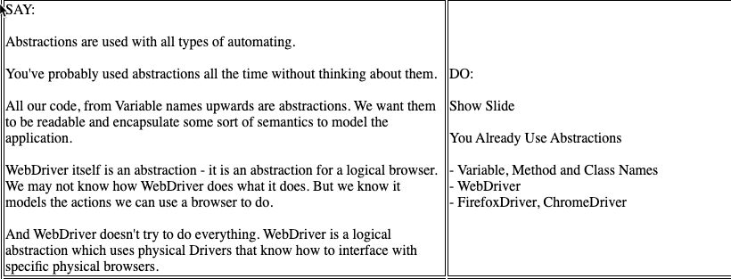
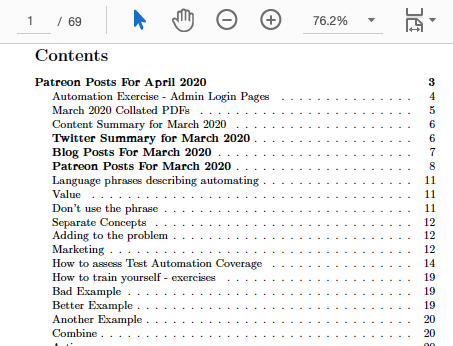

footer: @EvilTester
slidenumbers: true

# Automating Tactically and Strategically

SauceCon 2020

Alan Richardson

- [@EvilTester](https://twitter.com/eviltester)
- [EvilTester.com](https://eviltester.com)
- [compendiumdev.co.uk](https://compendiumdev.co.uk)
- [digitalonlinetactics.com](https://talotics.com)

---

# What is Tactical vs Strategic?

- Tactical
    - for a specific purpose at this point in time, possibly a bit rough around the edges, not necessarily completely robust for everyone
- Strategic
    - being critical to long term aims, maintained and maintainable, agreed and committed to

---

# Some Quick Examples

---

# Video Script Generator

- [github.com/eviltester/scriptgenerator](https://github.com/eviltester/scriptgenerator)

- Generates HTML scripts from DSL
- Tactical support of product development Strategy

---

## DSL

~~~~~~~~
Notes:

a basic script

DO:

set of instructions

SAY:

stuff to say
~~~~~~~~

---

## HTML Output

---

# Tactical Implementation as @Test

---

~~~~~~~~
public class ScriptFormatterTest {

  @Disabled("This is not a build test, this is an adhoc GUI")
  @Test
  public void givenAScriptFolderCreateAHTMLFiles()
  throws IOException {

      ScriptPaths paths = new ScriptPaths();
      paths.readFrom(""); paths.outputTo("");

       //...

      ScriptFormatterProcessor processor =
               new ScriptFormatterProcessor(paths);
      processor.outputAllScripts();

      SimpleWriter writer = newSimpleSystemOutBackedWriter();
      new ProcessorTextReport(writer).output(processor);

      Assertions.assertEquals(0,processor.getErrorReports());
    }
}
~~~~~~~~

---

# Strategic Implementation

- Evolved from `@Test`
- Until 'main' required

---

# Patreon Scraper

- Tactical support of a marketing Strategy
- every month build a pdf from patreon posts
- uses unofficial APIs, web gui, HTTP access
- 'hacked' together code, not releasable to others
- gradually automates more on each run

---

# Shakedown Automation Example

Problem:

- External System changing too fast
- Too many simple bugs
- Find problems after days of testing

---

# Shakedown Automation Example

Hacked together tactical tool to aid test strategy:

- Model based 'shake down' execution
- Runs for hours filling in forms with random data combinations
- Any issues investigated
- If it passes, then we test

---

# A Quick Code Example

from:

- [github.com/eviltester/automationAbstractions](https://github.com/eviltester/automationAbstractions)

---

# Tactical - does not mean no abstractions

---

~~~~~~~~
    @Test
    public void canCreateAToDo(){

        WebDriver driver = new ExecutionDriver().get();
        String siteURL = new TodoMVCSite().getURL();
        driver.get(siteURL);

        int originalNumberOfTodos = driver.findElements(
                 By.cssSelector("ul.todo-list li")).size();

        WebElement createTodo = driver.findElement(
                        By.className("new-todo"));
        createTodo.click();
        createTodo.sendKeys("new task");
        createTodo.sendKeys(Keys.ENTER);

        Assertions.assertTrue(driver.findElement(
                     By.className("filters")).isDisplayed());

        driver.close();
    }
~~~~~~~~

---

# Strategic Code Will Mean Abstractions

---

~~~~~~~~
  @Test
  public void canCreateAToDo(){

      WebDriver driver = new ExecutionDriver().get();
      TodoMVCUser user = new TodoMVCUser(driver,
                                new TodoMVCSite());

      user.opensApplication().and().
              createNewToDo("new task");

      TodoMVCPojoPage page =
                new TodoMVCPojoPage(driver,
                       new TodoMVCSite().getURL());

      assertThat(page.getCountOfTodoDoItems(), is(1));
      assertThat(page.isFooterVisible(), is(true));
     
      ExecutionDriver.closeDriver(driver);
    }
~~~~~~~~

---

# Differences?

- Maintainable
- How much hand holding required
- Risk and Trust
- Commitment to creation
- Reusable
- Readable for more people
- Supports creation

---

# Here are some common issues teams face with Automating illustrated by a Case Study

---

# A Case Study to Illustrate

- Content Management Based Web Site
- Agile Project
- Sprints
- Not Enough Time for Testing
- Automating Only by Test Team
- Automation New for Company
- Automation becomes Tech Debt

---

# Why?

- Beliefs vs Realities
- Rituals vs Agreement

Because "this is what you do on Agile projects"

---

# We did not have a distinction between tactical and strategic

---

# We did not have a distinction between tactical and strategic

- doing strategic work but without strategic commitment
    - automating, stories, sprints, not done
- adopting tactics without knowing the aim (Rituals)
    - poor quality standups, stories, etc.
- our work approach did not fit the reality of the project (Agile Beliefs)

---

# How could a distinction between tactical and Strategic have helped?

Forces us to recognise we are making a decision.

- Automating is full of decisions
- Heuristics are not absolute (YAGNI, DRY)

---

# Strategic

- Long term project
- Agile best fits end user's release needs
- Approach has project commitment, not role (Tester) commitment
- Maintenance of the automated execution long term
- Develop features to support automating and time to automate in sprint

This doesn't really describe the project.

---

# Tactical

- site is a 'one off'
- no real need for 'Agile'
- focus on business requirements, not dev process
- tooling to augment and identify risk manifestation
- automate small chunks not full stories

---

# We did not have a distinction between Strategic and Tactical

## We had "Agile"

---

# Without a distinction there is a risk that we don't make situational decisions.

- "Agile" is not the Context
- "The Project" is the Context

---

# Not a Binary Distinction

> "The distinction between tactical and strategic planning is often made but is seldom made clear. Decisions that appear to be strategic to one person may appear to be tactical to another. This suggests that the distinction is relative rather than absolute."

"A Concept of Corporate Planning", Russell L. Ackoff

---

# Seeking Simpler Distinctions

> "We should blunt our sharp points, and unravel the complications of things;"

_"Tao Teh King", Lao-Tze, Translated by James Legge_

[gutenberg.org/cache/epub/216/pg216.txt](http://www.gutenberg.org/cache/epub/216/pg216.txt)

- Not a binary distinction
- Work to understand and remove complications

<!--

Building our own models an Heuristics is what helps. I can remember my own Mnemonic "MORIM" when I need to.

I need to generalise and keep things simple. And I need to build my own models and understanding of the world.

-->

---

# Something is Tactical until it becomes Strategic

- If the work is tactical then...
    - who cares, go do it.
- But when it become strategic...
    - it will last longer and impact more people/systems and consideration of alternatives becomes more important.

---

## Is this code 'Rubbish' or 'Tactical'

---

~~~~~~~~
@Test
public void canCreateAToDo(){

    WebDriver driver = new ChromeDriver();
    String siteURL = "http://todomvc.com/examples/backbone/"
    driver.get(siteURL);

    int originalNumberOfTodos = driver.findElements(
                  By.cssSelector("ul.todo-list li")).size();

    WebElement createTodo = driver.findElement(
                          By.className("new-todo"));
    createTodo.click();
    createTodo.sendKeys("new task");
    createTodo.sendKeys(Keys.ENTER);

    Assertions.assertTrue(driver.findElement(
               By.className("filters")).isDisplayed());

    int newToDoCount = driver.findElements(
                By.cssSelector("ul.todo-list li")).size();
    Assertions.assertTrue(
              newToDoCount > originalNumberOfTodos);
    driver.close();
}
~~~~~~~~

---

# Cannot tell from code, but it is Sub-Optimal

What is sub-optimal about it?

- no re-use of the driver, or 'site' information across tests
- everything hard coded
- uses low level WebDriver in the test
- assertion doesn't have readable message if something goes wrong
- etc.

---

# Rubbish

What would make this 'rubbish'?

If we had 20+ tests, and they all looked like this.

---

# Why, Rubbish?

- Because we would have to maintain all the tests when URLs or locators change
- Tests require deep familiarity with the application in order to read, let alone maintain
- This is a very small path, a larger path, written in this way would be an incredibly long and hard to maintain test

---

# Tactical

When would this be acceptable for Tactical?

When we decide:

- to take the risk and impact.
- we are not working strategic yet.

<!--

- we know that we will refactor it to abstractions at the point we have repeated code in the tests
- we recognise the sub-optimal limitations of the implementation and have decided, that in the current context of the automated execution process, this is OK
- we recognise that it will need to change in the near future but, YAGNI, we don't need to do it yet
- we know multiple ways that we can improve it
- we know the strategic aims for the automated execution and this is the simplest way to implement them at the moment, building a foundation to build on

-->

---

# Tactical isn't a "Get out of jail free" word, to justify a long term sub-optimal approach.

---

# How can this distinction help?

---

# Forces Decision Making

- Is this Tactical or Strategic?
- Different
   - Attitude
   - Expectations
   - Agreements

---

# Tech Debt: stuff we should have done, but we didn't because we took a tactical approach, and we hope it won't bite us later.

---

# Tech Debt is not Strategic

Prioritising tactically, is OK for activities not part of Strategic path.

But, many of them are, and it is those ones that we have to go back and pick up the pieces for.

---

# keep that distinction " Strategic / Tactical" in mind

> "I think, that if I can keep that distinction " Strategic / Tactical" in mind when I perform my processes and daily tasks it will hopefully remind me to tidy up more after the strategic activities, and delete more after the tactical activities."

---

# "Quality is everyone's responsibility"

- Strategy is agreed across all systems
- Automation fails when strategic for 'testing' but not for 'the project'
- Tactics work best when implemented by skilled staff
- Strategic allows building up everyone's capability to contribute
- Strategic requires working together

---

# Impact on my work

---

# Start Tactical - Refactor to Strategic

- Start with off the shelf tool
- Script in tool or customise
- Hack out something in an @Test
- Experiment
- Each time I run, revisit the code I refactor
- The more it is used, the more strategic it becomes

---

# Tactical vs Strategic

- Distinction to force Decisions
- Tactical can Evolve To Strategic
- Tactical supports more experimentation
- Strategic requires Commitment
- Tactics can be used within a Strategy
- Not about "Abstractions", it is about Decisions
- Decision and Reality based vs Belief and Ritual Based

---

# Tactical vs Strategic

## A distinction to force decision making based on the reality of the situation, not our beliefs about the situation.

---

# Alan Richardson

- [@EvilTester](https://twitter.com/eviltester)
- [EvilTester.com](https://eviltester.com)
- [compendiumdev.co.uk](https://compendiumdev.co.uk)
- [digitalonlinetactics.com](https://talotics.com)
