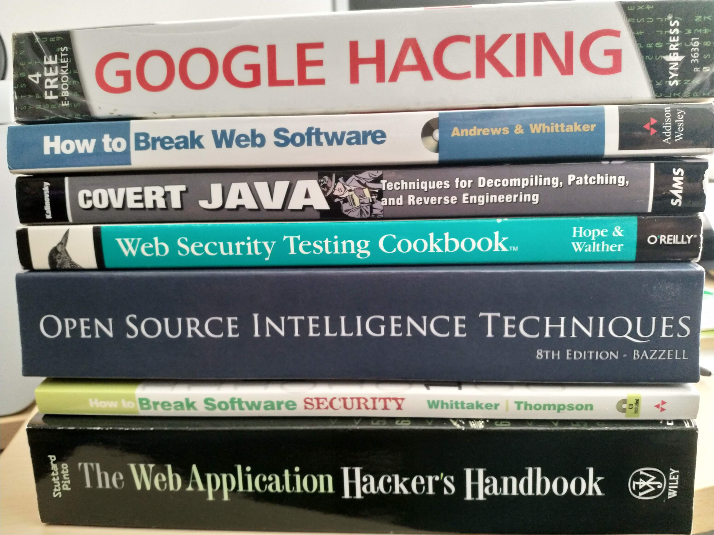
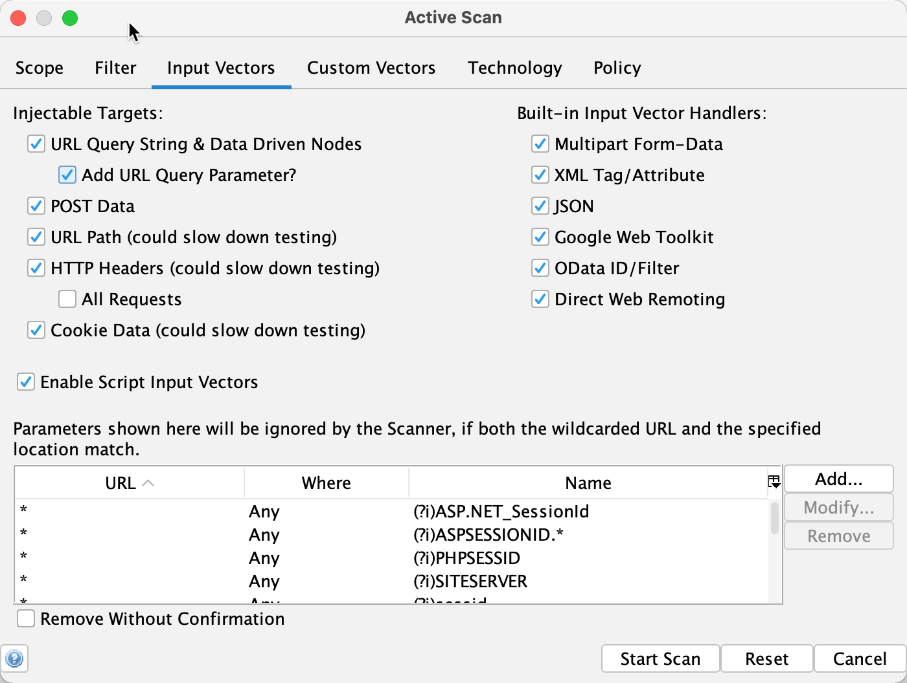
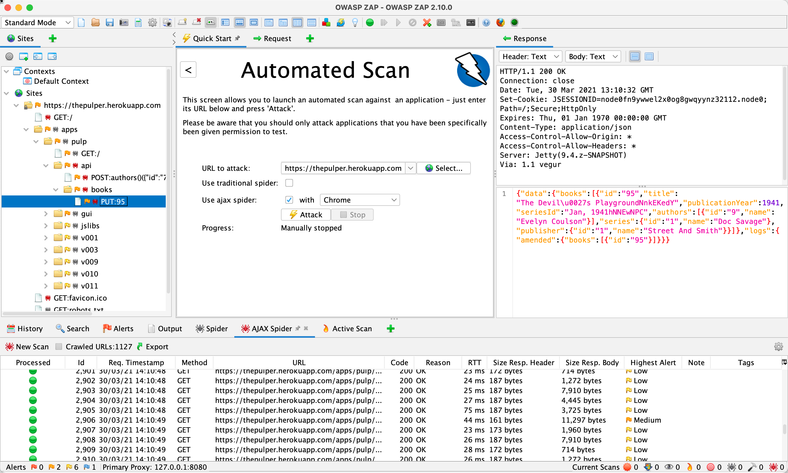

footer: @EvilTester
slidenumbers: true
<!-- page_number: true -->

# Adding more Security To your Testing and Automating

## Saucecon 2021, Alan Richardson

## [@EvilTester](https://twitter.com/eviltester), [EvilTester.com](https://eviltester.com)

---

# Security Testing:

## - a highly technical set of skills,
## - a wide domain of knowledge,
## - a long time to learn and practice.

---

# Any Hacks for doing more faster?

---

There are hacks for doing it faster.

They will still take work.


---

# Yes.

#  Augment and Extend our current approaches.

---

We don't have to add 'Security Testing' as a discipline and set of skills. There is a lot of overlap between  Testing and Automating, so all we have to do is extend into that overlap to gain some immediate benefit.


---

# That doesn't mean you shouldn't learn Security Testing

## It just isn't the fastest way to add security into your process

---

# I did learn Security Testing (Some)

## Loved it. Interesting. Challenging. Deep Dive into Technology.

---

# Because I could Test & Automate & Code

## I could see overlap and natural extensions.

---

# A Natural Extension to Technical Exploratory Testing

If you are already:

- Using Dev Tools.
- Using Proxies.
- Reading HTML & JS.
- Pushing the Edge Cases.
- Bypassing the validation.
- etc.

---

# A Natural Extension to Automating

If you are already:

- Writing reusable Abstraction Layers.
- Combining Libraries and tools.
- Data Parameterising your Execution paths.
- Auto Generating Test Data.
- Monitoring Logs.
- etc.

---

# On Learning Security Testing

## You already know the technology.
## Next learn vulnerabilities and exploits.



---

# RoadMaps

- [portswigger.net/web-security](https://portswigger.net/web-security)
- [www.hacker101.com](https://www.hacker101.com)
- [github.com/sundowndev/hacker-roadmap](https://github.com/sundowndev/hacker-roadmap)
- [github.com/onlurking/awesome-infosec](https://github.com/onlurking/awesome-infosec)
- [github.com/ericpqmor/security-study-plan](https://github.com/ericpqmor/security-study-plan)

---

# Practice

- Bug Bounties:
   - [hackerone.com](https://hackerone.com)
   - [bugcrowd.com](https://bugcrowd.com)
   - [yeswehack.com](https://yeswehack.com)
- [OWASP Vulnerable Web Applications Directory](https://owasp.org/www-project-vulnerable-web-applications-directory)

---

# But... this all takes a lot of time

---

# How can we add more security to our Testing and Automating?

---

# What does more Security mean?

- More secure system.
- More Job Security.
- More trust in our automated execution.
- More chance of finding security issues early.

---

# Does that mean we have to "Shift Left"?

## I do not like the term "shift left".

---

# I do not want to shift left.

I just want to... test.

And do it at the time that's best.

In a dev process where testing's enmeshed.

---

# I do not want to shift right.

I want a process that brings all problems to light.

"Secure Software" is not a sound bite.

Quality Software is Secure, and built with foresight.

---

# P.S. my book of Children's Poetry is available now:

## [thereAreHats.com](https://therearehats.com)


---

#  What makes Testing and Security Testing hard?

- Where to aim?
- When to stop?
- Unknowns.

---

- One of the hard parts of security testing is to know where to aim, and when to stop.
- Understanding Secure Coding can help.
- e.g. PHP has multiple commands for SQL mysqli::query and mysqli::multi_query (not possible to inject a new command "' or true; DROP TABLES;" with query, but it is with multi_query) we may not know what command they are using, but we need to know the basic scope.

Penetration Testing, Security Testing - like all ‘testing’ is the most expensive way to try and add quality attributes into your project because it is filled with unknowns and doesn’t ‘add’ quality it ‘reveals’ issues.

Unknowns?

- Have you done enough? I don’t know. (IDK)
- Have you found all the security issues? IDK
- Is it free from exploits? IDK


---

# Chasing unknowns is expensive

## Important, but expensive.

---

# Building in - is easier to answer

- Have you added coverage of SQL Injection? Y/N
- Has the coverage been reviewed by AppSec? Y/N
- Have you fuzzed it with common SQL Injection Payloads? Y/N
- Any issues found from that? Y/N

Explore gaps in the coverage where Unknowns still exist.


This then allows the exploratory Penetration and Security Testing to hunt for gaps in the coverage where Unknowns still exist.


---

# Security Do's, Don'ts

---

# Security Do's, Don'ts

- Do not reduce the security of your application to make it easier to test
    - e.g. automatable captchas, url param config (`?nocaptcha=true`)
- Do internalize your test environment
    - unsecured test environments on easy to find subdomains
- Do secure your test environment if public
- Do not share production services with test environments


- I was once able to use a 'live' test environment to see all production user details
- e.g. authentication on test applies to live


---

# Risks to Consider

- Security risks of live testing
    - test users with extensive permissions
    - test users with easy to guess usernames and passwords
    - leaving test users lying around in the environment
- Using Security Testing Tools without knowing Security Testing
    - using proxies, how they help, what they teach
    - using proxies to automate e.g. fuzzers

---

# Add additional tooling to augment existing testing and automating

---

# Tooling

- Adding passive security testing into your process
    - Running automated API/GUI execution through a security proxy
    - Exploratory Testing through a proxy
         - proxy config browsers and API tooling
- OWasp ZAP can passively scan traffic we proxy through
    - But can also scan using WebDriver
- Static Analysis, SAST:  scanning


- Running the automated execution through a proxy that does passive scanning e.g. example of running tests through Owasp Zap proxy
Combining Existing security testing tools with automation?


---

# Proxy Tool Scanning

- Point all test traffic through a proxy
- It 'passively' scans as you test
- check the results
- run an active scan later
- check the results

---

# Running Proxy With Selenium

- Install Owasp ZAP
- Configure browsers with the Dynamic Certificate
- Configure Selenium To Run with Proxy

---

# Running Proxy With Selenium

```
Proxy proxy = new Proxy();
proxy.setHttpProxy("127.0.0.1:8080");
proxy.setSslProxy("127.0.0.1:8080");
ChromeOptions options = new ChromeOptions();
options.setCapability("proxy", proxy);
driver = new ChromeDriver(options);
```

---

# OWASP ZAP

- Passive Scan for Vulnerabilities
- Build Sitemap during scan (visited, found)
- Active Scan - crawls and adds params
- Save session file as 'proof' of coverage
- Inspect sitemap for missing coverage

---

# Active Scan Config

---



---

# Using Proxy Tools for Exploratory Testing

- Feed your browsers/API Tooling through proxy
- Test
- Revisit requests made, study, fuzz
- Save session file as 'proof' of coverage
- AJAX Spider - uses WebDriver to 'crawl' site in browser
- Fuzz Individual requests

---



<!--

http://docs.w3af.org/en/latest/install.html

-->

---

# Proactive steps to improve security that are easier to adopt than learning to Hack

---

# Learn basic secure coding

Gotchas related to the languages and libraries in use:

- Static Analysis tooling can help with this
- 1 vulnerability in your code can be exposed by 100 'hacking approaches'
- 1 vulnerability might be fixable with 1 change

---

# Learn to spot what causes the issues


- Learning basic secure coding gotchas related to the languages in use
- Hacking is harder to learn than secure coding
    - 1 vulnerability in your code can be exposed by 100 'hacking approaches'
    - 1 vulnerability might be fixable with 1 change
    - Hackers have to work hard to find and exploit a vulnerability
    - Hackers are working 'blind'
    - Simple Secure Coding means understanding some of the vulnerabilities associated with the language or the libraries and using agreed patterns to avoid those vulnerabilities.
    - These can be learned, we can learn to review for them, there is tooling that can help identify them and enforce them.


---

# Security Testing Lessons learned to improve our automating

We use Direct Object Reference to make our automating faster.

- IDOR - Insecure Direct Object References

We parameterize our automated execution.

- Fuzzing with insecure payloads


- Security Testing Lessons learned to improve our automating
    - Very often we learn 'Hacking' or 'Security Testing' as a means in itself
    - The fastest way to add value from learning to Hack is to incorporate the lessons or techniques into the process as fast as possible.
    - IDOR - Insecure Direct Object References
        - https://portswigger.net/web-security/access-control/idor
        - Or... hitting a URL directly without permissions
        - we already DOR this
            - jump into the middle of applications and skipping flow

If we do this, we can check that we can only do it with the right permissions.


- IDOR - Insecure Direct Object Reference
- Direct Object Reference is a perfectly valid way to make tests faster e.g. once we have a cookie, jump directly to the place in the application rather than navigate. Once we have an abstraction that does this, it would be easy to add an 'invalid' cookie or a logged out cookie, or a cookie for a user without permissions and ensure they don't have access.


---

# Evaluate your Automating and Testing for Security

- Does your automation setup users, permissions, data easily?
- What are the security controls around that?
- Can anyone do it? == Insecure
- What permissions do you need? == Principle of least Privilege
- Do you mix HTTP and GUI? How? Sharing cookies? API headers? Is API access same as GUI access? How long do cookies/headers remain valid for?

Extend existing automating to cover.

---

# Adding More Security

- Security Testing is great to learn, but takes time.
- Overlap between Security Testing, Exploratory Testing, Automating
- Same tooling used
- Add to existing process.
- Finding issues in code, is easier than finding them in running app.

---

# Security Testing is a means to an end.

## We can start at the source, then augment and extend.

---

# Roll The End Credits...

---

## Learn to "Be Evil"

* [www.eviltester.com](http://www.eviltester.com)
* [@eviltester](https://twitter.com/eviltester)
* [www.youtube.com/user/EviltesterVideos](https://www.youtube.com/user/EviltesterVideos)

---

## About Alan Richardson

* [www.compendiumdev.co.uk](http://www.compendiumdev.co.uk)
* [uk.linkedin.com/in/eviltester](http://uk.linkedin.com/in/eviltester)


---

## Follow

- Linkedin - [@eviltester](https://uk.linkedin.com/in/eviltester)
- Twitter - [@eviltester](https://twitter.com/eviltester)
- Instagram - [@eviltester](https://www.instagram.com/eviltester)
- Facebook - [@eviltester](https://facebook.com/eviltester/)
- Youtube - [EvilTesterVideos](https://www.youtube.com/user/EviltesterVideos)
- Pinterest - [@eviltester](https://uk.pinterest.com/eviltester/)
- Github - [@eviltester](https://github.com/eviltester/)
- Slideshare - [@eviltester](www.slideshare.net/eviltester)

---

## BIO
 
Alan is a test consultant who enjoys testing at a technical level using techniques from psychotherapy and computer science. In his spare time Alan is currently programming a [multi-user text adventure game](http://compendiumdev.co.uk/page/restmud) and some [buggy JavaScript games](http://compendiumdev.co.uk/games/buggygames/) in the style of the Cascade Cassette 50. Alan is the author of the books "[Dear Evil Tester](http://www.eviltester.com/page/dearEvilTester/)", "[Java For Testers](http://javafortesters.com/page/about/)" and "[Automating and Testing a REST API](http://compendiumdev.co.uk/page/tracksrestapibook)". Alan's main website is [compendiumdev.co.uk](http://compendiumdev.co.uk) and he blogs at [blog.eviltester.com](http://blog.eviltester.com)

---

# Related Reading & Videos

- [Integrating E2E and Application Security Testing](https://abhaybhargav.medium.com/integrating-e2e-and-application-security-testing-howto-with-nightwatchjs-and-owasp-zap-8240c540c524) by Abhay Bhargav
- [Confessions of an Accidental Security Tester](https://www.eviltester.com/conference/oredev2014_conference/) by Alan Richardson
