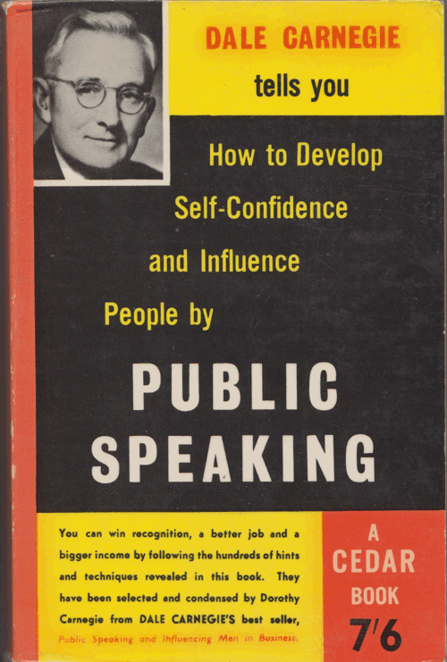
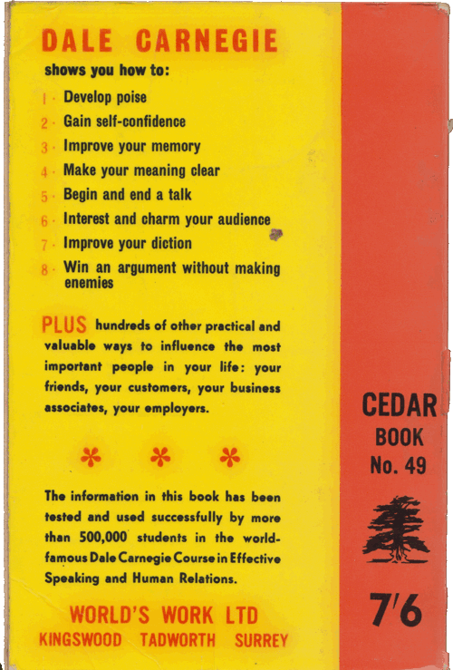

<!-- footer: @EvilTester -->
<!-- page_number: true -->

# Learning In Public

## A "How to" Public Speaking Workshop
## Sigist September 2017
## Alan Richardson

* [www.eviltester.com](http://www.eviltester.com)
* [www.compendiumdev.co.uk](http://www.compendiumdev.co.uk)
* [@eviltester](https://twitter.com/eviltester)

---

# Synopsis

Glossophobia, the fear of public speaking, usually ranks pretty high on surveys of 'what people fear'. And for good reason. We've all attended conferences where the keynote speakers were seriously injured after being hit by a torrent of rolled up feedback forms, or speakers were left bleeding from a rain of plastic name badges thrown Shuriken-like by the Ninja trained attendees.

---

# Synopsis

You can learn to avoid these outcomes, and when you do, you gain a skill that will win you recognition, improve your job prospects and allow you to travel the world talking to fellow testers.

---

# Synopsis

|  Dale Carnegie | 1945  |
|---|---|
|||

---

# Synopsis

In this workshop Alan will provide hints and tips for improving your public speaking. Sharing, from experience, what works for him, and discuss some conventional wisdom on public speaking. Alan will also share a few secrets, and unconventional exercises that he uses to prepare. The Q&A sessions will allow attendees to have their most pressing questions answered.

**Public speaking is a skill we have to learn in public, but it is a skill, it is learn-able, and it is a skill that you can learn.**

---

# Synopsis

Note: this workshop does not involve any embarrassing exercises, group hugs or filming of your presentations on VHS that you can watch when you return home.

---

# Exercise: Question

## How do we learn to speak in public?

## A: ?

---

# We Learn Public Speaking by Speaking in Public

We do it better when we gain experience. We have to gain experience by doing.

Which means...

## At some point we are speaking in public without experience.

Learn from others: books, workshops (like this), **your experience (of others)**.

---

# About the Group

What experience levels do we have in the workshop?

- never spoken?
- speakers?
- professionals?
- politicians?
- standup comedians?
- actors?

---

# *Plan* to cover in workshop

- conventional wisdom
- flow through stages of a talk: decision, idea, blurb, submission, commitment, prep, presentation, Q&A, debrief
- lessons learned and experiences
- personal decisions of what to do and not do
- Q&A

*My plan can change*

---

# Exercise: Question

## What do you *want* to cover

- specific topics we need to cover?
- specific concerns?
- specific tasks?

Remember you can ask questions at any point in time.

Any Speaker Confessions from you are welcome as we go through.

---

# Exercise: Introduce yourself

- in pairs or threes
- introduce yourself to the other person(s)
- at the same time
- do not shout, just talk
- 30 seconds

---

# Why?

- not used to doing that
- hard to think when being talked at
- internal dialog when presenting
    - negative
    - new ideas
    - tangents
- planning
- practice

---

# Exercise: Introduce yourself, after a plan

- create an introduction
- in pairs or threes
- introduce yourself to the other person(s)
- at the same time
- do not shout, just talk
- 30 seconds

---

# Conventional Wisdom - "Just be yourself"

> "I am not yet able, as the Delphic inscription has it, to know myself; so it seems to me ridiculous, when I do not yet know that, to investigate irrelevant things."
> 
> **Socrates**

---

# Conventional Wisdom - "Just be yourself"

> "€œHe who knows others is wise; he who knows himself is enlightened."€
> 
> **Lao Tzu**

---

# Conventional Wisdom - "Just be yourself"

- we have to know who we are
- we *are* a different person on stage
   - bigger
   - charisma
   - confidence
   - persuasive
   - etc.
- we have to discover that person

---

# You already know how to talk in public

- Conventional Wisdom
- What you do not like to see from others
- What you liked about other talks

---

# Exercise: Question

## What Conventional Wisdom Do We Know About Public Speaking?

## A?

---

# Conventional Wisdom

- Be Yourself
- Storytelling
- Entertain
- Maximum of 5 points in a presentation
- Only use images on slides

---

# Conventional Wisdom

- Use No slides
- Avoid Bullet Points
- Slides are for the Audience not the Speaker
- Make Eye Contact
- "They" want you to succeed
- It is better to be too short than too long?

---

# On Fear

- Fear is Natural?
    - Fight or Flight Explanations
- Is it fear?
    - Adrenalin != Fear
    - Physiology
    - Excitement

---

# Solutions

- Pretalk exercises 
- Breathing
- Talk Slower
- Practice
- Contingencies      

---

# Preparation Process

- Decision to talk
- Idea
- Blurb
- Submission
- Commitment
- Prep
- Presentation
- Q&A
- Debrief

These are markers for discussion.

---

# Decision to talk

## Question: Why would we talk in public?

---

# Decision to talk

- What annoys you?
- What information do you need to share?
- What have you done that others have not?
- What did you learn?
- What do people not talk about?
- You need to care

---

# Idea - expand on the decision

- What is important about the topic?
- What are your experiences?
- What do you want to emphasise?
- What is novel?
- What worked? What didn't?
- Titles?
- Do you still care?

---

# Blurb

- Rant
- Transcribe
- Key Points

---

# Submission

- Blurb **and Justification**
- Blurb is marketing
    - "I will explain the 7 attributes of good automation"
- Rest of submission is sales
    - "List the 7 attributes"

---

# Commitment to talk

- If you are accepted and you say yes
- Commit

---

# Prep - Build a Time Line Plan

- deadlines
- milestones
- give your talk time to gestate and adapt

---

# Prep - Create an Overview

- Mindmap
- Outline
- Don't have to have structure
- Build it over time
- Let the shape form

---

# Prep - Slides / Paper

- Refer to the blurb, make sure you cover it
- Split blurb into points or chunks
- Create slides for points I want
- I Write slides in Markdown using MARP
- Make 'nice' a last step
   - find/create images  
   - reformat using DeckSet on Mac
- Powerpoint - use the overview functionality, re-order slides
- keep slides short to allow moving around

---

# Prep - Practice and Contingency Planning

- Practice reduces uncertainty and develops confidence
- Contingency Planning mitigates risk

---

# Prep - Practice

- out loud 
- in your head

---

# Prep - Practice Different Styles

Adopt different presentation styles

- as funny as possible
- as outlandish as possible
- no jokes
- as many jokes and quips as you can
- Super excited
- slow and steady
- present from deck, without the deck
- with different timings

---

# Prep - Practice

- Record your practice sessions
- Video/Audio
- Listen back for 'nuggets'
    - add to speaker notes or on slides
- Later practices - transcribe (rev.com, trint.com)
    - can amend to create a paper   
- for timing
- do you need prompts on the slides?

---

# Prep - Practice to convince yourself that:

- you can do this;
- you know the material;
- you can work without slides;
- you know the experiences you are building on;
- you can do this.

## **Practice so that you _Know_ what you are talking about and that you can talk about it.**

---

# Prep - Contingency

- slides as pdf
- copy of pdf and slides
    - on phone
    - on usb
    - in cloud
    - on web
    - on slideshare
- what else?

---

# Presentation - On The Day

- presentation run through in the morning
- have a strong intro
- have a strong outro
- know where your room is
- check your laptop prior to the talk - with the projector
- be there early

---

# Presentation - The Talk

- no-one knows how nervous you are
- record it yourself
- you are in charge
- smile
- laugh at your own jokes
- acknowledge things that go wrong

---

# Presentation - The Talk

- don't apologise
- if you miss something - no-one knows
- respond to the audience
- signal the end of the talk
- drink from a bottle

---

# Presentation - Q & A

- different skill sets
- slowdown
- listen to the question
- paraphrase/repeat the question
- answer as best you can
- seek acknowledgement that the answer is understood

---

# Debrief

- After the presentation, debrief for yourself
- What worked?
- What didn't?
- What did you like?
- What will you experiment with next time?

---

# What I deliberately do not do (in a talk)

- Long intro about me and my company
- Cute pictures of cats and dogs
- Image only presentations
- Stand Still
- Visual, Auditory Kinaesthetic Learning
- Carry on after I have signalled the end
- Have scripted interweaving when co-presenting
- Padding: e.g. Videos, Audience Exercises, Gimmicks, People on Stage

---

# What Works For Me?

- Care about the topic
- Practice
- Have a structure
- Identify main points (over time)
- Record talk when practicing
- Assume people don't know who I am (or care) - make them care

---

# What Works For Me?

- Have a Beginning and and Ending
- Only tell really bad and obvious jokes
- Give myself permission to go off-piste
- Quotes and soudebite-eqsue slides - easy to retweet
- Get it down then re-order
- Worry about flow later (incrementally build)
- Twitter handle on each slide

---

# What Works For Me? Slides

- Have as many slides as I need
- Some slides are only on for 10 seconds
- Sometimes I have a different 'public' deck from presentation deck
- Release slides to slideshare early, update later

---

# What Works For Me? Talk from experience

- List lots of experience during prep even if I don't use them
- Know what I did
- Know what worked
- Know what I had to learn
- Know how I learned it

---

# Skills to develop

- signalling the end of talk
- getting people to stop talking when you start
- look at everyone
- experiment with a 'new thing' at every talk
    - don't overload yourself   
- Q&A is different from presenting

---

# Additional Q&A

## Any Questions

---

# Exercise: Identify what you would talk about

In pairs:

- What annoys you?
- What do you do that no-one else does?
- What does no-one else seem to get?
- What have you just done that was cool?
- What did you just learn?

---

# Exercise: Already got a talk?

- One short sentence - why should 'they' care?
- What are the main points?

---

# Exercise: Finish

- Make notes on something to talk about for 30 seconds
- Make notes on a "Finish"
- Groups of 2 or 3
    - do your talk
    - finish in a way that the group knows you have finished

---

# Additional Q&A

## Any Questions

---

# Speaking in Public

Speaking in public is a skill, that you can develop if you care enough about the message that you want to deliver. It is simply practice, and you can do that.

## END

---

# Learn to "Be Evil"

* [www.eviltester.com](http://www.eviltester.com)
* [@eviltester](https://twitter.com/eviltester)
* [www.youtube.com/user/EviltesterVideos](https://www.youtube.com/user/EviltesterVideos)

---

# Learn About Alan Richardson

* [www.compendiumdev.co.uk](http://www.compendiumdev.co.uk)
* [uk.linkedin.com/in/eviltester](http://uk.linkedin.com/in/eviltester)

---

# Follow

- Linkedin - [@eviltester](https://uk.linkedin.com/in/eviltester)
- Twitter - [@eviltester](https://twitter.com/eviltester)
- Instagram - [@eviltester](https://www.instagram.com/eviltester)
- Facebook - [@eviltester](https://facebook.com/eviltester/)
- Youtube - [EvilTesterVideos](https://www.youtube.com/user/EviltesterVideos)
- Pinterest - [@eviltester](https://uk.pinterest.com/eviltester/)
- Github - [@eviltester](https://github.com/eviltester/)
- Slideshare - [@eviltester](www.slideshare.net/eviltester)

---

# BIO
 
Alan is a test consultant who enjoys testing at a technical level using techniques from psychotherapy and computer science. In his spare time Alan is currently programming a [multi-user text adventure game](http://compendiumdev.co.uk/page/restmud) and some [buggy JavaScript games](http://compendiumdev.co.uk/games/buggygames/) in the style of the Cascade Cassette 50. Alan is the author of the books "[Dear Evil Tester](http://www.eviltester.com/page/dearEvilTester/)", "[Java For Testers](http://javafortesters.com/page/about/)" and "[Automating and Testing a REST API](http://compendiumdev.co.uk/page/tracksrestapibook)". Alan's main website is [compendiumdev.co.uk](http://compendiumdev.co.uk) and he blogs at [blog.eviltester.com](http://blog.eviltester.com)

