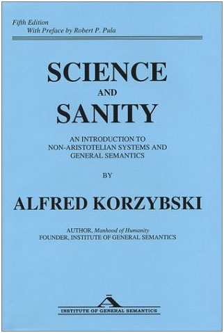
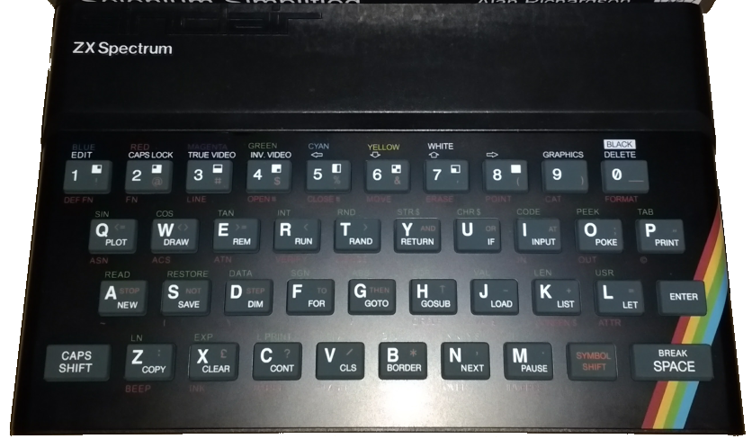
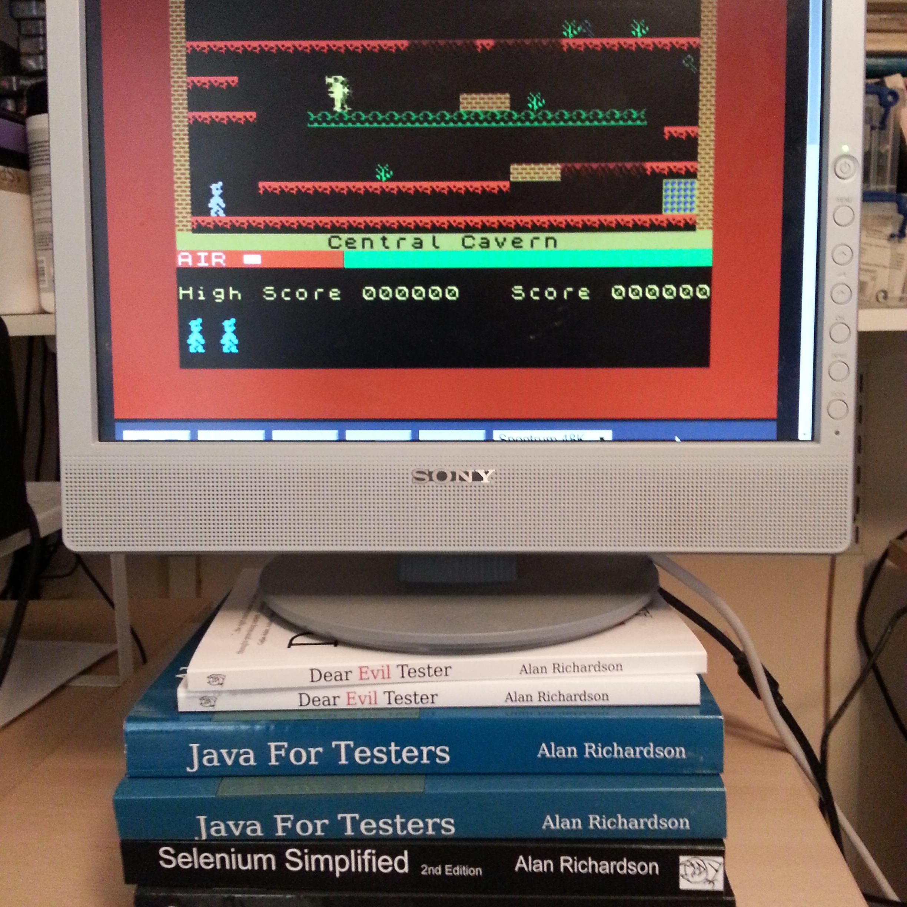

# How to misuse 'Automation' for testing, fun and productivity

## TestBash Netherlands 2017
## Alan Richardson

* [www.eviltester.com](http://www.eviltester.com)
* [www.seleniumsimplified.com](http://www.seleniumsimplified.com)
* [www.javafortesters.com](http://www.javafortesters.com)
* [www.compendiumdev.co.uk](http://www.compendiumdev.co.uk)
* [uk.linkedin.com/in/eviltester](http://uk.linkedin.com/in/eviltester)
* [@eviltester](https://twitter.com/eviltester)
* [www.youtube.com/user/EviltesterVideos](https://www.youtube.com/user/EviltesterVideos)

---

# Tempt

> "entice or try to entice (someone) to do something that they find attractive but know to be wrong or unwise."

_Warned [Google](https://www.google.co.uk/search?q=tempt+definition) on 16th January 2017_

> "persuade (someone) to do something."

-----

I want to persuade you to look differently at the tools you use, and they way that you approach automating your applications so that you don't just adopt the way that everyone else does it.

I want you to suspect that perhaps:

- you're not being told the whole truth
- there are better ways
- people don't know all they waus this tool can be used
- there are different ways
- there is value in making up your own mind
- there is value in finding your own path

I'm going to give you examples, and models to help you freshen up your view of technology you already use and increase the flexibility you have when you use it.

------

---

# What does 'misuse' mean?

> "use (something) in the wrong way or for the wrong purpose."

_sayeth [Google](https://www.google.co.uk/search?q=misuse) on the 16th January 2017_

-----

To try and have an 'objective' view of this topic I have asked Google for explanations.

And Google tells me that misuse is using something 'wrong'.

Which must mean there is a 'right' way. But also someone defining something as 'wrong'.

But what if they mean "possible but unwise"? Or "possible, but please don't"?

What if they are wrong about it being wrong?

------
---

# What do 'testers' do?

## Use or Misuse?

-----

I think testers already misuse stuff.

Most users don't see most of the error messages in the system because they don't treat the systems as badly as we do.

Our job is often to misuse the system.

And our job is to use the system.

- can the user do X?
- does this flow through the system result in Y happening?

We do both.

So we already know how to do this and we already do this.

"A User would never do that" - but it is possible, and someone views it as 'wrong' or as misuse.

We already have experience of misusing systems.

------

---

# Who says the use is 'wrong'?

> "use (something) in the wrong way or for the wrong purpose."

- Beliefs
- Conceptions and Perceptions of Reality
- Opinions

-----

In order for it to be 'wrong'. Someone has to have a belief system that models a 'right' and a 'wrong' and they have to map that on to the system.

We have to decide if we comply with that opinion, set of beliefs or model of reality.

We can decide not to comply. And we are often paid to not comply.

------

---

# Oh mighty Google, what pray tell is "[Automation](https://www.google.co.uk/search?q=automation#q=automation+definition)"?

> "the use or introduction of automatic equipment in a manufacturing or other process or facility."

_Google's proferred definition on 16th January 2017_

-----

So what is "Automation"?

------

---

# What is a 'tool'?

> "a device or implement, especially one held in the hand, used to carry out a particular function. e.g. 'gardening tools'"

_thus spake Google to me on 20th August 2016_

---

# But I'm using software!

## OK.

---

# Definition of: tool

> "(1) A program used for software development or system maintenance. Virtually any program or utility that helps programmers or users develop applications or maintain their computers can be called a tool."

_thus spake [PCMag.com](http://www.pcmag.com/encyclopedia/term/52979/tool)_

---

# What is a testing tool?

What have you heard "That's not a testing tool!" in relation to?

* BDD? 
* Cucumber? 
* Selenium? 

[see more 'not a testing tool' on Google](https://www.google.co.uk/webhp?#q=%22is+not+a+testing+tool%22)

---

# I used to say:

> "any software that I use to support my testing is a _Testing Tool_"

_Me_

---

# So What?

> "If the patient wishes to argue that his conception of reality is correct, we must be willing to discuss his opinions, but we must not fail to emphasize that our main interest is his behavior than his attitude"

_'Reality Therapy' by William Glasser, 1965, page 28_

---

# I now say

> "any software that I use to support my testing I view as a _Testing Tool_"

_Me_

-----

So if I use Cucumber in my testing it becomes a "Testing Tool"

And you can argue about it all you want. It won't stop me using it, or misusing it (if you say its not a testing tool and I use it in my testing).

------

---

# Cards As Weapons

## The key word is "AS", not "IS"

-----

* Very few people would choose playing cards as their weapon of choice
* Playing card manufacturers are unlikely to advertise their product as a weapon
* Casinos would likely operate under different lega provisions if cards were viewed as weapons.

But here we are.

Note that Ricky Jay didn't write "Cards Are Weapons", or "My Other Weapon is a Card"

"Cards As Weapons" 

- Playing cards used as weapons.
- Playing cards thought of as weapons
- My model of playing cards is weapons

The use is defined by the user, not the maker.

If people didn't misuse, we would lose 'art'.

The key word is "AS", not "IS"

------
---

# Korzybski said "The word is not the thing"

* Cucumber is not a testing tool. 
    * It is a vegetable. 
* But "cucumber" is not a vegetable.
    * "cucumber" is a word.

----- 

The software called "Cucumber" is not a testing tool, and is not not a testing tool. It is software called Cucumber.

And all philosophysing aside. If I can use software to help me test, I'll use it. And along the way, I'll probably refer to it as a "testing tool" when I do.

Feel free to disagree. You won't stop me.

------

---

-----

# Fortean Times

Explain fortean times

show some sample covers

Possible fortean times cover about Cucumberists

- they believe that Cucumber can improve communication
- that specifications can become executable

---
------

# Horticulture for a better world

## "Eighteen-foot tomato plants and cucumbers the size of watermelons"

-----

# Scientology

* Offended?
* Beliefs - 'identity' - rigidity
* Value Flexibility

http://www.bridgepub.com/store/catalog/survive-and-succumb-classic.html

"Eighteen-foot tomato plants and cucumbers the size of watermelons"

http://tonyortega.org/2013/02/02/scientology-mythbusting-with-jon-atack-the-tomato-photo/

http://www.instinct.org/texts/bluesky/bs4-3.htm

horticulture for a better world

https://en.wikipedia.org/wiki/Scientology_and_celebrities

- http://www.carolineletkeman.org/

1959 http://www.xenu-directory.net/news/images/thecompiler-1959-1.pdf

Sea-org created in 1967 where people sign up for 1 billion years.

Why mention it?

- Someone did research into Cucumbers (pic of Hubbard)
- They documented it and were interviewed
- People liked what this person said and incorporated this model into their beliefs (pics of Tom Cruise and John Travolta)
- There are certain ways to talk about these beliefs (sometimes they are enforced)

Enforcer:

http://tonyortega.org/2013/05/29/marty-rathbun-builds-his-warrior-legend-in-new-memoir/

Now I know that some people could be offended by comparing a Software Development Tool/process and the reasoned and sensible online discussions that take place about the processe/tool evolution and efficacy to a cult (Officially recognised religion in UK, USA, Sweden, Taiwan,...)

https://en.wikipedia.org/wiki/Scientology_status_by_country

And that's fine. I'm trying to make a point about our beliefs and the models we build up around them. And when we give them more credence or 'identify' with them then we run the risk of fixed strategies in our thinking.

Which can be detrimental when those strategies are not flexibile enough to fit the environment we operate within.

------

---

# Which brings me back on to madness.

-----

---

# Madness

Slide with Madness logo.

Ska dance
------

---

# Care about Behaviour

> "In Reality Therapy we are much more concerned with behavior than with attitudes."

_'Reality Therapy' by William Glasser, 1965, page 27_

-----

In "Reality Therapy" William Glasser prefers the terms 'responsibility' and 'irresponsibility' to sane and insane and madness and mental illness.

-------

---

# ZX Spectrum and Clive Sinclair

> "...Sir Clive Sinclair himself is often reticent to discuss the machine - seeing the popularity of the system for gaming, rather than serious computing, as an insult to his creation."

_[bit-tech.net/news/hardware/2012/04/23/zx-spectrum-30-years/1](http://www.bit-tech.net/news/hardware/2012/04/23/zx-spectrum-30-years/1)_

-----

Ah Diddums.

------

---

# Our Model vs The World

* Our model of the world
* Our model of our creation
* Our model of 'correct' usage

**The world often has other ideas**

-----

While we may have a model of how we want our creation to be used and how we want the world to work. The world often has other ideas.

------

---

# Books are not a monitor stand

-----
Photo of my books holding up a monitor - if possible running a zx spectrum emulator
------

---

# Thomas S. Szasz

> "...if our aim is to see things clearly, rather than to confirm popular beliefs and justify accepted practices, then we must sharply distinguish three related but distinct classes of phenomena:
> 
> 1) events and behaviours
> 2) explanations
> 3) social controls"

_Thomas S. Szasz, "The Manufacture of Madness", 1973, Paladin Books, pg 21_

---

# Why - Beliefs, Explanations

> "In Reality Therapy, therefore, we rarely ask why. Our usual question is _What? What_ are you doing - not, _why_ are you doing it?"

_'Reality Therapy' by William Glasser, 1965, page 32_

-----

"Why implies that the reasons for the patient's behavior make a difference in therapy, but they do not."

This view seems shared by Brief Therapy, Gestalt Theray, Rational Emotive Behaviour Therapy, Cognitive Behaviour Therapy, to name but a few.

------

---

# An Abstraction Model

Thomas Szasz has used a layered/levelled/abstraction model.

- what it does
- how we model it
- how we expect people to use it

At which level does "Cucumber is not a testing tool" sit?

---

# Tool Events and Behaviours

- What it does is immutable. 

- It does what it does.

---

# Social Controls & Explanations

- Models are mutable, and different per person.

----- 

Assume for the moment that what it does is immutable. It does what it does.

Can people have different models of it?

OF course.

Can people with different models of it, have different expectations of use around it?

Of course.

So we have a tree of differences - plenty of scope for argument there.

So what do we have to do?

1) Get to the core of its events and behaviours
2) Build our own explanations and models (feel free to have multiple for maximum requisite variety)
3) Agree contextually the social controls (again, feel free to have multiple for maximum requisite variety)

- what contexts? self, project, company, role, industry, etc.

------

---

# About Cucumber - Social Controls

-  "Cucumber is not a testing tool" (general hearsay)
-  "Cucumber is for Behaviour-Driven Development" (cucumber.io)

---

# About Cucumber - Explanations

- "An open-source tool for executable specification"
- "Cucumber merges specification and test documentation into one cohesive whole."

(cucumber.io)

---

-----

## Write Gerkhin to specify conditions and code to implement their execution

> 1) events and behaviours

## "Cucumber is not a testing tool"

> 2) explanations

"An open-source tool for executable specification"

https://cucumber.io

## If I use it for testing - I misuse it.

> 3) social controls

------

# Models of Cucumber?

* Collaboration tool
* Communication tool
* Test automation tool
* Automation tool
* Testing Tool
* Specification Tool
* ?

-----

"At a glance, Cucumber might just look like another tool for running automated tests. But it’s more than that."
cucumber.io

------

---

# About Cucumber - Events and Behaviours

* Create Text File - written in Gherkin
* Write Code
* Annotate Code with a REGEX to match text
* Execute Text File

---

# "Regex based parser for building custom Domain Specific Languages"

_we could also describe it as an interpreter_

-----

Apparently cucumber is not a testing tool.

https://www.google.co.uk/search?q=%22cucumber+is+not+a+testing+tool%22

Great. So for the purposes of our 'misusing' tools perspective its a perfect fit.

So what is it?

Ignore all the nonsense about it being a collaboration tool or a communication tool.

Clearly it is a "Regex based parser for building custom Domain Specific Languages"

As evidence I submit the following facts:

blah blah blah

So how does that knowledge help us?

Well...

But "Regex etc. whatever, would put off BAs" - But BA's don't use Cucumber, BAs use Gherkin. So what is Gherkin.

------

---

# Evidence & Examples

~~~~~~~~
Feature: Can login to the application

  Background: A user can login
              to the application

  We want the user to login because
  every user has their own projects
  and they can't be shared between users

    Scenario: Login with valid credentials
      Given a default user
      When the default user logs in
      Then they are taken to their account home page
~~~~~~~~

-----

http://compendiumnews.blogspot.co.uk/2013/01/tutorial-lessons-learned-with-bdd.html

https://github.com/eviltester/bddexamples
------

---

# More Evidence & Examples

~~~~~~~~
    Scenario: Login with valid credentials
      Given a default user
~~~~~~~~

- custom DSL
- parsed by Cucumber

~~~~~~~~
    @Given("^a default user$")
    public void a_default_user() throws Throwable {
        tracksAccount = new TracksAccount();
    }
~~~~~~~~

- regex based annotations

---

# Misuse as FACT

### When I use a "Regex based parser for building custom Domain Specific Languages" as part of my testing process then I can use it as a test tool.

---

# New Model, New Skills

* REGEX
* Domain Specific Language
* Modelling Declaratively
* Data Separation
* etc.

---

# RestAssured

[RestAssured](http://rest-assured.io/) is a Java DSL based REST Testing Library with a "Given, When, Then" syntax.

## _Is it?_

-----

http://rest-assured.io/

https://github.com/rest-assured/rest-assured

------

---

# This is RestAssured

~~~~~~~~
    @Test
    public void aUserCanNAccessWithBasicAuthHeader(){

        given().
                contentType("text/xml").
                auth().preemptive().basic("user", "bitnami").
        expect().
                statusCode(200).
        when().
                get("http://192.168.17.129/todos.xml");

    }
~~~~~~~~

---

# RestAssured as an HTTP Library

- RestAssured wraps the Java HTTP libraries and uses Groovy to create a DSL.

We can use it to automate any HTTP service. We don't need all the Given, When, Then, etc. and Assertions.

---

# This is RestAssured Misused as an HTTP library

~~~~~~~~
    @Test
    public void aUserCanAuthenticateAndUseAPIWithBasicAuth(){

        HttpMessageSender http = new HttpMessageSender(
        			TestEnvDefaults.getURL());
                                
        http.basicAuth(
        	TestEnvDefaults.getAdminUserName(),
        	TestEnvDefaults.getAdminUserPassword());

        Response response = http.getResponseFrom(
        			TracksApiEndPoints.todos);

        Assert.assertEquals(200, response.getStatusCode());

    }
~~~~~~~~

---

# Beliefs

## Strong beliefs are important when you are doing something.

Can you detach from the belief when not doing something?

-----

Strong beliefs are important when you are doing something.

Coding standards - strong beliefs about code. you should believe in these when you code at work as it makes your life easier.

You can forget them at home because you might want to experiment with new styles and learn new things

beliefs impact testing

If we believe this functionality works then when we test it we will feel like we are wasting time.

Be the flat earther who goes on an around the world vacation.

Because what you'll probably find is that the people who say "Cucumber is not a test tool" use cucumber as part of their tool set for automating, and automating is part of their test strategy so - guess what - Cucumber, which is not a test tool is part of their test approach and strategy for automating the app.

------

---

# About Selenium

Model: Selenium is not a test tool. 

Reality:

- Selenium automates Browsers.
- Testers want to automate browsers.
- When testers use Selenium to Automate Browsers, they use Selenium as a Test Tool

-----

Selenium is not a test tool. Selenium is a tool for automating Browsers.

Fortunately that is something that testers want to automate.

Misuse examples - keyboard - managing tabs with keyboard

------

---

# About Web Browsers

- For some people it 'is' the internet.
- Browsers are for everyone (not just testers)
- Browsers have 'dev tools' (not test tools)

We use Browsers as test tools.

---

# What is a Web Browser?

* an HTML reader and renderer?
* a JavaScript interpreter?
* an HTTP based URI and response processor?
* an async and multi-threaded HTTP based URI and response processor?
* What else?

-----

#### What does a browser do?

Let you surf the web?

For some people it 'is' the internet.

What is it?

Is it - an HTML reader and renderer?

- Something that reads an html file
- looks at all the links and included files
- reads all the files into memory
- renders the html based on the CSS and JavaScript and Images

?

Is it - a JavaScript interpreter?

Is it - an HTTP based URI and response processor?

- Something that issues an HTTP Get on a supplied URI
- uses the headers in the HTTP to determine the type of response
- uses that type to process the text response
- if it is an html file then it checks the local cache to see if it needs to re-request it
- looks at all the links and included files and checks the local cache to see if it needs to request it
- requests the files and save them to disk
- reads all the files into memory
- renders the html based on the CSS and JavaScript and Images

?

Is it - an async and multi-threaded HTTP based URI and response processor?

- Something that issues an HTTP GET on a supplied URI
- uses the headers in the HTTP to determine the type of response
- uses that type to process the text response
- processes the files and links listed in parallel
- if it is an html file then it checks the local cache to see if it needs to re-request it
- looks at all the links and included files and checks the local cache to see if it needs to request it
- requests the files and save them to disk
- reads all the files into memory
- renders the html based on the CSS and JavaScript and Images

?

------

---

# Our model changes our process

Each understanding of what it 'is', and what it 'does', changes the risk profile.

The more models we have, the more things we can test, and more ways we have to justify our testing.

----- 

#### Does our understanding change our process?

Each understanding of what it is changes the risk profile.

- An HTML reader and renderer
    - HTML, CSS, JavaScript standards
    - response sizes
    - resource availability
- An HTTP based URI processor
    - Cache headers
    - Local Storage
    - Memory size
    - Screen resolution
    - Device drivers
- An async and multi-threaded HTTP based URI processor
    - Processor power
    - Multi-threading capabilities in the Processor
    - TCP/IP and network limits

Could these risks impact our application?

Do we think about them for testing?

------

---

# Features - what it says it does

What it actually does when it does what it says it does

-----

#### We didn't mention features

Features:

- View Source
    - can report syntax errors
- Cookie Editing
- Add ons

etc.

------

-----

---

# Browser Developer Tools

### About Browser Developer Tools

etc.

------

-----

---

# Checks

### Checks

When programming we call these 'assertions' it doesn't invalidate the notion that 'checking' is different from 'testing' (even though neither exist). But we 'check' pre and post conditions by 'asserting' on values returned from code.

------

---

# JUnit is a unit testing tool

-----

JUnit is a unit testing tool. It is part of the notional XUnit family of Unit testing tools

https://en.wikipedia.org/wiki/XUnit

https://martinfowler.com/bliki/Xunit.html

------

---

# JUnit is a unit testing tool

**Except when** we use it as a runner for code which will automate anything we want. Then we can use it as a GUI or a command line interface.

---

# Other Examples?

-----

Do we really need any more examples?

Can you think of examples?

- the stuff you're embarrassed to admit
- when you used that really expensive load testing tool to send a couple of API message
- you used your link checker and set it running with so many threads that use used it as a stress testing tool and brought down the web site

### Notepad

Notepad as a file locker

http://superuser.com/questions/294826/how-to-purposefully-exclusively-lock-a-file

------

---

# What is it?

* Go beyond 'social' abstractions
* What does it say it does?
* What else does it do?
* What does it actually do?
* How does it do that?
* How can you use that as part of your testing?
* How does that limit you?

---

# We Test By Exploring the System's

- 1) events and behaviours
- 2) explanations
- 3) social controls

---

# Finally: have fun and increase productivity when you automate by misusing tools

- _Use their:_  1) events and behaviours

- _Build our own:_ 2) explanations

- _Ignore other peoples':_  3) social controls

---

# Learn to be Evil

* [www.eviltester.com](http://www.eviltester.com)
* [@eviltester](https://twitter.com/eviltester)
* [www.youtube.com/user/EviltesterVideos](https://www.youtube.com/user/EviltesterVideos)

---

# Learn to Use Tools

* [www.seleniumsimplified.com](http://www.seleniumsimplified.com)
* [www.javafortesters.com](http://www.javafortesters.com)

---

# Learn About Alan Richardson

* [www.compendiumdev.co.uk](http://www.compendiumdev.co.uk)
* [uk.linkedin.com/in/eviltester](http://uk.linkedin.com/in/eviltester)
