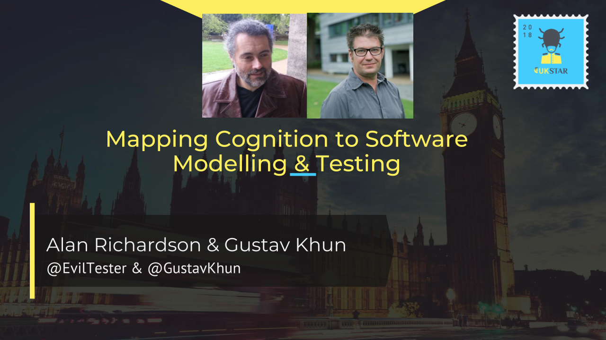
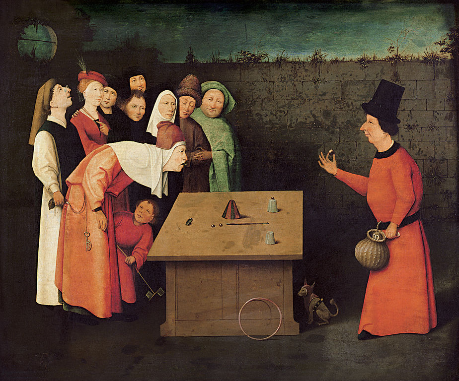
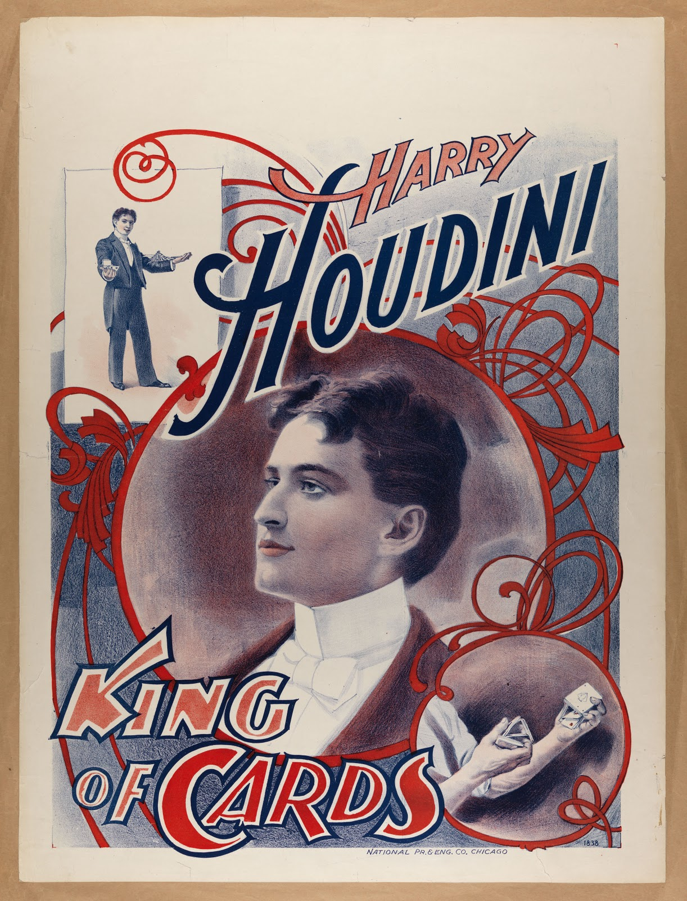

<!-- footer: @EvilTester | @GustavKuhn -->
<!-- page_number: true -->

<!--

https://ukstar.eurostarsoftwaretesting.com/submission/mapping-cognition-software-modelling-testing/

To create a slide deck from this, I export as .txt from google docs to create a markdown file formatted correctly (for some reason it always puts an odd unicode char as first char, so I have to delete that in Marp - other than that it exports just fine)

Then add to [Marp](https://github.com/yhatt/marp) or [DeckSet](https://www.decksetapp.com/)

http://blog.eviltester.com/2016/10/a-case-study-in-creating-conference.html

10:15 - 11-45 == 1.5 hours

TODO:

[x] provide initial version of slides to UKStar by 23rd Feb 2018 (done)
[x] meetup to run through workshop closer to the time
[x] Mechanical turk images 

Markdown Instructions for slide creation:

Use

# Heading 1

## Heading 2

### Heading 3

Leaving a Line after headings is important.

* This is a bullet point, does not matter if Google turns it into a bullet

**This is Bold Text**

_this is underlined_

If you write something and Google doc formats it to formatting then immediately press ctrl+z and Google docs will revert back to the plain ascii text

Use --- to create a slide break

[This is link text](http://linkstothisurl.com)

Any images need to be added in a folder that we save the .txt file to. If we need images we can co-ordinate. It mig

We can always embed images in comments and they are easy enough to extract out later.

  

And we need a blank line before the slidebreak

---

-->

<!--

Exported this image o folder so it is imported as image on slide

  

Imported image into deck using  below

-->

---

# Mapping Cognition to Software Modelling & Testing

## UKStar March 2018

* Alan Richardson & Gustav Kuhn
* @EvilTester & @GustavKuhn

---

# Blurb

Have you ever wondered how studying magic can improve your software testing? Alan Richardson talked his way into the Magic Circle in London, allowing him to learn how to reverse engineer the process of observing the performance of magic and develop techniques which he applied directly to improve his Technical Testing process.

Have you ever wondered why magic works? Gustav Kuhn heads the MAGIC lab at Goldsmiths University of London, and his his research lab uses magic to study a wide range questions about human cognition. For example, why is your mind so easily tricked? How can magicians misdirect your attention, and why is your experience distorted by perceptual, attentional and other more general cognitive illusions?

---

# Welcome

* Who we are
* What we will be doing
* Logistics 1.5 hours

---

# Beginnings

_Hieronymos Bosch - The Conjuror_

<!--

 https://commons.wikimedia.org/wiki/File:Hieronymus_Bosch_051.jpg

-->

---

# Don’t ask where the Lemons come from

---

# Magic and Psychology

*  Why I became a psychologist 
*  The Science of Magic

<!--

I grew up in Switzerland and started magic as a teenager and spent the next 8 years of my life pretty much dedicated to finding ways to trick the mind and create illusions of the impossible

In addition to reading magic books, I read about books about psychology, but none of these were directly related to magic. 

At the age of 19 I move to London to start a career as a professional magician - failed

Studied Psychology to improve my magic

None of the Psychology I learnt at Uni was directly related to magic - interest changed from magic to Cognition

During Phd - Realised link between magic and psychology

Last 15 years I have been using magic to study the mind

Magicians have lots of real world experience in deceiving people - Psychologist are interested in these illusions because they can tell us about limitations in cognition and the mind more generally. 

Science of Magic Association

For most non-magicians like yourselves these illusions offer valuable insights into your own cognitive limitations.   

-->

---

# Magic and Testing

* “I talked my way into the Magic circle”
   * The library
   * The Theatre
* I learned how to observe magic
   * Watch Magic
   * Hypothesise
   * Study Domain - to learn what to look for

<!--

I can’t really ‘do’ magic. But it is something I have always been interested in. I probably have more ‘magic’ books than ‘testing’ books.

But I don’t practice magic so I don’t have the skills to join the magic circle. Fortunately they have a 1 year probation where, if you are sponsored by a member, can join for a year.

I managed to talk my way in, and for a year was able to access the library and read as much as possible about how magic was performed.

And I was able to see great magicians lecture on how they perform.

All of that helped me observe magic in different ways. I started to apply the modelling and observational techniques into my testing.

One massively beneficial activity for anyone to do is to take whatever they learn in one domain, and apply it to another.

-->

---

# Magic and HCI - The user illusion

---

# The Mechanical Turk

- History of the Mechanical Turk
- Impact on Society and Technology - Machines challenge human intellect / inspiration for AI
- Is Turk Real or Trick?  
- How would you test it?  

---

# Principles

Principle in magic:  Give people the illusion they are testing the situation, but magician is always in control of the situation.

-  I asked you to examine/test the cups, but you cannot test the rest of the trick
    - Does not work all the time (e.g. burned down theatre, switched bullet in bullet catch)
-  Magicians never repeat the same trick

---

# The User Illusion - Shared virtual realities - Illusions

<!--
* Joint trick to demonstrate differences in approach - timing
-->

---

# You will choose…

---

# You will choose…

## Ace of Hearts

## Ten of Spades

<!--

Key points:

- Presentation is important
- The magic has already happened
    - e.g. async, server requests etc.

-->

---

# Marco Tempest - Cyber Magic Card Trick

* Augmented Reality Magic
* [Marco Tempest](http://marcotempest.com/en/work/)
* A Cyber Magic Card Trick Like No other
* [youtube.com/watch?v=ZX8MBBohX3s](https://www.youtube.com/watch?v=ZX8MBBohX3s)
* [Ted Talks Listing](https://www.ted.com/talks/marco_tempest_a_cyber_magic_card_trick_like_no_other)

<!--

Performance rather  than ‘trick’ - leads into communication of 

Need to keep skills up to date

What is reality going to be?

Need to find new ways to observe

-->

---

# How Magic Works

- prevent you from attributing the true cause of an effect 

---

# Illusory Attribution

- Illusory Attribution - Michotte Causal attribution video
    - We are willing to endorse illusory causal attributions 
    - https://www.youtube.com/watch?v=VTNmLt7QX8E

---

# Magic relies on exploiting limitation in cognition

---

# Magic relies on exploiting limitation in cognition

- People are willing to endorse the illusory causal attribution (i.e. the magic stuff) because they are not aware of their Cognitive limitations and Biases

---

# Surprising Limitations and Cognitive Biases 

- Limitations in perceptual awareness (misdirection trick)
- Subjective nature of visual experience (seeing is believing) - card trick
- Biases in reasoning (Theory of false solution)

---

# “How Magic Works” Impacts How We Test

* Understanding magic:
   * Learn how to observe differently
   * Contextual understanding of magician’s techniques
   * Gimmicks and new technologies
   * Multiple Methods & Effects

<!--

Most people ‘watch’ magic for enjoyment.

Occasionally people will look up on YouTube how an effect is performed.

But does that explanation really explain the trick? Perhaps it too is misdirection?

With magic we have to learn how to observe differently.

The magician assumes that you are already watching what they do, so they have to find ways of ‘doing magic’ despite the fact that you are watching. So to truly watch magic you have to watch to appreciate the effect, and observe to identify the method.

Most people don’t have a frame of reference to map the effects on to. So they have no way to truly understand how an effect is performed. E.g. if you don’t know that trap doors exist then the possibility that a stage vanish might have been effected using that method will never occur to you.

We need to understand the technology of magic to allow us to observe for hints that that is being used.

-->

---

# How Magic Works Impacts How We Test

* Not take what we see as absolute
   * Explanations are possible not definite
* Take action to help us model reality
   * Take notes,
   * Perform experiments, Learn to falsify
* Communicate
   * It seemed as though...
   * It looked like....
   * E-Prime !be

<!--

After we watch a trick, we have to construct a ‘hypothesis’ for how it could have been implemented. This does not mean that we ‘know’ how the trick was performed.

We have to develop the ability to identify multiple models of an effect.

In software development we have Data flow diagrams, state transition diagrams, entity relationship diagrams. All different ways of modelling software to give us the ability to consider the same software or system from different angles.

A single view of the system will limit us. And it might mislead us.

Even when we have evidence ‘I saw the magician, hide the coin in his hand’ we cannot rely on that evidence as an absolute. It is still an observation. It depends on how we observe it to know if we can trust it.

Why have ‘fake psychics’ been able to fool ‘scientists’ for so long? Despite undergoing experimental conditions and being observed and recorded in different ways?

Our reality is impacted by how we model it. So we learn how to model differently:

* To give us more opportunity to consider options
* To give us more opportunity to build a complete model
* To give us more opportunity to consider the situation at more times

E.g. when a trick is performed we are building a model dynamically, on the fly. We don’t necessarily know the end effect. We can see ‘stuff’ happening, we don’t necessarily know if that is relevant or not, we may not see all the stuff that is happening because we don’t know what to look for because we don’t know what is actually going to happen. We build models on the fly.

We have to be careful in how we communicate. Because our communication can fool us into thinking we have a more complete model than we do.

* The psychic correctly said my grandfather’s name was David.
* Actual: “I’m sensing someone who’s name begins with D, does anyone know someone with D? Dan? Daniel? Doug? Douglas? Dave? David?”

We have to be careful that we don’t communicate in absolutes when we don’t have the evidence to support it:

* The magician vanished a normal coin which he got from someone in the audience
   * The magician asked if anyone had a 10p piece
   * The magician took a coin from someone
   * The magician thanked the person and sent them back to their chair
   * It looked as though the magician put that coin in his hand
   * When the magician opened his hand it looked as though his hand was empty
   * When the magician asked the person he took the coin to check his watch band, the person said that there was a 10p piece in the watch band

Two very different ways of using language to describe the same situation.

When testing - if we are too absolute in our communication or note taking then we might mislead, or prevent someone doing additional investigation on parts of a system.

E-prime is a form of language based on Alfred Korzybski’s General Semantics. Created by David Bourland, an attempt to promote clear communication by avoiding use of the verb “To Be”. So, someone using e-prime would no longer say ‘the coin is gone’ they would have to say ‘I can not see a coin’

* Can no longer say ‘am’ ‘is’ ‘was’ ‘be’

Could perform a small e-prime experiment at this point and ask people to describe a trick, and avoid use of the verb ‘to be’ and see if it helps model the effect.

Could type what they say into https://www.compendiumdev.co.uk/page.php?title=eprimer to see if it flags any violations. It is still possible to confuse ourselves even we we avoid “to be” “the magician made the coin vanish” doesn’t violate eprime

I have rewritten my defect reports in eprime to help make them clearer and avoid suggesting ‘truth’ when I wanted to suggest possibility.

-->

---

# “How Magic Works” Impacts How I Test

* Modelling
* Observation
* Reflection
* Interrogation
* Manipulation

<!--

This the high level model I use to explain my testing. I built this from a study of Magic, Psychotherapy and Hypnosis (as well as Software Testing and Software Development).

Modelling is key to how we work. And we have to recognise that we need multiple models of system.

Not because all models are ‘wrong’, but because they are approximations and they are built from our knowledge of the domain. The model reflects how we understand the world. And we can use it to explore the world and refine our model and our understanding of the world.

We have to learn to observe, otherwise we can’t compare our model to the world, or build a model. We have to reflect to evaluate our model and think about what do do next. And because we are testing we need to interrogate the system to help us falsify our model or make it more detailed and we have to manipulate the system if we want to do any testing at all.

-->

---

# Modelling

## **Modelling Systems**

E.g. Testing a web application

* Domain knowledge
   * HTTP, Cookies, JavaScript
   * More knowledge, deeper model
* Surface Interaction e.g. HTML rendering
   * Effect
* GET, PUT, POST, Ajax
   * Method

Our model is limited by our knowledge.

<!--

Example: Chatterscan.com and the ‘favourite’ searches functionality.

Chatterscan.com is a Twitter client I wrote using PHP.

Q&A 
* How would we model that?
* Do we have enough information?
* Do we understand the domain? Business, Technical, Programming Language?

→

---

## **Modelling**

- when we see a 'trick' we model it.
    - Not always know outcome in advance.
- We model it as we go. 
- Our existing models impact our newly created model.
     - biases, experience
- We don't **know** how it was done
- We have a supposition of how it _might_ have been done or _could_ have been done. 

<!--
   * Show a Multiple outs trick.
   * Reasoning - Theory of false solution - mind fixing effects

--->

---

# Observation

* we need to learn how to observe, this is contextual 
   *  i.e. if it is a web app we learn to observe the HTTP messages, or the DOM changing, or the javascript events
   * if it is Magic then we learn to observe hand movements, what we are directed to, what we are directed away from, why did they do that?

<!--

Q&A with audience.

* How can we observe a web application?
* What tools can we use?
* How would we find those tools in the first place?
* How would we know to look for those tools?

With each tool we add, we observe new things, which expands our understanding and model of the domain. Which then opens up new areas for exploration, investigation, modelling and observing.

-->

---

# Observation

* supports  incrementally building a model which only becomes realised after we have finished and reflect on it
   * Note taking as we go

<!--
   * Cover - Inattentional Blindness - change blindness

Q&A with audience

* How to people document their models?
* How do they use observation to support that?
* What tools help with that process?

-->

---

#  We see less than we think we do

* Attentional misdirection
* Change Blindness
* Inattentional Blindness
   * HCI display in pilots - Radiographers 
* Never perform the same trick twice
* Don’t get distracted
* Multitasking myth

<!--
* Can demonstrate this by showing a trick twice or rewatching trick video to show why.
-->

---

# Reflection

* think about the model
* what are the component parts, what are our assumptions?
* what to test next, for what purpose?

---

# Interrogation

* when you first see a magic trick you don't necessarily know what will happen at the end so you have to go back and interrogate to validate your model against what you have modelled
* you interrogate to see where you were led astray during your incremental model building
   * Look at the observed results in more detail
   * Tools can create logs to review later

<!--
Amodal completion - Knife through arm
Multiple methods - same effect, different methods

Q&A with audience:

* How else can you interrogate a system?
* How is interrogation different from observation?
   * Observation is often real time, missing things
   * Interrogation is often ‘after the fact’, things have to be ‘paused’ to support it
   * Used to answer direct questions

-->

---

# Manipulation

* “If in doubt, try it out.”
* is your model or hypothesis actually possible?

##  _In magic you never give people the opportunity to test it._

<!--

Magician’s Choice - equivoque

We use tools in testing to help us manipulate the system.

-->

---

# Summary

---

# Gustav Kuhn

- https://www.gold.ac.uk/psychology/staff/kuhn/
- https://twitter.com/gustavkuhn
- https://scienceofmagicassoc.org/

---

# Alan Richardson

Alan Richardson [www.compendiumdev.co.uk](http://www.compendiumdev.co.uk)

- Linkedin - [@eviltester](https://uk.linkedin.com/in/eviltester)
- Twitter - [@eviltester](https://twitter.com/eviltester)
- Instagram - [@eviltester](https://www.instagram.com/eviltester)
- Facebook - [@eviltester](https://facebook.com/eviltester/)
- Youtube - [EvilTesterVideos](https://www.youtube.com/user/EviltesterVideos)
- Pinterest - [@eviltester](https://uk.pinterest.com/eviltester/)
- Github - [@eviltester](https://github.com/eviltester/)
- Slideshare - [@eviltester](http://www.slideshare.net/eviltester)

---

# Alan Bio

Alan is a Software Development and Testing Coach/Consultant who enjoys testing at a technical level using techniques from psychotherapy and computer science. In his spare time Alan is currently programming a [Twitter client called ChatterScan](https://chatterscan.com), and [multi-user text adventure game](http://compendiumdev.co.uk/page/restmud). Alan is the author of the books "[Dear Evil Tester](http://www.eviltester.com/page/dearEvilTester/)", "[Java For Testers](http://javafortesters.com/page/about/)" and "[Automating and Testing a REST API](http://compendiumdev.co.uk/page/tracksrestapibook)". Alan's main website is [compendiumdev.co.uk](http://compendiumdev.co.uk) and he blogs at [blog.eviltester.com](http://blog.eviltester.com)
                
<!--

# probably out of time at this point

So what follows are extra notes and possible stuff we could use.

We see what we believe to see - Flustration count illusion….

Reconstructive memory - False memory illusions 
* Can demonstrate by asking people to describe what they saw after they see a trick
* Common also in psychic readings, people remember the hits, but not the misses

- could we view a stage magic trick
     - model, observation - first time through the trick
     - interrogate by viewing the video again
     - doug henning
     e.g. https://www.youtube.com/watch?v=BAyUA1d7hgQ
         - david copperfield did a version of this trick
             - https://www.youtube.com/watch?v=7KRLvrLTdZk
     - could show both, and compare
         - do they use the same techniques?
         - does observing one system help us understand another system?
         - can we use the same tests on each system? do they pass the same tests?
         - does our assumptions or model of one system impact how we look at another system?
     - we are limited that we can't 'test' our assumptions through interrogation, we can only deal in possibilities and plausibilities

- can we apply magic, modelling behaviour to a system as a group - shout out, thought exercises

Applied magic
tognazzini1993
Paper - theory of false solutions - hypothesis
frustration cadence
innattentional blindess

-->